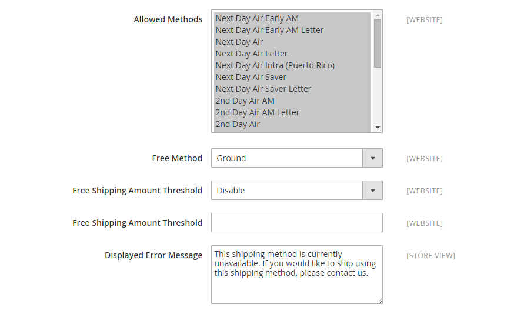

# United Parcel Service (UPS)

United Parcel Service (UPS) bietet inländische und internationale Seeverkehrsdienstleistungen auf dem Land- und Luftweg in über 220 Ländern an.

{{ups-api}}

>[!NOTE]
>
>UPS kann [dimensionale Gewichtung](carriers.md#dimensional-weight) verwenden, um einige Versandraten zu bestimmen. Adobe Commerce unterstützt jedoch nur die gewichtsbasierte Berechnung der Versandkosten.

## Schritt 1: Öffnen Sie ein UPS-Versandkonto.

Um diese Versandmethode Ihren Kunden anzubieten, müssen Sie zunächst ein Konto bei UPS eröffnen.

## Schritt 2: UPS für Ihren Store aktivieren

1. Wechseln Sie auf der _Admin-Seitenleiste_ zu **[!UICONTROL Stores]** > _[!UICONTROL Settings]_>**[!UICONTROL Configuration]**.

1. Wählen Sie im Bedienfeld auf der linken Seite unter **[!UICONTROL Sales]** die Option **[!UICONTROL Delivery Methods]**.

1. Erweitern Sie  im Abschnitt **[!UICONTROL UPS]** .

1. Setzen Sie **[!UICONTROL Enabled for Checkout]** auf `Yes`.

1. Gehen Sie für ein UPS REST-Konto (Standard) wie folgt vor:

   - Geben Sie Ihre UPS-Anmeldedaten ein: UPS ClientID als **[!UICONTROL User ID]**, UPS Client Secret als **[!UICONTROL Password]**.

   - Setzen Sie **[!UICONTROL Mode]** auf `Live` , um Daten über eine sichere Verbindung an das UPS Versandsystem zu senden. (Im Entwicklungsmodus werden keine Daten über eine sichere Verbindung gesendet.)

   - Überprüfen Sie die **[!UICONTROL Gateway URL]** , die zum Senden von Anforderungen erforderlich ist. Verwenden Sie eine Sandbox-URL für den Testmodus und eine Produktions-URL für Live-Anfragen.

   - Überprüfen Sie die **[!UICONTROL Tracking URL]** , die zum Abrufen der Tracking-Informationen erforderlich ist. Verwenden Sie eine Sandbox-URL für den Testmodus und eine Produktions-URL für Live-Anfragen.

   - Setzen Sie **[!UICONTROL Origin of the Shipment]** auf die Region, aus der die Sendung stammt.

   - Wenn Sie Sondertarife mit UPS haben, setzen Sie **[!UICONTROL Enable Negotiated Rates]** auf `Yes` und geben Sie die sechsstellige **[!UICONTROL Shipper Number]** ein, die Ihnen von UPS zugewiesen wurde.

   - Setzen Sie **[!UICONTROL Live Account]** auf einen der folgenden Werte:

      - `Yes` - Führt UPS im Produktionsmodus aus und bietet UPS als Versandmethode für Ihre Kunden an.
      - `No` - Führt UPS in einem Testmodus aus.

   >[!NOTE]
   >
   >Der standardmäßige United Parcel Service-Typ ist für die Einstellung geplant. Verwenden Sie für neue Konfigurationen den Standardtyp `United Parcel Service REST` . Der REST-Typ ist auch erforderlich, um [Versandbezeichnungen](shipping-labels.md) zu generieren. 
   >Für Version 2.4.7 wird **[!UICONTROL UPS Type]** entfernt, da die Typen `UPS` und `UPS XML` für die Einstellung geplant sind und `UPS REST` die Standardeinstellung ist. Die von der nativen Adobe Commerce-Integration verwendeten United Parcel Service-APIs (UPS) werden vorübergehend nicht mehr unterstützt, da das OAuth 2.0-Sicherheitsmodell derzeit nicht unterstützt wird.

   >[!IMPORTANT]
   >
   >UPS stellt die Unterstützung von HTTP ein, die in der aktuellen Standardeinstellung (Systemwert) verwendet wird. Deaktivieren Sie das Kontrollkästchen **[!UICONTROL Use system value]** und ändern Sie die URL für HTTPS. Beispiel: `https://www.ups.com/using/services/rave/qcostcgi.cgi`

1. Geben Sie für **[!UICONTROL Title]** den Namen dieser Versandoption ein, wie er beim Checkout angezeigt werden soll.

   Standardmäßig ist dieses Feld auf `United Parcel Service` gesetzt.

   {width="600" zoomable="yes"}

## Schritt 3: Container-Beschreibung ausfüllen

1. Setzen Sie **[!UICONTROL Packages Request Type]** auf einen der folgenden Werte:

   - `Use origin weight (few requests)`
   - `Divide to equal weight (one request)`

1. Geben Sie für **[!UICONTROL Container]** den typischen Verpackungstyp an, der für die Verbringung verwendet wird:

   - `Customer Packaging`
   - `UPS Letter Envelope`
   - `Customer Supplied Package`
   - `UPS Tube`
   - `PAK`
   - `UPS Express Box`
   - `UPS Worldwide 25 kilo`
   - `UPS Worldwide 10 kilo`
   - `Pallet`
   - `Small Express Box`
   - `Medium Express Box`
   - `Large Express Box`

1. Setzen Sie **[!UICONTROL Weight Unit]** auf das System, mit dem Sie die Produktgewichtung messen.

   Das von UPS unterstützte Gewichtungssystem ist je nach Land unterschiedlich. Im Zweifelsfall fragen Sie UPS, welches Gewichtssystem Sie verwenden sollten. Zu den Optionen gehören:

   - `LBS`
   - `KGS`

1. Setzen Sie **[!UICONTROL Destination Type]** auf einen der folgenden Werte:

   - `Residential` - Die meisten Ihrer Sendungen sind geschäftlich an Verbraucher (B2C).
   - `Commercial` - Die meisten Ihrer Sendungen sind geschäftlich (B2B).

1. Geben Sie die vom Träger zulässige **[!UICONTROL Maximum Package Weight]** ein.

1. Setzen Sie **[!UICONTROL Pickup Method]** auf einen der folgenden Werte:

   - `Regular Daily Pickup`
   - `On Call Air`
   - `One Time Pickup`
   - `Letter Center`
   - `Customer Counter`

1. Geben Sie die vom Träger zulässige **[!UICONTROL Minimum Package Weight]** ein.

   {width="600" zoomable="yes"}

## Schritt 4: Einrichten von Bearbeitungsgebühren

Die Bearbeitungsgebühr ist optional und erscheint als zusätzliche Gebühr, die zu den UPS Versandkosten hinzukommt. Wenn Sie eine Bearbeitungsgebühr einbeziehen möchten, gehen Sie wie folgt vor:

1. Setzen Sie **[!UICONTROL Calculate Handling Fee]** auf eine der folgenden Methoden:

   - `Fixed`
   - `Percent`

1. Um festzustellen, wie die Bearbeitungsgebühr angewendet wird, setzen Sie **[!UICONTROL Handling Applied]** auf einen der folgenden Werte:

   - `Per Order`
   - `Per Package`

1. Geben Sie den Betrag des zu ladenden **[!UICONTROL Handling Fee]** ein.

   Um einen Prozentsatz einzugeben, verwenden Sie das Dezimalformat. Geben Sie beispielsweise &quot;`0.25`&quot;für 25 % ein.

   {width="600" zoomable="yes"}

## Schritt 5: Angeben der zulässigen Methoden und der entsprechenden Länder

1. Wählen Sie für **[!UICONTROL Allowed Methods]** jede UPS Versandmethode aus, die für Ihre Kunden verfügbar sein soll.

   Die Methoden werden beim Checkout unter UPS angezeigt. Um mehrere Methoden auszuwählen, halten Sie die Strg-Taste (PC) oder die Befehlstaste (Mac) gedrückt und klicken Sie auf jede Option.

1. Wenn Sie die Option [Kostenloses Versand](shipping-free.md) über UPS bereitstellen möchten, legen Sie die kostenlosen Versandoptionen fest:

   - Setzen Sie **[!UICONTROL Free Method]** auf die Methode, die Sie für den kostenlosen Versand verwenden möchten. Wenn Sie keinen kostenlosen Versand über UPS anbieten möchten, wählen Sie `None`.

   - Um einen Mindestbestellbetrag zu verlangen, der für einen kostenlosen Versand mit UPS qualifiziert ist, setzen Sie **[!UICONTROL Enable Free Shipping Threshold]** auf `Enable`. Geben Sie dann den Mindestwert in **[!UICONTROL Free Shipping Amount Threshold]** ein.

1. Ändern Sie bei Bedarf die **[!UICONTROL Displayed Error Message]**.

   Dieses Textfeld enthält eine Standardmeldung, Sie können jedoch eine andere Meldung eingeben, die angezeigt werden soll, wenn UPS nicht verfügbar ist.

   {width="600" zoomable="yes"}

1. Setzen Sie **[!UICONTROL Ship to Applicable Countries]** auf einen der folgenden Werte:

   - `All Allowed Countries` - Kunden aus allen in Ihrer Store-Konfiguration angegebenen [Ländern](../getting-started/store-details.md#country-options) können diese Bereitstellungsmethode verwenden.
   - `Specific Countries` - Wenn Sie diese Option auswählen, wird die Liste _Zu bestimmten Ländern verschicken_ angezeigt. Wählen Sie jedes Land in der Liste aus, in dem diese Versandmethode verwendet werden kann.

1. Setzen Sie **[!UICONTROL Show Method if Not Applicable]** auf einen der folgenden Werte:

   - `Yes` - Listet alle verfügbaren UPS Versandmethoden während des Checkout auf, einschließlich Methoden, die nicht für den Versand gelten.
   - `No` - Listet nur die UPS Versandmethoden auf, die für die Sendung gelten.

   {width="600" zoomable="yes"}

1. Um eine Protokolldatei mit den Details zu UPS-Sendungen aus Ihrem Speicher zu erstellen, setzen Sie **[!UICONTROL Debug]** auf `Yes`.

1. Geben Sie für &quot;**[!UICONTROL Sort Order]**&quot;eine Zahl ein, um die Sequenz zu bestimmen, in der UPS angezeigt wird, wenn es beim Checkout mit anderen Versandmethoden aufgeführt wird.

   `0` = first, `1` = second, `2` = third usw.

1. Klicken Sie auf **[!UICONTROL Save Config]**.

## Schritt 6: Einrichten der Versandstammadresse

1. Stellen Sie sicher, dass Ihre [Store-Informationen](../getting-started/store-details.md#store-information) abgeschlossen sind.

1. Wechseln Sie in der Seitenleiste _Admin_ zu **[!UICONTROL Stores]** > _[!UICONTROL Settings]_>**[!UICONTROL Configuration]**.

1. Erweitern Sie im linken Bereich den Eintrag **[!UICONTROL Sales]** und wählen Sie **[!UICONTROL Shipping Settings]** aus.

1. Erweitern Sie  **[!UICONTROL Origin]** auf der Seite und konfigurieren Sie die Lieferursprungsadresse.

   {width="600" zoomable="yes"}

1. Klicken Sie auf **[!UICONTROL Save Config]**.

>[!NOTE]
>
>Commerce erklärt UPS bei der Berechnung der Versandkosten den vollen Bestellpreis nicht. Dieses Verhalten kann nicht geändert werden.
