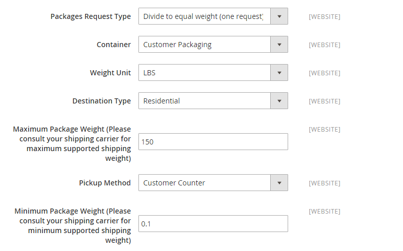

# United Parcel Service (UPS)

United Parcel Service (UPS) bietet inländische und internationale Verschiffen auf dem Land- und Luftweg in mehr als 220 Länder an.

{{ups-api}}

>[!NOTE]
>
>USV kann [Flächengewicht](carriers.md#dimensional-weight) um einige Versandraten zu ermitteln. Adobe Commerce unterstützt jedoch nur die gewichtsbasierte Versandkostenberechnung.

## Schritt 1: Öffnen eines UPS Versandkontos

Um diese Versandart Ihren Kunden anbieten zu können, müssen Sie zunächst ein Konto bei UPS eröffnen.

## Schritt 2: Aktivieren von UPS für Ihren Shop

1. Auf der _Admin-Seitenleiste_, zu gehen **[!UICONTROL Stores]** > _[!UICONTROL Settings]_>**[!UICONTROL Configuration]**.

1. Im Bedienfeld links, unter **[!UICONTROL Sales]**, wählen Sie **[!UICONTROL Delivery Methods]**.

1. Expand  Die **[!UICONTROL UPS]** -Abschnitt.

1. set **[!UICONTROL Enabled for Checkout]** bis `Yes`.

1. Gehen Sie für ein UPS REST-Konto (Standard) wie folgt vor:

   - Geben Sie Ihre UPS-Anmeldedaten ein: UPS ClientID als **[!UICONTROL User ID]** UPS, Client-Geheimnis als **[!UICONTROL Password]**

   - set **[!UICONTROL Mode]** bis `Live` um Daten über eine sichere Verbindung an das UPS Versandsystem zu senden. (Der Entwicklungsmodus sendet keine Daten über eine sichere Verbindung.)

   - Überprüfen Sie die **[!UICONTROL Gateway URL]** Dies ist erforderlich, um -Anfragen zu senden. Verwenden Sie eine Sandbox-URL für den Testmodus und eine Produktions-URL für Live-Anfragen.

   - Überprüfen Sie die **[!UICONTROL Tracking URL]** Dies ist erforderlich, um Tracking-Informationen zu erhalten. Verwenden Sie eine Sandbox-URL für den Testmodus und eine Produktions-URL für Live-Anfragen.

   - set **[!UICONTROL Origin of the Shipment]** in die Region, aus der die Sendung stammt.

   - Wenn Sie Sondertarife bei UPS haben, setzen Sie **[!UICONTROL Enable Negotiated Rates]** bis `Yes` und die sechsstellige Zahl eingeben **[!UICONTROL Shipper Number]** Ihnen von UPS zugewiesen.

   - set **[!UICONTROL Live Account]** eine der folgenden Möglichkeiten:

      - `Yes` - UPS läuft im Produktionsmodus und bietet UPS als Versandmethode an Ihre Kunden.
      - `No` - UPS wird im Testmodus ausgeführt.

   >[!NOTE]
   >
   >Für den Standardtyp Einheitlicher Paketdienst ist die Einstellung geplant. Verwenden Sie für neue Konfigurationen die Standardeinstellung `United Parcel Service REST` Typ. Der REST-Typ ist auch erforderlich, um Folgendes zu generieren [Versandetiketten](shipping-labels.md). 
   >Für die Version 2.4.7 **[!UICONTROL UPS Type]**  wird aus folgenden Gründen entfernt `UPS` und `UPS XML` -Typen sind für die Einstellung geplant und `UPS REST` ist der Standard. Die von der nativen Adobe Commerce-Integration verwendeten United Parcel Service (UPS)-APIs werden vorübergehend nicht mehr unterstützt, da sie derzeit das OAuth 2.0-Sicherheitsmodell nicht unterstützen.

   >[!IMPORTANT]
   >
   >UPS stellt die Unterstützung von HTTP ein, das im aktuellen Standard (Systemwert) verwendet wird. Löschen Sie die **[!UICONTROL Use system value]** Kontrollkästchen aktivieren und die URL ändern, um HTTPS zu verwenden. Beispiel: `https://www.ups.com/using/services/rave/qcostcgi.cgi`

1. für **[!UICONTROL Title]**, geben Sie den Namen dieser Versandoption so ein, wie sie während des Checkouts angezeigt werden soll.

   Standardmäßig ist dieses Feld auf festgelegt. `United Parcel Service`.

   {width="600" zoomable="yes"}

## Schritt 3: Container-Beschreibung ausfüllen

1. set **[!UICONTROL Packages Request Type]** eine der folgenden Möglichkeiten:

   - `Use origin weight (few requests)`
   - `Divide to equal weight (one request)`

1. für **[!UICONTROL Container]** Geben Sie hier den typischen Verpackungstyp für den Versand an:

   - `Customer Packaging`
   - `UPS Letter Envelope`
   - `Customer Supplied Package`
   - `UPS Tube`
   - `PAK`
   - `UPS Express Box`
   - `UPS Worldwide 25 kilo`
   - `UPS Worldwide 10 kilo`
   - `Pallet`
   - `Small Express Box`
   - `Medium Express Box`
   - `Large Express Box`

1. set **[!UICONTROL Weight Unit]** auf das System, mit dem Sie das Produktgewicht messen.

   Das von UPS unterstützte Gewichtssystem variiert je nach Land. Fragen Sie im Zweifelsfall bei UPS nach dem zu verwendenden Gewichtssystem. Zu den Optionen gehören:

   - `LBS`
   - `KGS`

1. set **[!UICONTROL Destination Type]** eine der folgenden Möglichkeiten:

   - `Residential` - Die meisten Ihrer Sendungen sind Business to Consumer (B2C).
   - `Commercial` - Die meisten Ihrer Sendungen sind Business-to-Business (B2B).

1. Geben Sie die **[!UICONTROL Maximum Package Weight]** vom Beförderer zugelassen.

1. set **[!UICONTROL Pickup Method]** eine der folgenden Möglichkeiten:

   - `Regular Daily Pickup`
   - `On Call Air`
   - `One Time Pickup`
   - `Letter Center`
   - `Customer Counter`

1. Geben Sie die **[!UICONTROL Minimum Package Weight]** vom Beförderer zugelassen.

   {width="600" zoomable="yes"}

## Schritt 4: Einrichten von Bearbeitungsgebühren

Die Bearbeitungsgebühr ist optional und erscheint als zusätzliche Gebühr, die zu den UPS Versandkosten hinzugerechnet wird. Wenn Sie eine Bearbeitungsgebühr einbeziehen möchten, gehen Sie wie folgt vor:

1. set **[!UICONTROL Calculate Handling Fee]** auf eine der folgenden Methoden:

   - `Fixed`
   - `Percent`

1. Um zu bestimmen, wie die Bearbeitungsgebühr angewendet wird, stellen Sie Folgendes ein: **[!UICONTROL Handling Applied]** eine der folgenden Möglichkeiten:

   - `Per Order`
   - `Per Package`

1. Geben Sie den Betrag der **[!UICONTROL Handling Fee]** in Rechnung zu stellen.

   Verwenden Sie das Dezimalformat, um einen Prozentsatz einzugeben. Geben Sie beispielsweise ein `0.25` für 25 %.

   {width="600" zoomable="yes"}

## Schritt 5: Zugelassene Methoden und anwendbare Länder angeben

1. für **[!UICONTROL Allowed Methods]** Wählen Sie daher jede UPS Versandart, die Ihren Kunden zur Verfügung stehen soll.

   Die Methoden werden während des Checkouts unter UPS angezeigt. Zur Auswahl mehrerer Methoden halten Sie die Strg-Taste (PC) bzw. die Befehlstaste (Mac) gedrückt und klicken auf die einzelnen Optionen.

1. Wenn Sie eine [kostenloser Versand](shipping-free.md) Option durch UPS, legen Sie die kostenlosen Versandoptionen fest:

   - set **[!UICONTROL Free Method]** auf die Methode, die Sie für den kostenlosen Versand verwenden möchten. Wenn Sie keinen kostenlosen Versand über UPS anbieten möchten, wählen Sie `None`.

   - Um einen Mindestbestellbetrag zu verlangen, der eine Bestellung für den kostenlosen Versand mit UPS qualifiziert, setzen Sie **[!UICONTROL Enable Free Shipping Threshold]** bis `Enable`. Geben Sie dann den Mindestwert in ein **[!UICONTROL Free Shipping Amount Threshold]**.

1. Ändern Sie bei Bedarf die **[!UICONTROL Displayed Error Message]**.

   Dieses Textfeld ist mit einer Standardmeldung vorbelegt, Sie können jedoch eine andere Nachricht eingeben, die angezeigt werden soll, wenn UPS nicht mehr verfügbar ist.

   {width="600" zoomable="yes"}

1. set **[!UICONTROL Ship to Applicable Countries]** eine der folgenden Möglichkeiten:

   - `All Allowed Countries` - Kunden aus allen [Länder](../getting-started/store-details.md#country-options) Diese Versandmethode kann von der Store-Konfiguration verwendet werden.
   - `Specific Countries` - Wenn Sie diese Option wählen, wird die _Versand in bestimmte Länder_ Liste angezeigt. Wählen Sie jedes Land in der Liste aus, in dem diese Versandmethode verwendet werden kann.

1. set **[!UICONTROL Show Method if Not Applicable]** eine der folgenden Möglichkeiten:

   - `Yes` - Listet alle verfügbaren UPS Versandmethoden während des Checkouts auf, einschließlich Methoden, die nicht für die Sendung gelten.
   - `No` - Listet nur die UPS Versandmethoden auf, die für die Sendung gelten.

   {width="600" zoomable="yes"}

1. Um eine Protokolldatei mit den Details der UPS-Sendungen aus Ihrem Geschäft zu erstellen, legen Sie Folgendes fest **[!UICONTROL Debug]** bis `Yes`.

1. für **[!UICONTROL Sort Order]** Geben Sie eine Zahl ein, um die Reihenfolge zu bestimmen, in der UPS beim Checkout mit anderen Versandmethoden aufgelistet wird.

   `0` = zuerst, `1` = Sekunde, `2` = Dritter usw.

1. Klick **[!UICONTROL Save Config]**.

## Schritt 6: Versandursprungsadresse einrichten

1. Stellen Sie sicher, dass Ihre [Informationen speichern](../getting-started/store-details.md#store-information) ist abgeschlossen.

1. Auf der _Admin_ Seitenleiste, zu gehen **[!UICONTROL Stores]** > _[!UICONTROL Settings]_>**[!UICONTROL Configuration]**.

1. Erweitern Sie im linken Bereich . **[!UICONTROL Sales]** und wählen Sie **[!UICONTROL Shipping Settings]**.

1. Expand  **[!UICONTROL Origin]** auf der Seite und konfigurieren Sie die Versandursprungsadresse.

   {width="600" zoomable="yes"}

1. Klick **[!UICONTROL Save Config]**.

>[!NOTE]
>
>Bei der Berechnung der Versandkosten gibt Commerce UPS nicht den vollständigen Bestellpreis an. Dieses Verhalten kann nicht geändert werden.
