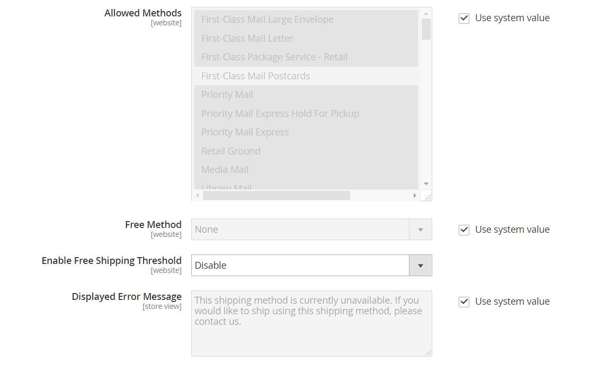

# United States Postal Service (USPS)

Der United States Postal Service ist ein unabhängiger Postdienst der Regierung der Vereinigten Staaten, der inländische und internationale Schifffahrtsdienste auf dem Land- und Luftweg anbietet.

## Schritt 1: USPS Versandkonto eröffnen

Öffnen einer [USPS Web-Tools][1] Konto. Nach Abschluss des Registrierungsprozesses erhalten Sie Ihre Benutzer-ID und eine URL zum USPS-Testserver.

Sie können auch ein [USPS Web-Tools][1] Konto. Nach Abschluss des Registrierungsprozesses erhalten Sie Ihre Benutzer-ID und eine URL zum USPS-Testserver. Weitere Informationen zu USPS Web Tools finden Sie in den [Technische Dokumentation][2].

## Schritt 2: USPS für Ihren Shop aktivieren

1. Auf der _Admin_ Seitenleiste, zu gehen **[!UICONTROL Stores]** > _[!UICONTROL Settings]_>**[!UICONTROL Configuration]**.

1. Erweitern Sie im linken Bereich . **[!UICONTROL Sales]** und wählen **[!UICONTROL Delivery Methods]**.

1. Expand  Die **[!UICONTROL USPS]** -Abschnitt.

   >[!NOTE]
   >
   >Deaktivieren Sie bei Bedarf zunächst die Option **[!UICONTROL Use system value]** Kontrollkästchen aktivieren, um die folgenden Einstellungen wie beschrieben zu ändern.

1. set **[!UICONTROL Enabled for Checkout]** bis `Yes`.

1. Geben Sie bei Bedarf Folgendes ein **[!UICONTROL Gateway URL]** um auf USPS Versandkosten zuzugreifen.

   >[!IMPORTANT]
   >
   >Mit dem 24. Juni 2021 wird die Unterstützung für alle unsicheren HTTP-Endpunkte durch USPS Web Tools eingestellt. Nach dieser Änderung schlagen alle Web-Tools-API-Anfragen, die an einen unsicheren HTTP-Endpunkt gesendet werden, fehl. Stellen Sie sicher, dass Ihre **[!UICONTROL Gateway URL]** verwendet den sicheren HTTPS-Endpunkt.

   Das Feld ist standardmäßig voreingestellt und muss normalerweise nicht geändert werden.

1. Geben Sie ein **[!UICONTROL Title]** für diese Versandmethode, die beim Checkout angezeigt wird.

1. Geben Sie die **[!UICONTROL User ID]** und **[!UICONTROL Password]** für Ihr USPS-Konto.

1. set **[!UICONTROL Mode]** eine der folgenden Möglichkeiten:

   - `Development` - USPS wird in einer Testumgebung ausgeführt. Nachdem Sie USPS in einer Entwicklungsumgebung ausgeführt haben, stellen Sie sicher, dass Sie zu einem späteren Zeitpunkt zurückkehren und Mode auf setzen `Live`.
   - `Live` - USPS wird in einer Live-Produktionsumgebung ausgeführt.

## Schritt 3: Vervollständigen Sie die Verpackungsbeschreibung

1. Um zu bestimmen, wie die Bestellung verwaltet wird, wenn sie als mehrere Pakete gesendet wird, legen Sie Folgendes fest **[!UICONTROL Packages Request Type]** eine der folgenden Möglichkeiten:

   - `Divide to Equal Weight` - (Eine Anfrage) Die Lieferung mehrerer Pakete kann als eine Anfrage eingereicht werden, wenn die Pakete durch das gleiche Gewicht geteilt werden.
   - `Use Origin Weight` - (Mehrere Anfragen) Mehrere Pakete müssen als separate Anfragen eingereicht werden, wenn das Ursprungsgewicht als Grundlage für die Berechnung der Versandkosten verwendet wird.

1. set **[!UICONTROL Container]** auf die Art der Verpackung, die normalerweise für den Versand der für Ihr Geschäft bestellten Produkte verwendet wird.

1. Legen Sie die **[!UICONTROL Size]** des typischen Pakets, das von Ihrem Geschäft geliefert wird.

1. set **[!UICONTROL Machinable]** eine der folgenden Möglichkeiten:

   - `Yes` - Wenn Ihr typisches Paket maschinell verarbeitet werden kann.
   - `No` - Wenn Ihr typisches Paket manuell verarbeitet werden muss.

1. Geben Sie die **[!UICONTROL Maximum Package Weight]** gemäß den Anforderungen des Beförderers.

   {width="600" zoomable="yes"}

## Schritt 4: Einrichten von Bearbeitungsgebühren

Die Bearbeitungsgebühr ist optional und erscheint als zusätzliche Gebühr, die zu den DHL Versandkosten hinzugerechnet wird. Wenn Sie eine Bearbeitungsgebühr einbeziehen möchten, gehen Sie wie folgt vor:

1. set **[!UICONTROL Calculate Handling Fee]** auf eine der folgenden Methoden:

   - `Fixed`
   - `Percent`

1. Um zu bestimmen, wie die Bearbeitungsgebühr angewendet wird, stellen Sie Folgendes ein: **[!UICONTROL Handling Applied]** eine der folgenden Möglichkeiten:

   - `Per Order`
   - `Per Package`

1. Geben Sie den Betrag der **[!UICONTROL Handling Fee]** in Rechnung zu stellen.

   Verwenden Sie das Dezimalformat, um einen Prozentsatz einzugeben. Geben Sie beispielsweise ein `0.25` für 25 %.

   {width="600" zoomable="yes"}

## Schritt 5: Zugelassene Methoden und anwendbare Länder angeben

1. für **[!UICONTROL Allowed Methods]** Wählen Sie daher jede USPS-Versandmethode aus, die Ihren Kunden zur Verfügung stehen soll.

   Die Methoden werden beim Checkout unter USPS angezeigt. Zur Auswahl mehrerer Methoden halten Sie die Strg-Taste (PC) bzw. die Befehlstaste (Mac) gedrückt und klicken auf die einzelnen Optionen.

1. Wenn Sie eine [kostenloser Versand](shipping-free.md) Option über USPS, legen Sie die kostenlosen Versandoptionen fest:

   - set **[!UICONTROL Free Method]** auf die Methode, die Sie für den kostenlosen Versand verwenden möchten. Wenn Sie keinen kostenlosen Versand über USPS anbieten möchten, wählen Sie `None`.

   - Um einen Mindestbestellbetrag zu verlangen, der eine Bestellung für den kostenlosen Versand mit USPS qualifiziert, setzen Sie **[!UICONTROL Enable Free Shipping Threshold]** bis `Enable`. Geben Sie dann den Mindestwert in ein **[!UICONTROL Free Shipping Amount Threshold]**.

1. Ändern Sie bei Bedarf die **[!UICONTROL Displayed Error Message]**.

   Dieses Textfeld ist mit einer Standardmeldung vorbelegt, Sie können jedoch eine andere Meldung eingeben, die angezeigt werden soll, wenn USPS nicht mehr verfügbar ist.

   {width="600" zoomable="yes"}

1. set **[!UICONTROL Ship to Applicable Countries]** eine der folgenden Möglichkeiten:

   - `All Allowed Countries` - Kunden aus allen [Länder](../getting-started/store-details.md#country-options) Diese Versandmethode kann von der Store-Konfiguration verwendet werden.
   - `Specific Countries` - Wenn Sie diese Option wählen, wird die _Versand in bestimmte Länder_ Liste angezeigt. Wählen Sie jedes Land in der Liste aus, in dem diese Versandmethode verwendet werden kann.

   {width="600" zoomable="yes"}

1. set **[!UICONTROL Show Method if Not Applicable]** eine der folgenden Möglichkeiten:

   - `Yes` - Listet alle verfügbaren USPS Versandmethoden während des Checkouts auf, einschließlich Methoden, die nicht für die Sendung gelten.
   - `No` - Listet nur die USPS-Versandmethoden auf, die für die Sendung gelten.

1. Um eine Protokolldatei mit den Details der USPS-Sendungen aus Ihrem Geschäft zu erstellen, legen Sie Folgendes fest **[!UICONTROL Debug]** bis `Yes`.

1. für **[!UICONTROL Sort Order]** Geben Sie eine Zahl ein, um die Reihenfolge zu bestimmen, in der USPS beim Checkout mit anderen Versandmethoden aufgelistet wird.

   `0` = zuerst, `1` = Sekunde, `2` = Dritter usw.

1. Klick **[!UICONTROL Save Config]**.

[1]: https://secure.shippingapis.com/registration/
[2]: https://www.usps.com/business/web-tools-apis/welcome.htm
