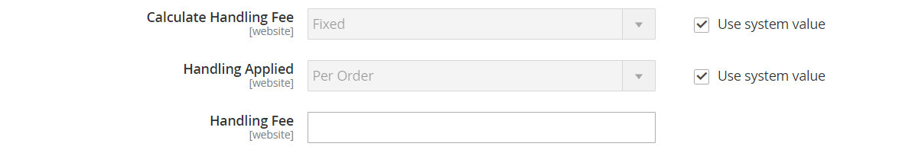

# United States Postal Service (USPS)

Der US-Postdienst ist der unabhängige Postdienst der US-Regierung, der inländische und internationale Seeverkehrsdienstleistungen auf dem Land- und Luftweg anbietet.

## Schritt 1: Öffnen Sie ein USPS-Versandkonto.

Öffnen Sie eine [USPS Web Tools][1] -Konto. Nach Abschluss des Registrierungsprozesses erhalten Sie Ihre Benutzer-ID und eine URL zum USPS-Testserver.

Sie können auch eine [USPS Web Tools][1] -Konto. Nach Abschluss des Registrierungsprozesses erhalten Sie Ihre Benutzer-ID und eine URL zum USPS-Testserver. Weitere Informationen zu USPS Web Tools finden Sie in den [Technische Dokumentation][2].

## Schritt 2: USPS für Ihren Store aktivieren

{{beta2-updates}}

1. Im _Admin_ Seitenleiste, navigieren Sie zu **[!UICONTROL Stores]** > _[!UICONTROL Settings]_>**[!UICONTROL Configuration]**.

1. Erweitern Sie im linken Bereich **[!UICONTROL Sales]** und wählen **[!UICONTROL Delivery Methods]**.

1. Erweitern  die **[!UICONTROL USPS]** Abschnitt.

   >[!NOTE]
   >
   >Heben Sie bei Bedarf die Auswahl der **[!UICONTROL Use system value]** aktivieren, um die folgenden Einstellungen wie beschrieben zu ändern.

1. Satz **[!UICONTROL Enabled for Checkout]** nach `Yes`.

1. Geben Sie bei Bedarf die **[!UICONTROL Gateway URL]** für den Zugriff auf die USPS Versandtarife.

   >[!IMPORTANT]
   >
   >Ab dem 24. Juni 2021 werden die USPS Web Tools die Unterstützung für alle unsicheren HTTP-Endpunkte entfernen. Nach dieser Änderung schlagen alle Web Tools-API-Anfragen, die an einen unsicheren HTTP-Endpunkt gesendet werden, fehl. Stellen Sie sicher, dass Ihr **[!UICONTROL Gateway URL]** verwendet den sicheren HTTPS-Endpunkt.

   Das Feld ist standardmäßig vordefiniert und muss normalerweise nicht geändert werden.

1. Geben Sie einen **[!UICONTROL Title]** für diese Versandmethode, die beim Checkout angezeigt wird.

1. Geben Sie die **[!UICONTROL User ID]** und **[!UICONTROL Password]** für Ihr USPS-Konto.

1. Satz **[!UICONTROL Mode]** auf einen der folgenden Werte zu:

   - `Development` - Führt USPS in einer Testumgebung aus. Nachdem Sie USPS in einer Entwicklungsumgebung ausgeführt haben, stellen Sie sicher, dass Sie zu einem späteren Zeitpunkt zurückkehren und den Modus auf `Live`.
   - `Live` - Führt USPS in einer Produktionsumgebung aus.

## Schritt 3: Angabe der Verpackungsbeschreibung

1. Um zu bestimmen, wie die Reihenfolge verwaltet wird, wenn sie als mehrere Pakete gesendet wird, legen Sie **[!UICONTROL Packages Request Type]** auf einen der folgenden Werte zu:

   - `Divide to Equal Weight` - (Eine Anfrage) Die Sendung mehrerer Packstücke kann als eine Anfrage eingereicht werden, wenn die Packstücke durch gleiche Gewichtung aufgeteilt sind.
   - `Use Origin Weight` - (Mehrfachanfragen) Mehrere Packstücke müssen als gesonderte Anträge eingereicht werden, wenn das Ursprungsgewicht als Grundlage für die Berechnung der Versandkosten verwendet wird.

1. Satz **[!UICONTROL Container]** für die Art der Verpackung, die normalerweise für den Versand von für Ihr Geschäft bestellten Produkten verwendet wird.

1. Legen Sie die **[!UICONTROL Size]** des typischen Packages, das von Ihrem Laden versandt wird.

1. Satz **[!UICONTROL Machinable]** auf einen der folgenden Werte zu:

   - `Yes` - Wenn Ihr typisches Paket von einem Computer verarbeitet werden kann.
   - `No` - Wenn Ihr typisches Paket manuell verarbeitet werden muss.

1. Geben Sie die **[!UICONTROL Maximum Package Weight]** gemäß den Befördereranforderungen.

   {width="600" zoomable="yes"}

## Schritt 4: Einrichten von Bearbeitungsgebühren

Die Bearbeitungsgebühr ist optional und erscheint als zusätzliche Gebühr, die zu den Versandkosten von DHL hinzukommt. Wenn Sie eine Bearbeitungsgebühr einbeziehen möchten, gehen Sie wie folgt vor:

1. Satz **[!UICONTROL Calculate Handling Fee]** auf eine der folgenden Methoden anwenden:

   - `Fixed`
   - `Percent`

1. Um festzustellen, wie die Bearbeitungsgebühr angewendet wird, legen Sie **[!UICONTROL Handling Applied]** auf einen der folgenden Werte zu:

   - `Per Order`
   - `Per Package`

1. Geben Sie die Menge der **[!UICONTROL Handling Fee]** zu berechnen.

   Um einen Prozentsatz einzugeben, verwenden Sie das Dezimalformat. Geben Sie beispielsweise `0.25` für 25 %.

   {width="600" zoomable="yes"}

## Schritt 5: Angeben der zulässigen Methoden und der entsprechenden Länder

1. Für **[!UICONTROL Allowed Methods]**, wählen Sie jede USPS Versandmethode aus, um für Ihre Kunden verfügbar zu sein.

   Die Methoden werden beim Checkout unter USPS angezeigt. Um mehrere Methoden auszuwählen, halten Sie die Strg-Taste (PC) oder die Befehlstaste (Mac) gedrückt und klicken Sie auf jede Option.

1. Wenn Sie eine [Kostenloser Versand](shipping-free.md) -Option über USPS festlegen Sie die kostenlosen Versandoptionen:

   - Satz **[!UICONTROL Free Method]** zu der Methode, die Sie für den kostenlosen Versand verwenden möchten. Wenn Sie keinen kostenlosen Versand über USPS anbieten möchten, wählen Sie `None`.

   - Um einen Mindestbestellbetrag zu verlangen, der für eine kostenlose Lieferung mit USPS qualifiziert ist, legen Sie **[!UICONTROL Enable Free Shipping Threshold]** nach `Enable`. Geben Sie dann den Mindestwert in **[!UICONTROL Free Shipping Amount Threshold]**.

1. Ändern Sie bei Bedarf die **[!UICONTROL Displayed Error Message]**.

   Dieses Textfeld ist mit einer Standardmeldung vordefiniert, Sie können jedoch eine andere Meldung eingeben, die angezeigt werden soll, wenn USPS nicht verfügbar ist.

   {width="600" zoomable="yes"}

1. Satz **[!UICONTROL Ship to Applicable Countries]** auf einen der folgenden Werte zu:

   - `All Allowed Countries` - Kunden von allen [Länder](../getting-started/store-details.md#country-options) Diese in Ihrer Store-Konfiguration angegebene Versandmethode kann verwendet werden.
   - `Specific Countries` - Wenn Sie diese Option wählen, wird die _Schiff in bestimmte Länder_ angezeigt. Wählen Sie jedes Land in der Liste aus, in dem diese Versandmethode verwendet werden kann.

   {width="600" zoomable="yes"}

1. Satz **[!UICONTROL Show Method if Not Applicable]** auf einen der folgenden Werte zu:

   - `Yes` - Listet alle verfügbaren USPS Versandmethoden während des Checkout auf, einschließlich Methoden, die nicht für den Versand gelten.
   - `No` - Listet nur die USPS Versandmethoden auf, die für den Versand gelten.

1. Um eine Protokolldatei mit Details zu USPS-Sendungen zu erstellen, die über Ihren Speicher durchgeführt werden, legen Sie **[!UICONTROL Debug]** nach `Yes`.

1. Für **[!UICONTROL Sort Order]** Geben Sie eine Zahl ein, um die Reihenfolge zu bestimmen, in der USPS angezeigt wird, wenn es beim Checkout mit anderen Versandmethoden aufgeführt wird.

   `0` = first, `1` = Sekunde, `2` = drittes Element usw.

1. Klicken **[!UICONTROL Save Config]**.

[1]: https://secure.shippingapis.com/registration/
[2]: https://www.usps.com/business/web-tools-apis/welcome.htm
