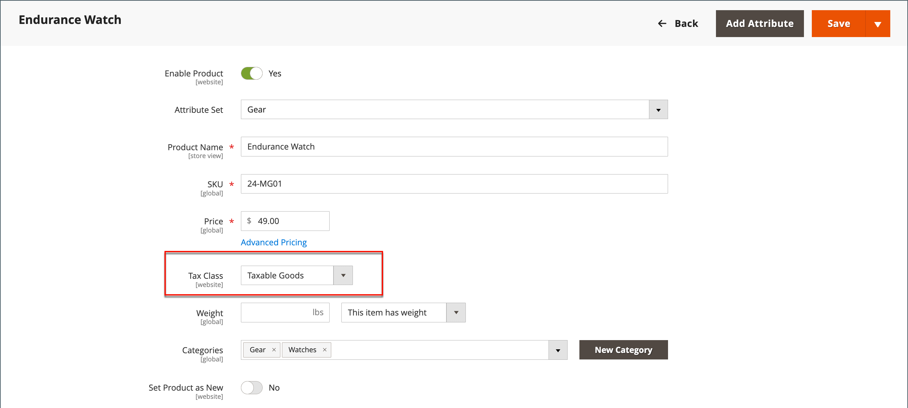
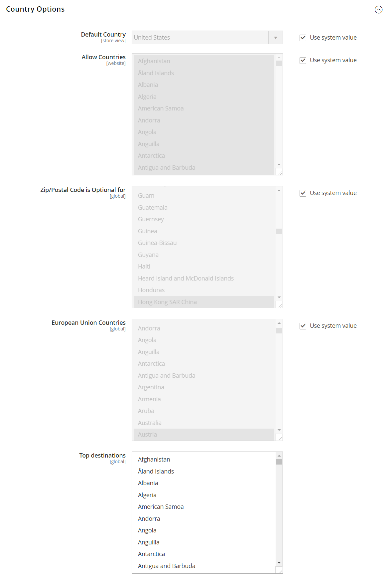

# Mehrwertsteuer (MwSt.)

Einige Länder erheben auf Waren und Dienstleistungen eine Mehrwertsteuer (MwSt.). Je nach Phase des Herstellungs- oder Vertriebsprozesses, der Materialien oder Dienstleistungen, die Sie an Ihre Kunden verkaufen, kann es unterschiedliche Mehrwertsteuersätze geben. Sie können mehr als einen Mehrwertsteuersatz anwenden, um die fällige Steuer korrekt zu berechnen.

Commerce kann so konfiguriert werden, dass eine Mehrwertsteuer auf der Grundlage der Händleradresse oder Kundenadresse erhoben wird, wenn sich beide im selben Land befinden. Die MwSt.-Berechnungen basieren in der Regel auf dem Bestimmungsort der Sendung und nicht auf dem Ursprungsort. In den meisten Szenarien reicht eine Konfigurationseinstellung aus, bei der die MwSt. anhand der Lieferadresse des Kunden berechnet wird.

## Beispielszenarien

- Für ein in einem EU-Land registriertes Unternehmen, das Gegenstände an eine Privatperson in einem anderen EU-Land liefert, wird die MwSt anhand des Standorts eines Händlers als „Fernverkauf“ berechnet.

- Ein Unternehmen in den Niederlanden, das einen Kauf in einem Geschäft in Großbritannien tätigt, das an eine Adresse in Großbritannien versendet, muss die Mehrwertsteuersätze in Großbritannien zahlen.

- Beim Verkauf von [herunterladbaren Produkten](../catalog/product-create-downloadable.md) oder _digitalen Waren_ basiert der Mehrwertsteuersatz auf dem Versandziel und nicht auf dem Standort des Händlers. Siehe [Ort der Lieferung digitaler Güter](taxes.md#place-of-supply-for-digital-goods-eu).

>[!TIP]
>
>Einige grenzüberschreitende und B2B-Sendungen unterliegen komplexeren Steuervorschriften. Um die nativen Funktionen Ihrer Commerce-Installation zu erweitern, sollten Sie eine Steuerverwaltungslösung vom [Marketplace](https://marketplace.magento.com/extensions/accounting-finance/taxes.html) hinzufügen.

## Konfigurieren von MwSt.

Die folgenden Anweisungen enthalten ein Beispielverfahren für die Einrichtung einer 20%igen Mehrwertsteuer im Vereinigten Königreich für Verkäufe an Einzelhandelskunden. Für andere Steuersätze und Länder folgen Sie dem allgemeinen Verfahren, geben Sie jedoch spezifische Informationen ein, die Ihrem Land, Mehrwertsteuersatz, Kundentypen usw. entsprechen.

>[!NOTE]
>
>Bevor Sie fortfahren, informieren Sie sich darüber, welche Regeln und Vorschriften in Ihrem Bereich für die Mehrwertsteuer gelten.

Bei bestimmten Umsätzen zwischen Unternehmen wird die MwSt nicht erhoben. Commerce kann die MwSt.-ID eines Kunden validieren, um sicherzustellen, dass die MwSt. ordnungsgemäß berechnet (oder nicht berechnet) wird. Siehe [Validierung der MwSt.-ID](#vat-id-validation).

### Schritt 1: Einrichten von Steuerklassen für Debitoren

Der Prozess der Erstellung einer Steuerregel beginnt mit dem Hinzufügen eines Steuersatzes.

1. Navigieren Sie in _Admin_-Seitenleiste zu **[!UICONTROL Stores]** > _[!UICONTROL Taxes]_>**[!UICONTROL Tax Zones and Rates]**.

   {width="600" zoomable="yes"}

1. Stellen Sie sicher, dass es eine Steuerklasse für den Kunden gibt, die mit der MwSt. verwendet werden kann.

   Stellen Sie für dieses Beispiel sicher, dass es eine Steuerklasse für Kunden namens &quot;_&quot;_. Wenn diese Steuerklasse nicht vorhanden ist, klicken Sie auf **[!UICONTROL Add New Tax Rate]**.

1. Geben Sie die **[!UICONTROL Tax Identifier]** für die neue Steuerklasse ein.

   Alle Steuersätze werden im Feld _Steuersatz_ unter „Informationen _Steuerregeln_ angezeigt, wenn Sie Steuerregeln erstellen.

1. Um den Bereich der Postleitzahl (von / bis) festzulegen, aktivieren Sie das Kontrollkästchen **[!UICONTROL Zip/Post is Range]** .

1. Wählen Sie die **[!UICONTROL Country]** aus, für die der Steuersatz gilt.

1. Geben Sie die **[!UICONTROL Rate Percent]** ein, die für die Berechnung des Steuersatzes beim Kauf verwendet werden soll.

1. Klicken Sie abschließend auf **[!UICONTROL Save Rate]**.

Basierend auf dem übermittelten Steuersatz können Sie nachfolgende Steuerregeln erstellen. Wenn es keine Steuersätze gibt, wird die Schaffung von Steuervorschriften unmöglich.

### Schritt 2: Einrichten von Produktsteuerklassen

1. Navigieren Sie in _Admin_-Seitenleiste zu **[!UICONTROL Stores]** > _[!UICONTROL Taxes]_>**[!UICONTROL Tax Rules]**.

1. Klicken Sie auf **[!UICONTROL Add New Tax Rule]**.

1. Erweitern Sie  den Abschnitt **[!UICONTROL Additional Settings]** .

   {width="600" zoomable="yes"}

1. Klicken _unter „Produktsteuerklasse_ auf **[!UICONTROL Add New Tax Class]**.

1. Um die neue Klasse zur Liste der verfügbaren Produktsteuerklassen hinzuzufügen und drei neue Klassen zu erstellen, geben Sie den **[!UICONTROL Name]** der neuen Steuerklasse ein und klicken Sie auf das Häkchen:

   - `VAT Standard`
   - `VAT Reduced`
   - `VAT Zero`

1. Klicken Sie für jede neue Klasse, die Sie hinzufügen, auf **[!UICONTROL Save Class]** .

1. Klicken Sie auf **[!UICONTROL Save Rule]**.

### Schritt 3: Einrichten von Steuerzonen und Steuersätzen

1. Navigieren Sie in _Admin_-Seitenleiste zu **[!UICONTROL Stores]** > _[!UICONTROL Taxes]_>**[!UICONTROL Tax Zones and Rates]**.

   In diesem Beispiel können Sie die US-Steuersätze entfernen oder sie unverändert lassen.

1. Klicken Sie auf **[!UICONTROL Add New Tax Rate]**.

   {width="600" zoomable="yes"}

1. Definieren Sie die neuen Sätze wie folgt:

   **MwSt.-**

   - Steuernummer: `VAT Standard`
   - Land und Staat: `United Kingdom`
   - Rate Prozent: `20.00`

   **Ermäßigte Mehrwertsteuer**

   - Steuernummer: `VAT Reduced`
   - Land und Staat: `United Kingdom`
   - Rate Prozent: `5.00`

1. Für jeden Tarif auf **[!UICONTROL Save Rate]** klicken.

### Schritt 4: Einrichten von Steuerregeln

Eine Steuerregel ist eine Kombination aus einer Debitorensteuerklasse, einer Produktsteuerklasse und einem Steuersatz.

1. Navigieren Sie in _Admin_-Seitenleiste zu **[!UICONTROL Stores]** > _[!UICONTROL Taxes]_>**[!UICONTROL Tax Rules]**.

1. Fügen Sie neue Steuerregeln wie folgt hinzu:

   **MwSt.-**

   - Name: `VAT Standard`
   - Debitorensteuerklasse: `Retail Customer`
   - Produkt-Steuerklasse: `VAT Standard`
   - Steuersatz: `VAT Standard Rate`

   **Ermäßigte MwSt**

   - Name: `VAT Reduced`
   - Debitorensteuerklasse: `Retail Customer`
   - Produkt-Steuerklasse: `VAT Reduced`
   - Steuersatz: `VAT Reduced Rate`

1. Für jeden Tarif auf **[!UICONTROL Save Rule]** klicken.

### Schritt 5: Anwenden von Steuerklassen auf Produkte

1. Navigieren Sie in der _Admin_-Seitenleiste zu **[!UICONTROL Catalog]** > **[!UICONTROL Manage Products]**.

1. Öffnen Sie ein Produkt aus Ihrem Katalog im Bearbeitungsmodus.

1. Suchen Sie auf der _Allgemein_ die Option **[!UICONTROL Tax Class]** und wählen Sie die **[!UICONTROL VAT Class]** aus, die für das Produkt gilt.

1. Klicken Sie abschließend auf **[!UICONTROL Save]**.

   {width="600" zoomable="yes"}

## Feldbeschreibungen

### Informationen speichern

Commerce verwendet die folgenden [Konfigurationseinstellungen für Store-Informationen](../configuration-reference/general/general.md#store-information), um die MwSt. auf der Grundlage von Händlerinformationen zu berechnen.

**[!UICONTROL VAT Number]** - Die Mehrwertsteuernummer, die dem Händler zugewiesen wird.

**[!UICONTROL Validate VAT Number]** - [MwSt-Validierung](#vat-id-validation) bestätigt, dass die MwSt-Nummer mit dem entsprechenden Datensatz in der Datenbank der [Europäischen Kommission](https://ec.europa.eu/taxation_customs/vies/) übereinstimmt.

### Kundeninformationen

Commerce verwendet die folgenden Felder, um die MwSt. anhand von [Kundeninformationen](../customers/account-dashboard-account-information.md) zu berechnen.

#### Kontoinformationen

**[!UICONTROL Tax/VAT Number]** - Falls zutreffend, die Steuernummer oder Umsatzsteuernummer, die dem Kunden zugeordnet ist.

#### Adressen

**[!UICONTROL VAT Number]** - Falls zutreffend, die Umsatzsteuernummer, die mit einer bestimmten Rechnungs- oder Lieferadresse des Kunden verknüpft ist. Für den Verkauf von [digitalen Waren](taxes.md#place-of-supply-for-digital-goods-eu) innerhalb der EU basiert der Mehrwertsteuerbetrag auf dem Bestimmungsort des Versands.

### Kundenkonto

Commerce verwendet die folgenden [Kundenkonfigurationseinstellungen](../customers/account-options-new.md) zur Berechnung der MwSt.

**[!UICONTROL Show VAT Number on Storefront]** - Bestimmt, ob das Feld „MwSt.-Nummer des Kunden“ im Adressbuch enthalten ist, das im Kundenkonto verfügbar ist.

**[!UICONTROL Default Value for Disable Automatic Group Changes Based on VAT ID]** - MwSt.-ID ist eine interne Kennung für die MwSt.-Nummer des Kunden bei Verwendung in der MwSt.-Validierung. Bei der Mehrwertsteuervalidierung bestätigt Commerce, dass die Nummer mit der Datenbank [Europäische Kommission](https://ec.europa.eu/taxation_customs/vies/) übereinstimmt. Kunden können basierend auf den Validierungsergebnissen automatisch einer der vier Standardkundengruppen zugewiesen werden.

## Validierung der MwSt.-Kennung

_VAT ID Validation_ berechnet automatisch die erforderliche Steuer für B2B-Transaktionen, die innerhalb der Europäischen Union (EU) stattfinden, basierend auf dem Gebietsschema des Händlers und Kunden. Commerce führt die Validierung der MwSt.-Nummer mithilfe der Webservices des Servers [Europäische Kommission](https://ec.europa.eu/taxation_customs/vies/) durch.

>[!NOTE]
>
>MwSt-bezogene Steuervorschriften beeinflussen andere Steuervorschriften nicht und stehen der Anwendung anderer Steuervorschriften nicht entgegen. Es kann jeweils nur eine Steuerregel angewendet werden.

- Die MwSt wird erhoben, wenn sich der Händler und der Kunde im selben EU-Land befinden.
- Die MwSt wird nicht erhoben, wenn sich der Händler und der Kunde in verschiedenen EU-Ländern befinden und beide Parteien in der EU eingetragene Unternehmen sind.

Der Store-Administrator erstellt mehr als eine standardmäßige Kundengruppe, die dem Kunden während der Kontoerstellung, der Adresserstellung oder -aktualisierung und des Checkouts automatisch zugewiesen werden kann. Dies hat zur Folge, dass für innerstaatliche (Inlands-) und innergemeinschaftliche Verkäufe unterschiedliche Steuervorschriften gelten.

>[!IMPORTANT]
>
>Wenn Sie virtuelle oder herunterladbare Produkte verkaufen, für die kein Versand erforderlich ist, sollte der MwSt.-Satz des Landes, in dem sich der Kunde befindet, sowohl für innergemeinschaftliche als auch für inländische Verkäufe verwendet werden. Erstellen Sie zusätzliche individuelle Steuerregeln für Produktsteuerklassen, die den virtuellen Produkten entsprechen.

### Registrierungs-Workflow für Kunden

Wenn die Validierung der MwSt.-ID aktiviert ist, wird jedem Kunden nach der Registrierung vorgeschlagen, die MwSt.-ID-Nummer einzugeben. Dieses Feld wird jedoch nur von Käufern ausgefüllt, die registrierte MwSt-Kunden sind.

Nachdem ein Kunde die MwSt.-Nummer und andere Adressfelder angegeben und die Speicherung ausgewählt hat, speichert das System die Adresse und sendet die MwSt.-ID-Validierungsanfrage an den Server der Europäischen Kommission. Gemäß den Ergebnissen der Validierung wird einem Kunden eine der Standardgruppen zugewiesen. Diese Gruppe kann geändert werden, wenn ein Kunde oder Administrator die MwSt.-Kennung der Standardadresse ändert oder die gesamte Standardadresse ändert. Manchmal kann die Gruppe beim einseitigen Auschecken vorübergehend geändert (Gruppenänderung wird emuliert) werden.

Wenn diese Option aktiviert ist, können Sie die Validierung der MwSt.-ID für einzelne Kunden überschreiben, indem Sie das Kontrollkästchen auf der Seite _[!UICONTROL Customer Information]_aktivieren.

### Checkout-Workflow

Wenn die MwSt.-Validierung eines Kunden während des Checkouts durchgeführt wird, werden die MwSt.-Anforderungskennung und das MwSt.-Anforderungsdatum im Abschnitt Kommentarverlauf der Bestellung gespeichert.

Das Systemverhalten, das sich aus der Validierung der MwSt.-ID und der Änderung der Kundengruppe während des Checkouts ergibt, hängt davon ab, wie die Einstellungen Bei jeder Transaktion validieren und Automatische Gruppenänderung deaktivieren konfiguriert sind. In diesem Abschnitt wird die Implementierung der Validierungsfunktion der MwSt.-ID für den Checkout im Frontend beschrieben.

Wenn der Kunde Google Express Checkout, PayPal Express Checkout oder eine andere externe Checkout-Methode verwendet, wird der Checkout vollständig auf der Seite des externen Zahlungs-Gateways durchgeführt. In diesem Szenario kann die Einstellung _Bei jeder Transaktion validieren_ nicht angewendet werden und die Kundengruppe kann sich während des Checkouts nicht ändern.

{width="550" zoomable="yes"}

### Konfigurieren der Validierung der MwSt.-ID

Um die Validierung der MwSt.-ID zu konfigurieren, müssen Sie zunächst die erforderlichen Kundengruppen einrichten und die entsprechenden Steuerklassen, -sätze und -regeln erstellen. Aktivieren Sie dann die Validierung der MwSt.-ID für den Store und schließen Sie die Konfiguration ab.

Die folgenden Beispiele zeigen, wie Steuerklassen und -sätze für die MwSt.-ID-Validierung verwendet werden. Sehen Sie sich die Beispiele an und befolgen Sie dann die Anweisungen zum Einrichten der Steuerklassen und -regeln, die für Ihren Store erforderlich sind.

#### Beispiel: Minimale Steuerregeln für die Validierung der MwSt.-ID erforderlich

| #1 der Steuerregel |  |
|--- |--- |
| Debitorensteuerklasse | Kundensteuerklassen müssen Folgendes umfassen:  A-Klasse für inländische Kunden.  Eine Klasse für Kunden mit falsch formatierten MwSt.-IDs. Eine Klasse für Kunden, bei denen die Validierung der MwSt.-ID fehlgeschlagen ist. |
| Produkt-Steuerklasse | Produktsteuerklassen müssen eine Klasse für Produkte aller Typen, mit Ausnahme von Paketen und virtuellen Produkten, enthalten. |
| Steuersatz | Der Steuersatz muss den Mehrwertsteuersatz des Landes enthalten, in dem der Händler ansässig ist. |

{style="table-layout:auto"}

| #2 der Steuerregel |   |
|--- |--- |
| Debitorensteuerklasse | Eine Klasse für Kunden innerhalb der Union. |
| Produkt-Steuerklasse | Eine Klasse für Produkte aller Typen, außer virtueller. |
| Steuersatz | MwSt-Sätze für alle EU-Länder außer dem Land des Händlers. Derzeit beträgt dieser Prozentsatz 0 %. |

{style="table-layout:auto"}

| #3 der Steuerregel | (Erforderlich für virtuelle und herunterladbare Produkte) |
|--- |--- |
| Debitorensteuerklasse | Steuerklassen für Kunden müssen Folgendes enthalten:  A-Klasse für inländische Kunden  A-Klasse für Kunden mit ungültiger MwSt.-ID A-Klasse für Kunden, für die die MwSt.-ID-Validierung fehlgeschlagen ist |
| Produkt-Steuerklasse | Eine Klasse für virtuelle Produkte. |
| Steuersatz | Mehrwertsteuersatz des Landes des Händlers. |

{style="table-layout:auto"}

| #4 der Steuerregel | (Erforderlich für virtuelle und herunterladbare Produkte) |
|--- |--- |
| Debitorensteuerklasse | Eine Klasse für Kunden innerhalb der Union. |
| Produkt-Steuerklasse | Eine Klasse für virtuelle Produkte. |
| Steuersatz | MwSt-Sätze für alle EU-Länder außer dem Land des Händlers. Derzeit beträgt dieser Prozentsatz 0 %. |

{style="table-layout:auto"}

#### Schritt 1: Erstellen von mehrwertsteuerbezogenen Kundengruppen

Bei der Validierung der MwSt.-ID wird den Kunden automatisch eine der vier Standardkundengruppen gemäß den Ergebnissen der MwSt.-ID-Validierung zugewiesen:

- häuslich
- EU-intern
- Ungültige MwSt.-ID
- Validierungsfehler

Sie können Kundengruppen für die Validierung der MwSt.-ID erstellen oder vorhandene Gruppen verwenden, wenn diese Ihrer Geschäftslogik entsprechen. Beim Konfigurieren der MwSt.-ID-Validierung müssen Sie jede der erstellten Kundengruppen als Standard für Kunden mit entsprechenden Ergebnissen der MwSt.-ID-Validierung zuweisen.

#### Schritt 2: Erstellen Sie mehrwertsteuerbezogene Klassen, Sätze und Regeln

Jede Steuerregel wird von drei Entitäten definiert:

- Debitorensteuerklassen
- Produktsteuerklassen
- Steuersätze

Erstellen Sie die [Steuerregeln](tax-rules.md), um die MwSt.-ID-Validierung effektiv zu verwenden.

- Zu den Steuervorschriften gehören Steuersätze und [Steuerklassen](tax-class.md).
- Steuerklassen werden „Kundengruppen[ zugeordnet](../customers/customer-groups.md).

#### Schritt 3: Validierung der MwSt.-ID aktivieren und konfigurieren

1. Navigieren Sie in _Admin_-Seitenleiste zu **[!UICONTROL Stores]** > _[!UICONTROL Settings]_>**[!UICONTROL Configuration]**.

1. Legen Sie bei Bedarf die **[!UICONTROL Store View]** für die Konfiguration fest.

1. Erweitern Sie im linken Bereich **[!UICONTROL Customers]** und wählen Sie **[!UICONTROL Customer Configuration]**.

1. Erweitern Sie  den Abschnitt **[!UICONTROL Create New Account Options]** .

   Im folgenden Beispiel sind die allgemeinen Kundeneinstellungen, die sich nicht auf die MwSt.-Validierung beziehen, abgeblendet.

   {width="600" zoomable="yes"}

1. Legen Sie **[!UICONTROL Enable Automatic Assignment to Customer Group]** auf `Yes` fest und füllen Sie die folgenden Felder nach Bedarf aus.

   - **[!UICONTROL Default Group]**
   - **[!UICONTROL Default Value for Disable Automatic Group Changes Based on VAT ID]**
   - **[!UICONTROL Show VAT Number on Storefront]**

1. Klicken Sie abschließend auf **[!UICONTROL Save Config]**.

#### Schritt 4: Legen Sie Ihre MwSt.-Kennung und Ihr Land fest

1. Erweitern Sie im linken Bereich **[!UICONTROL General]** und wählen Sie darunter **[!UICONTROL General]**.

1. Erweitern Sie  den Abschnitt **[!UICONTROL Store Information]** .

   {width="600" zoomable="yes"}

1. Wählen Sie Ihre **[!UICONTROL Country]** aus.

1. Geben Sie Ihre **[!UICONTROL VAT Number]** ein und klicken Sie auf **[!UICONTROL Validate VAT Number]**.

   Das Ergebnis wird sofort angezeigt.

1. Klicken Sie abschließend auf **[!UICONTROL Save Config]**.

#### Schritt 5: Überprüfen der Liste der EU-Mitgliedstaaten

1. Erweitern Sie auf der _Allgemein_ Konfigurationsseite den  den Abschnitt **[!UICONTROL Countries Options]** .

   {width="600" zoomable="yes"}

1. Überprüfen Sie in der **[!UICONTROL European Union Countries]**, ob jedes Mitgliedsland der EU ausgewählt ist.

   Um die Standardeinstellung zu ändern, deaktivieren **das Kontrollkästchen „Systemwerte**. Halten Sie die Strg-Taste (PC) oder die Befehlstaste (Mac) gedrückt und klicken Sie auf jedes Land, das Sie hinzufügen oder entfernen möchten.

1. Klicken Sie abschließend auf **[!UICONTROL Save Config]**.
