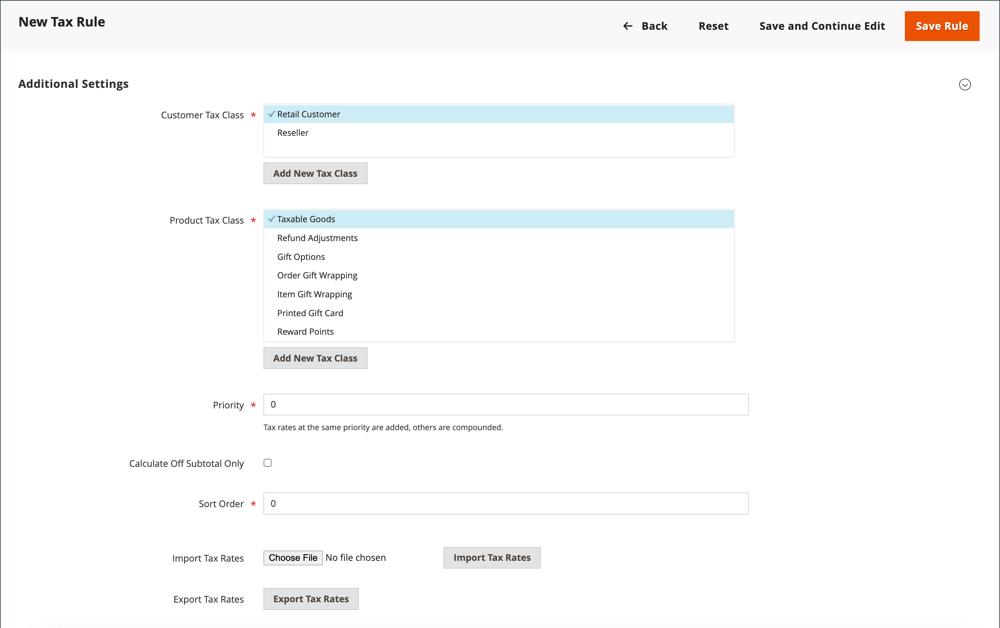

# Mehrwertsteuer (MwSt)

Einige Länder erheben eine Mehrwertsteuer auf Waren und Dienstleistungen. Je nach der Stufe des Herstellungs- oder Vertriebsprozesses, der Materialien oder der Dienstleistungen, die Sie an Ihre Kunden verkaufen, kann es unterschiedliche Mehrwertsteuersätze geben. Sie können mehrere MwSt.-Sätze anwenden, um die fällige Steuer korrekt zu berechnen.

Commerce kann so konfiguriert werden, dass eine Mehrwertsteuer auf der Grundlage der Händler- oder Kundenadresse berechnet wird, wenn beide im selben Land liegen. Die MwSt-Berechnungen basieren in der Regel auf dem Bestimmungsort der Lieferung und nicht auf dem Ursprungsort. In den meisten Szenarien ist eine Konfigurationseinstellung ausreichend, die die Mehrwertsteuer auf der Grundlage der Lieferadresse des Kunden berechnet.

## Beispielszenarien

- Für ein mehrwertsteuerpflichtiges Unternehmen in einem EU-Land, das Waren an eine Privatperson in einem anderen EU-Land liefert, wird die Mehrwertsteuer als &quot;Fernverkauf&quot;berechnet, der auf dem Standort des Händlers basiert.

- Ein Unternehmen in den Niederlanden, das einen Kauf bei einem Geschäft im Vereinigten Königreich tätigt, das an eine Adresse im Vereinigten Königreich verschickt wird, muss die britischen Mehrwertsteuersätze entrichten.

- Für den Verkauf von [herunterladbaren Produkten](../catalog/product-create-downloadable.md) oder _digitalen Gütern_ basiert der Mehrwertsteuersatz auf dem Versandziel und nicht auf dem Händlerstandort. Siehe [Lieferort für digitale Waren](taxes.md#place-of-supply-for-digital-goods-eu).

>[!TIP]
>
>Einige grenzüberschreitende Sendungen und B2B-Sendungen haben komplexere steuerliche Anforderungen. Um die nativen Funktionen Ihrer Commerce-Installation zu erweitern, sollten Sie eine Steuerverwaltungslösung vom [Marketplace](https://marketplace.magento.com/extensions/accounting-finance/taxes.html) hinzufügen.

## Mehrwertsteuer konfigurieren

Die folgenden Anweisungen enthalten ein Stichprobenverfahren zur Einrichtung einer Mehrwertsteuer von 20 % im Vereinigten Königreich für den Verkauf an Einzelhändler. Für andere Steuersätze und Länder folgen Sie dem allgemeinen Verfahren, geben jedoch spezifische Informationen ein, die Ihrem Land, Ihrem Mehrwertsteuersatz, Ihren Kundentypen usw. entsprechen.

>[!NOTE]
>
>Stellen Sie vor dem Fortfahren sicher, dass Sie herausfinden, welche Vorschriften und Vorschriften in Ihrem Bereich für die Mehrwertsteuer gelten.

Bei bestimmten unternehmensübergreifenden Umsätzen wird die Mehrwertsteuer nicht bewertet. Commerce kann die MwSt-ID eines Kunden validieren, um sicherzustellen, dass die MwSt richtig bewertet (oder nicht bewertet) wird. Siehe [Validierung der MwSt-ID](#vat-id-validation).

### Schritt 1: Einrichten von Kundensteuerklassen

Der Prozess der Erstellung einer Steuerregel beginnt mit der Hinzufügung eines Steuersatzes.

1. Wechseln Sie in der Seitenleiste _Admin_ zu **[!UICONTROL Stores]** > _[!UICONTROL Taxes]_>**[!UICONTROL Tax Zones and Rates]**.

   {width="600" zoomable="yes"}

1. Stellen Sie sicher, dass eine für die Verwendung mit der Mehrwertsteuer geeignete Kundensteuerklasse vorhanden ist.

   Stellen Sie für dieses Beispiel sicher, dass es eine Kundensteuerklasse mit dem Namen _Einzelhandelskunden_ gibt. Wenn diese Steuerklasse nicht vorhanden ist, klicken Sie auf **[!UICONTROL Add New Tax Rate]**.

1. Geben Sie die **[!UICONTROL Tax Identifier]** für die neue Steuerklasse ein.

   Alle Steuersätze werden beim Erstellen von Steuerregeln im Feld _Steuersatz_ in den _Informationen zu Steuerregeln_ angezeigt.

1. Um den Postleitzahlbereich (von / bis) festzulegen, aktivieren Sie das Kontrollkästchen **[!UICONTROL Zip/Post is Range]** .

1. Wählen Sie die **[!UICONTROL Country]** aus, für die der Steuersatz gilt.

1. Geben Sie die **[!UICONTROL Rate Percent]** ein, die bei Kauf für die Berechnung des Steuersatzes verwendet werden soll.

1. Klicken Sie nach Abschluss des Vorgangs auf **[!UICONTROL Save Rate]**.

Basierend auf dem übermittelten Steuersatz können Sie nachfolgende Steuerregeln erstellen. Ohne Steuersätze wird die Schaffung von Steuervorschriften unmöglich.

### Schritt 2: Einrichten von Produktsteuerklassen

1. Wechseln Sie in der Seitenleiste _Admin_ zu **[!UICONTROL Stores]** > _[!UICONTROL Taxes]_>**[!UICONTROL Tax Rules]**.

1. Klicken Sie auf **[!UICONTROL Add New Tax Rule]**.

1. Erweitern Sie  im Abschnitt **[!UICONTROL Additional Settings]** .

   {width="600" zoomable="yes"}

1. Klicken Sie unter _Produktsteuerklasse_ auf **[!UICONTROL Add New Tax Class]**.

1. Um die neue Klasse zur Liste der verfügbaren Produktsteuerklassen hinzuzufügen und drei neue Klassen zu erstellen, geben Sie den Wert **[!UICONTROL Name]** der neuen Steuerklasse ein und klicken Sie auf das Häkchen:

   - `VAT Standard`
   - `VAT Reduced`
   - `VAT Zero`

1. Klicken Sie für jede neue Klasse, die Sie hinzufügen, auf &quot;**[!UICONTROL Save Class]**&quot;.

1. Klicken Sie auf **[!UICONTROL Save Rule]**.

### Schritt 3: Einrichten von Steuerzonen und Steuersätzen

1. Wechseln Sie in der Seitenleiste _Admin_ zu **[!UICONTROL Stores]** > _[!UICONTROL Taxes]_>**[!UICONTROL Tax Zones and Rates]**.

   In diesem Beispiel können Sie die US-Steuersätze entfernen oder so lassen, wie sie sind.

1. Klicken Sie auf **[!UICONTROL Add New Tax Rate]**.

   {width="600" zoomable="yes"}

1. Definieren Sie neue Tarife wie folgt:

   **MwSt-Standard**

   - Steuerkennung: `VAT Standard`
   - Land und Bundesland: `United Kingdom`
   - Rate Percent: `20.00`

   **Ermäßigte Mehrwertsteuer**

   - Steuerkennung: `VAT Reduced`
   - Land und Bundesland: `United Kingdom`
   - Rate Percent: `5.00`

1. Klicken Sie für jede Rate auf **[!UICONTROL Save Rate]** .

### Schritt 4: Einrichten von Steuerregeln

Eine Steuerregel ist eine Kombination aus einer Kundensteuerklasse, einer Produktsteuerklasse und einem Steuersatz.

1. Wechseln Sie in der Seitenleiste _Admin_ zu **[!UICONTROL Stores]** > _[!UICONTROL Taxes]_>**[!UICONTROL Tax Rules]**.

1. Fügen Sie neue Steuervorschriften wie folgt hinzu:

   **MwSt-Standard**

   - Name: `VAT Standard`
   - Kundensteuerklasse: `Retail Customer`
   - Produktsteuerklasse: `VAT Standard`
   - Steuersatz: `VAT Standard Rate`

   **reduzierte Mehrwertsteuer**

   - Name: `VAT Reduced`
   - Kundensteuerklasse: `Retail Customer`
   - Produktsteuerklasse: `VAT Reduced`
   - Steuersatz: `VAT Reduced Rate`

1. Klicken Sie für jede Rate auf **[!UICONTROL Save Rule]** .

### Schritt 5: Anwenden von Steuerklassen auf Produkte

1. Wechseln Sie in der Seitenleiste _Admin_ zu **[!UICONTROL Catalog]** > **[!UICONTROL Manage Products]**.

1. Öffnen Sie ein Produkt aus Ihrem Katalog im Bearbeitungsmodus.

1. Suchen Sie auf der Seite _Allgemein_ die Option **[!UICONTROL Tax Class]** und wählen Sie die Option **[!UICONTROL VAT Class]** aus, die für das Produkt gilt.

1. Klicken Sie nach Abschluss des Vorgangs auf **[!UICONTROL Save]**.

   {width="600" zoomable="yes"}

## Feldbeschreibungen

### Store-Informationen

Commerce verwendet die folgenden [Konfigurationseinstellungen für Speicherinformationen](../configuration-reference/general/general.md#store-information), um die Mehrwertsteuer auf der Grundlage von Händlerinformationen zu berechnen.

**[!UICONTROL VAT Number]** - Die dem Händler zugewiesene Mehrwertsteuernummer.

**[!UICONTROL Validate VAT Number]** - [MwSt-Validierung](#vat-id-validation) bestätigt, dass die MwSt-Nummer mit dem entsprechenden Datensatz in der Datenbank [Europäische Kommission](https://ec.europa.eu/taxation_customs/vies/) übereinstimmt.

### Kundeninformationen

Commerce verwendet die folgenden Felder, um die Mehrwertsteuer auf der Grundlage von [Kundeninformationen](../customers/account-dashboard-account-information.md) zu berechnen.

#### Kontoinformationen

**[!UICONTROL Tax/VAT Number]** - Falls zutreffend, die dem Kunden zugewiesene Steuernummer oder Mehrwertsteuernummer.

#### Adressen

**[!UICONTROL VAT Number]** - Falls zutreffend, die Mehrwertsteuer-Nummer, die mit einer bestimmten Abrechnungs- oder Lieferadresse des Kunden verknüpft ist. Für den Verkauf von [digitalen Gütern](taxes.md#place-of-supply-for-digital-goods-eu)) innerhalb der EU richtet sich der Mehrwertsteuerbetrag nach dem Versandziel.

### Kundenkonto

Commerce verwendet die folgenden [Kundenkonfigurationseinstellungen](../customers/account-options-new.md) zur Berechnung der Mehrwertsteuer.

**[!UICONTROL Show VAT Number on Storefront]** - Stellt fest, ob das Feld &quot;MwSt.-Nummer des Kunden&quot;im Adressbuch enthalten ist, das im Kundenkonto verfügbar ist.

**[!UICONTROL Default Value for Disable Automatic Group Changes Based on VAT ID]** - Die MwSt-ID ist eine interne Kennung für die MwSt-Nummer des Kunden bei der Verwendung in der MwSt-Validierung. Während der MwSt-Validierung bestätigt Commerce, dass die Zahl mit der Datenbank [Europäische Kommission](https://ec.europa.eu/taxation_customs/vies/) übereinstimmt. Kunden können basierend auf den Validierungsergebnissen automatisch einer der vier standardmäßigen Kundengruppen zugewiesen werden.

## MwSt-ID-Validierung

_MwSt.-ID-Validierung_ berechnet anhand des Gebietsschemas für Händler und Kunden automatisch die erforderliche Steuer für B2B-Transaktionen, die innerhalb der Europäischen Union (EU) stattfinden. Commerce führt die MwSt-ID-Validierung mithilfe der Webdienste des Servers [Europäische Kommission][1] durch.

>[!NOTE]
>
>MwSt-bezogene Steuervorschriften beeinflussen andere Steuervorschriften nicht und verhindern nicht die Anwendung anderer Steuervorschriften. Es kann jeweils nur eine Steuerregel angewendet werden.

- Die Mehrwertsteuer wird erhoben, wenn sich der Händler und der Kunde in demselben EU-Land befinden.
- Die Mehrwertsteuer wird nicht erhoben, wenn sich der Händler und der Kunde in verschiedenen EU-Ländern befinden und beide Parteien in der EU registrierte Unternehmen sind.

Der Store-Administrator erstellt mehr als eine Standard-Kundengruppe, die dem Kunden bei der Kontoerstellung, der Adresserstellung oder -aktualisierung und beim Checkout automatisch zugewiesen werden kann. Infolgedessen werden für innerstaatliche (inländische) und innergemeinschaftliche Verkäufe unterschiedliche Steuervorschriften angewandt.

>[!IMPORTANT]
>
>Wenn Sie virtuelle oder herunterladbare Produkte verkaufen, für die kein Versand erforderlich ist, sollte der MwSt.-Satz des Landes des Kunden sowohl für den innergemeinschaftlichen als auch für den inländischen Verkauf verwendet werden. Erstellen Sie zusätzliche individuelle Steuerregeln für Produktsteuerklassen, die den virtuellen Produkten entsprechen.

### Workflow zur Kundenregistrierung

Wenn die Validierung der MwSt-ID aktiviert ist, wird jedem Kunden nach seiner Registrierung die Angabe der MwSt-ID-Nummer vorgeschlagen. Es wird jedoch erwartet, dass nur Kunden, die MwSt-Kunden sind, dieses Feld ausfüllen.

Nachdem ein Kunde die MwSt.-Nummer und andere Adressfelder angegeben und sich für die Speicherung entschieden hat, speichert das System die Adresse und sendet den MwSt.-ID-Validierungsantrag an den Server der Europäischen Kommission. Gemäß den Ergebnissen der Validierung wird eine der Standardgruppen einem Kunden zugewiesen. Diese Gruppe kann geändert werden, wenn ein Kunde oder Administrator die Mehrwertsteuer-ID der Standardadresse ändert oder die gesamte Standardadresse ändert. Manchmal kann die Gruppe während des einmaligen Auscheckens vorübergehend geändert werden (Gruppenänderung wird emuliert).

Wenn diese Option aktiviert ist, können Sie die Überprüfung der MwSt-ID für einzelne Kunden außer Kraft setzen, indem Sie das Kontrollkästchen auf der Seite _[!UICONTROL Customer Information]_aktivieren.

### Checkout-Workflow

Wenn die MwSt-Validierung eines Kunden während des Auscheckens durchgeführt wird, werden die MwSt-Anforderungskennung und das MwSt-Anfragedatum im Abschnitt Kommentar-Verlauf der Bestellung gespeichert.

Das Systemverhalten bezüglich der MwSt-ID-Validierung und der Änderung der Kundengruppe während des Checkouts hängt davon ab, wie die Einstellungen für &quot;Auf jeder Transaktion validieren&quot;und &quot;Automatische Gruppenänderung deaktivieren&quot;konfiguriert sind. In diesem Abschnitt wird die Implementierung der Funktion zur Überprüfung der MwSt-ID für den Kassengang an der Vorderseite beschrieben.

Wenn der Kunde Google Express Checkout, PayPal Express Checkout oder eine andere externe Checkout-Methode verwendet, wird der Checkout vollständig auf der Seite des externen Payment Gateways durchgeführt. Für dieses Szenario kann die Einstellung _Für jede Transaktion validieren_ nicht angewendet werden und die Kundengruppe kann sich beim Checkout nicht ändern.

{width="550" zoomable="yes"}

### MwSt-ID-Validierung konfigurieren

Um die Validierung der MwSt-ID zu konfigurieren, müssen Sie zunächst die erforderlichen Kundengruppen einrichten und die entsprechenden Steuerklassen, Steuersätze und Regeln erstellen. Aktivieren Sie dann die MwSt-ID-Validierung für den Store und schließen Sie die Konfiguration ab.

Die folgenden Beispiele zeigen, wie Steuerklassen und Steuersätze für die Überprüfung der MwSt-ID verwendet werden. Überprüfen Sie die Beispiele und befolgen Sie dann die Anweisungen zum Einrichten der für Ihren Store benötigten Steuerklassen und Regeln.

#### Beispiel: Mindeststeuervorschriften für die MwSt-ID-Validierung

| Steuerregel Nr. 1 |  |
|--- |--- |
| Kundensteuerklasse | Kundensteuerklassen müssen Folgendes enthalten:  Eine Klasse für inländische Kunden.  Eine Klasse für Kunden mit falsch formatierten Mehrwertsteuer-IDs. Eine Klasse für Kunden, deren MwSt-ID-Validierung fehlgeschlagen ist. |
| Produktsteuerklasse | Produktsteuerklassen müssen eine Klasse für Produkte aller Typen enthalten, mit Ausnahme von Bundle und Virtual. |
| Steuersatz | Der Steuersatz muss den Mehrwertsteuersatz des Landes des Händlers enthalten. |

{style="table-layout:auto"}

| Steuerregel Nr. 2 |   |
|--- |--- |
| Kundensteuerklasse | Eine Klasse für Universally-Kunden. |
| Produktsteuerklasse | Eine Klasse für Produkte aller Art, außer Virtual. |
| Steuersatz | MwSt-Sätze für alle EU-Länder außer dem Land der Händler. Derzeit beträgt dieser Satz 0 %. |

{style="table-layout:auto"}

| Steuerregel Nr. 3 | (Erforderlich für virtuelle und herunterladbare Produkte) |
|--- |--- |
| Kundensteuerklasse | Kundensteuerklassen müssen Folgendes umfassen:  Eine Klasse für inländische Kunden  A Klasse für Kunden mit ungültiger Mehrwertsteuer-ID A Klasse für Kunden, bei denen die MwSt-ID-Validierung fehlgeschlagen ist |
| Produktsteuerklasse | Eine Klasse für virtuelle Produkte. |
| Steuersatz | Mehrwertsteuersatz des Landes des Händlers. |

{style="table-layout:auto"}

| Steuerregel Nr. 4 | (Erforderlich für virtuelle und herunterladbare Produkte) |
|--- |--- |
| Kundensteuerklasse | Eine Klasse für Universally-Kunden. |
| Produktsteuerklasse | Eine Klasse für virtuelle Produkte. |
| Steuersatz | MwSt-Sätze für alle EU-Länder außer dem Land der Händler. Derzeit beträgt dieser Satz 0 %. |

{style="table-layout:auto"}

#### Schritt 1: Erstellen von mehrwertsteuerbezogenen Kundengruppen

Die Überprüfung der MwSt-ID weist Kunden gemäß den Ergebnissen der MwSt-ID-Überprüfung automatisch eine der vier standardmäßigen Kundengruppen zu:

- Häuslich
- Intra-EU
- Ungültige MwSt-ID
- Validierungsfehler

Sie können Kundengruppen für die Überprüfung der MwSt-ID erstellen oder bestehende Gruppen verwenden, wenn diese Ihrer Geschäftslogik entsprechen. Bei der Konfiguration der Validierung der MwSt-ID müssen Sie jede der erstellten Kundengruppen als Standard für Kunden mit entsprechenden Ergebnissen zur MwSt-ID-Validierung zuweisen.

#### Schritt 2: Erstellen von mehrwertsteuerbezogenen Klassen, Sätzen und Regeln

Jede Steuerregel wird von drei Entitäten definiert:

- Kundensteuerklassen
- Produktsteuerklassen
- Steuersätze

Erstellen Sie die [Steuerregeln](tax-rules.md) für die effektive Verwendung der MwSt-ID-Überprüfung.

- Zu den Steuervorschriften gehören Steuersätze und [Steuerklassen](tax-class.md).
- Steuerklassen werden [Kundengruppen](../customers/customer-groups.md) zugewiesen.

#### Schritt 3: MwSt-ID-Validierung aktivieren und konfigurieren

1. Wechseln Sie in der Seitenleiste _Admin_ zu **[!UICONTROL Stores]** > _[!UICONTROL Settings]_>**[!UICONTROL Configuration]**.

1. Legen Sie bei Bedarf den **[!UICONTROL Store View]** für die Konfiguration fest.

1. Erweitern Sie im linken Bereich den Wert **[!UICONTROL Customers]** und wählen Sie **[!UICONTROL Customer Configuration]** aus.

1. Erweitern Sie  im Abschnitt **[!UICONTROL Create New Account Options]** .

   Im folgenden Beispiel sind die allgemeinen Kundeneinstellungen, die nicht mit der Mehrwertsteuervalidierung in Verbindung stehen, dunkel.

   {width="600" zoomable="yes"}

1. Setzen Sie **[!UICONTROL Enable Automatic Assignment to Customer Group]** auf `Yes` und füllen Sie die folgenden Felder nach Bedarf aus.

   - **[!UICONTROL Default Group]**
   - **[!UICONTROL Default Value for Disable Automatic Group Changes Based on VAT ID]**
   - **[!UICONTROL Show VAT Number on Storefront]**

1. Klicken Sie nach Abschluss des Vorgangs auf **[!UICONTROL Save Config]**.

#### Schritt 4: Festlegen der MwSt-ID und des Ortungslandes

1. Erweitern Sie im linken Bedienfeld den Wert **[!UICONTROL General]** und wählen Sie unter &quot;**[!UICONTROL General]**&quot;.

1. Erweitern Sie  im Abschnitt **[!UICONTROL Store Information]** .

   {width="600" zoomable="yes"}

1. Wählen Sie Ihren **[!UICONTROL Country]** aus.

1. Geben Sie Ihren **[!UICONTROL VAT Number]** ein und klicken Sie auf **[!UICONTROL Validate VAT Number]**.

   Das Ergebnis wird sofort angezeigt.

1. Klicken Sie nach Abschluss des Vorgangs auf **[!UICONTROL Save Config]**.

#### Schritt 5: Überprüfung der Liste der EU-Mitgliedstaaten

1. Erweitern Sie auf der Konfigurationsseite _Allgemein_ den Abschnitt  und dann den Abschnitt **[!UICONTROL Countries Options]** .

   {width="600" zoomable="yes"}

1. Überprüfen Sie in der Liste &quot;**[!UICONTROL European Union Countries]**&quot;, ob jedes Mitgliedsland der EU ausgewählt ist.

   Um die Standardeinstellung zu ändern, deaktivieren Sie das Kontrollkästchen **Systemwerte verwenden** . Halten Sie die Strg-Taste (PC) oder die Befehlstaste (Mac) gedrückt und klicken Sie auf jedes Land, das Sie hinzufügen oder entfernen möchten.

1. Klicken Sie nach Abschluss des Vorgangs auf **[!UICONTROL Save Config]**.

[1]: https://ec.europa.eu/taxation_customs/vies/
