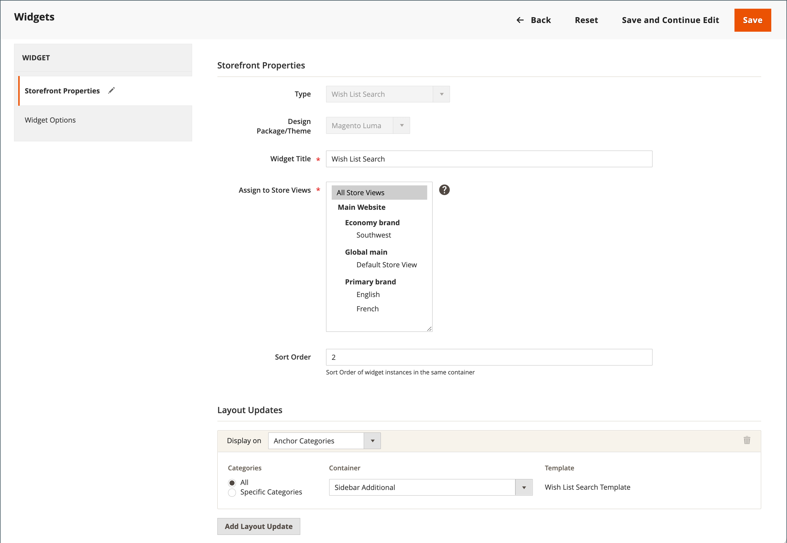

# Konfigurieren von Wunschlisten

Die Konfiguration der Wunschliste ermöglicht Wunschlisten und bestimmt die E-Mail-Vorlage und den Absender von E-Mail-Nachrichten, die bei der Freigabe einer Wunschliste verwendet werden.

## Wunschlistenfunktion aktivieren

1. Navigieren Sie in _Admin_-Seitenleiste zu **[!UICONTROL Stores]** > _[!UICONTROL Settings]_>**[!UICONTROL Configuration]**.

1. Erweitern Sie im linken Bereich **[!UICONTROL Customers]** und wählen Sie **[!UICONTROL Wish List]**.

1. Erweitern Sie  den Abschnitt **[!UICONTROL General Options]** und führen Sie folgende Schritte aus:

   {width="600" zoomable="yes"}

   - Schalten Sie **[!UICONTROL Enabled]** auf `Yes` um, wodurch das Modul „Wunschliste“ für den Store aktiviert wird.

   -  (nur Adobe Commerce) Schalten Sie **[!UICONTROL Enable Multiple Wish Lists]** auf `Yes` um, damit Kundinnen und Kunden mehrere Wunschlisten erstellen und verwalten können.

   -  (nur Adobe Commerce) Um die Anzahl der Wunschlisten zu begrenzen, die Kundinnen und Kunden mit ihrem Konto verknüpfen können, geben Sie einen Wert für **[!UICONTROL Number of Multiple Wish Lists]** ein.

   - Schalten Sie **[!UICONTROL Show in Sidebar]** zu `Yes` um. Daraufhin werden die Wunschlisten in der Seitenleiste angezeigt.

1. Erweitern Sie  den Abschnitt **[!UICONTROL Share Options]** und führen Sie folgende Schritte aus:

   {width="600" zoomable="yes"}

   - Legen Sie die **[!UICONTROL Email Sender]** auf den Store-Kontakt fest, der als Absender der Nachricht angezeigt werden soll. Optionen: Allgemeiner Kontakt, Vertriebsmitarbeiter, Support, benutzerdefinierte E-Mail.

   - Legen Sie die **[!UICONTROL Email Template]** fest, die verwendet werden soll, wenn eine Kundin oder ein Kunde eine Wunschliste teilt.

   - Geben Sie einen **[!UICONTROL Max Emails Allowed to be Sent]** Wert ein, um die Gesamtzahl der E-Mails zu begrenzen, die eine Kundin oder ein Kunde senden kann. Der Standardwert ist 10 und der maximal zulässige Wert ist 10.000.

   - Um die Größe der Nachricht zu begrenzen, geben Sie einen Wert für **[!UICONTROL Email Text Length Limit]** ein. Der Standardwert lautet 255.

1. Erweitern Sie  den Abschnitt **[!UICONTROL My Wish List Link]** und legen Sie **[!UICONTROL Display Wish List Summary]** auf einen der folgenden Werte fest:

   - `Display number of items in wish list`
   - `Display item quantities`

   {width="600" zoomable="yes"}

1. Klicken Sie abschließend auf **[!UICONTROL Save Config]**.

## Wunschliste hinzufügen Suche

 (nur Adobe Commerce)

Jede öffentliche Wunschliste finden Sie mit dem Wunschlisten-Such-[Widget](../content-design/widgets.md). Das Widget ermöglicht es einem Kunden, nach dem Namen oder der E-Mail-Adresse des Wunschlistenbesitzers zu suchen. Store-Kunden können Wunschlisten finden, die zu anderen Kunden gehören, sie anzeigen und Produkte von ihnen bestellen oder die Produkte zu ihren eigenen Wunschlisten hinzufügen. Wenn ein Artikel von einem anderen Kunden auf einer öffentlichen Wunschliste gekauft wird, wird er nicht von der ursprünglichen Wunschliste entfernt. Das _Wunschlistensuche_-Widget kann zu jeder Seite Ihres Geschäfts hinzugefügt werden, um es Kunden zu erleichtern, die Wunschlisten von Freunden und Familienmitgliedern zu finden.

{width="700" zoomable="yes"}

1. Navigieren Sie in _Admin_-Seitenleiste zu **[!UICONTROL Content]** > _[!UICONTROL Elements]_>**[!UICONTROL Widgets]**.

1. Klicken Sie oben rechts auf **[!UICONTROL Add Widget]**.

1. Gehen Sie auf der Registerkarte _[!UICONTROL Settings]_&#x200B;wie folgt vor:

   - Legen Sie **[!UICONTROL Type]** auf `Wish List Search` fest.

   - Legen Sie **[!UICONTROL Design Theme]** auf das Design des Stores fest, dem die Wunschliste hinzugefügt wird.

   - Klicken Sie auf **[!UICONTROL Continue]**.

1. Vervollständigen Sie die _[!UICONTROL Storefront Properties]_:

   - Geben Sie die **[!UICONTROL Widget Title]** ein.

   - Legen Sie **[!UICONTROL Assign to Store Views]** auf die Ansicht oder Website fest, in der das Widget verwendet werden soll.

   - Geben Sie **[!UICONTROL Sort Order]** eine Zahl ein, um die Platzierung des Widgets innerhalb seines Containers zu bestimmen.

     `0` = Erster (Standard), `1` = Zweiter, `2` = Dritter usw.

1. Klicken Sie im Abschnitt _[!UICONTROL Layout Updates]_&#x200B;auf **[!UICONTROL Add Layout Update]**&#x200B;und legen Sie **[!UICONTROL Display on]**&#x200B;auf eine der folgenden Einstellungen fest:

   - _[!UICONTROL Categories]_

      - `Anchor Categories`
      - `Non-Anchor Categories`

   - _[!UICONTROL Products]_

      - `All Product Type`
      - `Simple Product`
      - `Virtual Product`
      - `Bundle Product`
      - `Configurable Product`
      - `Downloadable Product`
      - `Gift Card`
      - `Grouped Product`

   - _[!UICONTROL Generic Page]_

      - `All Pages`
      - `Specified Page`
      - `Page Layouts`

1. Wählen Sie in der **[!UICONTROL Container]**-Liste den Bereich des Seiten-Layouts aus, in dem er platziert werden soll.

   {width="700" zoomable="yes"}

1. Wählen Sie im linken Bedienfeld **[!UICONTROL Widget Options]** aus.

1. Legen Sie **[!UICONTROL Quick Search Form Types]** auf eine der folgenden Einstellungen fest:

   - `All Forms` - Kunden können nach allen verfügbaren Parametern suchen.
   - `Owner Name` - Kunden können nach Wunschlisten anhand des Eigentümernamens suchen.
   - `Owner Email` - Kunden können nach Wunschlisten anhand der E-Mail-Adresse des Inhabers suchen.

   >[!NOTE]
   >
   >Versandadressen sind nicht in Wunschzetteln enthalten.

1. Konfigurieren Sie alle verbleibenden Widget-Eigenschaften nach Bedarf, indem Sie die standardmäßigen [Anweisungen](../content-design/widget-create.md) befolgen.

1. Klicken Sie abschließend auf **[!UICONTROL Save]**.

1. Aktualisieren Sie alle ungültigen Caches, wenn Sie dazu aufgefordert werden.
