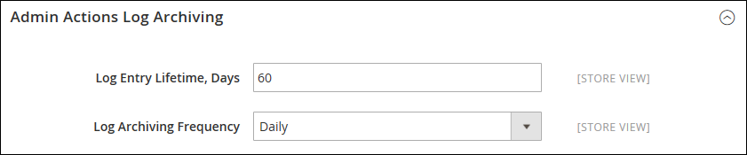
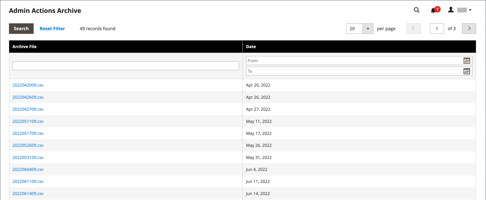

# Aktionsprotokoll-Archiv

{{ee-feature}}

Der Administrator [Aktionen](action-log.md) archivieren listet die CSV-Protokolldateien auf, die auf dem Server gespeichert sind. In der Konfiguration können Sie angeben, wie lange die Protokolleinträge gespeichert werden und wie oft sie archiviert werden. Standardmäßig enthält der Dateiname das aktuelle Datum im ISO-Format:  `yyyyMMddHH`

>[!NOTE]
>
>Die Protokollarchivierung erfordert eine [Cron-Auftrag](cron.md) festgelegt werden.

## Protokollarchiv konfigurieren

1. Im _Admin_ Seitenleiste, navigieren Sie zu **[!UICONTROL Stores]** > _[!UICONTROL Settings]_>**[!UICONTROL Configuration]**.

1. Erweitern Sie im linken Bereich **[!UICONTROL Advanced]** und wählen **[!UICONTROL System]**.

1. Erweitern  die **[!UICONTROL Admin Actions Log Archiving]** und legen Sie die folgenden Optionen fest:

   - **[!UICONTROL Log Entry Lifetime, Days]** — Geben Sie die Anzahl der Tage an, nach denen die Protokolleinträge in der Datenbank beibehalten werden sollen, bevor sie entfernt werden.
   - **[!UICONTROL Log Archiving Frequency]** — Legen Sie `Daily`, `Weekly`oder `Monthly`.

   {width="600" zoomable="yes"}

   Eine detaillierte Liste der Konfigurationseinstellungen finden Sie unter [Archivierung des Admin Actions](../configuration-reference/advanced/system.md) im _Konfigurationsreferenz_.

1. Wenn Sie fertig sind, klicken Sie auf **[!UICONTROL Save Config]**.

## Archiv anzeigen

Im _Admin_ Seitenleiste, navigieren Sie zu **[!UICONTROL System]** > _[!UICONTROL Actions Logs]_>**[!UICONTROL Archive]**.

{width="600" zoomable="yes"}
