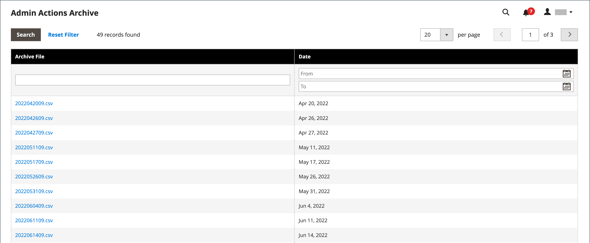

# Aktions-Log-Archiv

{{ee-feature}}

Das [ „Aktionen](action-log.md)-Archiv listet die CSV-Protokolldateien auf, die auf dem Server gespeichert sind. In der Konfiguration können Sie angeben, wie lange die Protokolleinträge gespeichert werden und wie oft sie archiviert werden. Standardmäßig enthält der Dateiname das aktuelle Datum im ISO-Format: `yyyyMMddHH`

>[!NOTE]
>
>Die Protokollarchivierung erfordert die Einrichtung eines [Cron](cron.md)Auftrags.

## Konfigurieren des Protokollarchivs

1. Navigieren Sie in _Admin_-Seitenleiste zu **[!UICONTROL Stores]** > _[!UICONTROL Settings]_>**[!UICONTROL Configuration]**.

1. Erweitern Sie im linken Bereich **[!UICONTROL Advanced]** und wählen Sie **[!UICONTROL System]**.

1. Erweitern Sie  den Abschnitt **[!UICONTROL Admin Actions Log Archiving]** und legen Sie die folgenden Optionen fest:

   - **[!UICONTROL Log Entry Lifetime, Days]** - Geben Sie die Anzahl der Tage ein, nach denen die Protokolleinträge in der Datenbank gespeichert werden sollen, bevor sie entfernt werden.
   - **[!UICONTROL Log Archiving Frequency]** - Auf `Daily`, `Weekly` oder `Monthly` festlegen.

   {width="600" zoomable="yes"}

   Eine detaillierte Liste der Konfigurationseinstellungen finden Sie unter [Admin-](../configuration-reference/advanced/system.md)-Archivierung“ in _Konfigurationsreferenz_.

1. Klicken Sie abschließend auf **[!UICONTROL Save Config]**.

## Anzeigen des Archivs

Navigieren Sie in _Admin_-Seitenleiste zu **[!UICONTROL System]** > _[!UICONTROL Actions Logs]_>**[!UICONTROL Archive]**.

{width="600" zoomable="yes"}
