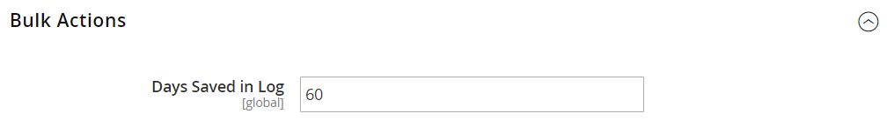

# Massenaktionen

{{ee-feature}}

Das Massenaktionsprotokoll zeichnet die Details asynchroner Massenvorgänge auf, die im Hintergrund ausgeführt werden, z. B. Import/Export oder Zuweisung von [benutzerdefinierten Preisen](../b2b/catalog-shared-manage.md#update-custom-pricing) zu mehreren Produkten in einem [freigegebenen Katalog](../b2b/catalog-shared.md).

{width="600" zoomable="yes"}

## Massenaktionen konfigurieren

1. Wechseln Sie in der Seitenleiste _Admin_ zu **[!UICONTROL Stores]** > _[!UICONTROL Settings]_>**[!UICONTROL Configuration]**.

1. Erweitern Sie im linken Bereich den Wert **[!UICONTROL Advanced]** und wählen Sie **[!UICONTROL System]** aus.

1. Erweitern Sie  den Abschnitt **[!UICONTROL Bulk Actions]** und legen Sie die Option zum Speichern des Protokolls fest:

   **[!UICONTROL Days Saved in Log]** - Geben Sie die Anzahl der Tage ein, für die Massenaktionen in einem Protokoll gespeichert werden.

   {width="600" zoomable="yes"}

   Eine detaillierte Liste der Konfigurationseinstellungen finden Sie unter [_Massenaktionen_](../configuration-reference/advanced/system.md) in der _Konfigurationsreferenz_.

1. Klicken Sie nach Abschluss des Vorgangs auf **[!UICONTROL Save Config]**.

## Anzeigen von Massenaktionen

1. Wechseln Sie in der Seitenleiste _Admin_ zu **[!UICONTROL System]** > _[!UICONTROL Actions Logs]_>**[!UICONTROL Bulk Actions]**.

1. Suchen Sie die gewünschte Aktion im Protokoll.

1. Klicken Sie in der Spalte _[!UICONTROL Action]_auf **[!UICONTROL Details]**.
