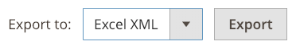

# Bericht &quot;Action Logs&quot;

{{ee-feature}}

Der Bericht _Aktionsprotokolle_ enthält einen detaillierten Datensatz aller Admin-Aktionen, die für die Protokollierung aktiviert sind. Jeder Datensatz ist mit einem Zeitstempel versehen und zeichnet die IP-Adresse und den Namen des Benutzers auf. Die Protokolldetails enthalten Admin-Benutzerdaten und zugehörige Änderungen, die während der Aktion vorgenommen wurden.

Die Aktionen, die Sie im Bericht anzeigen möchten, müssen im Bildschirm [Protokollierung der Admin-Aktionen](action-log.md) in den Store-Einstellungen aktiviert sein. Wenn der Aktionstyp aktiviert (aktiviert) ist, werden diese Arten von Admin-Aktionen im Bericht &quot;Aktionsprotokolle&quot;angezeigt.

Der Bericht kann mithilfe der Optionen in den einzelnen Spalten gefiltert werden. Sie können eine Einzelfilteroption festlegen oder Filteroptionen für mehrere Spalten festlegen, um den Bericht auf die Auflistung bestimmter Aktionen zu beschränken. Sie können Berichtsdaten auch im CSV- oder Excel-XML-Format exportieren.

Der Bericht &quot;Aktionsprotokolle&quot;enthält die folgenden Informationen:

- **[!UICONTROL Time]** - Datum und Uhrzeit der Aktion
- **[!UICONTROL Action Group]** - Zeigt den Aktionstyp an und entspricht den Aktionen, die auf dem Bildschirm &quot;Protokollierung von Admin-Aktionen&quot;_in Ihren Store-Einstellungen aktiviert wurden._
- **[!UICONTROL Action]** - Zeigt die protokollierte Aktion an
- **[!UICONTROL IP Address]** - Zeigt die IP-Adresse des Computers an, auf dem die Aktion ausgeführt wurde
- **[!UICONTROL Username]** - Zeigt die Anmelde-ID für den Benutzer an, der die Aktion ausgeführt hat
- **[!UICONTROL Result]** - Zeigt den Erfolg oder Misserfolg der Benutzeraktion an
- **[!UICONTROL Full Action Name]** - Zeigt den Namen der Backend-Aktion an
- **[!UICONTROL Details]** - Zeigt die Kategorie der Backend-Aktion an
- **[!UICONTROL Full Details]** - Zeigt alle protokollierten Details der Administratoraktion an

## Bericht &quot;Aktionsprotokolle&quot;anzeigen

1. Wechseln Sie in der Seitenleiste _Admin_ zu **[!UICONTROL System]** > _[!UICONTROL Actions Logs]_>**[!UICONTROL Report]**.

   {width="600" zoomable="yes"}

1. Um die vollständigen Details einer aufgelisteten Admin-Aktion anzuzeigen, klicken Sie auf **[!UICONTROL View]**.

   {width="600" zoomable="yes"}

## Bericht &quot;Aktionsprotokolle&quot;filtern

Sie können die Felder für Filteroptionen definieren und dann auf **[!UICONTROL Search]** klicken, um die angezeigten Aktionen einzuschränken.

Um die Filteroptionen zu löschen und zum vollständigen Bericht zurückzukehren, klicken Sie auf **[!UICONTROL Reset Filter]**.

{width="600" zoomable="yes"}

| Feld | description |
|--- |--- |
| [!UICONTROL Time] | Klicken Sie in &quot;**[!UICONTROL From]**&quot;, um ein Datum aus dem dynamischen Kalender auszuwählen und das Anfangsdatum für den Filter zu definieren. Klicken Sie in &quot;**[!UICONTROL To]**&quot;auf , um ein Datum auszuwählen und das Enddatum für den Filter zu definieren. |
| [!UICONTROL Action Group] | Wählen Sie eine Aktionsgruppe aus. |
| [!UICONTROL Action] | Wählen Sie eine Aktion aus. |
| [!UICONTROL IP Address] | Geben Sie die IP-Adresse des für eine Aktion verwendeten Computers ein. |
| [!UICONTROL Username] | Wählen Sie einen Benutzernamen aus. Der Standardwert ist `All Users`. |
| [!UICONTROL Result] | Wählen Sie Erfolg oder Fehler aus. |
| [!UICONTROL Full Action Name] | Geben Sie Text für die Suche ein, die im Feld übereinstimmen soll. |
| [!UICONTROL Details] | Geben Sie Text für die Suche ein, die im Feld übereinstimmen soll. |

{style="table-layout:auto"}

## Bericht &quot;Aktionsprotokolle&quot;exportieren

1. Wählen Sie für **[!UICONTROL Export to]** ein Exportformat:

   - `CSV` - Eine kommagetrennte Wertdatei mit Textdaten
   - `Excel XML` - Ein XML-basiertes Tabellendatenformat

1. Klicken Sie auf **[!UICONTROL Export]**.

   Die generierte Datei wird automatisch für Downloads in Ihrem angegebenen Ordner gespeichert.

   {width="200"}
