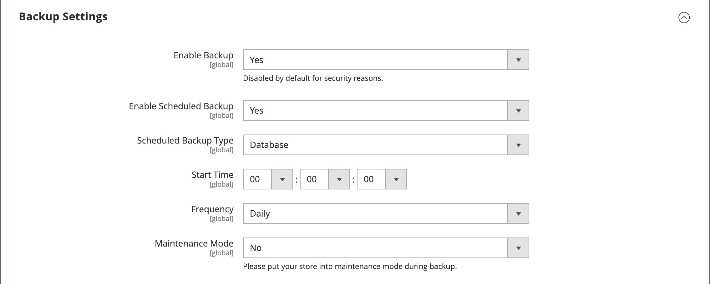

# Systemsicherungen

Mit Adobe Commerce und Magento Open Source können Sie verschiedene Teile des Systems sichern, z. B. das Dateisystem, die Datenbank und Mediendateien, und das Rollback automatisch durchführen. Für jedes Backup wird auf der Seite „Backups _ein Datensatz im Raster_. Wenn Sie einen Datensatz aus der Liste löschen, wird auch die archivierte Datei gelöscht. Die Backup-Dateien der Datenbank werden im GZ-Format komprimiert. Für die Systemsicherungen und die Datenbank- und Mediensicherungen wird das TGZ-Format verwendet. Als Best Practice sollten Sie den Zugriff auf Sicherungs-Tools einschränken und Sicherungskopien erstellen, bevor Sie Erweiterungen und Aktualisierungen installieren.

- **Beschränken des Zugriffs auf Backup-Tools.** Der Zugriff auf das Backup- und Rollback-Management-Tool kann durch die Konfiguration von [Benutzerrollen](permissions-user-roles.md) für Backup- und Rollback-Ressourcen eingeschränkt werden. Um den Zugriff einzuschränken, lassen Sie das entsprechende Kontrollkästchen deaktiviert. Um Zugriff auf Rollback-Ressourcen zu gewähren, müssen Sie auch Zugriff auf Backup-Ressourcen gewähren.

- **Sichern Sie diese, bevor Sie Erweiterungen und Updates installieren.** Führen Sie immer eine Sicherung durch, bevor Sie eine Erweiterung oder ein Update installieren.

{{$include /help/_includes/backups-note.md}}

## Aktivieren und Planen von Backups

1. Navigieren Sie in _Admin_-Seitenleiste zu **[!UICONTROL Stores]** > _[!UICONTROL Settings]_>**[!UICONTROL Configuration]**.

1. Erweitern Sie im linken Bereich **[!UICONTROL Advanced]** und wählen Sie **[!UICONTROL System]**.

1. Erweitern Sie  die **[!UICONTROL Backup Settings]**.

1. Legen Sie **[!UICONTROL Enabled Schedule Backup]** auf `Yes` fest.

1. Um automatische Sicherungen zu planen, legen Sie die Planungsoptionen fest:

   - Legen Sie **[!UICONTROL Enabled Schedule Backup]** auf `Yes` fest.
   - Legen Sie **[!UICONTROL Scheduled Backup Type]** auf den Typ des Backups fest, das im geplanten Intervall ausgeführt werden soll.
   - Legen Sie **[!UICONTROL Start Time]** auf die Tageszeit fest, zu der der Backup-Vorgang ausgeführt werden soll.
   - **[!UICONTROL Frequency]** auf `Daily`, `Weekly` oder `Monthly` festlegen.
   - Legen Sie **[!UICONTROL Maintenance Mode]** auf `Yes` fest.

   {width="600" zoomable="yes"}

1. Klicken Sie abschließend auf **[!UICONTROL Save Config]**.

## Erstellen eines Backups

1. Navigieren Sie in _Admin_-Seitenleiste zu **[!UICONTROL System]** > _[!UICONTROL Tools]_>**[!UICONTROL Backups]**.

1. Klicken Sie oben rechts auf den Typ der Sicherung, die Sie erstellen möchten:

   - **[!UICONTROL System Backup]** - Erstellt eine vollständige Sicherung der Datenbank und des Dateisystems. Während des Vorgangs können Sie den Medienordner in die Sicherung einbeziehen.

   - **[!UICONTROL Database and Media Backup]** - Erstellt eine Sicherung der Datenbank und des Medienordners.

   - **[!UICONTROL Database Backup]** - Erstellt ein Backup der Datenbank.

   {width="600" zoomable="yes"}

1. Um den Speicher während des Backups in den Wartungsmodus zu versetzen, aktivieren Sie das Kontrollkästchen.

   Nach Abschluss des Backups wird der Wartungsmodus automatisch deaktiviert.

1. Aktivieren Sie für eine Systemsicherung das Kontrollkästchen **[!UICONTROL Include Media folder to System Backup]** , um den Medienordner einzuschließen.

1. Bestätigen Sie die Aktion, wenn Sie dazu aufgefordert werden.

<!-- Last updated from includes: 2023-02-22 09:59:54 -->
