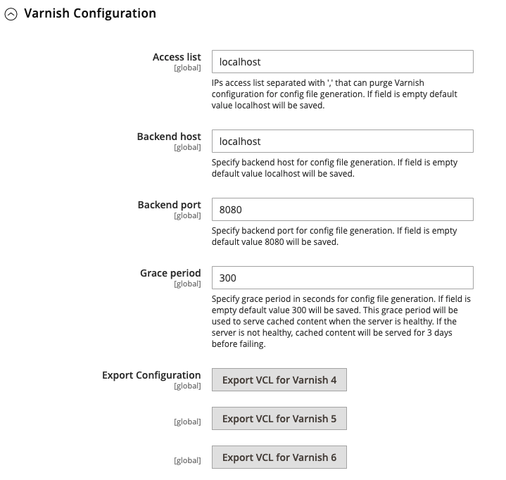

# Cacheverwaltung

Das Cache-Verwaltungssystem von Adobe Commerce und Magento Open Source bietet eine einfache Möglichkeit, die Leistung Ihrer Site zu verbessern. Wenn ein Cache eine Aktualisierung erfordert, wird eine Benachrichtigung mit einem Link zum [!UICONTROL Cache Management] Seite, um die Aktualisierung abzuschließen.

{width="500"}

Die _[!UICONTROL Cache Management]_-Seite zeigt den Status jedes primären Caches und des zugehörigen Tags an. Die großen Schaltflächen in der oberen rechten Ecke können verwendet werden, um den Cache oder den All-Include-Cache-Speicher zu leeren. Unten auf der Seite können Sie mit zusätzlichen Schaltflächen den Cache für Katalogproduktbilder und den JavaScript-/CSS-Cache leeren.

>[!IMPORTANT]
>
>Wenn Katalogentitäten geändert werden, kann sich dies auf andere Seiten auswirken und mehrere Caches gleichzeitig ungültig machen. Wenn Sie die Seite zur Cache-Verwaltung überprüfen, werden möglicherweise ungültige Elemente angezeigt, die aktualisiert werden müssen, wenn sie _**nicht direkt bearbeitet**_. Diese Invalidierung tritt beispielsweise dann auf, wenn Sie ein Produkt im Katalog bearbeiten, das einer beliebigen Kategorie zugewiesen ist, oder wenn Sie eine verwandte Produktregel ändern.

Nachdem Sie einen Cache gelöscht haben, aktualisieren Sie Ihren Browser immer, um sicherzustellen, dass Sie die neuesten Dateien sehen können. Beim Löschen des Commerce-Cache wird der Cache des Webbrowsers nicht gelöscht. Möglicherweise müssen Sie den Browser-Cache löschen, um aktualisierte Inhalte anzuzeigen.

Weitere technische Informationen zur Adobe Commerce-Zwischenspeicherung finden Sie im Abschnitt [Cache-Übersicht](https://developer.adobe.com/commerce/frontend-core/guide/caching/){:target=&quot;_blank&quot;} im _Commerce Frontend-Entwicklungshandbuch_.

Zugriff auf _[!UICONTROL Cache Management]_Seite durch einen der folgenden Schritte:

- Klicken Sie auf **[!UICONTROL Cache Management]** in der Meldung über dem Arbeitsbereich.
- Im _Admin_ Seitenleiste, navigieren Sie zu **[!UICONTROL System]** > _[!UICONTROL Tools]_>**[!UICONTROL Cache Management]**.

{width="700" zoomable="yes"}

## Best Practices für die Zwischenspeicherung

Die Neuindizierung und Zwischenspeicherung dienen in Commerce unterschiedlichen Zwecken. [Indizes](index-management.md) Nachverfolgen von Datenbankinformationen für eine verbesserte Suchleistung, einen schnelleren Datenabruf für Storefronts und mehr. Caches speichern geladene Daten, Bilder, Formate und Ähnliches für eine verbesserte Leistung beim Laden und Aufrufen der Storefront.

- Leeren Sie den Cache immer, nachdem Sie Erweiterungen/Module installiert haben. Sie können eine oder mehrere Erweiterungen installieren und dann den Cache leeren.
- Leeren Sie den Cache nach der Installation von Commerce. Bei Neuinstallationen sollten Sie auch neu indizieren.
- Leeren Sie den Cache, nachdem Sie von einer Open Source- oder Commerce-Version auf eine andere aktualisiert haben.
- Berücksichtigen Sie beim Leeren von Caches den Cache-Typ und planen Sie die Leerung während Nicht-Spitzenzeiten. Wählen Sie beispielsweise eine Zeit aus, zu der wenige Kunden die Site verwenden, z. B. spät oder früh morgens. Das Löschen von Cache-Typen während der Spitzenlast kann die Belastung des Administrators erhöhen und dazu führen, dass die Site herunterfährt, bis der Vorgang abgeschlossen ist.
- Wann [Neuindizierung](index-management.md), müssen Sie den Cache nicht leeren.

## Rollenressourcen für die Cacheverwaltung

Sie können Benutzern anhand der Rolle Zugriff auf bestimmte Cache-Wartungsaktionen zuweisen, einschließlich Optionen zum Anzeigen, Umschalten und Leeren von Caches. Adobe empfiehlt die Aktivierung von Flush-Aktionen nur für Benutzer auf Administratorebene. Die Bereitstellung des Zugriffs auf alle Cache-Management-Funktionen kann die Leistung Ihrer Storefront beeinträchtigen.

{width="600" zoomable="yes"}

Informationen zum Zuweisen von Ressourcen zur Gewährung des Zugriffs für Admin-Benutzerkonten finden Sie unter [Rollenressourcen](permissions-user-roles.md#role-resources). Die folgenden Ressourcen steuern den Zugriff auf die Cache-Verwaltungstools:

- [!UICONTROL Clean Cache Actions]

   - [!UICONTROL Flush Cache Storage]
   - [!UICONTROL Flush Magento Cache]

- [!UICONTROL Cache Type Management]

   - [!UICONTROL Toggle Cache Type]
   - [!UICONTROL Refresh Cache Type]

- [!UICONTROL Additional Cache Management]

   - [!UICONTROL Catalog Images Cache]
   - [!UICONTROL Flush Js/Css]
   - [!UICONTROL Flush Static Files]

## Aktualisieren bestimmter Caches

1. Aktivieren Sie für jeden Cache, der aktualisiert werden soll, das Kontrollkästchen am Anfang der Zeile.

1. Satz **[!UICONTROL Actions]** nach `Refresh` und klicken **[!UICONTROL Submit]**.

## Aktualisierung der Massenaktion durchführen

1. Um eine Gruppe von Caches auszuwählen, legen Sie **[!UICONTROL Mass Actions]** auf einen der folgenden Werte zu:

   - `Select All`
   - `Select Visible`

1. Aktivieren Sie das Kontrollkästchen für jeden zu aktualisierenden Cache.

1. Satz **[!UICONTROL Actions]** nach `Refresh` und klicken **[!UICONTROL Submit]**.

## Leeren Sie den Cache des Produktbilds.

1. under _[!UICONTROL Additional Cache Management]_klicken **[!UICONTROL Flush Catalog Images Cache]**, um vorgenerierte Produktbilddateien zu löschen.

   Die `Image cache was cleaned` wird oben im Arbeitsbereich angezeigt.

1. Löschen Sie den Cache Ihres Browsers.

## JavaScript-/CSS-Cache leeren

1. under _[!UICONTROL Additional Cache Management]_, löschen Sie JavaScript- und CSS-Dateien, die durch Klicken auf **[!UICONTROL Flush JavaScript/CSS Cache]**.

   Die `The JavaScript/CSS cache has been cleaned` wird oben im Arbeitsbereich angezeigt.

1. Löschen Sie den Cache Ihres Browsers.

## Leeren mithilfe der Befehlszeile

Systemadministratoren und Entwickler mit Zugriff auf den Commerce-Anwendungsserver können die Cache- und Cachekonfiguration auch über die Befehlszeile mithilfe der Commerce-CLI verwalten. Siehe [Verwalten des Cache](https://experienceleague.adobe.com/en/docs/commerce-operations/configuration-guide/cli/manage-cache#clean-and-flush-cache-types){:target=&quot;_blank&quot;} im _Konfigurationshandbuch_.

## Steuerelemente

| Kontrolle | Beschreibung |
|---------------------------|------------------------------------------------------------------------------------------------------------------------------------------------------------------------------------------------------------------------------------------------------------------------------------------------------------------------------------------------------------|
| [!UICONTROL Mass Actions] | Aktiviert das Kontrollkästchen mehrerer Caches. Optionen:  **[!UICONTROL Select All]**— Wählt das Kontrollkästchen aller Caches aus. ** Auswahl aufheben **— Löscht das Kontrollkästchen aller Caches. **[!UICONTROL Select Visible]** — Wählt das Kontrollkästchen aller sichtbaren Caches aus.  **[!UICONTROL Unselect Visible]**— Löscht das Kontrollkästchen aller sichtbaren Caches. |
| [!UICONTROL Actions] | Bestimmt die Aktion, die auf alle ausgewählten Caches angewendet werden soll. Optionen:  **[!UICONTROL Enable]**— Aktiviert alle ausgewählten Caches. **[!UICONTROL Disable]** — Deaktiviert alle ausgewählten Caches.  **[!UICONTROL Refresh]**- Aktualisiert alle ausgewählten Caches. |
| [!UICONTROL Submit] | Wendet die Aktion auf alle ausgewählten Caches an. |

{style="table-layout:auto"}

### Schaltflächen

| Schaltfläche | Beschreibung |
|-----------------------------------------|----------------------------------------------------------------------------------------------------------------------------------------------------------------------------------------------------------------------------------------|
| [!UICONTROL Flush Magento Cache] | Entfernt alle Elemente im standardmäßigen Commerce-Cache (`var/cache`), entsprechend den zugehörigen Commerce-Tags. |
| [!UICONTROL Flush Cache Storage] | Entfernt alle Elemente aus dem Cache, unabhängig vom Commerce-Tag. Wenn Ihr System einen alternativen Cache-Speicherort verwendet, werden alle zwischengespeicherten Dateien, die von anderen Anwendungen verwendet werden, im Prozess entfernt. |
| [!UICONTROL Flush Catalog Images Cache] | Entfernt alle automatisch in der Größe angepassten und mit Wasserzeichen versehenen Katalogbilder, die in `media/catalog/product/cache`. Wenn kürzlich hochgeladene Bilder nicht im Katalog angezeigt werden, versuchen Sie, den Katalog zu leeren und den Browser zu aktualisieren. |
| [!UICONTROL Flush JavaScript/CSS Cache] | Entfernt die zusammengeführte Kopie von JavaScript- und CSS-Dateien aus dem Cache. Wenn aktuelle Änderungen am Stylesheet oder JavaScript im Store nicht berücksichtigt werden, versuchen Sie, den JavaScript-/CSS-Cache zu leeren und den Browser zu aktualisieren. |
| [!UICONTROL Flush Static Files Cache] | Entfernt vorverarbeitete Ansichtsdateien und statische Dateien. |

{style="table-layout:auto"}

### Caches

Die [!UICONTROL Cache Management] -Seite listet die Cache-Typen auf, die Sie vom Administrator verwalten können, mit ihrem aktuellen Status. In diesem Abschnitt werden die von Adobe Commerce unterstützten Standard-Cache-Typen beschrieben. Die _Cache-Tag_ und _Cache-ID_ -Spalten beschreiben die Werte, die im Commerce-Anwendungscode verwendet werden:

- `cache_type_id` definiert die eindeutige Kennung für einen Cache-Typ.

- `%CACHE_TYPE_TAG%` definiert das eindeutige Tag, das im Cachetyp-Scoping verwendet werden soll.

Entwickler und Systemintegratoren verwenden diese Werte zum Konfigurieren und Verwalten der Zwischenspeicherung bei der Anpassung oder Integration mit Adobe Commerce, z. B. bei der Entwicklung von Integrationen mit GraphQL-APIs. Die `cache type id` wird auch für die Cache-Verwaltung über die Befehlszeile des Anwendungsservers mithilfe der Commerce-CLI verwendet. Beispiel: ` bin/magento cache:status config` zeigt den aktuellen Status des Konfigurations-Caches an.

>[!NOTE]
>
>Entwickler und Systemintegratoren können das Cache-Management-System von Commerce anpassen und erweitern, um benutzerdefinierte Module und Integrationen zu unterstützen. Weitere Informationen finden Sie unter [Zwischenspeicherung konfigurieren](https://experienceleague.adobe.com/en/docs/commerce-operations/configuration-guide/cache/caching-overview) im _Adobe Commerce-Konfigurationshandbuch_.

<!-- prettier-ignore -->

#### Detail der Cache-Liste

| Cache | Beschreibung | Cache-Tag | Cache-ID |
|-------|------------|----------|----------|
| [!UICONTROL Configuration] | Commerce erfasst die XML-Konfiguration aus allen Modulen, führt sie zusammen und speichert das zusammengeführte Ergebnis im Cache. **[!UICONTROL System]**-  `config.xml`,`local.xml` **[!UICONTROL Module]** - `config.xml`  Dieser Cache enthält auch speicherspezifische Einstellungen, die im Dateisystem und in der Datenbank gespeichert sind. Löschen oder leeren Sie diesen Cache-Typ, nachdem Sie die Konfigurationsdateien geändert haben. | `CONFIG` | `config` |
| [!UICONTROL Layouts] | Kompilierte Seitenlayouts, d. h. die Layoutkomponenten aus allen Komponenten. Löschen oder leeren Sie diesen Cache-Typ, nachdem Sie die Layout-Dateien geändert haben. | `LAYOUT_GENERAL_CACHE_TAG` | `layout` |
| [!UICONTROL Blocks HTML output] | HTML von Seitenfragmenten pro Block. Entfernen oder leeren Sie diesen Cache-Typ, nachdem Sie die Ansichtsebene geändert haben. | `BLOCK_HTML` | `block_html` |
| [!UICONTROL Collections Data] | Sammlungsdatendateien, in denen die Ergebnisse von Datenbankabfragen gespeichert werden. Bei Bedarf löscht Commerce diesen Cache automatisch, aber Entwickler von Drittanbietern können alle Daten in ein beliebiges Segment des Caches einfügen. Entfernen oder leeren Sie diesen Cache-Typ, wenn Ihr benutzerdefiniertes Modul Logik verwendet, die zu Cache-Einträgen führt, die von Commerce nicht bereinigt werden können. | `COLLECTION_DATA` | `collections` |
| [!UICONTROL Reflections] | Löscht die normalerweise während der Laufzeit generierten Reflexionsdaten der API-Oberfläche. | `REFLECTION` | `reflection` |
| `Database DDL operations` | Datenbankschema. Bei Bedarf löscht Commerce diesen Cache automatisch, aber Entwickler von Drittanbietern können alle Daten in ein beliebiges Segment des Caches einfügen. Löschen oder leeren Sie diesen Cache-Typ, nachdem Sie benutzerdefinierte Änderungen am Datenbankschema vorgenommen haben. (Das heißt, es handelt sich um Aktualisierungen, die Commerce nicht selbst vornimmt.) Eine Möglichkeit, das Datenbankschema automatisch zu aktualisieren, besteht darin, das Magento-Setup zu verwenden:db-schema:Upgrade-Befehl. | `DB_DDL` | `db_ddl` |
| [!UICONTROL Compiled Config] | Ergebnisse der Codekompilierung. | `COMPILED_CONFIG` | `compiled_config` |
| [!UICONTROL Webhooks Response Cache] | Zwischenspeichert Antworten auf Webhook-Anforderungen. Weitere Informationen finden Sie unter [Webhooks-Anleitung](https://developer.adobe.com/commerce/extensibility/webhooks/release-notes/#enhancements-2) in der Commerce-Entwicklerdokumentation. | `WEBHOOKS_RESPONSE` | `webhooks_response` |
| [!UICONTROL EAV types and attributes] | Zwischenspeichert die Deklaration von Entitätstypen für Metadaten im Zusammenhang mit Entitätsattributwerten (EAV)-Attributen. Zu den Attributen gehören Store-Bezeichnungen, Links zum zugehörigen PHP-Code, Attribut-Rendering, Sucheinstellungen usw. Normalerweise müssen Sie diesen Cache-Typ nicht bereinigen oder leeren. | `EAV` | `eav` |
| [!UICONTROL Customer Notification] | Vorübergehende Benachrichtigungen, die in der Benutzeroberfläche angezeigt werden. | `CUSTOMER_NOTIFICATION` | `customer_notification` |
| [!UICONTROL GraphQL Query Resolver Results] | Die Ergebnisse von GraphQL-Abfrageresolvern werden für Entitäten aus Kunden-, CMS-Seiten-, CMS-Block- und Produktmedien zwischengespeichert. Lassen Sie diesen Cache aktiviert, um die Leistung von GraphQL zu verbessern. | `GRAPHQL_QUERY_RESOLVER_RESULT` | `graphql_query_resolver_result` |
| [!UICONTROL Integrations Configuration] | Integrationskonfigurationsdatei. Löschen oder leeren Sie diesen Cache, nachdem Sie Integrationen geändert oder hinzugefügt haben. | `INTEGRATION` | `config_integration` |
| [!UICONTROL Integrations API Configuration] | Konfiguration kompilierter Integrations-APIs für Store-Integrationen. | `INTEGRATION_API_CONFIG` | `config_integration_api` |
| [!UICONTROL Admin UI SDK Cache] | Zwischenspeichert Anpassungen für den Administrator. Siehe [Admin-Konfiguration und -Tests](https://developer.adobe.com/commerce/extensibility/admin-ui-sdk/configuration/) im _Handbuch zum Admin UI SDK_. | `ADMIN_UI_SDK` | `admin_ui_sdk` |
| [!UICONTROL Page Cache] | Zwischenspeicherung auf der vollständigen Seite. | `FPC` | `full_page` |
| [!UICONTROL Target Rule] | Target-Regelindex | `TARGET_RULE` | `target_rule` |
| [!UICONTROL Web Services Configuration] | Zwischenspeichern der Web-API-Struktur. | `WEBSERVICE` | `config_webservice` |
| [!UICONTROL Translations] | Übersetzungsdateien. | `TRANSLATE` | `translate` |

{style="table-layout:auto"}

## Vollseitenzwischenspeicherung

Adobe Commerce und Magento Open Source verwenden das vollständige Caching auf dem Server, um Kategorie-, Produkt- und CMS-Seiten schnell anzuzeigen. Die Zwischenspeicherung über die vollständige Seite verbessert die Antwortzeit und verringert die Auslastung des Servers. Ohne Zwischenspeicherung muss jede Seite möglicherweise Codeblöcke ausführen und Informationen aus der Datenbank abrufen. Bei aktiviertem ganzseitigen Caching kann eine vollständig generierte Seite jedoch direkt aus dem Cache gelesen werden.

>[!NOTE]
>
>Es wird empfohlen, [Varnish Cache](https://varnish-cache.org/){:target=&quot;_blank&quot;} darf nur in einer Produktionsumgebung verwendet werden.

Zwischengespeicherte Inhalte können zur Verarbeitung der Anforderungen von ähnlichen Besuchstypen verwendet werden. Daher können Seiten, die einem Gelegenheitsbesucher angezeigt werden, von Seiten abweichen, die einem Kunden angezeigt werden. Für die Zwischenspeicherung ist jeder Besuch einer von drei Typen:

- `Non-sessioned` - Während eines nicht sitzungsbezogenen Besuchs zeigt der Käufer Seiten an, interagiert jedoch nicht mit dem Store. Das System speichert den Inhalt jeder angezeigten Seite zwischen und stellt ihn anderen Benutzern ohne Sitzung zur Verfügung.
- `Sessioned` - Während eines Sitzungsbesuchs wird Käufern, die mit dem Store interagieren, eine Sitzungs-ID zugewiesen. Interaktionen umfassen Aktivitäten wie den Produktvergleich oder das Hinzufügen von Produkten zum Warenkorb. Zwischengespeicherte Seiten, die während der Sitzung generiert werden, werden nur von diesem Käufer während der Sitzung verwendet.
- `Customer` - Kundensitzungen werden für Kunden erstellt, die sich mit ihrem registrierten Konto anmelden und einkaufen. Während der Sitzung können Kunden je nach zugewiesener Kundengruppe Sonderangebote, Promotions und Preise präsentiert werden.

Technische Informationen finden Sie unter [Konfigurieren und Verwenden von Varnish](https://experienceleague.adobe.com/docs/commerce-operations/configuration-guide/cache/varnish/config-varnish.html){:target=&quot;_blank&quot;} und [Verwenden von Redis für die Commerce-Seite und den Standardcache](https://experienceleague.adobe.com/docs/commerce-operations/configuration-guide/cache/redis/redis-pg-cache.html){:target=&quot;_blank&quot;} im _Konfigurationshandbuch_.

**_So konfigurieren Sie den ganzseitigen Cache:_**

1. Im _Admin_ Seitenleiste, navigieren Sie zu **[!UICONTROL Stores]** > _[!UICONTROL Settings]_>**[!UICONTROL Configuration]**.

1. Erweitern Sie im linken Bereich **[!UICONTROL Advanced]** und wählen **[!UICONTROL System]**.

1. Erweitern  die **[!UICONTROL Full Page Cache]** Abschnitt.

   {width="600" zoomable="yes"}

1. Satz **[!UICONTROL Caching Application]** auf einen der folgenden Werte zu:

   - `Built-in Application`
   - `Varnish Caching`

1. Um den Timeout für den Seiten-Cache festzulegen, geben Sie die **[!UICONTROL TTL for public content]**. (Der Standardwert ist `86400`)

1. So legen Sie die maximale Anzahl von [Layout-Handles](https://developer.adobe.com/commerce/frontend-core/guide/layouts/#layout-handles) zur Verarbeitung in [`{BASE-URL}/page_cache/block/esi`](https://experienceleague.adobe.com/docs/commerce-operations/configuration-guide/cache/use-varnish-esi.html) HTTP-Endpunkt, geben Sie die **[!UICONTROL Handles param size]**. Eine Größenbeschränkung kann die Sicherheit und Leistung verbessern. (Der Standardwert ist `100`)

1. Bei Verwendung von Varnish müssen Sie die **[!UICONTROL Varnish Configuration]** wie folgt:

   - **[!UICONTROL Access list]** - Geben Sie die IP-Adressen ein, die die Varnish-Konfiguration bereinigen können, um eine Konfigurationsdatei zu generieren. Trennen Sie mehrere Einträge durch ein Komma. Der Standardwert ist `localhost`.

   - **[!UICONTROL Backend host]** - Geben Sie die IP-Adresse des Backend-Hosts ein, der Konfigurationsdateien generiert. Der Standardwert ist `localhost`.

   - **[!UICONTROL Backend port]** - Identifizieren Sie den Backend-Port, der zum Generieren von Konfigurationsdateien verwendet wird. Der Standardwert ist: `8080`.

   - **[!UICONTROL Grace period]** - Geben Sie die Anzahl der Sekunden an, die als Übergangsphase zum Generieren von Konfigurationsdateien verwendet werden sollen. Siehe [Erweiterte Varnish-Konfiguration](https://experienceleague.adobe.com/docs/commerce-operations/configuration-guide/cache/config-varnish-advanced.html) im _Konfigurationshandbuch_.

   - So exportieren Sie die Konfiguration als `varnish.vcl` klicken Sie auf die Schaltfläche für die von Ihnen verwendete Version von Varnish.

   {width="600" zoomable="yes"}

1. Wenn Sie fertig sind, klicken Sie auf **[!UICONTROL Save Config]**.
