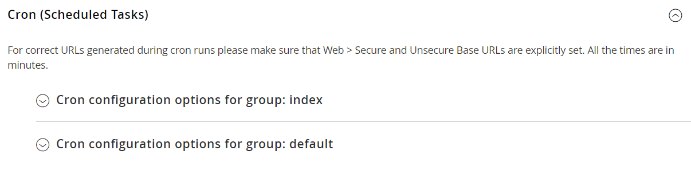

# Cron (geplante Aufgaben)

Adobe Commerce und Magento Open Source führen einige Vorgänge planmäßig durch, indem sie regelmäßig ein Skript ausführen. Sie können die Ausführung und Planung von Commerce-Cron-Aufträgen über den Administrator steuern. Speichervorgänge, die nach einem Cron-Zeitplan ausgeführt werden, umfassen unter anderem:

- [E-Mail](email-communications.md)
- [Katalogpreisregeln](../merchandising-promotions/price-rules-catalog.md)
- [Newsletter](../merchandising-promotions/newsletters.md)
- [Generieren einer XML-Sitemap](../merchandising-promotions/sitemap-xml.md)
- [Währungskursaktualisierungen](../stores-purchase/currency-update.md)
- [Inventory management](../inventory-management/introduction.md)

>[!IMPORTANT]
>
>Commerce-Services müssen in Crontab installiert werden, um sicherzustellen, dass Kernkomponenten und einige Erweiterungen von Drittanbietern erwartungsgemäß funktionieren. Siehe die [Anweisungen im _Installationshandbuch_](https://experienceleague.adobe.com/docs/commerce-operations/installation-guide/next-steps/configuration.html) für detaillierte Informationen über die Installation von Services auf crontab.

Darüber hinaus können Sie Folgendes so konfigurieren, dass es gemäß einem Cron-Zeitplan ausgeführt wird:

- Systemrasteraktualisierungen und -neuindizierung bestellen
- Ausstehende Zahlungsdauer

Stellen Sie sicher, dass [Basis-URLs](../stores-purchase/store-urls.md) für den Store korrekt festgelegt sind, damit die URLs, die während Cron-Vorgängen generiert werden, korrekt sind. Informationen zu Adobe Commerce in Cloud-Infrastrukturen finden Sie unter [Einrichten von Cron](https://experienceleague.adobe.com/docs/commerce-cloud-service/user-guide/configure/app/properties/crons-property.html) im _Handbuch zu Commerce in Cloud-Infrastrukturen_. Für On-Premise siehe [Konfigurieren und Ausführen ](https://experienceleague.adobe.com/docs/commerce-operations/configuration-guide/cli/configure-cron-jobs.html)) im _Konfigurationshandbuch_.

## Cron konfigurieren

1. Navigieren Sie in _Admin_-Seitenleiste zu **[!UICONTROL Stores]** > _[!UICONTROL Settings]_>**[!UICONTROL Configuration]**.

1. Erweitern Sie im linken Bereich **[!UICONTROL Advanced]** und wählen Sie **[!UICONTROL System]**.

1. Erweitern Sie  den Abschnitt **[!UICONTROL Cron]** .

   {width="600" zoomable="yes"}

1. Füllen Sie die folgenden Einstellungen für die Gruppen **[!UICONTROL Index]** und **[!UICONTROL Default]** aus.

   Die Einstellungen sind in jedem Abschnitt gleich.

   - **[!UICONTROL Generate Schedules Every]** - Definiert, wie oft der Zeitplan generiert wird (in Minuten). Zeitpläne werden in der Datenbank gespeichert.
   - **[!UICONTROL Schedule Ahead for]** - Definiert, wie weit im Voraus Cron-Aufträge geplant werden (in Minuten). Wenn diese Einstellung beispielsweise auf `10` festgelegt ist und das Cron ausgeführt wird, werden Cron-Aufträge für die nächsten 10 Minuten geplant.
   - **[!UICONTROL Missed if not Run Within]** - Definiert die Zeit (in Minuten), die zum Ermitteln eines verpassten Auftrags verwendet wird. Wenn der Cron-Auftrag nicht zur geplanten Zeit ausgeführt wird und die angegebene Zeit verstrichen ist, kann er nicht ausgeführt werden und sein Status ist auf `Missed` festgelegt.
   - **[!UICONTROL History Cleanup Every]** - Definiert die Zeit (in Minuten), zu der der Verlauf beendeter Aufgaben aus der Datenbank gelöscht wird.
   - **[!UICONTROL Success History Lifetime]** - Definiert die Zeitdauer (in Minuten), die der Verlauf von Cron-Aufträgen mit dem Status `Successful` in der Datenbank verbleibt.
   - **[!UICONTROL Failure History Lifetime]** - Definiert die Zeitdauer (in Minuten), die der Verlauf von Cron-Aufträgen mit dem Status `Error` in der Datenbank verbleibt.
   - **[!UICONTROL Use Separate Process]** - Definiert, ob alle Cron-Aufträge aus der Gruppe in einem separaten Systemprozess ausgeführt werden. Optionen: `Yes` / `No`

   {width="600" zoomable="yes"}

1. Klicken Sie abschließend auf **[!UICONTROL Save Config]**.
