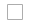

# Daten exportieren

Die beste Möglichkeit, sich mit der Struktur Ihrer Datenbank vertraut zu machen, besteht darin, die Daten zu exportieren und in einer Tabelle zu öffnen. Nachdem Sie sich mit dem Prozess vertraut gemacht haben, können Sie ihn als effiziente Methode zur Verwaltung großer Datenmengen verwenden.

Sonderzeichen wie Gleichheitszeichen, Größer- und Kleiner-als-Symbole, einfache und doppelte Anführungszeichen, umgekehrter Schrägstrich, Strich und Und-Zeichen können Probleme bei der Datenübertragung verursachen. Um sicherzustellen, dass solche Sonderzeichen korrekt interpretiert werden, können sie als _Escape-Sequenz_ markiert werden. Wenn die Daten beispielsweise eine Textzeichenfolge wie `code="str"` und `code="str2"` enthalten, wird durch das Umschließen des Textes in doppelte Anführungszeichen sichergestellt, dass die ursprünglichen doppelten Anführungszeichen als Teil der Daten verstanden werden: `"code="str""`. Wenn das System auf einen doppelten Satz doppelter Anführungszeichen trifft, versteht es, dass der äußere Satz doppelter Anführungszeichen die tatsächlichen Daten umschließt.

Der Datenexport ist ein asynchroner Vorgang, der im Hintergrund ausgeführt wird, damit Sie die Arbeit in Admin fortsetzen können, ohne auf den Abschluss des Vorgangs warten zu müssen. Das System zeigt eine Meldung an, wenn die Aufgabe abgeschlossen ist.

## Exportkriterien

Exportfilter dienen dazu, die Daten anzugeben, die Sie in der Exportdatei basierend auf dem Attributwert verwenden möchten. Darüber hinaus können Sie festlegen, welche Attributdaten Sie in den Export einbeziehen oder daraus ausschließen möchten.

{width="600" zoomable="yes"}

### Filter exportieren

Mithilfe von Filtern können Sie bestimmen, welche SKUs in der Exportdatei enthalten sind. Wenn Sie beispielsweise einen Wert in den Filter Land des Herstellers eingeben, enthält die exportierte CSV-Datei nur Produkte, die in diesem Land hergestellt wurden.

Der Filtertyp entspricht dem Datentyp. Für Datumsfelder können Sie das Datum aus dem Kalender  auswählen. Weitere Informationen finden Sie unter [Attributeingabetypen](../catalog/attributes-input-types.md) .

Das Format des Datums wird durch das [Gebietsschema](../getting-started/store-details.md#locale-options) bestimmt.

Um nur Datensätze mit einem bestimmten Wert einzuschließen, z. B. eine SKU, geben Sie den Wert in das Feld Filter ein. Einige Felder wie &quot;Preis&quot;, &quot;Gewichtung&quot;und &quot;Produkt als neu festlegen&quot;weisen einen von/zu Wertebereich auf.

### Attribute ausschließen

Das Kontrollkästchen in der ersten Spalte wird verwendet, um Attribute aus der Exportdatei auszuschließen. Wenn ein Attribut ausgeschlossen wird, wird die zugehörige Spalte in den Exportdaten eingeschlossen, jedoch leer.

| Ausschließen | Filter | Ergebnis |
|--- |--- |--- |
|  | Nein | Die exportierte Datei enthält jedes Attribut für alle vorhandenen Datensätze. |
|  | Ja | Die Exportdatei enthält jedes Attribut mit nur den vom Filter erlaubten Datensätzen. |
|  | Nein | Die Exportdatei enthält nicht die Spalte für das ausgeschlossene Attribut, sondern enthält alle vorhandenen Datensätze. |
|  | Ja | Die Exportdatei enthält nicht die Spalte für das ausgeschlossene Attribut und nur die vom Filter zugelassenen Datensätze. |

{style="table-layout:auto"}

## Daten exportieren

1. Wechseln Sie in der Seitenleiste _Admin_ zu **[!UICONTROL System]** > _[!UICONTROL Data Transfer]_>**[!UICONTROL Export]**.

1. Legen Sie im Abschnitt _Exporteinstellungen_ **[!UICONTROL Entity Type]** auf einen der folgenden Werte fest:

   - `Advanced Pricing`
   - `Products`
   - `Customer Finances`
   - `Customers Main File`
   - `Customer Addresses`
   - `Stock Sources`

   {width="600" zoomable="yes"}

1. Nehmen Sie die standardmäßige CSV-Datei **[!UICONTROL Export File Format]** an.

1. Wenn Sie Sonderzeichen einschließen möchten, die möglicherweise in den Daten als _Escape-Sequenz_ enthalten sind, aktivieren Sie das Kontrollkästchen **[!UICONTROL Fields Enclosure]** .

1. Ändern Sie bei Bedarf die Anzeige der Entitätsattribute.

   Standardmäßig werden im Abschnitt &quot;Entitätsattribute&quot;alle verfügbaren Attribute in alphabetischer Reihenfolge aufgelistet. Mit den standardmäßigen [Listensteuerelementen](../getting-started/admin-grid-controls.md) können Sie nach bestimmten Attributen suchen und die Liste sortieren. Die Steuerelemente Suche und Filter zurücksetzen steuern die Anzeige der Liste, wirken sich jedoch nicht auf die Auswahl der Attribute aus, die in die Exportdatei aufgenommen werden sollen.

   {width="600" zoomable="yes"}

1. Gehen Sie wie folgt vor, um die exportierten Daten nach Attributwerten zu filtern:

   - Um nur Datensätze mit bestimmten Attributwerten zu exportieren, geben Sie den erforderlichen Wert in die Spalte **[!UICONTROL Filter]** ein. Im folgenden Beispiel wird nur eine bestimmte SKU exportiert.

   - Um ein Attribut aus dem Export auszuschließen, aktivieren Sie das Kontrollkästchen **[!UICONTROL Exclude]** am Anfang der Zeile. Um beispielsweise nur die Spalten `sku` und `image` zu exportieren, aktivieren Sie das Kontrollkästchen jedes anderen Attributs. Die Spalte wird in der Exportdatei angezeigt, jedoch ohne Werte.

1. Scrollen Sie nach unten und klicken Sie in der rechten unteren Ecke der Seite auf **[!UICONTROL Continue]** .

   Nach Abschluss der Aufgabe wird die Datei über eine Nachrichtenwarteschlange verarbeitet (stellen Sie sicher, dass Ihr Cron-Auftrag ausgeführt wird). Die exportierte Datei wird im `var/export/ folder` gespeichert. Weitere Informationen zur Nachrichtenwarteschlange finden Sie unter [Verwalten von Nachrichtenwarteschlangen](https://experienceleague.adobe.com/docs/commerce-operations/configuration-guide/message-queues/manage-message-queues.html) im _Konfigurationshandbuch_.

   Sie können die exportierte CSV-Datei als Tabelle speichern oder öffnen, dann die Daten bearbeiten und wieder in Ihren Speicher importieren.

   >[!NOTE]
   >
   >Standardmäßig befinden sich alle exportierten Dateien im Ordner &quot;`<Magento-root-directory>/var/export`&quot;. Wenn das Remote-Speichermodul aktiviert ist, befinden sich alle exportierten Dateien im Ordner &quot;`<remote-storage-root-directory>/import_export/export`&quot;.

## Fehlerbehebung bei Ressourcen

Hilfe zur Behebung von Problemen beim Datenexport finden Sie in den folgenden Artikeln der Commerce-Support-Knowledge Base:

- [Die .csv-Datei der exportierten Produkte wird nicht angezeigt](https://experienceleague.adobe.com/docs/commerce-knowledge-base/kb/troubleshooting/miscellaneous/exported-products-.csv-file-does-not-appear.html)
- [Die Produktexport-Datei wird in Admin](https://experienceleague.adobe.com/docs/commerce-knowledge-base/kb/support-tools/patches/v1-0-9/mdva-31168-magento-patch-product-export-file-does-not-show-in-admin.html) nicht angezeigt.
- [Problem beim Exportieren von Bestellungen im CSV-Format](https://experienceleague.adobe.com/docs/commerce-knowledge-base/kb/support-tools/patches/v1-0-8/mdva-31242-magento-patch-issue-in-exporting-orders-in-csv-format.html)
