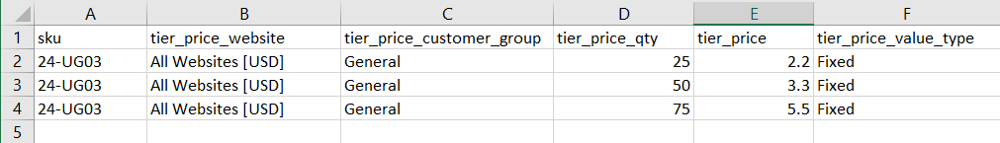

# Preise der Einfuhrstufen

Anstatt [Stufenpreise](../catalog/product-price-tier.md) manuell für jedes Produkt einzugeben, kann es effizienter sein, die Preisdaten zu [importieren](data-import.md). Bevor Sie beginnen, erstellen Sie eine Beispieldatei mit exportierten Preisdaten der Stufe, die Sie als Vorlage verwenden können.

{width="700" zoomable="yes"}

## Schritt 1: Exportieren der Preisdaten der Stufe

Im folgenden Beispiel werden Preisdaten der Stufe für ein einzelnes Produkt exportiert. Anschließend können Sie die exportierten Daten als Vorlage für Massenimporte von Preisdaten der Stufe verwenden. Weitere Informationen zum Exportieren von erweiterten Preisdaten finden Sie unter [Erweiterte Preisdaten](data-attributes-product.md#advanced-pricing-attributes).

{width="600" zoomable="yes"}

1. Navigieren _in_ Seitenleiste zu **[!UICONTROL System]** > _[!UICONTROL Data Transfer]_>**[!UICONTROL Export]**.

1. Legen Sie unter _[!UICONTROL Export Settings]_&#x200B;**[!UICONTROL Entity Type]**&#x200B;auf `Advanced Pricing` fest.

1. Scrollen Sie im **[!UICONTROL Entity Attributes]** Raster nach unten zu den SKU-Attributen und führen Sie die folgenden Schritte aus:

   - Geben Sie für Stufenpreise, die auf einem Rabattprozentsatz basieren, die SKU jedes zu exportierenden Produkts ein, getrennt durch ein Komma.

     {width="600" zoomable="yes"}

   - Geben Sie für Stufenpreise, die auf einem festen Betrag basieren, die SKU jedes Produkts ein.

   - Scrollen Sie nach unten und klicken Sie auf **[!UICONTROL Continue]**.

1. Suchen Sie die Exportdatei am Downloads-Speicherort für Ihren Webbrowser und öffnen Sie die Datei .

   {width="600" zoomable="yes"}

**_Exportierte Preisdaten der Stufe_**

Die exportierten Daten enthalten die folgenden Spalten:

- `sku`
- `tier_price_website`
- `tier_price_customer_group`
- `tier_price_qty`
- `tier_price`
- `tier_price_value_type`

Sie verwenden die exportierten Daten als Vorlage für den Import von Preisdaten der Stufe.

## Schritt 2: Daten aktualisieren

1. Aktualisieren Sie bei Bedarf die Stufenpreisdaten für jedes Produkt.

   Alle Produkte ohne Preisaktualisierungen können aus der CSV-Datei gelöscht werden. Produkte, die sich nicht geändert haben, müssen nicht erneut importiert werden.

1. **[!UICONTROL Save]** die aktualisierte CSV-Datei.

>[!NOTE]
>
>Die Größe einer Importdatei darf nicht größer als 2 MB sein.

## Schritt 3: Importieren der aktualisierten Daten

1. Navigieren _in_ Seitenleiste zu **[!UICONTROL System]** > _[!UICONTROL Data Transfer]_>**[!UICONTROL Import]**.

1. Legen _unter &quot;_ importieren“ **[!UICONTROL Entity Type]** auf `Advanced Pricing` fest.

1. Legen Sie **[!UICONTROL Import Behavior]** auf `Add/Update` fest.

1. Klicken Sie unter **[!UICONTROL File to Import]** auf **[!UICONTROL Choose File]** und wählen Sie die Datei aus, die Sie für den Import aus Ihrem Verzeichnis vorbereitet haben.

1. Klicken Sie oben rechts auf **[!UICONTROL Check Data]**.

1. Wenn die Datei gültig ist, klicken Sie auf **[!UICONTROL Import]**.

   Korrigieren Sie andernfalls jedes Problem mit den in der Nachricht aufgelisteten Daten, und versuchen Sie erneut, die Datei zu importieren.
