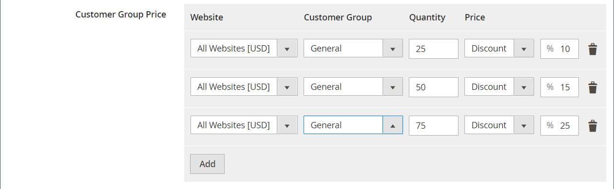

# Einfuhrstufungspreise

Anstatt für jedes Produkt die [Tier-Preise](../catalog/product-price-tier.md) manuell einzugeben, kann es effizienter sein, die Preisdaten [zu importieren](data-import.md). Bevor Sie beginnen, erstellen Sie eine Beispieldatei mit exportierten Tier-Preisdaten, die Sie als Vorlage verwenden können.

{width="700" zoomable="yes"}

## Schritt 1: Exportieren Sie die Daten zum Tierpreis.

Im folgenden Beispiel werden die Kategoriedaten für ein einzelnes Produkt exportiert. Anschließend können Sie die exportierten Daten als Vorlage für Massenimporte von Tier-Preisdaten verwenden. Weitere Informationen zum Exportieren erweiterter Preisdaten finden Sie unter [Erweiterte Preisdaten](data-attributes-product.md#advanced-pricing-attributes).

{width="600" zoomable="yes"}

1. Wechseln Sie in der Seitenleiste _Admin_ zu **[!UICONTROL System]** > _[!UICONTROL Data Transfer]_>**[!UICONTROL Export]**.

1. Setzen Sie unter _[!UICONTROL Export Settings]_**[!UICONTROL Entity Type]**auf `Advanced Pricing`.

1. Scrollen Sie im Raster **[!UICONTROL Entity Attributes]** nach unten zu den SKU-Attributen und führen Sie folgende Schritte aus:

   - Für Tier-Preise, die auf einem Rabattprozentsatz basieren, geben Sie die SKU jedes zu exportierenden Produkts ein, getrennt durch Kommas.

     {width="600" zoomable="yes"}

   - Für Tier-Preise, die auf einem festen Betrag basieren, geben Sie die SKU jedes Produkts an.

   - Scrollen Sie nach unten und klicken Sie auf **[!UICONTROL Continue]**.

1. Suchen Sie die Exportdatei im Speicherort für Downloads Ihres Webbrowsers und öffnen Sie die Datei.

   {width="600" zoomable="yes"}

**_Exportierte Tier-Preisdaten_**

Die folgenden Spalten sind in den exportierten Daten enthalten:

- `sku`
- `tier_price_website`
- `tier_price_customer_group`
- `tier_price_qty`
- `tier_price`
- `tier_price_value_type`

Sie verwenden die exportierten Daten als Vorlage zum Importieren von Tier-Preisdaten.

## Schritt 2: Daten aktualisieren

1. Aktualisieren Sie bei Bedarf die Stufenpreisdaten für jedes Produkt.

   Alle Produkte ohne Tier-Preisaktualisierungen können aus der CSV-Datei gelöscht werden. Es ist nicht erforderlich, nicht geänderte Produkte erneut zu importieren.

1. **[!UICONTROL Save]** die aktualisierte CSV-Datei.

>[!NOTE]
>
>Die Importdatei darf nicht größer als 2 MB sein.

## Schritt 3: Aktualisierte Daten importieren

1. Wechseln Sie in der Seitenleiste _Admin_ zu **[!UICONTROL System]** > _[!UICONTROL Data Transfer]_>**[!UICONTROL Import]**.

1. Legen Sie unter _Importeinstellungen_ **[!UICONTROL Entity Type]** auf `Advanced Pricing` fest.

1. Setzen Sie **[!UICONTROL Import Behavior]** auf `Add/Update`.

1. Klicken Sie unter &quot;**[!UICONTROL File to Import]**&quot;auf &quot;**[!UICONTROL Choose File]**&quot;und wählen Sie die Datei aus, die Sie für den Import aus Ihrem Verzeichnis vorbereitet haben.

1. Klicken Sie in der oberen rechten Ecke auf **[!UICONTROL Check Data]**.

1. Wenn die Datei gültig ist, klicken Sie auf **[!UICONTROL Import]**.

   Korrigieren Sie andernfalls jedes Problem mit den in der Nachricht aufgelisteten Daten und versuchen Sie erneut, die Datei zu importieren.
