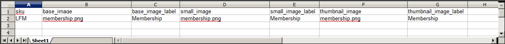

# Importieren von Produktbildern

Es können mehrere Produktbilder jeden Typs in Adobe Commerce und Magento Open Source importiert und mit einem bestimmten Produkt verknüpft werden. Der Pfad und der Dateiname jedes Produktbilds werden in die CSV-Datei eingegeben und die zu importierenden Bilddateien werden in den entsprechenden Pfad auf den Commerce-Server oder externen Server hochgeladen.

Commerce erstellt eine eigene Verzeichnisstruktur für Produktbilder, die alphabetisch organisiert sind. Wenn Sie Produktdaten mit vorhandenen Bildern in eine CSV-Datei exportieren, wird der alphabetisierte Pfad vor dem Dateinamen jedes Bildes angezeigt. Beim Import neuer Bilder müssen Sie jedoch keinen Pfad angeben, da Commerce die Ordnerstruktur automatisch verwaltet. Geben Sie jedoch den relativen Pfad zum Importverzeichnis vor dem Dateinamen der zu importierenden Bilder an.

Um Bilder hochzuladen, müssen Sie über Anmeldedaten und die entsprechenden Zugriffsberechtigungen für den Commerce-Ordner auf dem Server verfügen. Mit den richtigen Anmeldeinformationen können Sie jedes SFTP-Dienstprogramm verwenden, um die Dateien von Ihrem Desktop-Computer auf den Server hochzuladen.

Bevor Sie versuchen, viele Bilder zu importieren, überprüfen Sie die Schritte in der Importmethode, die Sie verwenden möchten, und führen Sie den Prozess mit einigen Produkten durch. Wenn Sie wissen, wie es funktioniert, können Sie große Mengen von Bildern importieren.

>[!IMPORTANT]
>
>Es wird empfohlen, ein Programm zu verwenden, das die UTF-8-Kodierung unterstützt, um CSV-Dateien zu bearbeiten, z. B. Notepad++. Microsoft® Excel fügt zusätzliche Zeichen in die Spaltenüberschrift der CSV-Datei ein, wodurch verhindert werden kann, dass die Daten wieder in Commerce importiert werden.

## Methode 1: Importieren von Bildern vom lokalen Server

1. Laden Sie die Bilddateien auf dem Commerce-Server in den Ordner `var/import/images` oder einen Unterordner hoch, z. B. `var/import/images/product_images`. Dies ist der Standardstammordner für den Import von Produktbildern.

   ```
   <Magento root folder>/var/import/images
   ```

   >[!NOTE]
   >
   >Ab der Adobe Commerce- und Magento Open Source `2.3.2`-Version verkettet der in **[!UICONTROL Images File Directory]** angegebene Pfad den Import in das Basisverzeichnis der Bilder - `<Magento-root-folder>/var/import/images`. Bei früheren Adobe Commerce- und Magento Open Source-Versionen können Sie einen anderen Ordner auf dem Commerce-Server verwenden, sofern der Ordnerpfad während des Importvorgangs angegeben wird.

1. Geben Sie in den CSV-Daten den Namen jeder Bilddatei ein, die in der richtigen Zeile, mit `sku` und in der richtigen Spalte je nach Bildtyp (`base_image`, `small_image`, `thumbnail_image` oder `additional_images`) importiert werden soll.

   >[!NOTE]
   >
   >Bei Bildern im standardmäßigen Importordner (`var/import/images`) dürfen Sie den Pfad vor dem Dateinamen nicht in die CSV-Daten aufnehmen.

   Die CSV-Datei darf nur die Spalte `sku` und die zugehörigen Bildspalten enthalten.

   {width="600" zoomable="yes"}

1. Befolgen Sie die Anweisungen zum [Importieren](data-import.md) der Daten.

1. Geben Sie nach Auswahl der zu importierenden Datei den relativen Pfad nach **[!UICONTROL Images File Directory]** ein.

   ```
   var/import/images
   ```

   {width="600" zoomable="yes"}

   >[!TIP]
   >
   >Lassen Sie _[!UICONTROL Images File Directory]_leer, um das Verzeichnis `<Magento-root-folder>/var/import/images` zu verwenden. Ab Adobe Commerce- und Magento Open Source-Version 2.3.2 ist dies der standardmäßige Basisordner für Importbilder.

   Wenn Sie mehrere Bilder für eine einzelne `sku` importieren, fügen Sie die Bilder in eine Spalte mit dem Namen `additional_images` ein (fügen Sie die Spalte hinzu, falls noch nicht geschehen), getrennt durch Kommas. Beispiel: `image02.jpg,image03.jpg`

## Methode 2: Importieren von Bildern von einem externen Server

1. Laden Sie die zu importierenden Bilder in den angegebenen Ordner auf den externen Server hoch.

1. Geben Sie in den CSV-Daten die vollständige URL für jede Bilddatei in der richtigen Spalte nach Bildtyp (`base_image`, `small_image`, `thumbnail_image` oder `additional_images`) ein.

   ```
   https://example.com/images/image.jpg
   ```

1. Befolgen Sie die Anweisungen zum [Importieren](data-import.md) der Daten.

## Methode 3: Importieren von Bildern mit Remote-Speicher

1. Laden Sie die Bilddateien im Remote-Speichermodul in den Ordner `var/import/images` oder einen Unterordner hoch, z. B. `var/import/images/product_images`. Dies ist der Standardstammordner für den Import von Produktbildern.

   ```bash
   <remote-storage-root-folder>/var/import/images
   ```

   >[!NOTE]
   >
   >Ab der Adobe Commerce- und Magento Open Source `2.3.2`-Version verkettet der in _[!UICONTROL Images File Directory]_angegebene Pfad den Import in das Basisverzeichnis der Bilder: `<remote-storage-root-folder>/var/import/images`. Bei früheren Adobe Commerce- und Magento Open Source-Versionen können Sie einen anderen Ordner auf dem Commerce-Server verwenden, sofern der Ordnerpfad während des Importvorgangs angegeben wird.

1. Geben Sie in den CSV-Daten den Namen jeder Bilddatei ein, die in der richtigen Zeile, mit `sku` und in der richtigen Spalte je nach Bildtyp (`base_image`, `small_image`, `thumbnail_image` oder `additional_images`) importiert werden soll.

   >[!NOTE]
   >
   >Bei Bildern im standardmäßigen Importordner (`var/import/images`) dürfen Sie den Pfad vor dem Dateinamen nicht in die CSV-Daten aufnehmen.

   Die CSV-Datei darf nur die Spalte `sku` und die zugehörigen Bildspalten enthalten.

   {width="600" zoomable="yes"}

1. Befolgen Sie die Anweisungen zum [Importieren](data-import.md) der Daten.

1. Geben Sie nach Auswahl der zu importierenden Datei den relativen Pfad nach **[!UICONTROL Images File Directory]** ein.

   ```
   var/import/images/product_images
   ```

   >[!TIP]
   >
   >Lassen Sie die _[!UICONTROL Images File Directory]_leer, um das Verzeichnis `<Magento-root-folder>/var/import/images` zu verwenden. Ab Adobe Commerce- und Magento Open Source-Version 2.3.2 ist dies der standardmäßige Basisordner für Importbilder.

   Wenn Sie mehrere Bilder für eine einzelne `sku` importieren, fügen Sie die Bilder in eine Spalte mit dem Namen `additional_images` ein (fügen Sie die Spalte hinzu, falls nicht bereits hinzugefügt), getrennt durch Kommas: `image02.jpg,image03.jpg`

Weitere Informationen zum Aktivieren und Verwalten des Remote-Speichermoduls finden Sie unter [Remote-Speicher konfigurieren](https://experienceleague.adobe.com/docs/commerce-operations/configuration-guide/storage/remote-storage/remote-storage.html) im _Konfigurationshandbuch_.

>[!NOTE]
>
>Beim Importieren von Produktbildern wird die Bildgröße nicht erhöht. Die Größe von Produktbildern wird an der Vorderseite durch `pub/get.php` geändert. Achten Sie darauf, dass Ihr `pub/get.php` ordnungsgemäß funktioniert. Andernfalls kann die Größe von Bildern nicht geändert werden.
