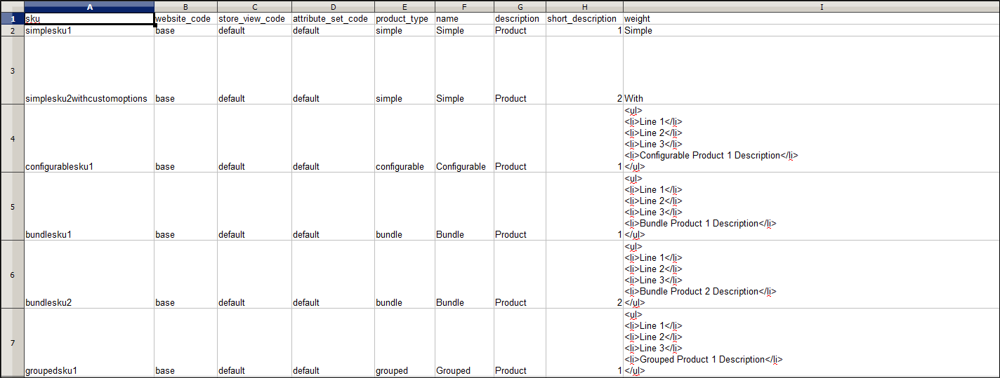
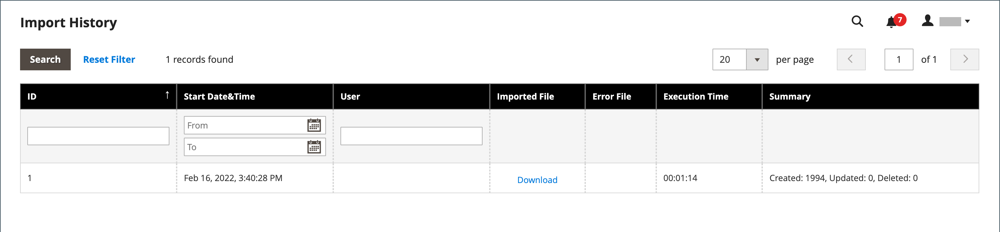

# Daten importieren

Daten für alle Produkttypen können in den Store importiert werden. Darüber hinaus können Sie Produkte, erweiterte Preisdaten, Kundendaten, Kundenadressdaten und Produktbilder importieren. Der Import unterstützt die folgenden Vorgänge:

- Hinzufügen/Aktualisieren
- Ersetzen
- Löschen

## Importrichtlinien

### Neue Entitäten

- Entitäten werden mit den in der CSV-Datei angegebenen Attributwerten hinzugefügt.
- Für ein erforderliches Attribut ohne festgelegten Standardwert kann die Entität (die entsprechende Zeile oder Zeilen) nicht importiert werden, wenn kein Wert oder ein ungültiger Wert vorhanden ist.
- Für ein erforderliches Attribut mit einem festgelegten Standardwert wird die Entität (die entsprechende Zeile oder Zeilen) importiert und der Standardwert wird für das Attribut festgelegt, wenn kein Wert oder ein ungültiger Wert vorhanden ist.
- Wenn die komplexen Daten ungültig sind, kann die Entität (die entsprechende Zeile oder Zeilen) nicht importiert werden.

### Vorhandene Entitäten

- Bei Attributen, die keine komplexen Daten sind, ersetzen die Werte aus der Importdatei, einschließlich der leeren Werte für die nicht erforderlichen Attribute, die vorhandenen Werte.
- Wenn für ein erforderliches Attribut kein Wert oder ein ungültiger Wert vorhanden ist, wird der vorhandene Wert nicht ersetzt.
- Wenn die komplexen Daten für die Entität ungültig sind, kann die Entität (die entsprechende Zeile bzw. die entsprechenden Zeilen) nicht importiert werden. Eine Ausnahme stellt der Fall dar, wenn im Dropdown-Menü Importverhalten die Option Entitäten löschen ausgewählt wurde.

### Komplexe Daten

Wenn ein in der Importdatei angegebenes Attribut vorhanden ist und sein Wert aus einem definierten Satz von Werten abgeleitet wird, gilt Folgendes:

- Wenn der Wert nicht bereits in dem definierten Wertesatz enthalten ist, kann die Zeile importiert werden und für das Attribut wird ein Standardwert festgelegt, falls dieser definiert ist.
- Wenn der Wert bereits in dem definierten Satz enthalten ist, kann die entsprechende Zeile nicht importiert werden.
- Wenn die Importdatei einen Attributnamen angibt, der noch nicht im System definiert ist, wird er nicht erstellt und seine Werte werden nicht importiert.

### Ungültige Dateien

- Eine Datei kann nicht importiert werden, wenn alle Zeilen ungültig sind.
- Ein nicht vorhandener Service-Daten- oder komplexer Datenname wird in der Importdatei angegeben, z. B. eine Spalte mit einer `_<non-existing name>` Überschrift.

Im Importvorgang von Adobe Commerce werden in UTF-8 kodierte Dateien, die eine Bytereihenfolgemarkierung (Byte Order Mark, BOM) verwenden, möglicherweise nicht richtig erkannt. Dateien, die eine Stückliste enthalten, können zu Problemen oder Fehlern während des Importvorgangs führen.

## Importvorgänge

| Bedienung | Beschreibung |
| --------- | ----------- |
| Hinzufügen/Aktualisieren | Zu den vorhandenen Produktdaten für die vorhandenen Einträge in der Datenbank werden neue Produktdaten hinzugefügt. Alle Felder außer `sku` können aktualisiert werden.  Neue Steuerklassen, die in den Importdaten angegeben sind, werden automatisch erstellt.  Neue Produktkategorien, die in der Importdatei angegeben sind, werden automatisch erstellt.  Neue SKUs, die in der Importdatei angegeben sind, werden automatisch erstellt   **_Hinweis:_**&#x200B;Bei Produkten können Sie alle Felder außer SKU durch Import aktualisieren.  **_Wichtig:_** Mehrere Feldwerte, wie Websites oder Kategorien, können nicht mit dem Importverhalten _Hinzufügen/Aktualisieren_ entfernt werden. Diese Felder bleiben nach dem Import in der Datenbank, wenn sie nicht in der CSV-Datei aufgeführt sind. |
| Ersetzen | Die vorhandenen Produktdaten werden durch neue Daten ersetzt.  **_Wichtig:_**&#x200B;Gehen Sie beim Ersetzen von Daten vorsichtig vor, da die vorhandenen Produktdaten gelöscht werden und alle Verweise im System verloren gehen.  Wenn eine SKU in den Importdaten mit der SKU einer vorhandenen Entität übereinstimmt, werden alle Felder, einschließlich der SKU, gelöscht und mithilfe der CSV-Daten wird ein neuer Datensatz erstellt. Ein Fehler tritt auf, wenn die CSV-Datei auf eine SKU verweist, die nicht in der Datenbank vorhanden ist. Sie können Daten überprüfen, um den Fehler anzuzeigen. |
| Löschen | Alle Entitäten in den Importdaten, die in der Datenbank vorhanden sind, werden aus der Datenbank gelöscht.  Löschen ignoriert alle Spalten in den Importdaten, mit Ausnahme der SKU. Sie können alle anderen Attribute in den Daten ignorieren.  Ein Fehler tritt auf, wenn die CSV-Datei auf eine SKU verweist, die nicht in der Datenbank vorhanden ist. Sie können Daten überprüfen, um den Fehler anzuzeigen. |

{style="table-layout:auto"}

## Importvorgang

Die Größe der Importdatei wird durch die Einstellungen in der `php.ini` auf dem Server bestimmt. Die Systemmeldung auf der Seite _Importieren_ gibt die aktuelle Größenbeschränkung an. Die Standardgröße ist 2 MB.

Sonderzeichen (wie das Gleichheitszeichen, Größer- und Kleinstzeichen, einfache und doppelte Anführungszeichen, umgekehrte Schrägstriche, senkrechte Striche und kaufmännische Und-Zeichen) können bei der Datenübertragung zu Problemen führen. Um sicherzustellen, dass solche Sonderzeichen korrekt interpretiert werden, können sie als _Escape-Sequenz“ markiert_. Wenn die Daten beispielsweise eine Textzeichenfolge wie `code="str"` oder `code="str2"` enthalten, stellt die Entscheidung, den Text in doppelte Anführungszeichen einzuschließen, sicher, dass die ursprünglichen doppelten Anführungszeichen als Teil der Daten verstanden werden. Wenn das System auf doppelte Anführungszeichen trifft, versteht es, dass der äußere Satz doppelter Anführungszeichen die tatsächlichen Daten einschließt.

Beim Importieren von Produktdaten werden neue Produktdaten zu vorhandenen Produktdateneinträgen in der Datenbank hinzugefügt. Alle Felder außer SKU können durch Import aktualisiert werden. Alle vorhandenen Produktdaten werden durch die importierten neuen Daten ersetzt. Gehen Sie beim Ersetzen von Daten mit Vorsicht vor. Alle vorhandenen Produktdaten werden gelöscht und alle Verweise im System gehen verloren.

{width="600" zoomable="yes"}

### Schritt 1: Daten vorbereiten

1. Navigieren Sie in _Admin_-Seitenleiste zu **[!UICONTROL System]** > _[!UICONTROL Data Transfer]_>**[!UICONTROL Import]**.

1. Legen _unter_ Importeinstellungen **[!UICONTROL Entity Type]** eine der folgenden Einstellungen fest:

   - `Advanced Pricing`
   - `Products`
   - `Customer Finances`
   - `Customers and Addresses`
   - `Customers Main File`
   - `Customer Addresses`
   - `Stock Sources`

1. Klicken Sie auf **[!UICONTROL Download Sample File]**.

1. Suchen Sie die Exportdatei am Downloads-Speicherort für Ihren Webbrowser und öffnen Sie die Datei .

   Die Beispieldatei enthält Spaltenüberschriften mit Platzhalterdaten für die Produkttypen.

   {width="600" zoomable="yes"}

1. Überprüfen Sie die Struktur der Beispieldatei und verwenden Sie sie, um Ihre CSV-Importdatei vorzubereiten und sicherzustellen, dass die Spaltenüberschriften korrekt geschrieben sind.

1. Stellen Sie sicher, dass die Größe Ihrer Importdatei das in der Nachricht angezeigte Limit nicht überschreitet.

   {width="600"}

1. Wenn die Importdaten Pfade zu Produktbildern enthalten, stellen Sie sicher, dass die Bilddateien an den entsprechenden Speicherort hochgeladen wurden.

   Der Standardspeicherort auf dem Commerce-Server lautet: `pub/media/import`.

   Wenn sich die Bilder auf einem externen Server befinden, stellen Sie sicher, dass Sie die vollständige URL zu dem Verzeichnis haben, das die Bilder enthält.

### Schritt 2: Importverhalten auswählen

{width="600" zoomable="yes"}

1. Legen Sie **[!UICONTROL Import Behavior]** auf eine der folgenden Einstellungen fest:

   - `Add/Update` (Für Produkte können Sie alle Felder außer SKU durch Import aktualisieren.)
   - `Replace`
   - `Delete`

1. Um festzustellen, was beim Importieren von Daten passiert, wenn ein Fehler auftritt, wählen Sie eine der folgenden Optionen:

   - `Stop on Error`
   - `Skip error entries`

1. Geben Sie **[!UICONTROL Allowed Errors Count]** die Anzahl der Fehler ein, die auftreten können, bevor der Import abgebrochen wird.

   Der Standardwert ist 10.

1. Akzeptieren Sie den Standardwert eines Kommas (`,`) für **[!UICONTROL Field separator]**.

1. Akzeptieren Sie den Standardwert eines Kommas (`,`) für **[!UICONTROL Multiple value separator]**.

   In einer CSV-Datei ist ein Komma das Standardtrennzeichen. Wenn Sie ein anderes Zeichen verwenden möchten, stellen Sie sicher, dass die Daten in der CSV-Datei mit dem angegebenen Zeichen übereinstimmen.

1. Akzeptieren Sie den Standardwert `_EMPTY_VALUE_` für **[!UICONTROL Empty attribute value constant]**.

1. Wenn Sie alle Sonderzeichen, die sich möglicherweise in den Daten befinden, als _Escape-Sequenz_ einschließen möchten, aktivieren Sie das Kontrollkästchen **[!UICONTROL Fields Enclosure]** .

### Schritt 3: Importdatei identifizieren

{width="600" zoomable="yes"}

1. Klicken Sie auf **[!UICONTROL Choose File]** , um die zu importierende Datei auszuwählen.

1. Suchen Sie die CSV-Datei, die Sie importiert haben, und klicken Sie auf **[!UICONTROL Open]**.

1. Geben Sie **[!UICONTROL Images File Directory]** den relativen Pfad zum Speicherort der hochgeladenen Bilder auf dem Commerce-Server ein.

   Beispiel: `product_images`.

   >[!NOTE]
   >
   >Ab der Adobe Commerce- und Magento Open Source `2.3.2`-Version wird der in _[!UICONTROL Images File Directory]_&#x200B;angegebene Pfad zum Import in das Bildbasisverzeichnis verkettet: `<Magento-root-folder>/var/import/images`. Platzieren Sie beispielsweise die `product_images` Dateien im Ordner `<Magento-root-directory>/var/import/images/product_images` . Der Basisordner für den Import von Bildern kann in der `\Magento\ImportExport\etc\config.xml` konfiguriert werden. Wenn das Remote-Speichermodul aktiviert ist, importieren Sie Dateien in den `<remote-storage-root-directory>/var/import/images/product_images`.

   Weitere Informationen zum Importieren von Produktbildern finden Sie unter [Importieren von Produktbildern](data-import-product-images.md).

### Schritt 4: Importdaten überprüfen

1. Klicken Sie oben rechts auf **[!UICONTROL Check Data]**.

1. Warten Sie einige Augenblicke, bis der Validierungsprozess abgeschlossen ist.

   Wenn die Importdaten gültig sind, wird die folgende Meldung angezeigt:

   {width="600"}

1. Wenn die Datei gültig ist, klicken Sie auf **[!UICONTROL Import]**.

   Korrigieren Sie andernfalls jedes Problem mit den in der Nachricht aufgelisteten Daten, und versuchen Sie erneut, die Datei zu importieren.

1. Der Importvorgang wird bis zum Ende der Daten fortgesetzt, es sei denn, es tritt ein Fehler auf.

   Wenn in den Validierungsergebnissen eine Fehlermeldung angezeigt wird, beheben Sie das Problem in den Daten und importieren Sie die Datei erneut.

   {width="600"}

   Nach Abschluss des Imports wird eine Meldung angezeigt.

## Importverlauf

Commerce verwaltet einen Datensatz mit Daten, die in Ihren Store importiert wurden, einschließlich Startdatum und -zeit, Benutzenden, Ausführungszeit und einem Link zur importierten Datei. Die _Ausführungszeit_ ist die Dauer des Importvorgangs.

**_So zeigen Sie den Importverlauf an:_**

Navigieren Sie in _Admin_-Seitenleiste zu **[!UICONTROL System]** > _[!UICONTROL Data Transfer]_>**[!UICONTROL Import History]**.

{width="600" zoomable="yes"}

>[!NOTE]
>
>Standardmäßig befinden sich die Importverlaufsdateien im Ordner `<Magento-root-directory>/var/import_history` . Wenn das Remote-Speichermodul aktiviert ist, befinden sich die Importverlaufsdateien im `<remote-storage-root-directory>/import_export/import_history`.

| Feld | Beschreibung |
|--- |--- |
| [!UICONTROL ID] | Eine interne Nummer, die zur Bezeichnung einer Übertragung verwendet wird. |
| [!UICONTROL Start Date & Time] | Ein bestimmtes Datum und eine bestimmte Uhrzeit für die Übertragung. |
| [!UICONTROL User] | Der Kunde, der die Übertragung vorgenommen hat. |
| [!UICONTROL Imported file] | Link zum Herunterladen der importierten Datei. |
| [!UICONTROL Error file] | Die entsprechende Fehlerdatei. |
| [!UICONTROL Execution Time] | Zeitintervall des Importvorgangs. |
| [!UICONTROL Summary] | Anzahl der erstellten, aktualisierten und gelöschten Elemente oder Fehlermeldung. |

{style="table-layout:auto"}

Um die Datei _Importiert/Fehler_ herunterzuladen, klicken Sie auf **[!UICONTROL Download]**.
