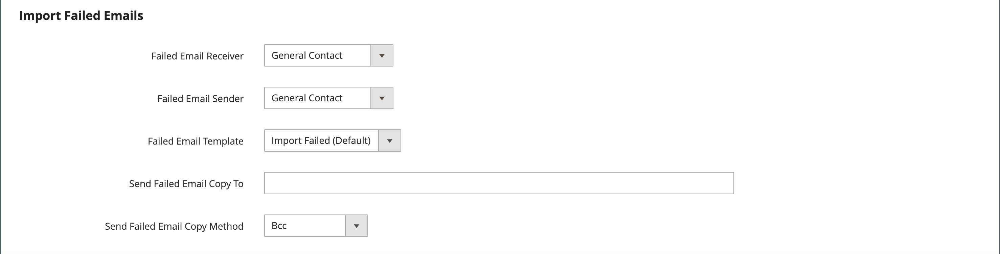

# Geplanter Import und Export

{{ee-feature}}

Geplante Importe und Exporte können täglich, wöchentlich oder monatlich ausgeführt werden. Die zu importierenden oder zu exportierenden Dateien können sich auf lokalen Adobe Commerce-Servern oder FTP-Remote-Servern befinden. Geplanter Import/Export ist standardmäßig implementiert und erfordert keine zusätzliche Konfiguration. Alle geplanten Importe und Exporte werden von der Cron-Auftragsplanung verwaltet.

## Zugriff auf geplante Importe/Exporte

1. Navigieren Sie in _Admin_-Seitenleiste zu **[!UICONTROL System]** > _[!UICONTROL Data Transfer]_>**[!UICONTROL Scheduled Imports/Exports]**.

   {width="700" zoomable="yes"}

1. Um einen neuen geplanten Import- oder Exportvorgang zu erstellen, klicken Sie auf die entsprechende Schaltfläche und folgen Sie den Anweisungen für den Typ des geplanten Vorgangs.

   - [Geplanten Export hinzufügen](#schedule-an-export)
   - [Geplanten Import hinzufügen](#schedule-an-import)

1. Wenn der Datensatz gespeichert wird, wird der Auftrag im _[!UICONTROL Scheduled Import/Export]_angezeigt.

   >[!NOTE]
   >
   >Wenn Sie einen geplanten Import/Export erstellen oder aktualisieren, führt dies zu einer Änderung der Systemkonfiguration. Achten Sie nach dem Speichern darauf, den Hinweis zur Cache-Invalidierung zu adressieren, der oben auf der Admin-Seite angezeigt wird, und den Cache zu leeren, um den neuen oder aktualisierten Zeitplan anzuwenden.

1. [!BADGE Nur PaaS]{type=Informative url="https://experienceleague.adobe.com/en/docs/commerce/user-guides/product-solutions" tooltip="Gilt nur für Adobe Commerce in Cloud-Projekten (von Adobe verwaltete PaaS-Infrastruktur) und lokale Projekte."} Nach jedem geplanten Auftrag wird eine Kopie der Datei im `var/log/import_export` auf dem lokalen Adobe Commerce-Server abgelegt.

   Die Details der einzelnen Vorgänge werden nicht in das Protokoll geschrieben. Wenn ein Fehler auftritt, wird eine Benachrichtigung über den fehlgeschlagenen Import-/Exportvorgang mit einer Beschreibung des Fehlers gesendet.

## Planen eines Imports

Für das verfügbare Importdateiformat und die Typen von Importentitäten ähnelt der geplante Importvorgang dem manuellen Importvorgang:

- Die Importdatei sollte im .CSV-Format vorliegen.
- Produkt- und Kundendaten importieren

Der Vorteil der Verwendung des geplanten Imports besteht darin, dass eine Datendatei nach Angabe der Importparameter automatisch mehrmals importiert und nur einmal geplant werden kann.

Die Details der einzelnen Importvorgänge werden nicht in ein Protokoll geschrieben. Wenn jedoch ein Fehler auftritt, erhalten _eine E-_ mit einer Beschreibung des Fehlers. Das Ergebnis des letzten geplanten Importvorgangs wird in der Spalte Letztes Ergebnis auf der Seite Geplanter Import/Export angezeigt.

[!BADGE Nur PaaS]{type=Informative url="https://experienceleague.adobe.com/en/docs/commerce/user-guides/product-solutions" tooltip="Gilt nur für Adobe Commerce in Cloud-Projekten (von Adobe verwaltete PaaS-Infrastruktur) und lokale Projekte."} Nach jedem Importvorgang wird eine Kopie der Importdatei im `var/log/import_export` auf dem Server abgelegt, auf dem Adobe Commerce oder Magento Open Source bereitgestellt werden. Der Zeitstempel, die Markierung der importierten Entität (Produkte oder Kunden) und der Typ des Vorgangs (in diesem Fall Import) werden zum Importdateinamen hinzugefügt.

Nach jedem geplanten Importvorgang wird automatisch ein Neuindizierungsvorgang ausgeführt. Im Frontend werden Änderungen an den Beschreibungen und anderen Textinformationen angezeigt, nachdem die aktualisierten Daten in die Datenbank übertragen wurden, und die Preisänderungen werden erst nach dem Neuindizierungsvorgang angezeigt.

### Schritt 1: Importeinstellungen abschließen

1. Navigieren Sie in _Admin_-Seitenleiste zu **[!UICONTROL System]** > _[!UICONTROL Data Transfer]_>**[!UICONTROL Scheduled Import/Export]**.

1. Klicken Sie oben rechts auf **[!UICONTROL Add Scheduled Import]**.

1. Zeitplanungs- und Importoptionen festlegen:

   - **[!UICONTROL Name]** - Geben Sie einen Namen für den geplanten Import ein.

   - **[!UICONTROL Description]** - Geben Sie eine kurze Beschreibung ein, die den Zweck des Imports und seine Verwendung erklärt.

   - **[!UICONTROL Entity Type]** — Auf eine der folgenden Einstellungen festlegen:

      - `Products`
      - `Advanced Pricing`
      - `Customers and Addresses (single file)`
      - `Customer Addresses`
      - `Customer Finances`
      - `Customers Main File`
      - `Stock Sources`

   - **[!UICONTROL Import Behavior]** — Auf eine der folgenden Einstellungen festlegen:

      - `Add/Update Complex Data` - Fügt den vorhandenen komplexen Daten für vorhandene Einträge in der Datenbank neue komplexe Daten hinzu oder aktualisiert diese. Dies ist der Standardwert.
      - `Replace` - Überschreiben vorhandener komplexer Daten für vorhandene Entitäten in der Datenbank.
      - `Delete Entities` - Löscht vorhandene Einträge in der Datenbank.
      - `Custom Action` - Passt vorhandene Entitäten in der Datenbank an.

     >[!NOTE]
     >
     >Für die Entitätstypen _[!UICONTROL Advanced Pricing]_,_[!UICONTROL Products]_, _[!UICONTROL Customers and Addresses (single file)]_und_[!UICONTROL Stock Sources]_ werden diese Importverhalten angezeigt: `Add/Update`, `Replace` und `Delete`. Für die Entitätstypen _Kundenfinanzen_, _Kundenhauptdatei_ und _Kunden und Adressen_ werden diese Importverhaltensweisen angezeigt: `Add/Update Complex Data`, `Delete Entities` und `Custom Action`.

   - **[!UICONTROL Start Time]** - Legen Sie die Stunde, Minute und Sekunde fest, zu der der Import beginnen soll.

   - **[!UICONTROL Frequency]** - Auf eine der folgenden Einstellungen festlegen: `Daily`, `Weekly` oder `Monthly`

   - **[!UICONTROL On Error]** : Legen Sie einen der folgenden Werte fest: `Stop Import` oder `Continue Processing`

   - **[!UICONTROL Status]** - Um den geplanten Import zu aktivieren, setzen Sie auf `Enabled`.

   - **[!UICONTROL Field Separator]** - Geben Sie das Zeichen ein, mit dem Felder in der Importdatei getrennt werden. Das Standardzeichen ist ein Komma.

   - **[!UICONTROL Multiple Value Separator]** - Geben Sie das Zeichen ein, mit dem mehrere Werte in einem Feld getrennt werden.

   {width="600" zoomable="yes"}

### Schritt 2: Füllen Sie die Importdatei-Informationen aus

1. Legen Sie **[!UICONTROL Server Type]** auf eine der folgenden Einstellungen fest:

   - `Local Server` - Importiert die Daten von demselben Server, auf dem Adobe Commerce installiert ist.
   - `Remote FTP` - Importiert die Daten von einem Remote-Server.

   {width="600" zoomable="yes"}

   >[!NOTE]
   >
   >Wenn das Remote-Speichermodul aktiviert ist, wechselt `Local Server` automatisch zu `Remote Storage`.

1. Geben Sie die **[!UICONTROL File Directory]** ein, von der die Importdatei stammt.

   - `Local Server` - Geben Sie einen relativen Pfad in der Commerce-Installation ein. Beispiel: `var/import`. Wenn das Remote-Speichermodul konfiguriert ist, verwenden Sie `import_export/import`.
   - `Remote FTP server` : Geben Sie die vollständige URL und den Pfad zum Importordner auf dem Remote-Server ein.

1. Geben Sie die zu importierenden **[!UICONTROL File Name]** ein.

1. Geben Sie **[!UICONTROL Images File Directory]** den Pfad zum Verzeichnis ein, in dem Produktbilder gespeichert werden.

   Geben Sie auf einem lokalen Server einen relativen Pfad ein, z. B.: `var/import`. Geben Sie auf einem Remote-Speicher einen relativen Pfad ein, z. B. `import_export/import` oder `import_export/import/some/dir`.

### Schritt 3: Konfigurieren des Imports fehlgeschlagener E-Mails

{width="600" zoomable="yes"}

1. Legen Sie **[!UICONTROL Failed Email Receiver]** auf den Store-Kontakt fest, der benachrichtigt werden soll, wenn beim Import ein Fehler auftritt.

1. Legen Sie **[!UICONTROL Failed Email Sender]** auf den Store-Kontakt fest, der als Absender der Benachrichtigung angezeigt wird.

1. Legen Sie **[!UICONTROL Failed Email Template]** auf die Vorlage fest, die für die Benachrichtigung verwendet wird.

1. Geben Sie **[!UICONTROL Send Failed Email Copy To]** die E-Mail-Adresse der Person ein, die eine Kopie der Benachrichtigung erhalten soll.

   Trennen Sie mehrere E-Mail-Adressen durch ein Komma.

1. Legen Sie **[!UICONTROL Failed Email Copy Method]** auf eine der folgenden Einstellungen fest:

   - `Bcc` - Sendet eine Blindkopie der fehlgeschlagenen Importbenachrichtigung. Der Name und die Adresse des Empfängers sind in der ursprünglichen E-Mail-Verteilung enthalten, werden jedoch nicht angezeigt.
   - `Separate Email` - Sendet eine Kopie der fehlgeschlagenen Importbenachrichtigung als separate E-Mail.

1. Klicken Sie abschließend auf **[!UICONTROL Save]**.

   Der neue geplante Importvorgang wird der Liste auf der Seite _[!UICONTROL Scheduled Import/Export]_hinzugefügt. Von dieser Seite aus kann sie sofort zum Testen ausgeführt und bearbeitet werden. Die Importdatei wird vor der Ausführung jedes Importvorgangs validiert.

>[!NOTE]
>
>Wenn Sie einen geplanten Import/Export erstellen oder aktualisieren, führt dies zu einer Änderung der Systemkonfiguration. Achten Sie nach dem Speichern darauf, den Hinweis zur Cache-Invalidierung zu adressieren, der oben auf der Admin-Seite angezeigt wird, und den Cache zu leeren, um den neuen oder aktualisierten Zeitplan anzuwenden.

### Feldbeschreibungen

#### [!UICONTROL Import Settings]

| Feld | Beschreibung |
| ----- | ----------- | 
| [!UICONTROL Name] | Der Name des Imports. Hilft bei der Unterscheidung, ob viele verschiedene geplante Importe erstellt werden. |
| [!UICONTROL Description] | (Optional) Sie können eine Beschreibung eingeben. |
| [!UICONTROL Entity Type] | Definiert die zu importierenden Daten. |
| [!UICONTROL Import Behavior] | Definiert, wie komplexe Daten verarbeitet werden, wenn die importierten Entitäten in der Datenbank vorhanden sind. Zu den komplexen Produktdaten gehören Kategorien, Websites, benutzerdefinierte Optionen, Stufenpreise, zugehörige Produkte, Upsell, Crosssell und zugehörige Produktdaten. Zu den komplexen Daten für Kunden gehören Adressen. Optionen:  **[!UICONTROL Add/Update Complex Data]**- Die neuen komplexen Daten werden den vorhandenen komplexen Daten für vorhandene Einträge in der Datenbank hinzugefügt oder aktualisiert. Dies ist der Standardwert. **[!UICONTROL Add/Update]** - Zu den vorhandenen Einträgen in der Datenbank werden neue Daten hinzugefügt. Alle Felder außer `sku` können für Produkte aktualisiert werden. Mehrere Feldwerte, die nicht in der CSV-Datei aufgeführt sind, z. B. Kategorien oder Websites, bleiben nach dem Import in der Datenbank. **[!UICONTROL Replace]**- Die vorhandenen komplexen Daten für die vorhandenen Entitäten werden ersetzt. **[!UICONTROL Delete Entities]** - Wenn importierte Entitäten in der Datenbank vorhanden sind, werden sie aus der Datenbank gelöscht. **[!UICONTROL Custom Action]**- Die vorhandenen komplexen Entitäten werden während des Importvorgangs angepasst. |
| [!UICONTROL Start Time] | Legen Sie die Startstunde, Minuten und Sekunden des Imports fest. |
| [!UICONTROL Frequency] | Legen Sie fest, wie oft der Import ausgeführt wird. Optionen: `Daily` / `Weekly` / `Monthly` |
| [!UICONTROL On Error] | Definieren Sie das Systemverhalten, falls bei der Dateivalidierung Fehler gefunden werden. options: **Import anhalten** - Die Datei wird nicht importiert, wenn bei der Validierung Fehler gefunden wurden. Dies ist der Standardwert. **Verarbeitung fortsetzen** - Wenn während der Validierung Fehler gefunden werden, der Import jedoch möglich ist, wird die Datei importiert. |
| [!UICONTROL Status] | Der Import ist standardmäßig aktiviert. Sie können ihn aussetzen, indem Sie den Status auf `Disabled` setzen. |
| [!UICONTROL Field Separator] | Bestimmt das Zeichen, mit dem Felder getrennt werden. Standardwert: `,` (Komma) |
| [!UICONTROL Multiple Value Separator] | Bestimmt das Zeichen, das zum Trennen mehrerer Werte innerhalb eines Felds verwendet wird. Standardwert: `,` (Komma) |

{style="table-layout:auto"}

#### [!UICONTROL Import File Information]

| Feld | Beschreibung |
| ----- | ----------- | 
| [!UICONTROL Server Type] | Sie können Daten aus einer Datei importieren, die sich auf demselben Server befindet, auf dem Commerce bereitgestellt wird (`Local Server` auswählen), oder aus dem FTP-Remote-Server importieren (`Remote FTP` auswählen). Wenn Sie _[!UICONTROL Remote FTP]_auswählen, werden zusätzliche Optionen für Anmeldedaten und Dateiübertragungs-Einstellungen angezeigt. Wenn das Remote-Speichermodul aktiviert ist, wird `Local Server` Typ automatisch auf `Remote Storage` umgeschaltet. |
| [!UICONTROL File Directory] | Geben Sie das Verzeichnis an, in dem sich die Importdatei befindet. Wenn Server Type auf _[!UICONTROL Local Server]_gesetzt ist, geben Sie den Pfad relativ zum Commerce-Installationsverzeichnis an. Beispiel: `var/import` oder `import_export/import` für Remote-Speicher. |
| [!UICONTROL File Name] | Geben Sie den Namen der Importdatei an. |
| [!UICONTROL Images File Directory] | Geben Sie den Pfad zum Verzeichnis ein, in dem Produktbilder gespeichert werden. Geben Sie für einen lokalen Server einen relativen Pfad ein. Beispiel: `var/import` oder `import_export/import` für Remote-Speicher. |

{style="table-layout:auto"}

#### [!UICONTROL Import Failed Emails]

| Feld | Beschreibung |
| ----- | ----------- | 
| [!UICONTROL Failed Email Receiver] | Geben Sie die E-Mail-Adresse an, an die eine E-Mail-Benachrichtigung (fehlgeschlagene Import-E-Mail) gesendet wird, wenn der Import fehlschlägt. |
| [!UICONTROL Failed Email Sender] | Geben Sie die E-Mail-Adresse an, die als Absender für den fehlgeschlagenen Import der E-Mail verwendet wird. |
| [!UICONTROL Failed Email Template] | Wählen Sie eine Vorlage für die E-Mail mit Fehlern beim Import aus. Standardmäßig ist nur die Option Importieren fehlgeschlagen (Standardvorlage vom Gebietsschema) verfügbar. Benutzerdefinierte Vorlagen können unter _[!UICONTROL System]_>_[!UICONTROL Transactional Emails]_ erstellt werden. |
| [!UICONTROL Send Failed Email Copy To] | Die E-Mail-Adresse, an die eine Kopie der E-Mail zu Fehlern beim Import gesendet wird. |
| [!UICONTROL Send Failed Email Copy Method] | Wählen Sie die Versandmethode Kopieren für die E-Mail mit Fehlern beim Import. |

{style="table-layout:auto"}

## Planen eines Exports

Der geplante Export ähnelt einem manuellen [Export](data-export.md) im verfügbaren Exportdateiformat und den Typen von Entitäten, die exportiert werden können:

- Sie können in das CSV-Format exportieren
- Produkt- und Kundendaten exportieren

Der Vorteil der Verwendung des geplanten Exports besteht darin, dass die Daten nach Angabe der Exportparameter mehrmals automatisch exportiert und nur einmal geplant werden können.

Die Details der einzelnen Exporte werden nicht in ein Protokoll geschrieben. Wenn jedoch ein Fehler auftritt, erhalten Sie eine E-Mail zu Fehlern beim Export, die die Fehlerbeschreibung enthält. Das Ergebnis des letzten Exportvorgangs wird auf der Seite Geplanter Import/Export in der Spalte Letztes Ergebnis angezeigt.

[!BADGE Nur PaaS]{type=Informative url="https://experienceleague.adobe.com/en/docs/commerce/user-guides/product-solutions" tooltip="Gilt nur für Adobe Commerce in Cloud-Projekten (von Adobe verwaltete PaaS-Infrastruktur) und lokale Projekte."} Nach jedem Export wird die Exportdatei an dem benutzerdefinierten Speicherort abgelegt und eine Kopie in das `var/log/import_export` auf dem Server, auf dem Adobe Commerce oder Magento Open Source bereitgestellt wird. Der Zeitstempel und die Markierung der exportierten Entität (Produkte oder Kunden) sowie der Typ des Vorgangs (in diesem Fall „Export„) werden dem Namen der Exportdatei hinzugefügt.

### Schritt 1: Abschließen der Exporteinstellungen

1. Navigieren Sie in _Admin_-Seitenleiste zu **[!UICONTROL System]** > _[!UICONTROL Data Transfer]_>**[!UICONTROL Scheduled Import/Export]**.

1. Klicken Sie oben rechts auf **[!UICONTROL Add Scheduled Export]** und führen Sie folgende Schritte aus:

   - Geben Sie einen **[!UICONTROL Name]** für den geplanten Export ein.

   - Geben Sie eine kurze **[!UICONTROL Description]** ein, in der der Zweck des Exports und seine Verwendung erläutert werden.

   - Legen Sie **[!UICONTROL Entity Type]** auf eine der folgenden Einstellungen fest:

      - `Advanced Pricing`
      - `Products`
      - `Customer Financing`
      - `Customers Main File`
      - `Customer Addresses`
      - `Stock Sources`

     Der Abschnitt _[!UICONTROL Entity Attributes]_unten auf der Seite wird aktualisiert und zeigt den ausgewählten Entitätstyp an.

   - Legen Sie **[!UICONTROL Start Time]** auf die Stunde, Minute und Sekunde fest, in der der Export beginnen soll.

   - Legen Sie **[!UICONTROL Frequency]** auf eine der folgenden Einstellungen fest:

      - `Daily`
      - `Weekly`
      - `Monthly`

1. Um den geplanten Export zu aktivieren, setzen Sie **[!UICONTROL Status]** auf `Enabled`.

1. Akzeptieren Sie `CSV` als **[!UICONTROL File Format]**.

   {width="600" zoomable="yes"}

### Schritt 2: Vervollständigen Sie die Informationen zur Exportdatei

1. Legen Sie **[!UICONTROL Server Type]** auf eine der folgenden Einstellungen fest:

   - `Local Server` - Zum Speichern der Exportdatei auf demselben Server, auf dem Commerce installiert ist.
   - `Remote FTP` - Zum Speichern der Exportdatei auf einem Remote-Server.

   {width="600" zoomable="yes"}

   >[!NOTE]
   >
   >Wenn das Remote-Speichermodul aktiviert ist, wechselt der `Local Server` automatisch zu `Remote Storage`.

1. Geben Sie **[!UICONTROL File Directory]** wie folgt das Verzeichnis ein, in dem die Exportdatei gespeichert werden soll:

   - Geben Sie **[!UICONTROL Local Server]** einen relativen Pfad innerhalb der Commerce-Installation ein, z. B. `var/export`. Wenn das Remote-Speichermodul konfiguriert ist, verwenden Sie `import_export/export`.
   - Geben Sie **[!UICONTROL Remote FTP server]** die vollständige URL und den Pfad zum Zielordner auf dem Zielserver ein.

1. Wenn der _[!UICONTROL Remote FTP]_Server ausgewählt ist, geben Sie die Anmeldeinformationen für die Verbindung zum Server ein und wählen Sie zusätzliche Einstellungen aus:

   - Geben Sie **[!UICONTROL FTP Host[:Port]]** die Remote-FTP-Host-Adresse ein.
   - Geben Sie **[!UICONTROL User Name]** den Benutzernamen ein, mit dem auf den Remote-Server zugegriffen wird.
   - Geben Sie **[!UICONTROL Password]** das Passwort des angegebenen Benutzernamenkontos ein.
   - Wählen Sie **[!UICONTROL File Mode]** `Binary` oder `ASCII`.
   - Wählen Sie **[!UICONTROL Passive Mode]** `No` oder `Yes`.

### Schritt 3: Konfigurieren der E-Mails zu Exportfehlern

1. Legen Sie **[!UICONTROL Failed Email Receiver]** auf den Store-Kontakt fest, der benachrichtigt werden soll, wenn beim Export ein Fehler auftritt.

1. Legen Sie **[!UICONTROL Failed Email Sender]** auf den Store-Kontakt fest, der als Absender der Benachrichtigung angezeigt wird.

1. Legen Sie **[!UICONTROL Failed Email Template]** auf die Vorlage fest, die für die Benachrichtigung verwendet wird.

1. Geben Sie **[!UICONTROL Send Failed Email Copy To]** die E-Mail-Adresse der Person ein, die eine Kopie der Benachrichtigung erhalten soll.

   Trennen Sie bei mehreren E-Mail-Adressen durch ein Komma.

1. Legen Sie **[!UICONTROL Failed Email Copy Method]** auf eine der folgenden Einstellungen fest:

   - `Bcc` - Sendet eine Blind-Höflichkeitskopie. Der Name und die Adresse des Empfängers sind in der ursprünglichen E-Mail-Verteilung enthalten, werden jedoch nicht angezeigt.
   - `Separate Email` - Sendet die Kopie als separate E-Mail.

### Schritt 4: Entitätsattribute auswählen

1. Wählen Sie im Abschnitt _[!UICONTROL Entity Attributes]_die Attribute aus, die Sie in die Exportdaten aufnehmen möchten.

   - Um Daten nach Attributwert zu filtern, geben Sie den Attributwert in die Spalte _[!UICONTROL Filter]_ein.
   - Um Produkte oder Kunden mit bestimmten Attributwerten auszuschließen, geben Sie die Werte der Attribute ein, die Sie ausschließen möchten, und aktivieren Sie das Kontrollkästchen in der Spalte Überspringen .

1. Klicken Sie abschließend auf **[!UICONTROL Save]**.

   Der neue geplante Exportvorgang wird der Liste auf der Seite _[!UICONTROL Scheduled Import/Export]_hinzugefügt. Von dieser Seite aus kann sie sofort zum Testen ausgeführt und bearbeitet werden.

>[!NOTE]
>
>Wenn Sie einen geplanten Import/Export erstellen oder aktualisieren, führt dies zu einer Änderung der Systemkonfiguration. Achten Sie nach dem Speichern darauf, den Hinweis zur Cache-Invalidierung zu adressieren, der oben auf der Admin-Seite angezeigt wird, und den Cache zu leeren, um den neuen oder aktualisierten Zeitplan anzuwenden.

### Feldbeschreibungen

#### [!UICONTROL Export Settings]

| Feld | Beschreibung |
| ----- | ----------- | 
| [!UICONTROL Name] | Der Name des Exports Hilft Ihnen bei der Unterscheidung, ob viele verschiedene geplante Exporte erstellt werden. |
| [!UICONTROL Description] | (Optional) Eine Beschreibung des geplanten Exports. |
| [!UICONTROL Entity Type] | Identifiziert die zu exportierenden Daten. Nachdem die Auswahl vorgenommen wurde, werden die Entitätsattribute unten angezeigt. Optionen: `Advanced Pricing` / `Products` / `Customer Finances` / `Customers Main File` / `Customer Addresses` / `Stock Sources` |
| [!UICONTROL Start Time] | Legen Sie die Startstunde, die Minuten und die Sekunden des Exports fest. |
| [!UICONTROL Frequency] | Definieren Sie, wie oft der Exportvorgang ausgeführt wird. Optionen: `Daily` / `Weekly` / `Monthly` |
| [!UICONTROL Status] | Ein neuer geplanter Export ist standardmäßig aktiviert. Sie können ihn aussetzen, indem Sie den Status auf Deaktiviert setzen. Optionen: `Enabled` / `Disabled` |
| [!UICONTROL File Format] | Wählen Sie das Format der Exportdatei. Derzeit ist nur die Option `.CSV` verfügbar. |

{style="table-layout:auto"}

#### [!UICONTROL Export Settings Information]

| Feld | Beschreibung |
| ----- | ----------- | 
| [!UICONTROL Server Type] | Bestimmt den Speicherort der Exportdatei. options: **Lokaler Server** - Platziert die Exportdatei auf demselben Server, auf dem Commerce bereitgestellt wird. Wenn das Remote-Speichermodul aktiviert ist, wird `Local Server` auf `Remote Storage` umgeschaltet. **Remote FTP** - Platziert die Exportdatei auf einem Remote-Server. Es werden zusätzliche Optionen für Anmeldedaten und Dateiübertragungs-Einstellungen angezeigt. |
| [!UICONTROL File Directory] | Geben Sie das Verzeichnis an, in dem die Exportdatei gespeichert werden soll. Wenn _[!UICONTROL Server Type]_auf `Local Server` gesetzt ist, geben Sie den Pfad relativ zum Commerce-Installationspfad an. Beispiel: `var/export` oder `import_export/export` für Remote-Speicher. |

{style="table-layout:auto"}

#### [!UICONTROL Export Failed Emails]

| Feld | Beschreibung |
| ----- | ----------- | 
| [!UICONTROL Failed Email Receiver] | Geben Sie die E-Mail-Adresse an, an die eine E-Mail-Benachrichtigung (E-Mail zu fehlgeschlagenem Export) gesendet werden soll, wenn der Export fehlschlägt. |
| [!UICONTROL Failed Email Sender] | Geben Sie die E-Mail-Adresse an, die als Absender fehlgeschlagener E-Mails für den Export verwendet wird. |
| [!UICONTROL Failed Email Template] | Wählen Sie eine Vorlage für die fehlgeschlagene Export-E-Mail aus. Standardmäßig ist nur die Option `Export Failed (Default Template from Locale)` verfügbar. |
| [!UICONTROL Send Failed Email Copy To] | Die E-Mail-Adresse, an die eine Kopie der fehlgeschlagenen Export-E-Mail gesendet wird. |
| [!UICONTROL Send Failed Email Copy Method] | Geben Sie die Kopiersendemethode für die E-Mail mit Fehlern beim Export an. |

{style="table-layout:auto"}
