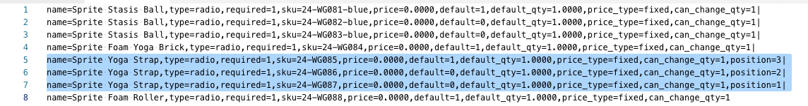

# Importieren von Bundle-Produkten

Ein Bundle-Produkt enthält eine Auswahl an Artikeln und ermöglicht es Kunden, die Artikel auszuwählen, die sie kaufen möchten. Alle Elemente, aus denen ein Bundle besteht, sind im Katalog als [Einfache Produkte](../catalog/product-create-simple.md) oder [Virtuelle Produkte](../catalog/product-create-virtual.md). In der Regel werden Bundle-Produkte vom Administrator erstellt und aktualisiert. Sie können jedoch auch Daten importieren, um ein Bundle-Produkt zu erstellen, oder Sie können vorhandene Bundle-Produkte exportieren, die Daten bearbeiten und wieder in den Katalog importieren. Das Sprite Yoga Companion Kit ist ein Bundle-Produkt in den Beispieldaten, das in den folgenden Beispielen verwendet wird.

{width="700" zoomable="yes"}

## Ändern der Reihenfolge der Bundle-Elemente

Es gibt zwei Möglichkeiten, die Reihenfolge der Elemente in einem Bundle-Produkt zu ändern.

### Methode 1: Ziehen und Ablegen

Beim Arbeiten mit einer [Paket](../catalog/product-create-bundle.md) -Produkt aus dem Admin können Sie Elemente und Abschnitte per Drag-and-Drop an die gewünschte Position ziehen.

{width="600" zoomable="yes"}

### Methode 2: Produktdaten bearbeiten

Die beste Möglichkeit, die Struktur eines Bundle-Produkts zu verstehen, besteht darin, das Produkt zu exportieren und die Daten in einer Tabelle zu untersuchen. Sie können die Reihenfolge der Bundle-Elemente ändern, indem Sie das Produkt exportieren und den Daten für jedes Element einen Positionsparameter hinzufügen. Die Elementdaten befinden sich im `bundle_values` Spalte des exportierten Erzeugnisses. Beim Öffnen in einer Tabelle befinden sich alle mit dem Produkt verknüpften Elemente in einer einzigen Zelle als lange Textzeichenfolge. Die `bundle_values` -Spalte enthält für jedes Element die folgenden Elemente:

- Name des Artikelabschnitts
- Eingabefeld
- Erforderliche Objektanzeige
- SKU
- Farbe
- Preis
- Standardoption
- Standardmenge
- Preistyp
- Indikator der bearbeitbaren Menge

#### Schritt 1: Exportieren des Bundle-Produkts

In diesem Schritt wird das Sprite Yoga Companion Kit als[CSV](data-csv.md) -Datei. Sie können jedes beliebige Paket-Produkt verwenden, das Sie in Ihrem Katalog haben.

1. Im _Admin_ Seitenleiste, navigieren Sie zu **[!UICONTROL System]** > _[!UICONTROL Data Transfer]_>**[!UICONTROL Export]**.

1. under _Exporteinstellungen_, set **[!UICONTROL Entity Type]** nach `Products`.

1. Scrollen Sie in der Liste der Produktattribute nach unten zu **[!UICONTROL SKU]** und geben Sie die SKU des Bundle-Produkts ein, das Sie exportieren möchten.

   Die SKU lautet `24-WG080` für das Produkt in diesem Beispiel.

1. Scrollen Sie nach unten zum unteren Rand des Abschnitts und klicken Sie auf **[!UICONTROL Continue]**.

1. Im _[!UICONTROL Action]_Spalte_[!UICONTROL File name]_ Raster, klicken **[!UICONTROL Select]** und wählen `Download`.

   Die Datei wird an dem von Ihrem Browser verwendeten Download-Speicherort angezeigt.

#### Schritt 2: Daten bearbeiten

1. Öffnen Sie die heruntergeladene CSV-Datei in einer Tabelle.

1. Scrollen Sie nach ganz rechts, bis Sie die `bundle_values` Spalte.

   Im `bundle_values` -Daten, wird jedes Element durch Kommas getrennt und jedes Bundle-Element wird durch einen vertikalen Balken vom nächsten getrennt. (Das letzte Element endet nicht mit einem vertikalen Balken.) Die exportierten Bundle-Daten sollten in etwa wie im folgenden Beispiel aussehen:

   {width="600" zoomable="yes"}

1. Um die Bearbeitung zu vereinfachen, können Sie die `bundle_values` Daten und fügen Sie sie in einen Texteditor ein. Fügen Sie dann nach jedem Element einen Zeilenumbruch hinzu, sodass sich jedes Element in einer separaten Zeile befindet.

1. Entfernen Sie nach der Bearbeitung der Daten sorgfältig die Zeilenumbrüche und fügen Sie die bearbeiteten Daten wieder in die `bundle_values` Spalte.

   In der folgenden Abbildung wird ein `position=[number]` wird zu jedem Yoga-Gurt hinzugefügt, um die Reihenfolge der Elemente in der Store-Liste zu ändern.

   {width="500" zoomable="yes"}

1. Nach der Bearbeitung der Daten, **[!UICONTROL Save]** die CSV-Datei.

#### Schritt 3: Importieren des aktualisierten Produkts

1. Im _Admin_ Seitenleiste, navigieren Sie zu **[!UICONTROL System]** > _[!UICONTROL Data Transfer]_>**[!UICONTROL Import]**.

1. under _[!UICONTROL Import Settings]_, set **[!UICONTROL Entity Type]**nach `Products`.

1. Satz **[!UICONTROL Import Behavior]** nach `Replace`.

   Diese Option überschreibt die vorherigen Daten für Ihr Bundle-Produkt, anstatt Ihre Änderungen als zusätzliche Elemente hinzuzufügen.

1. Scrollen Sie nach unten zum _Zu importierende Datei_ und klicken Sie auf **[!UICONTROL Choose File]**.

1. Wählen Sie die bearbeitete CSV-Datei aus.

1. Klicks **[!UICONTROL Check Data]** und warten Sie einige Augenblicke, bis die Daten überprüft werden.

1. Wenn die Datei gültig ist, klicken Sie auf **[!UICONTROL Import]**.

1. Wenn der Prozess abgeschlossen ist, navigieren Sie zu **[!UICONTROL System]** > _[!UICONTROL Tools]_>**[!UICONTROL Cache Management]**und klicken **[!UICONTROL Flush Cache Storage]**.

   Dadurch wird sichergestellt, dass das aktualisierte Produkt sofort im Storefront verfügbar ist.
