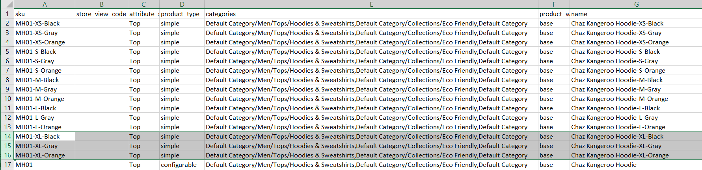

# Konfigurierbare Produkte importieren

Die beste Möglichkeit zu verstehen, wie konfigurierbare Produktdaten strukturiert sind, besteht darin, ein konfigurierbares Produkt und seine Varianten zu exportieren und die Daten in einer Tabelle zu untersuchen.

Im folgenden Beispiel fügen Sie eine Reihe von Produktvarianten für eine neue Größe in jeder Farbe hinzu. Zunächst exportieren Sie das konfigurierbare Produkt und untersuchen die Datenstruktur. Aktualisieren Sie dann die Daten und importieren Sie sie wieder in den Katalog. Wenn Sie die Übung zum Exportieren der Daten nicht durchführen möchten, können Sie die im Beispiel verwendete CSV-Datei herunterladen.

{width="700" zoomable="yes"}

## Schritt 1: Überprüfen der Attributeinstellungen und -werte

1. Bevor Sie beginnen, stellen Sie sicher, dass die Attribute, die für Produktvarianten verwendet werden, über die erforderlichen Eigenschafteneinstellungen verfügen.

   - [**[!UICONTROL Scope]**](../getting-started/websites-stores-views.md#scope-settings) - `Global`
   - [**[!UICONTROL Catalog Input Type for Store Owner]**](data-attributes-product.md) - Der Eingabetyp eines Attributs, das für eine Produktvariante verwendet wird, muss einer der folgenden sein:

      - `Dropdown`
      - `Visual Swatch`
      - `Text Swatch`
      - `Multi-Select`

   - **[!UICONTROL Values Required]** - `Yes`

1. Wenn Sie eine Größe oder Farbe hinzufügen oder eine andere Änderung an einem vorhandenen Attribut vornehmen, müssen Sie das Attribut mit dem neuen Wert aktualisieren.

1. Navigieren Sie in _Admin_-Seitenleiste zu **[!UICONTROL Stores]** > _[!UICONTROL Attributes]_>**[!UICONTROL Product]**.

1. Suchen Sie das Attribut in der Liste und öffnen Sie es im Bearbeitungsmodus.

1. Fügen Sie den neuen Wert zum -Attribut hinzu.

   Im folgenden Beispiel wird einem Textmuster eine neue Größe hinzugefügt.

   {width="500" zoomable="yes"}

1. Klicken Sie abschließend auf **[!UICONTROL Save Attribute]**.

1. Wenn Sie ein Attribut hinzufügen, befolgen Sie die Anweisungen zum [Erstellen des Attributs](../catalog/attribute-product-create.md) bevor Sie beginnen.

## Schritt 2: Exportieren Sie das konfigurierbare Produkt

1. Navigieren Sie in der _Admin_-Seitenleiste zu **[!UICONTROL Catalog]** > **[!UICONTROL Products]**.

1. Suchen Sie das konfigurierbare Produkt zum Exportieren:

   - Klicken Sie auf **[!UICONTROL Filters]**.
   - Legen Sie **[!UICONTROL Type]** auf `Configurable Product` fest und klicken Sie auf **[!UICONTROL Apply Filters]**.
   - Wählen Sie das konfigurierbare Produkt aus, das Sie für Ihren Testexport verwenden möchten, und notieren Sie sich die **[!UICONTROL SKU]**.

1. Navigieren Sie in _Admin_-Seitenleiste zu **[!UICONTROL System]** > _[!UICONTROL Data Transfer]_>**[!UICONTROL Export]**.

   {width="600" zoomable="yes"}

1. Gehen Sie unter _[!UICONTROL Export Setting]s_ wie folgt vor:

   - Legen Sie **[!UICONTROL Entity Type]** auf `Products` fest.

   - Legen Sie **[!UICONTROL Export File Format]** auf `CSV` fest.

1. Scrollen Sie unter _[!UICONTROL Entity Attributes]_nach unten oder verwenden Sie den Attributbeschriftungsfilter, um das **[!UICONTROL SKU]**zu finden. Gehen Sie dann wie folgt vor:

   - Geben Sie die SKU des konfigurierbaren Produkts ein, das Sie exportieren möchten, und klicken Sie auf **[!UICONTROL Continue]**.

     {width="600" zoomable="yes"}

   - Suchen Sie die Datei im Download-Speicherort für Ihren Webbrowser und öffnen Sie sie als Tabelle.

     Die CSV-Datei enthält eine separate Zeile für jede einfache Produktvariante und eine Zeile für das konfigurierbare Produkt. Die `product_type column` zeigt mehrere einfache Produktvarianten, die mit einem konfigurierbaren Produkt verknüpft sind.

     {width="600" zoomable="yes"}

   - Scrollen Sie nach ganz rechts im Arbeitsblatt, um die folgenden Spalten zu finden.

      - `configurable_variations` - Definiert die Eins-zu-Viele-Beziehung zwischen dem konfigurierbaren Produktdatensatz und den einzelnen Varianten.
      - `configurable_variation_labels` - Definiert die Bezeichnung, die jede Variante identifiziert.

     In diesem Beispiel befinden sich die Daten in den Spalten CG und CH. Je nach Anzahl der Varianten kann die Datenzeichenfolge in der `configurable_variations` Spalte lang sein. Die Daten werden als Index für die zugehörigen Produktvarianten verwendet und weisen die folgende Struktur auf:

     ```text
     sku={{SKU_VALUE}},attribute1={{VALUE}},attribute2={{VALUE}}| sku={{SKU_VALUE}},attribute1={{VALUE}},attribute2={{VALUE}}
     ```

     Jede SKU wird durch ein senkrechtes Komma (|) getrennt, und die Attribute werden durch ein Komma getrennt. Der Wert jedes Attributs wird durch den Attributcode und nicht durch die Attributbezeichnung dargestellt. So sehen die tatsächlichen Daten aus:

     ```text
     sku=MH01-XS-Black,size=XS,color=Black|sku=MH01-XS-Gray,size=XS,color=Gray|sku=MH01-XS-Orange,size=XS,color=Orange</pre>
     ```

1. Wenn Sie die Struktur konfigurierbarer Produktdaten verstehen, können Sie die Daten bearbeiten oder neue Varianten direkt zur CSV-Datei hinzufügen.

   Weitere Informationen finden Sie unter [Komplexe Daten](data-attributes-product.md#complex-product-data-attributes).

## Schritt 3: Daten bearbeiten

Im folgenden Beispiel wird der Satz von XML-Größen kopiert und in das Arbeitsblatt eingefügt, um einen Satz von Produktvarianten für eine neue Größe in jeder Farbe zu erstellen.

1. Kopieren Sie den Satz von Produktvarianten, die Sie als Vorlage für die neuen Produkte verwenden möchten.

   {width="600" zoomable="yes"}

1. Fügt die kopierten Datensätze in das Arbeitsblatt ein.

   Sie haben jetzt zwei identische Sets der einfachen Produktvarianten.

   {width="600" zoomable="yes"}

1. Aktualisieren Sie die Daten in den folgenden Spalten der neuen Varianten nach Bedarf.

   - `sku`
   - `name`
   - `url_key`
   - `additional_attributes`

   In diesem Beispiel werden alle `XL` Verweise in `XXL` geändert.

1. Aktualisieren Sie die Informationen in der Spalte `product_variations` des konfigurierbaren Produktdatensatzes, sodass die neuen Varianten als Teil des konfigurierbaren Produkts enthalten sind.

   Klicken Sie in der Zeile mit dem konfigurierbaren Produktdatensatz auf die Zelle, die die `product_variations` enthält. Kopieren Sie dann in der Formelleiste den letzten Parametersatz, beginnend mit dem senkrechten Strich.

   {width="600" zoomable="yes"}

1. Fügen Sie die Parameter an das Ende der Daten ein und bearbeiten Sie sie nach Bedarf für die neuen Varianten.

   In diesem Beispiel werden die Parameter `sku` und `size` für die neue XXL-Größe aktualisiert.

1. Löschen Sie alle Zeilen, die nicht geändert wurden, bevor die Daten wieder in den Katalog importiert werden.

   In diesem Beispiel werden nur die drei neuen Varianten für die neue Größe und die Zeile mit dem aktualisierten konfigurierbaren Produkt wieder in den Katalog importiert. Die anderen Zeilen können aus der CSV-Datei gelöscht werden. Achten Sie jedoch darauf, die Kopfzeile mit Spaltentitel nicht zu löschen.

   {width="600" zoomable="yes"}

1. **[!UICONTROL Save]** der CSV-Datei.

   Die Daten können jetzt in den Katalog importiert werden.

   >[!NOTE]
   >
   >Die Größe einer Importdatei darf nicht größer als 2 MB sein.

## Schritt 4: Importieren der aktualisierten Daten

1. Navigieren Sie in _Admin_-Seitenleiste zu **[!UICONTROL System]** > _[!UICONTROL Data Transfer]_>**[!UICONTROL Import]**.

1. Legen Sie unter _[!UICONTROL Import Settings]_**[!UICONTROL Entity Type]**auf `Products` fest.

1. Legen Sie unter _[!UICONTROL Import Behavior]_**[!UICONTROL Import Behavior]**auf `Add/Update` fest.

   {width="600" zoomable="yes"}

1. Klicken Sie unter _[!UICONTROL File to Import]_auf **[!UICONTROL Choose File]**und navigieren Sie zur CSV-Datei, die Sie für den Import vorbereitet haben, und wählen Sie die Datei aus.

   {width="600" zoomable="yes"}

1. Klicken Sie oben rechts auf **[!UICONTROL Check Data]**.

1. Wenn die Datei gültig ist, klicken Sie auf **[!UICONTROL Import]**.

   Korrigieren Sie andernfalls alle in den Daten gefundenen Probleme und versuchen Sie es erneut.

   {width="600" zoomable="yes"}

1. Wenn der Import abgeschlossen ist, klicken Sie in der Meldung oben auf der Seite auf **[!UICONTROL Cache Management]** und aktualisieren Sie alle ungültigen Caches.

   Die neuen Produktvarianten sind jetzt im Katalog beim Administrator und in der Storefront verfügbar. In diesem Beispiel ist der Kapuzenpullover jetzt in der Größe XXL für alle Farben erhältlich.
