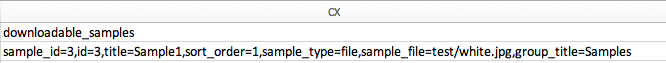

# Herunterladbare Produkte importieren

Der Ablauf für den Import herunterladbarer Produkte ist derselbe wie für [Bundle-](data-transfer-bundle-products.md) oder [konfigurierbare Produkte](data-transfer-configurable-products.md). Der Unterschied besteht darin, dass ein herunterladbares Produkt [herunterladbare Links](../catalog/product-create-downloadable.md) und [herunterladbare Beispiele](../catalog/product-create-downloadable.md) mit seinen Bildern hat.

Der standardmäßige Stammordner für herunterladbare Links und Beispiele ist `<Magento-root-folder>/pub/media/import`. Wenn das Remote-Speichermodul aktiviert ist, ist der standardmäßige Stammordner für herunterladbare Links und Beispiele der `<remote-storage-root-folder>/media/import`.

Die CSV-Datei enthält separate Spalten für `downloadable_links` und `downloadable_samples`.

- **Herunterladbare Link**-Bilder: Im folgenden Beispiel befinden sich herunterladbare Link-Bilder (`red.jpg` und `black.jpg`) im Ordner `<Magento-root-folder>/pub/media/import/test` . Wenn die Remote-Speicherung aktiviert ist, befinden sich diese Bilder im Ordner `<remote-storage-root-folder>/media/import/test`.

  {width="600" zoomable="yes"}

- **Herunterladbare Beispielbilder** - Im folgenden Beispiel befindet sich das herunterladbare Beispielbild (`white.jpg`) im Ordner `<Magento-root-folder>/pub/media/import/test`. Wenn die Remotespeicherung aktiviert ist, befindet sich dieses Bild im Ordner `<remote-storage-root-folder>/media/import/test`.

  {width="400" zoomable="yes"}

Weitere Informationen zur Aktivierung und Verwaltung des Remote-Speichermoduls finden Sie unter [Konfigurieren von Remote](https://experienceleague.adobe.com/docs/commerce-operations/configuration-guide/storage/remote-storage/remote-storage.html?lang=de) im _Konfigurationshandbuch_.
