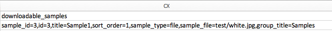

# Herunterladbare Produkte importieren

Der Importfluss von herunterladbaren Produkten entspricht dem von [Bundle-Produkte](data-transfer-bundle-products.md) oder [Konfigurierbare Produkte](data-transfer-configurable-products.md). Der Unterschied besteht darin, dass ein herunterladbares Produkt [herunterladbare Links](../catalog/product-create-downloadable.md) und [herunterladbare Beispiele](../catalog/product-create-downloadable.md) mit den Bildern.

Der Standardstammordner für herunterladbare Links und Beispiele lautet `<Magento-root-folder>/pub/media/import`. Wenn das Remote-Speichermodul aktiviert ist, ist der standardmäßige Stammordner für herunterladbare Links und Beispiele der `<remote-storage-root-folder>/media/import` Verzeichnis.

Die CSV-Datei verfügt über separate Spalten für `downloadable_links` und `downloadable_samples`.

- **Herunterladbare Link-Bilder** — Im folgenden Beispiel werden Bilder von herunterladbaren Links (`red.jpg` und `black.jpg`) in der `<Magento-root-folder>/pub/media/import/test` Ordner. Wenn der Remote-Speicher aktiviert ist, befinden sich diese Bilder im `<remote-storage-root-folder>/media/import/test` Ordner.

  {width="600" zoomable="yes"}

- **Herunterladbare Beispielbilder** — Im folgenden Beispiel wird das herunterladbare Beispielbild (`white.jpg`) im `<Magento-root-folder>/pub/media/import/test` Ordner. Wenn der Remote-Speicher aktiviert ist, befindet sich dieses Bild im `<remote-storage-root-folder>/media/import/test` Ordner.

  {width="400" zoomable="yes"}

Weitere Informationen zum Aktivieren und Verwalten des Remote-Speichermoduls finden Sie unter [Remote-Speicher konfigurieren](https://experienceleague.adobe.com/docs/commerce-operations/configuration-guide/storage/remote-storage/remote-storage.html) im _Konfigurationshandbuch_.
