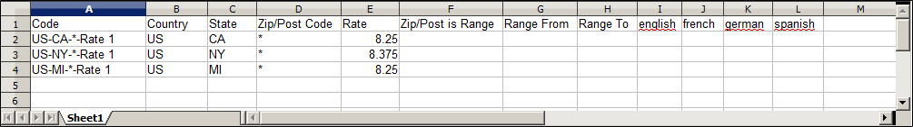

# Steuersatzdaten aktualisieren

Wenn Sie in mehreren Bundesstaaten geschäftlich tätig sind und eine große Menge an Produkten versenden, kann die manuelle Eingabe von Steuersätzen sehr zeitaufwendig sein. Es ist schneller und effizienter, Steuersätze per Postleitzahl herunterzuladen und in Commerce zu importieren. Das folgende Beispiel zeigt, wie Sie einen Satz von zustandsspezifischen Steuersätzen importieren, die aus einer vertrauenswürdigen Quelle heruntergeladen wurden. Avalara bietet [Steuersatztabellen](https://www.avalara.com/taxrates/en/download-tax-tables.html) die Sie für jede Postleitzahl in den USA kostenlos herunterladen können.

>[!NOTE]
>
>Wenn Sie daran interessiert sind, Ihre Umsätze zu automatisieren und die Einhaltung von Steuervorschriften und -berichten zu nutzen, finden Sie auf der Website [Commerce Partners](https://solutionpartners.adobe.com/s/directory/?solution=commerce) vertrauenswürdige Optionen für Commerce.

## Schritt 1: Exportieren der Commerce-Steuersatzdaten

1. Navigieren Sie in _Admin_-Seitenleiste zu **[!UICONTROL System]** > _[!UICONTROL Data Transfer]_>**[!UICONTROL Import/Export Tax Rates]**.

1. Klicken Sie auf **[!UICONTROL Export Tax Rates]**.

1. Suchen Sie die Datei im Download-Speicherort für Ihren Webbrowser.

1. Speichern und öffnen Sie die Datei in einer Tabelle.

   Dieses Beispiel verwendet [!DNL OpenOffice Calc].

   Die Daten zum exportierten Commerce-Steuersatz enthalten die folgenden Spalten:
   - Code
   - Land
   - Bundesland
   - Postleitzahl
   - Satz
   - Bereich von
   - Bereich bis
   - Eine Spalte für jede Shop-Ansicht

   {width="500" zoomable="yes"}

1. Öffnen Sie die neuen Steuersatzdaten in einer zweiten Instanz der Tabelle, sodass Sie sie nebeneinander anzeigen können.

1. Beachten Sie in den neuen Steuersatzdaten alle zusätzlichen Steuersatzdaten, die Sie möglicherweise in Ihrem Store einrichten müssen, bevor die Daten importiert werden.

   Die Steuersatzdaten für Kalifornien umfassen beispielsweise auch:

   - `TaxRegionName`
   - `CombinedRate`
   - `StateRate`
   - `CountyRate`
   - `CityRate`
   - `SpecialRate`

   Wenn Sie zusätzliche [Steuerzonen und -sätze](../stores-purchase/tax-zones-rates.md) importieren müssen, müssen Sie diese zunächst von der Administration Ihres Geschäfts definieren und die [Steuerregeln](../stores-purchase/tax-rules.md) nach Bedarf aktualisieren. Exportieren Sie dann die Daten und öffnen Sie die Datei in einem Texteditor, damit sie als Referenz verwendet werden kann. Um dieses Beispiel jedoch einfach zu halten, importieren wir nur die Spalten mit dem Standardsteuersatz.

## Schritt 2: Vorbereiten der Importdaten

Sie haben zwei Tabellenkalkulationen geöffnet, nebeneinander. Eine enthält die Commerce-Exportdateistruktur und die andere die neuen Steuersatzdaten, die Sie importieren möchten.

1. Um einen Arbeitsplatz in der Tabelle mit den neuen Steuersatzdaten zu erstellen, fügen Sie so viele leere Spalten ganz rechts ein wie nötig, um Daten aus der Commerce-Exportdatei hinzuzufügen. Verwenden Sie Cut-and-Paste , um die Daten hinzuzufügen, und ordnen Sie dann die Spalten so an, dass sie der Reihenfolge der Commerce-Exportdatendatei entsprechen.

1. Benennen Sie die Spaltenüberschriften so um, dass sie mit den Exportdaten von Commerce übereinstimmen.

1. Löschen Sie alle Spalten, die keine Daten enthalten.

   Andernfalls sollte die Struktur der Importdatei mit den ursprünglichen Commerce-Exportdaten übereinstimmen.

1. Führen Sie vor dem Speichern der Datei einen Bildlauf nach unten durch und stellen Sie sicher, dass die Spalten mit dem Steuersatz nur numerische Daten enthalten.

   Jeder Text, der in einer Steuersatzspalte gefunden wird, verhindert den Import der Daten.

1. Speichern Sie die vorbereiteten Daten als CSV-Datei.

   Vergewissern Sie sich bei Aufforderung, dass ein Komma als Feldtrennzeichen und doppelte Anführungszeichen als Texttrennzeichen verwendet werden. Klicken Sie dann auf **[!UICONTROL OK]**.

## Schritt 3: Importieren der Steuersätze

1. Navigieren Sie in _Admin_-Seitenleiste zu **[!UICONTROL System]** > _[!UICONTROL Data Transfer]_>**[!UICONTROL Import/Export Tax Rates]**.

1. Klicken Sie auf **[!UICONTROL Choose File]** und wählen Sie die CSV-Steuersatzdatei aus, die Sie für den Import vorbereitet haben.

1. Klicken Sie auf **[!UICONTROL Import Tax Rates]**.

   Der Import der Daten kann mehrere Minuten dauern. Nach Abschluss des Vorgangs wird die `The tax rate has been imported` angezeigt. Wenn Sie eine Fehlermeldung erhalten, beheben Sie das Problem in den Daten und versuchen Sie es erneut.

1. Navigieren Sie in _Admin_-Seitenleiste zu **[!UICONTROL Stores]** > _[!UICONTROL Taxes]_>**[!UICONTROL Tax Zones and Rates]**.

   Die importierten Tarife werden in der Liste angezeigt.

1. Verwenden Sie die Seitensteuerelemente, um die neuen Steuersätze anzuzeigen.

   {width="600" zoomable="yes"}

1. Führen Sie einige Testtransaktionen in Ihrem Geschäft mit Kunden mit unterschiedlichen Postleitzahlen durch, um sicherzustellen, dass die neuen Steuersätze ordnungsgemäß funktionieren.
