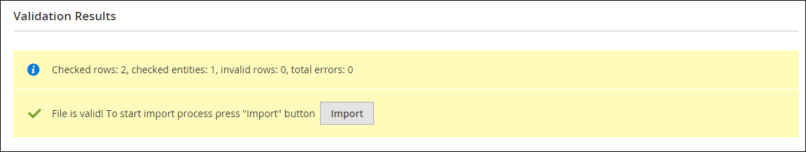

# Datenübertragungen

Verwenden Sie die Import- und Exportwerkzeuge, um mehrere Datensätze in einem einzigen Vorgang zu verwalten. Sie können neue Artikel importieren sowie vorhandene Produktsätze aktualisieren, ersetzen und löschen.

Sie können beispielsweise neue Produkte zu Ihrem Inventar hinzufügen, Produktdaten und erweiterte Preisdaten aktualisieren und einen Satz vorhandener Produkte durch neue Produkte ersetzen. Mit den Import- und Exportwerkzeugen können Sie große Produktkataloge effizienter verwalten, da Sie die Daten exportieren, in einer Tabelle bearbeiten und wieder in Ihren Store importieren können, anstatt mehrere Vorgänge im Administrator durchzuführen.

>[!NOTE]
>
>Adobe Commerce unterstützt auch den SaaS-Datenexport, um Produktdaten vom Commerce-Server an SaaS-Services zu übertragen. Der SaaS-Datenexport ist in Commerce SaaS-Services integriert, einschließlich [Produktempfehlungen](https://experienceleague.adobe.com/docs/commerce/product-recommendations/overview.html?lang=de), [Live Search](https://experienceleague.adobe.com/de/docs/commerce/live-search/overview) und [Catalog Service](https://experienceleague.adobe.com/de/docs/commerce/catalog-service/guide-overview). Weitere Informationen finden Sie im [SaaS-Datenexporthandbuch](https://experienceleague.adobe.com/de/docs/commerce/saas-data-export/overview).

## Datenvalidierung

Alle Daten müssen die Validierung bestehen, um Qualität, Genauigkeit und Integrität der Werte vor dem Import in den Store sicherzustellen. Die Validierung beginnt, wenn Sie auf **[!UICONTROL Check Data]** klicken. Während des Vorgangs werden alle Entitäten in der Importdatei auf Folgendes überprüft:

- **Attribute** - Spaltenkopfzeilennamen werden überprüft, um sicherzustellen, dass sie mit den entsprechenden Attributen in der Systemdatenbank übereinstimmen. Der Wert jedes Attributs wird überprüft, um sicherzustellen, dass es die Anforderungen des Datentyps (Decimal, Integer, Varchar, Text und Datetime) erfüllt.
- **Komplexe Daten** - Werte, die aus einem definierten Satz stammen, z. B. einem Dropdown-Menü oder einem Eingabetyp mit Mehrfachauswahl, werden überprüft, um sicherzustellen, dass die Werte im definierten Satz vorhanden sind.
- **Service-**: Die Werte in den Service-Datenspalten werden überprüft, um sicherzustellen, dass die Eigenschaften oder komplexen Datenwerte mit dem übereinstimmen, was bereits in der Systemdatenbank definiert ist.
- **Erforderliche Werte** - Bei neuen Entitäten wird geprüft, ob die Datei die erforderlichen Attributwerte enthält. Bei bestehenden Entitäten ist es nicht erforderlich, erneut zu überprüfen, ob erforderliche Attributwerte vorhanden sind.
- **Trennzeichen** - Obwohl die Trennzeichen in einer Tabelle nicht sichtbar sind, werden die Datenwerte in einer CSV-Datei durch Kommas getrennt und die Textwerte in doppelte Anführungszeichen gesetzt. Während des Validierungsprozesses werden die Formatierung der Trennzeichen und alle Anführungszeichen, die Zeichenfolgen einschließen, überprüft.

Die Ergebnisse der Validierung werden im Abschnitt Validierungsergebnisse angezeigt und enthalten die folgenden Informationen:

- Die Anzahl der überprüften Entitäten
- Die Anzahl der ungültigen Zeilen
- Die Anzahl der gefundenen Fehler

Wenn die Daten gültig sind, wird die Meldung _Erfolg_.

{width="500" zoomable="yes"}

Wenn die Validierung fehlschlägt, lesen Sie die Beschreibung jedes Fehlers und beheben Sie das Problem in der CSV-Datei. Wenn eine Zeile beispielsweise eine ungültige SKU enthält, wird der Importvorgang gestoppt, und diese Zeile wird nicht importiert, und alle nachfolgenden Zeilen werden nicht importiert. Nachdem das Problem korrekt behoben wurde, importieren Sie die Daten erneut. Wenn viele Fehler auftreten, kann es mehrere Versuche dauern, bis die Validierung erfolgreich ist.

### Nachrichten zur Datenvalidierung

#### Validierung

- `Product with specified SKU not found in rows: 1`
- `URL key for specified store already exists`
- `'7z' file extension is not supported`
- `TXT file extension is not supported`

#### Fehler

- `Wrong field type. Type in the imported file %decimal%, expected type is %text%.`
- `Value is not allowed. Attribute value does not exist in the system.`
- `Field %column name% is required.Wrong value separator is used.`
- `Wrong encoding used. Supported character encoding is UTF-8 and Windows-1252.`
- `Imported file does not contain SKU field.`
- `SKU does not exist in the system.`
- `Column name %column name% is invalid. Should start with a letter. Alphanumeric.`
- `Imported file does not contain a header.`
- `%website name% website does not exist in the system.`
- `%storeview name% storeview does not exist in the system.`
- `Imported attribute %attribute name% does not exist in the system.`
- `Imported resource (image) could not be downloaded from external resource due to timeout or access permissions.`
- `Imported resource (image) does not exist in the local media storage.`
- `Product creation error displayed to the user equal to the one seen during manual product save.`
- `Advanced Price creation error displayed to the user equal to the one seen during the manual product save.`
- `Customer creation error displayed to the user equal to the one seen during the manual customer save.`
