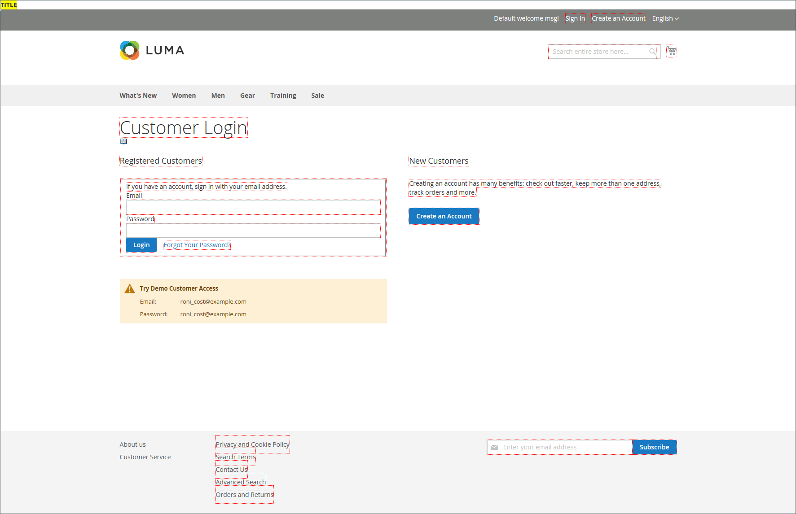

# Entwickler-Tools

Verwenden Sie die erweiterten Entwickler-Tools, um den Kompilierungsmodus während der Frontend-Entwicklung zu bestimmen, eine Zulassungsliste von IP-Adressen zu erstellen und Vorlagenpfadhinweise anzuzeigen. Es gibt auch Tools, mit denen Sie problemlos Änderungen am Text in der Benutzeroberfläche der Storefront und in der Admin vornehmen können.

- [Aktionsprotokolle](action-log.md)  (nur Adobe Commerce)
- [Frontend-Entwicklungs-Workflow](#frontend-development-workflow)
- [Verwenden von statischen Dateisignaturen](#static-file-signatures)
- [Ressourcendatei-Optimierung](#optimizing-resource-files)
- [Client-Einschränkungen für Entwickler](#client-restrictions)
- [Hinweise zu Vorlagenpfaden](#template-path-hints)
- [Inline übersetzen](#translate-inline)

## Betriebsmodi

Ihre Adobe Commerce- oder Magento Open Source-Instanz kann bereitgestellt werden, um entweder im _-_ im _-Modus_. Auf die speziell für Entwickler entwickelten Tools und Konfigurationseinstellungen kann nur zugegriffen werden, während der Store im _Entwicklermodus_ ausgeführt wird.

Der Betriebsmodus kann nur über die Befehlszeile des Servers von einem Benutzer mit entsprechenden Berechtigungen geändert werden. Weitere [ finden Sie unter „Festlegen ](https://experienceleague.adobe.com/docs/commerce-operations/configuration-guide/cli/set-mode.html?lang=de) Betriebsmodus“ _&quot;_&quot;.

Die meisten Themen in der Händlerdokumentation gelten für eine Commerce-Instanz, die im Produktionsmodus ausgeführt wird. Die folgenden Konfigurationseinstellungen und -tools können jedoch nur verwendet werden, wenn die Installation im Entwicklermodus ausgeführt wird.

## Frontend-Entwicklungs-Workflow

Der Workflow-Typ für die Frontend-Entwicklung bestimmt, ob während der Entwicklung weniger Kompilierungen Client- oder Server-seitig stattfinden. Less ist eine Erweiterung von CSS, die über zusätzliche Funktionen und Konventionen verfügt und optimierten Code generiert. Für die Design-Entwicklung wird eine Client-seitige Less-Kompilierung empfohlen. Die Server-seitige Kompilierung ist der Standardmodus. Die Workflow-Optionen für die Entwicklung sind nicht für Stores im Produktionsmodus verfügbar.
Siehe [Client-seitige LESS-Kompilierung vs. Server-seitig](https://developer.adobe.com/commerce/frontend-core/guide/css/quickstart/compilation-mode/){:target="_blank"} in der Entwicklerdokumentation zu Commerce.

>[!NOTE]
>
>Die Konfiguration des Frontend-Entwicklungs-Workflows ist nur im [-Modus ](../systems/developer-tools.md#operation-modes).

{width="600" zoomable="yes"}

1. Navigieren Sie in _Admin_-Seitenleiste zu **[!UICONTROL Stores]** > _[!UICONTROL Settings]_>**[!UICONTROL Configuration]**.

1. Erweitern Sie im linken Bereich **[!UICONTROL Advanced]** und wählen Sie **[!UICONTROL Developer]**.

1. Erweitern Sie  den Abschnitt **[!UICONTROL Front-end Development Workflow]** .

1. Legen Sie **[!UICONTROL Workflow Type]** auf eine der folgenden Einstellungen fest:

   - `Client side less compilation` - Die Kompilierung erfolgt im Browser unter Verwendung der nativen `less.js`.
   - `Server side less compilation` - Kompilierung erfolgt auf dem Server mit der Less PHP-Bibliothek. Dies ist der Standardmodus für die Produktion.

1. Klicken Sie abschließend auf **[!UICONTROL Save Config]**.

## Statische Dateisignaturen

Das Hinzufügen einer digitalen Signatur zur URL statischer Dateien ermöglicht es Browsern zu erkennen, wann eine neuere Version der Datei verfügbar ist. Zu den statischen Dateien, die mit digitalen Signaturen verfolgt werden können, gehören JavaScript, CSS, Bilder und Schriftarten. Die Signatur wird direkt nach der Basis-URL an den Pfad angehängt. Wenn sich die Signatur einer Datei von der unterscheidet, die im Cache des Browsers gespeichert ist, wird die neuere Version der Datei verwendet.

Siehe [Statisches Inhaltssignieren](https://experienceleague.adobe.com/docs/commerce-operations/configuration-guide/cache/static-content-signing.html?lang=de){:target="_blank"} in der Entwicklerdokumentation zu Commerce.

>[!NOTE]
>
>Die Konfiguration Statischer Dateieinstellungen ist nur im [Entwicklermodus“ ](../systems/developer-tools.md#operation-modes).

{width="600" zoomable="yes"}

Eine detaillierte Liste der Konfigurationseinstellungen finden Sie unter [_Statische Dateieinstellungen_](../configuration-reference/advanced/developer.md) in _Konfigurationsreferenz_.

**_So aktivieren Sie signierte statische Dateien:_**

1. Navigieren Sie in _Admin_-Seitenleiste zu **[!UICONTROL Stores]** > _[!UICONTROL Settings]_>**[!UICONTROL Configuration]**.

1. Erweitern Sie im linken Bereich **[!UICONTROL Advanced]** und wählen Sie **[!UICONTROL Developer]**.

1. Erweitern Sie  den Abschnitt **[!UICONTROL Static Files Settings]** .

1. Legen Sie **[!UICONTROL Sign Static Files]** auf `Yes` fest.

1. Klicken Sie abschließend auf **[!UICONTROL Save Config]**.

## Ressourcendateioptimierung

Der Zeitaufwand für das Laden von Ressourcendateien kann durch das Zusammenführen und Bündeln von Dateien sowie durch die Minimierung von Code reduziert werden.

- Beim Zusammenführen werden separate Dateien desselben Typs zu einer einzigen Datei zusammengefasst.
- Bundling ist eine Technik, bei der separate Dateien gruppiert werden, um die Anzahl der HTTP-Anfragen zu reduzieren, die zum Laden einer Seite erforderlich sind.
- Durch die Minimierung werden Leerzeichen, Zeilenumbrüche und Kommentare entfernt, die Funktionalität des Codes wird jedoch nicht beeinträchtigt. Da minimierte Dateien nicht bearbeitet werden können, sollte der Prozess nur angewendet werden, wenn Sie für die Produktion bereit sind.

Standardmäßig führen Adobe Commerce und Magento Open Source keine Dateien zusammen, bündeln oder minimieren sie nicht. Der Projektentwickler sollte festlegen, welche Dateioptimierungsmethoden verwendet werden sollen.

Weitere Informationen finden [ unter ](https://experienceleague.adobe.com/docs/commerce-operations/performance-best-practices/overview.html?lang=de) Practices für die Leistung .

>[!NOTE]
>
>CSS- und JavaScript-Dateien können nur im [Entwicklermodus](../systems/developer-tools.md#operation-modes) optimiert werden.

| Dateityp | Unterstützte Vorgänge |
| --------------- | -------------------- |
| CSS-Dateien | `MergeMinify` |
| JavaScript-Dateien | `MergeBundleMinify` |
| Vorlagendateien | `Minify` |

{style="table-layout:auto"}

**_So optimieren Sie Ressourcendateien:_**

1. Navigieren Sie in _Admin_-Seitenleiste zu **[!UICONTROL Stores]** > _[!UICONTROL Settings]_>**[!UICONTROL Configuration]**.

1. Erweitern Sie im linken Bereich **[!UICONTROL Advanced]** und wählen Sie **[!UICONTROL Developer]**.

1. Um CSS-Dateien zu optimieren, erweitern  den Abschnitt **[!UICONTROL CSS Settings]** und führen Sie die folgenden Schritte aus:

   - Legen Sie **[!UICONTROL Merge CSS Files]** auf `Yes` fest.
   - Legen Sie **[!UICONTROL Minify CSS Files]** auf `Yes` fest.

   {width="600" zoomable="yes"}

[_CSS_Settings](../configuration-reference/advanced/developer.md)

1. Um JavaScript-Dateien zu optimieren, erweitern  den Abschnitt **[!UICONTROL JavaScript Settings]** und führen Sie folgende Schritte aus:

   - Legen Sie **[!UICONTROL Merge JavaScript Files]** auf `Yes` fest.
   - Legen Sie **[!UICONTROL Minify JavaScript Files]** auf `Yes` fest.

   {width="600" zoomable="yes"}

1. Um PHTML-Vorlagendateien zu minimieren, erweitern Sie  den Abschnitt **[!UICONTROL Template Settings]** und setzen **[!UICONTROL Minify Html]** auf `Yes`.

   {width="600" zoomable="yes"}

1. Klicken Sie abschließend auf **[!UICONTROL Save Config]**.

## Client-Einschränkungen

Auf die Zulassungsliste setzen Bevor Sie ein Tool wie [Vorlagenpfadhinweise](#template-path-hints) verwenden, fügen Sie Ihre IP-Adresse zur Seite „Client-Einschränkungen für Entwickler“ hinzu, um zu vermeiden, dass das Einkaufserlebnis der Kunden im Store beeinträchtigt wird. Wenn Sie Ihre IP-Adresse nicht kennen, können Sie online danach suchen.

>[!NOTE]
>
>Client-Einschränkungen für Entwickler können nur im [Entwicklermodus](../systems/developer-tools.md#operation-modes) festgelegt werden.

Technische Informationen finden Sie unter [Benutzerdefinierte VCL zum Zulassen von Anfragen](https://experienceleague.adobe.com/docs/commerce-cloud-service/user-guide/cdn/custom-vcl-snippets/fastly-vcl-allowlist.html?lang=de) im _Handbuch zu Commerce in Cloud-Infrastrukturen_.

**_So fügen Sie Ihre IP-Adresse zur Zulassungsliste hinzu:_**

1. Navigieren Sie in _Admin_-Seitenleiste zu **[!UICONTROL Stores]** > _[!UICONTROL Settings]_>**[!UICONTROL Configuration]**.

1. Erweitern Sie im linken Bereich **[!UICONTROL Advanced]** und wählen Sie **[!UICONTROL Developer]**.

1. Erweitern Sie  den Abschnitt **[!UICONTROL Developer Client Restrictions]** .

   {width="600" zoomable="yes"}

1. Geben Sie **[!UICONTROL Allow IPs]** Ihre IP-Adresse ein.

   Wenn der Zugriff von mehreren IP-Adressen benötigt wird, trennen Sie sie durch ein Komma.

1. Klicken Sie abschließend auf **[!UICONTROL Save Config]**.

1. Aktualisieren Sie nach Aufforderung alle ungültigen Caches.

## Hinweise zu Vorlagenpfaden

Vorlagenpfadhinweise sind ein Diagnosewerkzeug, das jeder auf der Seite verwendeten Vorlage Notation mit dem Pfad hinzufügt. Hinweise auf Vorlagenpfade können entweder für die Storefront oder für den Administrator aktiviert werden.

>[!NOTE]
>
>Hinweise zu Vorlagenpfaden können nur im [Entwicklermodus](../systems/developer-tools.md#operation-modes) bearbeitet werden.

Siehe [Suchen von Vorlagen, Layouts und Stilen](https://developer.adobe.com/commerce/frontend-core/guide/themes/debug/){:target="_blank"} in der Commerce-Entwicklerdokumentation.

{width="700" zoomable="yes"}

### Auf die Zulassungsliste setzen Schritt 1: Hinzufügen der IP-Adresse zur

Bevor Sie Hinweise für Vorlagenpfade verwenden, fügen Sie Ihre IP-Adresse zur Zulassungsliste [hinzu](#client-restrictions) um Interferenzen mit Kunden zu vermeiden, die im Geschäft einkaufen. Wenn Sie fertig sind, stellen Sie sicher, dass Sie den Commerce-Cache löschen, um alle Hinweise aus dem Store zu entfernen.

{width="600" zoomable="yes"}

### Schritt 2: Aktivieren von Pfadhinweisen für Vorlagen

1. Navigieren Sie in _Admin_-Seitenleiste zu **[!UICONTROL Stores]** > _[!UICONTROL Settings]_>**[!UICONTROL Configuration]**.

1. Erweitern Sie im linken Bereich **[!UICONTROL Advanced]** und wählen Sie **[!UICONTROL Developer]**.

1. Erweitern Sie  den Abschnitt **[!UICONTROL Debug]** und führen Sie folgende Schritte aus:

   {width="600" zoomable="yes"}

   - Um Vorlagenpfadhinweise für den Store zu aktivieren, setzen Sie **[!UICONTROL Enabled Template Path Hints for Storefront]** auf `Yes`.

   - Damit Vorlagenpfadhinweise nur dann für den Store aktiviert werden, wenn die URL den `templatehints` enthält, setzen Sie **Hinweise für die Storefront mit URL-Parameter aktivieren** auf `Yes`. Legen Sie dann bei Bedarf den Wert für den Parameter fest. Der Standardwert ist `magento`, Sie können jedoch einen benutzerdefinierten Wert verwenden. Wenn Sie beispielsweise den Wert in `lorem` ändern, würden Sie `mymagento.com?templatehints=lorem` verwenden, um Vorlagenhinweise anzuzeigen.

   - Um Vorlagenpfadhinweise für Admins zu aktivieren, setzen Sie **[!UICONTROL Enabled Template Path Hints for Admin]** auf `Yes`.

   - Um die Namen von Blöcken einzuschließen, setzen Sie **[!UICONTROL Add Block Class Type to Hints]** auf `Yes`.

1. Klicken Sie abschließend auf **[!UICONTROL Save Config]**.

### Schritt 3: Löschen des Cache

1. Navigieren Sie in _Admin_-Seitenleiste zu **[!UICONTROL System]** > _[!UICONTROL Tools]_>**[!UICONTROL Cache Management]**.

1. Klicken Sie oben rechts auf **[!UICONTROL Flush Magento Cache]**.

## Inline übersetzen

Sie können das Tool Inline übersetzen im [Entwicklermodus](../systems/developer-tools.md#operation-modes) verwenden, um Text in der Benutzeroberfläche zu bereinigen, damit Ihre Stimme und Marke widergespiegelt werden. Wenn der Inline-Übersetzungs -Modus aktiviert ist, wird jeder Text auf der Seite, der bearbeitet werden kann, rot umrandet. Es ist einfach, Feldbezeichnungen, Nachrichten und anderen Text zu bearbeiten, der in der Storefront und in Admin angezeigt wird. Viele Designs verwenden beispielsweise Terminologie wie _Mein Konto_, _Meine Wunschliste_ und _Mein Dashboard_, um Kunden dabei zu helfen, sich zurechtzufinden. Möglicherweise bevorzugen Sie jedoch einfach die Wörter _Konto_, _Wunschliste_ und _Dashboard_.

>[!NOTE]
>
>Das Inline-Übersetzungs-Tool ist nur verfügbar, wenn im [Entwicklermodus](../systems/developer-tools.md#operation-modes) gearbeitet wird.

Siehe [Übersetzungen - Übersicht](https://developer.adobe.com/commerce/frontend-core/guide/translations/) in der Entwicklerdokumentation zu Commerce.

{width="700" zoomable="yes"}

Wenn Ihr Store in mehreren Sprachen verfügbar ist, können Sie feine Anpassungen am übersetzten Text für das Gebietsschema vornehmen. Auf dem Server wird der Schnittstellentext für jeden Ausgabeblock in einer separaten CSV-Datei verwaltet und nach Gebietsschema organisiert. Anstatt das Tool „Inline übersetzen _zu verwenden_ können Sie die CSV-Dateien auch direkt auf dem Server bearbeiten. Übersetzungsdateien werden in `app/code/Magento/<module_name>/i18n/<language_locale>.csv` gespeichert.

>[!NOTE]
>
>Um das Inline-Übersetzungs-Tool verwenden zu können, muss Ihr Browser Popup-Fenster zulassen.

### Schritt 1: Deaktivieren von Ausgabe-Caches

1. Navigieren Sie in _Admin_-Seitenleiste zu **[!UICONTROL System]** > _[!UICONTROL Tools]_>**[!UICONTROL Cache Management]**.

1. Aktivieren Sie die folgenden Kontrollkästchen:

   - `Blocks HTML output`
   - `Page Cache`
   - `Translations`

1. Legen Sie das **[!UICONTROL Actions]** auf `Disable` fest und klicken Sie auf **[!UICONTROL Submit]**.

### Schritt 2: Aktivieren des Inline-Übersetzungs-Tools

1. Navigieren Sie in _Admin_-Seitenleiste zu **[!UICONTROL Stores]** > _[!UICONTROL Settings]_>**[!UICONTROL Configuration]**.

1. Um mit einer bestimmten Store-Ansicht zu arbeiten, legen Sie die zu aktualisierende **[!UICONTROL Store View]** fest.

1. Erweitern Sie im linken Bereich **[!UICONTROL Advanced]** und wählen Sie **[!UICONTROL Developer]**.

1. Erweitern Sie  den Abschnitt **[!UICONTROL Translate Inline]** .

   Deaktivieren Sie das Kontrollkästchen **[!UICONTROL Use Website]** nach Bedarf, um diese Einstellungen zu ändern.

   Die Option &quot;_[!UICONTROL Enabled for Admin]_&quot; ist beim Bearbeiten einer bestimmten Store-Ansicht nicht verfügbar.

   {width="600" zoomable="yes"}

1. Legen Sie **[!UICONTROL Enabled for Storefront]** auf `Yes` fest.

1. Klicken Sie abschließend auf **[!UICONTROL Save Config]**.

1. Aktualisieren Sie die ungültigen Caches, aber lassen Sie die deaktivierten Caches vorerst so, wie sie sind.

### Schritt 3: Text aktualisieren

1. Öffnen Sie Ihre Storefront in einem Browser und gehen Sie zu der Seite, die Sie bearbeiten möchten.

   Verwenden Sie bei Bedarf die Sprachauswahl, um die Store-Ansicht zu ändern. Jede Textzeichenfolge, die übersetzt werden kann, ist rot umrandet. Wenn Sie den Mauszeiger über ein Textfeld bewegen, wird ein Buchsymbol (  ) angezeigt.

1. Klicken Sie auf das Buchsymbol, um das Fenster _Übersetzen_ zu öffnen. Gehen Sie dann wie folgt vor:

   - Wenn sich die Änderung auf die spezifische Store-Ansicht bezieht, aktivieren Sie das Kontrollkästchen **[!UICONTROL Store View Specific]** .

   - Geben Sie den neuen **[!UICONTROL Custom]** ein.

1. Klicken Sie abschließend auf **[!UICONTROL Submit]**.

   {width="700" zoomable="yes"}

1. Aktualisieren Sie den Browser, um Ihre Änderungen im Store anzuzeigen.

1. Wiederholen Sie diesen Vorgang für alle Elemente im Speicher, die geändert werden sollen.

### Schritt 4: Originaleinstellungen wiederherstellen

1. Kehren Sie zum Administrator Ihres Stores zurück.

1. Navigieren Sie in _Admin_-Seitenleiste zu **[!UICONTROL Stores]** > _[!UICONTROL Settings]_>**[!UICONTROL Configuration]**.

1. Legen Sie **[!UICONTROL Store View]** auf die spezifische Ansicht fest, die bearbeitet wurde.

1. Erweitern Sie im linken Bereich **[!UICONTROL Advanced]** und wählen Sie **[!UICONTROL Developer]**.

1. Erweitern Sie  den Abschnitt **[!UICONTROL Translate Inline]** .

1. Legen Sie **[!UICONTROL Enabled for Frontend]** auf `No` fest.

1. Klicken Sie abschließend auf **[!UICONTROL Save Config]**.

1. Navigieren Sie in _Admin_-Seitenleiste zu **[!UICONTROL System]** > _[!UICONTROL Tools]_>**[!UICONTROL Cache Management]**.

1. Aktivieren Sie das Kontrollkästchen der folgenden Ausgabe-Caches, die zuvor deaktiviert waren:

   - `Blocks HTML output`
   - `Page Cache`
   - `Translations`

1. Legen Sie das **[!UICONTROL Actions]** auf `Enable` fest und klicken Sie auf **[!UICONTROL Submit]**.

1. Aktualisieren Sie nach Aufforderung alle ungültigen Caches.

### Schritt 5: Überprüfen Sie die Änderungen in Ihrem Store

Gehen Sie zu Ihrer Storefront und überprüfen Sie jede Seite, die aktualisiert wurde, um sicherzustellen, dass die Änderungen korrekt sind. In diesem Beispiel wurde `Customer Login` in `Customer Sign In` geändert. Wenn Änderungen an einer bestimmten Ansicht vorgenommen wurden, verwenden Sie die Sprachauswahl, um zur richtigen Ansicht zu wechseln.

{width="700" zoomable="yes"}
