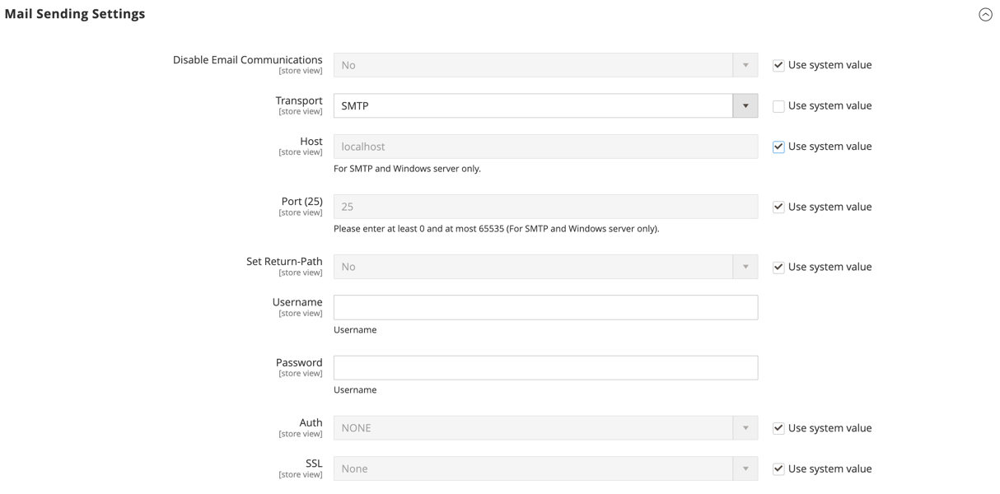

# Konfigurieren von E-Mail-Nachrichten

Mit _E-Mail-_ können Sie zurückgegebene E-Mails oder Antworten auf E-Mails an eine bestimmte Adresse weiterleiten. Wenn Ihr Store auf einem SMTP- oder Windows-Server ausgeführt wird, können Sie die Host- und Port-Einstellungen überprüfen.

>[!IMPORTANT]
>
>**Sicherheitshinweis** Alle Händler sollten sofort ihre E-Mail-Versandkonfiguration einstellen, um sich vor einem kürzlich identifizierten potenziellen Remote-Code-Ausführungsangriff zu schützen. Solange dieses Problem nicht behoben ist, wird dringend empfohlen, [!DNL Sendmail] nicht für E-Mail-Nachrichten zu verwenden. Stellen Sie in der _[!UICONTROL Mail Sending Settings]_&#x200B;sicher, dass&#x200B;_[!UICONTROL Set Return Path]_ auf `No` gesetzt ist.

Eine detaillierte Liste der Konfigurationseinstellungen finden Sie unter [_[!UICONTROL Mail Sending Settings]_](../configuration-reference/advanced/system.md) in der _Konfigurationsreferenz_.

## Konfigurieren von E-Mail-Nachrichten

1. Navigieren Sie in _Admin_-Seitenleiste zu **[!UICONTROL Stores]** > _[!UICONTROL Settings]_>**[!UICONTROL Configuration]**.

1. Erweitern Sie im linken Bereich **[!UICONTROL Advanced]** und wählen Sie **[!UICONTROL System]**.

1. Erweitern Sie  den Abschnitt **[!UICONTROL Mail Sending Settings]** und führen Sie folgende Schritte aus:

   {width="600" zoomable="yes"}

   - Falls erforderlich, setzen Sie **[!UICONTROL Disable Email Communications]** auf `No`.

   - Wählen Sie **[!UICONTROL Transport]** den Transporttyp für E-Mail-Nachrichten aus dem Store aus: `Sendmail` oder `SMTP`

   - Wenn er auf einem SMTP- oder Windows-Server ausgeführt wird, überprüfen Sie die folgenden Einstellungen:

      - **[!UICONTROL Host]** - `localhost` oder andere

      - **[!UICONTROL Port (25)]** - `25` oder andere

   - Wählen Sie **[!UICONTROL Set Return Path]** eine der folgenden Optionen:

      - `No` - (Empfohlene Sicherheitsmaßnahme) Routes hat die E-Mail an die Standard-Store-E-Mail-Adresse zurückgegeben.
      - `Yes` - Routet die zurückgegebene E-Mail an die Standard-Store-E-Mail-Adresse.
      - `Specified` - Routet die zurückgesendete E-Mail an die in **[!UICONTROL Return Path Email]** angegebene E-Mail-Adresse.

   - Konfigurieren Sie die Verbindung, wenn sie auf einem SMTP-Server ausgeführt wird:

      - **[!UICONTROL Username]** - Geben Sie den Anmeldenamen für den SMTP-Server ein.
      - **[!UICONTROL Password]** - Geben Sie das Passwort für die SMTP-Server-Anmeldung ein.
      - **[!UICONTROL Auth]** : Wählen Sie den Authentifizierungstyp für die SMTP-Server-Verbindung aus: `NONE` , `PLAIN` oder `LOGIN`
      - **[!UICONTROL SSL]** : Wählen Sie den Verifizierungstyp für das Server-Sicherheitszertifikat aus: `SSL` oder `TLS`

     {width="600" zoomable="yes"}

1. Erweitern Sie im linken Bereich **[!UICONTROL Sales]** und wählen Sie **[!UICONTROL Sales Emails]**.

1. Erweitern Sie  den Abschnitt **[!UICONTROL General Settings]** .

1. Legen Sie **[!UICONTROL Asynchronous sending]** auf `Enable` fest.

   {width="600" zoomable="yes"}

   Eine detaillierte Liste der Konfigurationseinstellungen finden Sie unter [_Allgemeine Einstellungen_](../configuration-reference/sales/sales-emails.md) in _Konfigurationsreferenz_.

1. Klicken Sie abschließend auf **[!UICONTROL Save Config]**.
