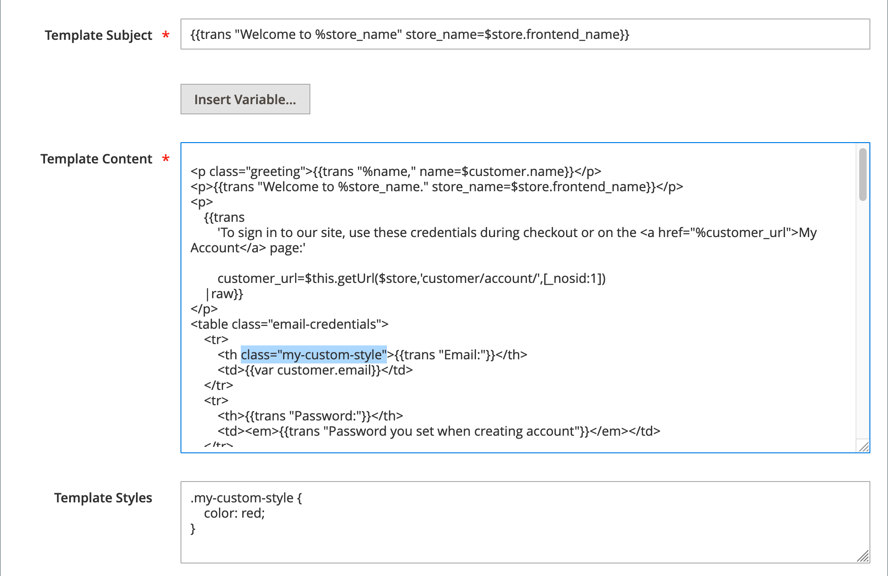

# E-Mail-Vorlagen anpassen

Commerce enthält eine Standard-E-Mail-Vorlage für den Hauptteil jeder vom System gesendeten Nachricht. Die Vorlage für den Textinhalt wird mit der Kopf- und Fußzeilenvorlage kombiniert, um die gesamte Nachricht zu erstellen. Der Inhalt ist mit HTML und CSS formatiert und kann einfach bearbeitet und durch Hinzufügen angepasst werden [variables](variables-predefined.md) und [Widgets](../content-design/widgets.md). E-Mail-Vorlagen können für jede Website-, Store- oder Store-Ansicht angepasst werden. Wenn Sie benutzerdefinierte Vorlagen verwenden, aktualisieren Sie die [Systemkonfiguration](email-templates.md#configure-email-templates) um sicherzustellen, dass die richtige Vorlage verwendet wird.

{width="500" zoomable="yes"}

Die Standardvorlagen enthalten Ihr Logo und Ihre Store-Informationen und können ohne weitere Anpassung verwendet werden. Als Best Practice sollten Sie jedoch jede Vorlage anzeigen und alle erforderlichen Änderungen vornehmen, bevor Sie sie an Kunden senden.

- [Kopfzeilenvorlage](email-template-custom.md#header-template)
- [Fußzeilenvorlage](email-template-custom.md#footer-template)
- [Nachrichtenvorlagen](email-template-custom.md#message-templates)

{width="700" zoomable="yes"}

## Vorlageninformationen

| Feld | Beschreibung |
| ----- | ----------- |
| [!UICONTROL Template Name] | Der Name Ihrer benutzerdefinierten Vorlage. |
| [!UICONTROL Insert Variable] | Fügt eine Variable an der Cursorposition in die Vorlage ein. |
| [!UICONTROL Template Subject] | Der Vorlagenbetreff wird in der Spalte Betreff angezeigt und kann zum Sortieren und Filtern der Vorlagen in der Liste verwendet werden. |
| [!UICONTROL Template Content] | Der Inhalt der Vorlage in HTML. |
| [!UICONTROL Template Styles] | Alle CSS-Stildeklarationen, die zum Formatieren der Vorlage erforderlich sind, können im _[!UICONTROL Template Styles]_ankreuzen. |

{style="table-layout:auto"}

## Kopfzeilenvorlage

Nach Abschluss der [Konfiguration](email-templates.md#configure-email-templates)enthält die E-Mail-Header-Vorlage Ihr Logo, das mit Ihrem Store verknüpft ist. Wenn Sie Grundkenntnisse im HTML haben, können Sie einfach [vordefinierte Variablen](variables-predefined.md) , um Kontaktinformationen zum Store zum Header hinzuzufügen.

### Schritt 1. Laden der Standardvorlage

1. Im _Admin_ Seitenleiste, navigieren Sie zu **[!UICONTROL Marketing]** > _[!UICONTROL Communications]_>**[!UICONTROL Email Templates]**.

1. Klicken **[!UICONTROL Add New Template]**.

1. Im **[!UICONTROL Load default template]** klicken Sie auf die **[!UICONTROL Template]** auswählen `Magento_Email` > `Header`.

   {width="600" zoomable="yes"}

1. Klicken **[!UICONTROL Load Template]**.

   Der HTML-Code und die Variablen aus der Vorlage werden im Formular angezeigt.

### Schritt 2. Vorlage anpassen

1. Geben Sie die **[!UICONTROL Template Name]** für Ihre benutzerdefinierte Kopfzeile.

1. Geben Sie einen **[!UICONTROL Template Subject]** um die Vorlagen zu organisieren.

   Im Raster kann die Liste der Vorlagen nach der _[!UICONTROL Subject]_Spalte.

   {width="600" zoomable="yes"}

1. Im **[!UICONTROL Template Content]** ändern Sie die HTML nach Bedarf.

   >[!NOTE]
   >
   >Achten Sie bei der Arbeit mit dem Vorlagencode darauf, keine doppelten Klammern zu überschreiben.

1. So fügen Sie eine [Variable](variables-reference.md)platzieren Sie den Cursor in den Code, in dem Sie die Variable platzieren möchten, und klicken Sie auf **[!UICONTROL Insert Variable]**.

1. Wählen Sie die einzufügende Variable aus.

   {width="600" zoomable="yes"}

   Wenn eine Variable ausgewählt wird, wird eine [Markup-Tag](markup-tags.md) für die Variable im Code eingefügt.

   Auch wenn die Variablen &quot;E-Mail-Adresse speichern&quot;am häufigsten in der Kopfzeile enthalten sind, können Sie den Code für jedes System oder [benutzerdefinierte Variable](variables-custom.md) direkt in die Vorlage ein.

1. Wenn Sie CSS-Deklarationen vornehmen müssen, geben Sie die Stile in die **[!UICONTROL Template Styles]** ankreuzen.

1. Wenn Sie bereit sind, Ihre Arbeit zu überprüfen, klicken Sie auf **[!UICONTROL Preview Template]**.

   Nehmen Sie die erforderlichen Änderungen an der Vorlage vor.

1. Wenn Sie fertig sind, klicken Sie auf **[!UICONTROL Save Template]**.

   Ihr benutzerdefinierter Header wird nun in der Liste der verfügbaren E-Mail-Vorlagen angezeigt.

### Schritt 3. Konfiguration aktualisieren

1. Im _Admin_ Seitenleiste, navigieren Sie zu **[!UICONTROL Content]** > _[!UICONTROL Design]_>**[!UICONTROL Configuration]**.

1. Suchen Sie im Raster nach der Store-Ansicht, die Sie konfigurieren möchten, und klicken Sie auf **[!UICONTROL Edit]** im _[!UICONTROL Action]_Spalte.

1. Hinunter scrollen und erweitern  die **[!UICONTROL Transactional Emails]** Abschnitt.

1. Wählen Sie die **[!UICONTROL Header Template]** wird als Standard für E-Mail-Benachrichtigungen verwendet.

1. Wenn Sie fertig sind, klicken Sie auf **[!UICONTROL Save Config]**.

{width="600" zoomable="yes"}

## Fußzeilenvorlage

Die Fußzeile der E-Mail-Vorlage enthält die schließende Zeile und die Unterschriftszeile der E-Mail-Nachricht. Sie können das Schließen an Ihren Stil anpassen und zusätzliche Informationen hinzufügen, wie z. B. den Firmennamen und die Adresse unter Ihrem Namen.

### Schritt 1. Laden der Standardvorlage

1. Im _Admin_ Seitenleiste, navigieren Sie zu **[!UICONTROL Marketing]** > _[!UICONTROL Communications]_>**[!UICONTROL Email Templates]**.

1. Klicken **[!UICONTROL Add New Template]**.

1. Im **[!UICONTROL Load default template]** klicken Sie auf die **[!UICONTROL Template]** auswählen `Magento_Email` > `Footer`.

1. Klicken **[!UICONTROL Load Template]**.

   Der HTML-Code und die Variablen aus der Vorlage werden im Formular angezeigt.

### Schritt 2. Vorlage anpassen und in der Vorschau anzeigen

1. Geben Sie die **[!UICONTROL Template Name]** für Ihre benutzerdefinierte Fußzeile.

1. Geben Sie einen **[!UICONTROL Template Subject]** um die Vorlagen zu organisieren.

   Im Raster können die Vorlagen nach der _[!UICONTROL Subject]_Spalte.

   {width="600" zoomable="yes"}

1. Im **[!UICONTROL Template Content]** ändern Sie die HTML nach Bedarf.

   >[!NOTE]
   >
   >Achten Sie bei der Arbeit mit dem Vorlagencode darauf, keine doppelten Klammern zu überschreiben.

1. So fügen Sie eine [Variable](variables-reference.md)platzieren Sie den Cursor in den Code, in dem Sie die Variable platzieren möchten, und klicken Sie auf **[!UICONTROL Insert Variable]**.

1. Wählen Sie die einzufügende Variable aus.

   Wenn eine Variable ausgewählt wird, wird eine [Markup-Tag](markup-tags.md) für die Variable im Code eingefügt.

   Auch wenn die Variablen Store Contact am häufigsten in der Fußzeile enthalten sind, können Sie den Code für jedes System eingeben oder [benutzerdefinierte Variable](variables-custom.md) direkt in die Vorlage ein.

1. Wenn Sie CSS-Deklarationen vornehmen müssen, geben Sie die Stile in die **[!UICONTROL Template Styles]** ankreuzen.

### Schritt 3. Konfiguration aktualisieren

1. Im _Admin_ Seitenleiste, navigieren Sie zu **[!UICONTROL Content]** > _[!UICONTROL Design]_>**[!UICONTROL Configuration]**.

1. Suchen Sie im Raster nach der Store-Ansicht, die Sie konfigurieren möchten, und klicken Sie auf **[!UICONTROL Edit]** im _[!UICONTROL Action]_Spalte.

1. Hinunter scrollen und erweitern  die **[!UICONTROL Transactional Emails]** Abschnitt.

1. Wählen Sie die **[!UICONTROL Footer Template]** wird als Standardfußzeile in E-Mail-Benachrichtigungen verwendet.

1. Wenn Sie fertig sind, klicken Sie auf **[!UICONTROL Save Config]**.

{width="600" zoomable="yes"}

## Nachrichtenvorlagen

Der Prozess der Anpassung des Hauptteils jeder Nachricht entspricht dem der Kopf- oder Fußzeile. Der einzige Unterschied besteht in der Nachrichtenvorlage für jede Aktivität oder jedes Ereignis, bei der eine Benachrichtigung Trigger wird. Sie können die Vorlagen unverändert verwenden oder sie an Ihre Stimme und Marke anpassen. Neben dem Vorlagentext gibt es eine große Auswahl an zulässigen [vordefiniert](variables-predefined.md) Variablen und [custom](variables-custom.md) Variablen, die Sie erstellen und in die Vorlage integrieren können.

### Schritt 1. Laden der Standardvorlage

1. Im _Admin_ Seitenleiste, navigieren Sie zu **[!UICONTROL Marketing]** > _[!UICONTROL Communications]_>**[!UICONTROL Email Templates]**.

1. Klicken **[!UICONTROL Add New Template]**.

   {width="600" zoomable="yes"}

1. Gehen Sie wie folgt vor:

   - under **[!UICONTROL Load default template]**, wählen Sie die **[!UICONTROL Template]** , die Sie anpassen möchten.

   - Klicken **[!UICONTROL Load Template]**.

### Schritt 2. Vorlage anpassen

1. Für **[!UICONTROL Template Name]** Geben Sie einen Namen für Ihre benutzerdefinierte Vorlage ein.

1. Ändern Sie bei Bedarf die **[!UICONTROL Template Subject]**.

   Dies ist die erste Zeile der Nachricht, die standardmäßig als Anrede bezeichnet wird. Sie können es wie besehen lassen oder eine aussagekräftigere Eingabe vornehmen.

1. Beachten Sie die **[!UICONTROL Currently Used For]** Pfad zur Vorlage, die den Pfad zum Aktualisieren der Konfiguration darstellt.

   {width="600" zoomable="yes"}

1. Im **[!UICONTROL Template Content]** ändern Sie die HTML nach Bedarf.

   Der Inhalt besteht aus einer Kombination aus HTML-Tags, CSS-Anweisungen, Variablen und Text.

   >[!NOTE]
   >
   >Achten Sie bei der Arbeit mit dem Vorlagencode darauf, nicht versehentlich den Code einzugeben, der in doppelte Klammern eingeschlossen ist.

1. Um eine Variable einzufügen, positionieren Sie den Cursor im Code an der Stelle, an der die Variable angezeigt werden soll.

   Die Variablenauswahl variiert je nach Vorlage und umfasst die zulässigen [vordefiniert](variables-predefined.md) und [custom](variables-custom.md) Variablen, falls verfügbar.

1. Klicks **[!UICONTROL Insert Variable]** und wählen Sie die einzufügende Variable aus.

   Ein Befehl zum Einfügen der Variablen ist in geschweifte Klammern eingeschlossen und dem Code an der Cursorposition hinzugefügt. Beispiel:

   `customVar code=my_custom_variable`

1. Um CSS-Deklarationen vorzunehmen, geben Sie die Stile in **[!UICONTROL Template Styles]**.

   {width="600" zoomable="yes"}

   >[!NOTE]
   >
   >Benutzerdefinierte Stile werden nur dann auf die E-Mail angewendet, wenn `{{template config_path="design/email/header_template"}}` ist im _[!UICONTROL Template Styles]_. Um benutzerdefinierte CSS ohne standardmäßige Kopfzeilenvorlage zu verwenden, müssen Sie sie hier im `<style>` HTML-Tag.

### Schritt 3. Konfiguration aktualisieren

Die _[!UICONTROL Currently Used For]_Breadcrumb-Pfad zeigt an, wo die Vorlage verwendet wird. In diesem Beispiel befindet sich die Vorlagenkonfiguration im_[!UICONTROL Customer Configuration]_ in der _[!UICONTROL Create New Account Options]_und im Abschnitt_[!UICONTROL Default Welcome Email]_ -Feld.

- Seite - [!UICONTROL Customer Configuration]
- Abschnitt - [!UICONTROL Create New Account Options]
- Feld - [!UICONTROL Default Welcome Email]

1. Im **[!UICONTROL Currently Used For]** Breadcrumb-Pfad klicken Sie auf den Link, um die Seite mit der Vorlagenkonfiguration zu öffnen.

   {width="600" zoomable="yes"}

1. Erweitern  und suchen Sie das Feld für die von Ihnen angepasste E-Mail-Vorlage.

1. Löschen Sie die **[!UICONTROL Use system value]** und klicken Sie auf den Namen Ihrer benutzerdefinierten Vorlage.

   {width="600" zoomable="yes"}

1. Wenn Sie fertig sind, klicken Sie auf **[!UICONTROL Save Config]**.

1. Klicken Sie in der Meldung oben im Arbeitsbereich auf **[!UICONTROL Cache Management]** und leeren Sie alle ungültigen Cache.

### Schritt 4. Vorschau erstellen und speichern

1. Wenn Sie bereit sind, Ihre Arbeit zu überprüfen, klicken Sie auf **[!UICONTROL Preview Template]**.

1. Aktualisieren Sie die Vorlage nach Bedarf.

1. Wenn Sie fertig sind, klicken Sie auf **[!UICONTROL Save Template]**.

   Ihre benutzerdefinierte Vorlage ist jetzt in der Liste der E-Mail-Vorlagen verfügbar.
