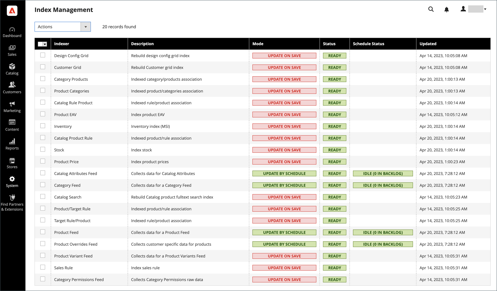

# Indexverwaltung

Adobe Commerce und Magento Open Source indizieren automatisch neu, wenn sich ein oder mehrere Elemente ändern. Zu den Aktionen, die eine Neuindizierung von Triggern ermöglichen, gehören Preisänderungen, das Erstellen von Preisregeln für Kataloge oder Warenkörbe, das Hinzufügen neuer Kategorien usw. Um die Leistung zu optimieren, sammelt Commerce Daten mithilfe von Indexern in speziellen Tabellen. Wenn sich die Daten ändern, müssen die indizierten Tabellen aktualisiert - oder neu indiziert werden. Commerce indiziert als Hintergrundprozess neu, und Ihr Store bleibt während der Prozesse zugänglich.

Die Neuindizierung von Daten beschleunigt die Verarbeitung und verkürzt die Wartezeit des Kunden. Wenn Sie beispielsweise den Preis eines Artikels von 4,99 USD auf 3,99 USD ändern, indiziert Commerce die Daten neu, um die Preisänderung im Store anzuzeigen. Ohne Indizierung müsste Commerce den Preis jedes Produkts laufend berechnen. Dazu gehören Preisregeln für Warenkörbe, Paketpreise, Rabatte, Preisstufen usw. Das Laden des Preises für ein Produkt kann länger dauern, als der Kunde bereit ist zu warten.

Die Indexer können so eingestellt werden, dass sie entweder beim Speichern oder planmäßig aktualisiert werden. Alle Indizes können eine der beiden Optionen verwenden, mit Ausnahme des Kundenrasters, das nur beim Speichern unterstützt. Beim Indizieren von Speicheraktionen startet Commerce eine Neuindizierung von Speicheraktionen. Die Seite „Indexverwaltung“ schließt die Aktualisierung ab und leert den Cache, wobei die Neuindizierungsmeldung innerhalb von ein bis zwei Minuten angezeigt wird. Bei der Neuindizierung nach einem Zeitplan wird eine Neuindizierung nach einem Zeitplan als Cron-Auftrag ausgeführt. Eine Systemmeldung wird angezeigt, wenn kein [Cron-Auftrag](cron.md) verfügbar ist, um ungültig werdende Indexer zu aktualisieren. Ihr Store bleibt während der Neuindizierungsprozesse verfügbar.

>[!NOTE]
> Adobe Commerce-Händler, die die Live-Suche, den Katalog-Service oder Produktempfehlungen verwenden, haben die Möglichkeit, einen [SaaS-basierten Preisindizer“ ](https://experienceleague.adobe.com/en/docs/commerce/price-indexer/price-indexing) verwenden.

Wenn eine Neuindizierung erforderlich ist, wird oben auf der Seite eine Benachrichtigung angezeigt. Der Index und die Nachricht werden je nach Neuindizierungsmodus und den von Ihnen durchgeführten potenziellen Aktionen gelöscht. Weitere Informationen zur Indizierung finden Sie unter [Wie die Anwendung die Indizierung implementiert](https://developer.adobe.com/commerce/php/development/components/indexing/#how-the-application-implements-indexing) im _PHP-Entwicklerhandbuch_.

{width="700" zoomable="yes"}

- Die Indexverwaltung bietet eine etwas andere Darstellung für flache Produktkataloge.
- Um Probleme zu vermeiden, wenn mehrere Admin-Benutzerinnen oder -Benutzer Objekte aktualisieren, die Trigger für die automatische Neuindizierung sind, wird empfohlen, für alle Indexer die Ausführung planmäßig als [Cron-Aufträge](cron.md) festzulegen. Andernfalls kann jedes Mal, wenn ein Objekt gespeichert wird, jedes Objekt mit Interdependenzen zu einem Deadlock führen. Zu den Symptomen eines Deadlocks gehören eine hohe CPU-Nutzung und MySQL-Fehler. Als Best Practice wird empfohlen, die geplante Indizierung zu verwenden.
-  (nur Adobe Commerce) Standardmäßig werden Admin-Aktionen, wie z. B. eine Neuindizierung, vom System protokolliert und können im Bericht [Aktionsprotokolle“ angezeigt ](action-log-report.md). Die Aktionsprotokollierung kann in den erweiterten Admin[Einstellungen Ihres Stores unter ](action-log.md)Admin-Aktionsprotokollierung“ konfiguriert werden.

## Best Practices für die Neuindizierung

Neuindizierung und Caching haben in Commerce unterschiedliche Zwecke. Indizes verfolgen Datenbankinformationen, um die Suchleistung zu erhöhen, den Datenabruf für Storefronts zu beschleunigen und vieles mehr. [Caches](cache-management.md) Speichern geladener Daten, Bilder, Formate und dergleichen, um das Laden und Zugreifen auf die Storefront zu verbessern.

- Normalerweise sollten Sie beim Aktualisieren von Daten in Commerce eine Neuindizierung durchführen.
- Wenn Sie einen großen oder mehrere Stores haben, sollten Sie Indexer wie Kategorie und Produkte aufgrund der Möglichkeit der Neuindizierungs-Schleife auf geplante Cron-Aufträge setzen. Möglicherweise möchten Sie die Neuindizierung außerhalb der Spitzenzeiten nach einem Zeitplan festlegen.
- Bei der Neuindizierung müssen Sie nicht auch einen Leer-Cache ausführen.
- Bei neuen Commerce-Installationen müssen Sie den Cache leeren und neu indizieren.
- Durch Leeren von Caches und Neuindizierung wird der Webbrowser-Cache Ihres Computers nicht geleert. Löschen Sie den Browser-Cache, nachdem Sie Aktualisierungen an Ihrer Storefront abgeschlossen haben.

## Ändern des Indexmodus

>[!IMPORTANT]
>
>Für Stores, die [Adobe Commerce B2B](https://experienceleague.adobe.com/docs/commerce-admin/b2b/introduction.html) verwenden und Elasticsearch als Volltext(`catalogsearch_fulltext`)-Indexer festgelegt haben: Der Volltext-Index muss nach jeder Massenberechtigungsänderung erneut ausgeführt werden oder wenn sich der Indexer „Berechtigungen“ im Modus „Geplant“ befindet.

1. Navigieren Sie in _Admin_-Seitenleiste zu **[!UICONTROL System]** > _[!UICONTROL Tools]_>**[!UICONTROL Index Management]**.

1. Aktivieren Sie das Kontrollkästchen für jeden Indexer, den Sie ändern möchten.

1. Legen Sie **[!UICONTROL Actions]** auf eine der folgenden Einstellungen fest:

   - `Update on Save`
   - `Update by Schedule`
   - `Invalidate index`

     >[!IMPORTANT]
     >
     >Das [!DNL Customer Grid] Indexerverhalten hat sich in Version 2.4.8 geändert:
     >
     >- **Vor 2.4.8**: Der [!DNL Customer Grid]-Indexer kann nur mithilfe der Option &quot;[!UICONTROL Update on Save]&quot; neu indiziert werden und unterstützt die Option &quot;[!UICONTROL Update by Schedule]&quot; nicht.
     >- **2.4.8 und höher**: Der [!DNL Customer Grid] Indexer unterstützt sowohl [!UICONTROL Update on Save]- als auch [!UICONTROL Update by Schedule] Modi und [!UICONTROL Update by Schedule] standardmäßig.

1. Klicken Sie auf **[!UICONTROL Submit]** , um die Änderung auf jeden ausgewählten Indexer anzuwenden.

   **Indexverwaltungsspalten**

   | Spalte | Beschreibung |
   | ------ |---------------------------------------------------------------------------------------------------------------------------------------------------------------------------------------------------------------------------------------------------------------------------------------------------------------------------------------------------------------------------------------------------------------------------------------------------------------------------------------------------------------------------------------------------------------------------------------------------------------------------------------------------------|
   | [!UICONTROL Indexer] | Der Name des Indexers. |
   | [!UICONTROL Description] | Eine Beschreibung des Indexers. |
   | [!UICONTROL Mode] | Gibt den aktuellen Aktualisierungsmodus für jeden Indexer an. Optionen:  **[!UICONTROL Update on Save]**- Der Index wird so eingestellt, dass er bei jeder Entitätsänderung aktualisiert wird. Zu diesen Entitäten gehören Produkte, Kategorien und Kunden. Wenn die Speicheraktion abgeschlossen ist, beginnt eine Reihe von Schritten, die Änderungen abzufangen und den Index zu aktualisieren. Die Seite „Indexverwaltung“ wird aktualisiert und die Neuindizierungsmeldung wird innerhalb von ein bis zwei Minuten geleert. **[!UICONTROL Update on Schedule]** - Der Index ist so eingestellt, dass er planmäßig gemäß einem [Cron-Auftrag“ aktualisiert ](cron.md). Der Cron-Auftrag umfasst das Zeitplanintervall für die Neuindizierung, wobei bei der Ausführung Aktualisierungen in den Index geschrieben werden. |
   | [!UICONTROL Schedule Status] | Zeigt die Aktualisierungen des Zeitplanstatus an. |
   | [!UICONTROL Status] | Zeigt eine der folgenden Optionen an:  **[!UICONTROL Ready]**- Der Index ist auf dem neuesten Stand. **[!UICONTROL Suspended]** - Die Neuindizierung wurde angehalten.  **[!UICONTROL Processing]**- Die Neuindizierung wird derzeit ausgeführt. **[!UICONTROL Reindex Required]** - Es wurde eine Änderung vorgenommen, die neu indiziert werden muss, aber die Indexer können nicht automatisch aktualisiert werden. Überprüfen Sie, ob [cron](cron.md) verfügbar und korrekt konfiguriert ist. |
   | [!UICONTROL Updated] | Gibt das Datum und die Uhrzeit der letzten Aktualisierung eines Index an. |

   {style="table-layout:auto"}

## Neuindizieren über die Befehlszeile

Commerce bietet zusätzliche Neuindizierungsoptionen über die Befehlszeile. Umfassende Details und Befehlsoptionen finden Sie unter [Neuindizieren](https://experienceleague.adobe.com/docs/commerce-operations/configuration-guide/cli/manage-indexers.html#reindex){:target="blank"} im _Konfigurationshandbuch_.

## Trigger-Ereignisse indizieren

## Neuindizierung von Trigger

| Indextyp | Neuindizierungsereignis |
| ---------- | ---------------- |
| [!UICONTROL Product Prices] | Kundengruppen-Konfigurationseinstellungen   |
| [!UICONTROL Flat catalog product data] | store add store group add, edit, or delete attribute (for searching and filters) |
| [!UICONTROL Flat catalog category data] | store add store group add, edit, or delete attribute (for searching and filters) |
| [!UICONTROL Catalog category/product index] | Hinzufügen, Bearbeiten oder Löschen von Produkten (Einzel-, Massen- und Importprodukte) Ändern von Produkt-zu-Kategorie-Beziehungen  Hinzufügen, Bearbeiten oder Löschen von Kategorien  Hinzufügen oder Löschen von Stores Löschen von Store-Gruppen Löschen von Websites |
| [!UICONTROL Catalog search index] | Produkte hinzufügen, bearbeiten oder löschen (Einzel-, Massen- und Importprodukte) Stores hinzufügen oder löschen Store-Gruppen löschen Websites löschen |
| [!UICONTROL Stock status index] | Ändern der Inventarkonfigurationseinstellungen. |
| [!UICONTROL Category permissions index] | store add store group add, delete, or update attribute (für die Suche und Filterung) |

{style="table-layout:auto"}

>[!IMPORTANT]
>
>Die Verwendung eines flachen Katalogs wird nicht mehr als Best Practice empfohlen. Es ist bekannt, dass die kontinuierliche Verwendung dieser Funktion zu Leistungseinbußen und anderen Indizierungsproblemen führt. Weitere Informationen finden [ unter „Verwenden ](../catalog/catalog-flat.md) flachen Katalogprodukts“.

## Indexaktionen und -kontrollen

| Aktion | Ergebnis | Kontrollen |
| ------ | ------ | -------- |
| Erstellen eines Stores, einer neuen Kundengruppe oder einer beliebigen Aktion, die in `Actions that Cause a Full Reindex` aufgeführt ist | Vollständige Neuindizierung | Die vollständige Neuindizierung erfolgt nach dem Zeitplan, der von Ihrem Adobe Commerce- oder Magento Open Source-Cron-Auftrag festgelegt wird. |
| Massenladen von Elementen (Commerce-Import/Export, direkte SQL-Abfrage und alle anderen Methoden, mit denen Daten direkt hinzugefügt, geändert oder gelöscht werden) | Teilweise Neuindizierung (nur geänderte Elemente werden neu indiziert) | Mit der von Ihrem Commerce Cron-Auftrag festgelegten Häufigkeit. |
| Ändern des Umfangs (z. B. von global zu website) | Teilweise Neuindizierung (nur geänderte Elemente werden neu indiziert) | Mit der von Ihrem Commerce Cron-Auftrag festgelegten Häufigkeit. |

{style="table-layout:auto"}

## Ereignisse mit Trigger einer vollständigen Neuindizierung

| Indexer | Ereignis |
| ------- | ----- |
| [!UICONTROL Catalog Category Flat Indexer] | Webstore erstellen Webstore-Ansicht erstellen Erstellen oder löschen eines der folgenden Attribute: - Durchsuchbar oder in der erweiterten Suche sichtbar -  - Durchsuchbar - Zum Sortieren verwendet Vorhandenes Attribut ändern, um eines der vorherigen Attribute zu sein. Optionen für flache Storefronts der Kategorie aktivieren |
| [!UICONTROL Catalog Product Flat Indexer] | Webstore erstellen Webstore-Ansicht erstellen Erstellen oder löschen eines der folgenden Attribute: - Durchsuchbar oder in der erweiterten Suche sichtbar -  - Durchsuchbar - Zum Sortieren verwendet  Vorhandenes Attribut ändern, um eines der vorherigen zu sein. Optionen für flache Storefronts der Kategorie aktivieren |
| [!UICONTROL Stock status indexer] | Wenn die folgenden _Kataloginventaroptionen_ sich in der Systemkonfiguration ändern: `Stock Options` - Nicht vorrätige Produkte anzeigen `Product Stock Options` - Lager verwalten |
| [!UICONTROL Price Indexer] | Hinzufügen einer Kundengruppe. Wenn sich eine der folgenden Kataloginventaroptionen in der Systemkonfiguration ändert: `Stock Options` - Nicht vorrätige Produkte anzeigen `Product Stock Options` - Lager verwalten `Price` - Katalogpreisbereich |
| [!UICONTROL Category or Product Indexer] | Shop-Ansicht erstellen oder löschen  Shop löschen Website löschen |

{style="table-layout:auto"}
