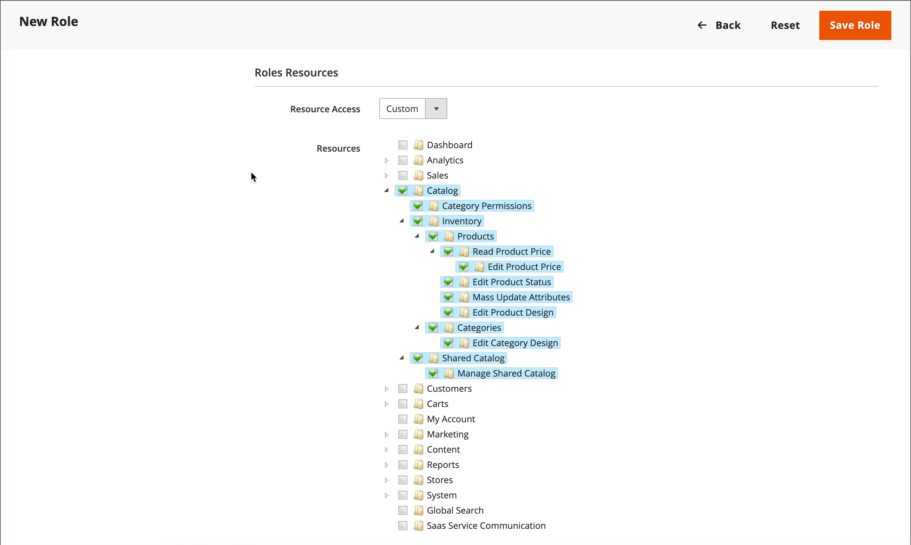

# Benutzerrollen

Um jemandem eingeschränkten Zugriff auf den Administrator zu gewähren, muss zunächst eine Rolle mit den entsprechenden Berechtigungen erstellt werden. Nachdem die Rolle gespeichert wurde, können Sie neue Benutzer hinzufügen und ihnen die eingeschränkte Rolle zuweisen, um ihnen eingeschränkten Zugriff auf den Admin zu gewähren.

{width="600" zoomable="yes"}

## Definieren einer Rolle

1. Navigieren Sie in _Admin_-Seitenleiste zu **[!UICONTROL System]** > _[!UICONTROL Permissions]_>**[!UICONTROL User Roles]**.

1. Klicken Sie oben rechts auf **[!UICONTROL Add New Role]**.

1. Führen Sie die Schritte aus, um die Rolle zu definieren:

### Schritt 1: Rollennamen hinzufügen

1. Geben Sie unter _[!UICONTROL Role Information]_&#x200B;einen beschreibenden **[!UICONTROL Role Name]**&#x200B;ein.

1. Geben Sie unter _[!UICONTROL Current User Identity Verification]_&#x200B;Ihr Kennwort ein.

   {width="600" zoomable="yes"}

### Schritt 2: Ressourcen zuweisen

>[!IMPORTANT]
>
>Stellen Sie bei der Zuweisung von Ressourcen sicher, dass Sie den Zugriff auf das Berechtigungs-Tool deaktivieren, wenn Sie den Zugriff für eine bestimmte Rolle einschränken. Andernfalls können Benutzende ihre eigenen Berechtigungen ändern.

1. Legen Sie **[!UICONTROL Role Scopes]** auf eine der folgenden Einstellungen fest:

   - `All`
   - `Custom`

   Wenn für eine Multisite-Installation `Custom` festgelegt ist, aktivieren Sie das Kontrollkästchen der Website und speichern Sie, wo die Rolle verwendet werden soll.

   {width="600" zoomable="yes"}

   >[!NOTE]
   >
   >Benutzer mit einem `Custom` Rollenbereich können keine Websites und Kategorien erstellen, Produkte Kategorien zuweisen oder Produkte _[!UICONTROL All Store Views]_&#x200B;Bereich bearbeiten, wenn sie eingeschränkten Stores zugewiesen sind. Diese Benutzenden können auch keine anderen_ globalen _Aktionen ausführen, die Bereiche betreffen, auf die sie keinen Zugriff haben.

1. Legen Sie unter _[!UICONTROL Roles Resources]_&#x200B;**[!UICONTROL Resource Access]**&#x200B;auf `Custom` fest.

   >[!NOTE]
   >
   >Wenn für die Anmeldung beim Administrator eine Zwei-Faktor-Authentifizierung (2FA) erforderlich ist, stellen Sie sicher, dass Sie für diese Rolle die `Permissions` Ressource > `Two Factor Auth` aktivieren. Andernfalls können neu erstellte Benutzer mit diesem `Custom` Rollenbereich 2FA nicht einrichten, wenn sie zum ersten Mal auf Admin zugreifen.

1. Aktivieren Sie in der **[!UICONTROL Resource]** das Kontrollkästchen jeder Admin-Funktion, auf die die Rolle zugreifen kann.

   Um eine Administratorrolle mit Zugriff auf Steuereinstellungen zu erstellen, wählen Sie sowohl die Ressourcen „Umsatz/Steuer“ als auch „System/Steuer“ aus. Wenn Sie eine Website für eine Region einrichten, die sich von Ihrem standardmäßigen [Versand-Ausgangspunkt](../stores-purchase/shipping-settings.md#point-of-origin) unterscheidet, müssen Sie den Zugriff auf das System/die Versandressourcen für die Rolle zulassen. Die Versandeinstellungen bestimmen den Store-Steuersatz, der für Katalogpreise verwendet wird.

   {width="600" zoomable="yes"}

   Die Liste der verfügbaren Berechtigungen kann zusätzliche Optionen für gebündelte und installierte Erweiterungen enthalten. Durch Auswahl der Berechtigung, die für jede Funktion am höchsten ist, weisen Sie alle für den Benutzer verfügbaren Berechtigungen zu.

   >[!NOTE]
   >
   >Ein Administrator bzw. eine Administratorin muss über **[!UICONTROL Sales / Archive]** Berechtigungen für den Rollenbereich verfügen, um die _[!UICONTROL Invoices]_,_[!UICONTROL Credit Memos]_ und _[!UICONTROL Shipments]_&#x200B;Reihenfolge ([) &#x200B;](../stores-purchase/order-processing.md).

1. Klicken Sie abschließend auf **[!UICONTROL Save Role]**.

   Die Rolle wird jetzt im Raster angezeigt und kann Benutzerkonten zugewiesen werden.

## Zuweisen einer Rolle zu Benutzern

1. Öffnen Sie den Datensatz im _[!UICONTROL Roles]_&#x200B;im Bearbeitungsmodus.

1. Geben Sie unter _[!UICONTROL Current User Identity Verification]_&#x200B;Ihr Benutzerkonto-Kennwort ein.

1. Wählen Sie im linken Bedienfeld **[!UICONTROL Role Users]** aus.

   Die Option _[!UICONTROL Role Users]_&#x200B;wird erst nach dem Speichern einer neuen Rolle angezeigt.

   {width="600" zoomable="yes"}

1. Gehen Sie wie folgt vor, um nach einem bestimmten Benutzerdatensatz zu suchen:

   - Geben Sie den Wert im Suchfilter oben in einer Spalte ein und drücken Sie die **Eingabetaste**.

   - Wenn Sie bereit sind, zur vollständigen Liste zurückzukehren, klicken Sie **[!UICONTROL Reset Filter]**.

1. Aktivieren Sie das Kontrollkästchen aller Benutzer, die der Rolle zugewiesen werden sollen.

1. Klicken Sie auf **[!UICONTROL Save Role]**.

## Bearbeiten einer Rolle

1. Navigieren Sie in _Admin_-Seitenleiste zu **[!UICONTROL System]** > _[!UICONTROL Permissions]_>**[!UICONTROL User Roles]**.

1. Suchen Sie die Rolle mithilfe von Filtern über dem Raster und klicken Sie auf den Rollennamen.

1. Nehmen Sie die erforderlichen Änderungen vor.

   Informationen zu den Rolleneinstellungen finden Sie in den Schritten zum Erstellen einer Benutzerrolle .

1. Geben Sie bei Aufforderung Ihr Kennwort ein, um Ihre Identität zu bestätigen.

1. Klicken Sie auf die **[!UICONTROL Save Role]**.

## Löschen einer Rolle

1. Navigieren Sie in _Admin_-Seitenleiste zu **[!UICONTROL System]** > _[!UICONTROL Permissions]_>**[!UICONTROL User Roles]**.

1. Suchen Sie die Rolle mithilfe von Filtern über dem Raster und öffnen Sie sie im Bearbeitungsmodus.

1. Klicken Sie oben rechts auf **[!UICONTROL Delete Role]**.

1. Um die Aktion zu bestätigen, klicken Sie auf **[!UICONTROL OK]**.

## Demo zu Benutzerrollen

In diesem Video erfahren Sie mehr über die Verwaltung von Benutzerrollen:

>[!VIDEO](https://video.tv.adobe.com/v/343654?quality=12&learn=on)

## Rollenressourcen

Der Zugriff auf die folgenden Ressourcen kann einer benutzerdefinierten Rolle zugewiesen werden. Weitere Informationen zu den Funktionen, die mit den einzelnen Ressourcen verknüpft sind, finden Sie auf der verknüpften Seite .

 - nur Adobe Commerce

 - Nur in Adobe Commerce B2B verfügbar

| Ressource |   |   |
| --- | --- | --- |
| [`Dashboard`](../getting-started/admin-dashboard.md) |  |  |
| [`Sales`](../stores-purchase/sales-menu.md) | [`Operations`](../stores-purchase/orders.md) |  |
|  | [`Quotes`](../b2b/quotes.md)   [`Orders`](../stores-purchase/orders.md) [`Invoices`](../stores-purchase/invoices.md) [`Shipments`](../stores-purchase/shipments.md) [`Credit Memos`](../stores-purchase/credit-memos.md) [`Billing Agreements`](../stores-purchase/paypal-billing-agreements.md) [`Returns`](../stores-purchase/returns.md)  [`Transactions`](../stores-purchase/transactions.md) |
|  | [`Archive`](action-log-archive.md)![Adobe Commerce] |  |
|  | [`Shopping Cart Management`](../stores-purchase/cart.md) |  |
| [`Catalog`](../catalog/catalog-menu.md) | [`Category Permissions`](../catalog/categories.md)  |  |
|  | [`Inventory`](../inventory-management/introduction.md) | [`Products`](../catalog/products-list.md) [`Categories`](../catalog/categories.md) |
|  | [`Shared Catalog`](../b2b/catalog-shared-create.md)  | [`Manage Shared Catalog`](../b2b/catalog-shared-manage.md) |
| [`Customers`](../customers/guide-overview.md) | [`All Customers`](../customers/customers-all.md) [`Now Online`](../customers/now-online.md) [`Customer Groups`](../customers/customer-groups.md) [`Segments`](../customers/customer-segments.md)  |  |
|  | [`Login as Customer`](../customers/login-as-customer.md) | `Allow Login as Customer Button` `View Login as Customer Log`  |
|  | [`Companies`](../b2b/account-companies.md)  | [`Manage Companies`](../b2b/account-company-manage.md)  `Add New Company`  `Delete Company`  `Reimburse Balance` |
| [`Carts`](../stores-purchase/shopping-assisted-cart-manage.md) | [`Manage carts`](../stores-purchase/shopping-assisted-cart-manage.md) |  |
| [`My Account`](../customers/account-dashboard-my-account.md) |  |  |
| [`Marketing`](../merchandising-promotions/marketing-menu.md) | [`Promotions`](../merchandising-promotions/marketing-menu.md#uicontrol-promotions) | [`Catalog Price Rule`](../merchandising-promotions/price-rules-catalog.md)  [`Cart Price Rules`](../merchandising-promotions/price-rules-cart.md)  [`Related Products Rules`](../merchandising-promotions/product-related-rules.md) [`Gift Card Accounts`](../stores-purchase/product-gift-card-accounts.md)  |
|  | [`Private Sales`](../merchandising-promotions/events-private-sales.md)  | [`Events`](../merchandising-promotions/event-create.md)  [`Invitations`](../merchandising-promotions/invitations.md) |
|  | `Communications` | [`Email Templates`](email-templates.md)  [`Newsletter Template`](../merchandising-promotions/newsletter-template.md)  [`Newsletter Queue`](../merchandising-promotions/newsletter-queue.md)  [`Newsletter Subscribers`](../merchandising-promotions/newsletter-subscribers.md)  [`Email Reminders`](../merchandising-promotions/email-reminder-rules.md) |
|  | `Sales Channel` | [`Amazon Sales Channel`](https://experienceleague.adobe.com/docs/commerce-channels/amazon/overview.html) |
|  | [`SEO & Search`](../merchandising-promotions/marketing-menu.md#uicontrol-seo--search) | [`Search Terms`](../catalog/search-terms.md)  [`Search Synonyms`](../catalog/search-terms.md#search-synonyms)  [`URL Rewrites`](../merchandising-promotions/url-rewrite-custom.md)  [`Site Map`](../merchandising-promotions/sitemap-xml.md) |
|  | [`User Content`](../merchandising-promotions/product-reviews-moderate.md) | [`All Reviews`](../merchandising-promotions/product-reviews.md)  [`Pending Reviews`](../merchandising-promotions/product-reviews-moderate.md)   |  |
| [`Content`](../content-design/content-menu.md) | [`Elements`](../content-design/content-menu.md#uicontrol-elements)) | [`Pages`](../content-design/pages.md) [`Hierarchy`](../content-design/page-hierarchy.md)  [`Blocks`](../content-design/blocks.md) [`Dynamic Blocks`](../content-design/dynamic-blocks.md)  [`Widgets`](../content-design/widgets.md) [`Media Gallery`](../content-design/media-gallery.md) |  |
|  | [`Design`](../content-design/introduction.md#design) | [`Themes`](../content-design/themes.md) [`Schedule`](../content-design/schedule.md) |  |
|  | [Inhalts-Staging](../content-design/content-staging.md)   |  |
| [`Reports`](../getting-started/reports-menu.md) | [`Marketing`](../getting-started/marketing-reports.md) | `Shopping Cart` [`Search Terms`](../catalog/search-terms.md#search-terms-report) `Newsletter Problem Reports` |  |
|  | [`Reviews`](../getting-started/review-reports.md)  |  |
|  | [`Sales`](../getting-started/sales-reports.md) |  |
|  | `System Insights`  | [`Site-Wide Analysis Tool`](https://experienceleague.adobe.com/docs/commerce-operations/tools/site-wide-analysis-tool/access.html) |
|  | [`Customers`](../getting-started/customer-reports.md) [`Products`](../getting-started/product-reports.md) [`Private Sales`](../getting-started/private-sales-reports.md)  [`Statistics`](../getting-started/reports-menu.md#uicontrol-statistics) [`Business Intelligence`](../getting-started/business-intelligence.md) |  |
| [`Stores`](../stores-purchase/stores.md) | [`Settings`](../stores-purchase/stores-menu.md) | [`All Stores`](../stores-purchase/stores.md) [`Configuration`](../configuration-reference/guide-overview.md) [`Terms and Conditions`](../stores-purchase/terms-and-conditions.md) [`Order Status`](../stores-purchase/order-status.md) |  |
|  | [`Inventory`](../inventory-management/sources-stocks.md) | [`Sources`](../inventory-management/sources-manage.md) [`Stocks`](../inventory-management/stocks-manage.md) |  |
|  | [`Taxes`](../stores-purchase/taxes.md) |  |  |
|  | [`Currency`](../stores-purchase/currency.md) | [`Currency Rates`](../stores-purchase/currency-update.md) [`Currency Symbols`](../stores-purchase/currency-configuration.md#step-5-customize-currency-symbols-optional) |  |
|  | [`Attributes`](../catalog/product-attributes.md) | [`Product`](../catalog/attribute-product-create.md) [`Update Attributes`](../catalog/attribute-product-create.md) [`Attribute Set`](../catalog/attribute-sets.md) [`Ratings`](../merchandising-promotions/product-reviews.md#create-custom-ratings) |
|  | [`Other Settings`](../stores-purchase/stores-menu.md) | [`Customer Groups`](../customers/customer-groups.md) |
| [`System`](system-menu.md) | [`Data Transfer`](data-transfer.md) | [`Import`](data-import.md) [`Export`](data-export.md) [`Import/Export Tax Rates`](data-transfer-tax-rates.md) [`Import History`](data-import.md#import-history) |  |
|  | [`Magento Connect`](../getting-started/commerce-marketplace.md) | `Connect Manager` `Package Extensions` |  |
|  | [`Tools`](system-menu.md#tools) | [`Cache Management`](cache-management.md) [`Backups`](backups.md) [`Index Management`](index-management.md) [`Change Indexer Mode`](index-management.md) |  |
|  | [`Permissions`](permissions.md) | [`All Users`](permissions-users-all.md) [`Locked Users`](permissions-users-all.md#locked-users) [`User Roles`](permissions-user-roles.md) |
| [`Action Log`](action-log.md) | [`Report`](action-log.md) [`Archive`](action-log-archive.md) |
|  | [`Other Settings`](system-menu.md) | [`Notifications`](notifications.md) [`Custom Variables`](variables-custom.md) [`Manage Encryption Key`](encryption-key.md) |  |
| [`Global Search`](../getting-started/admin-workspace.md#workspace-search) |  |  |

{style="table-layout:auto"}
