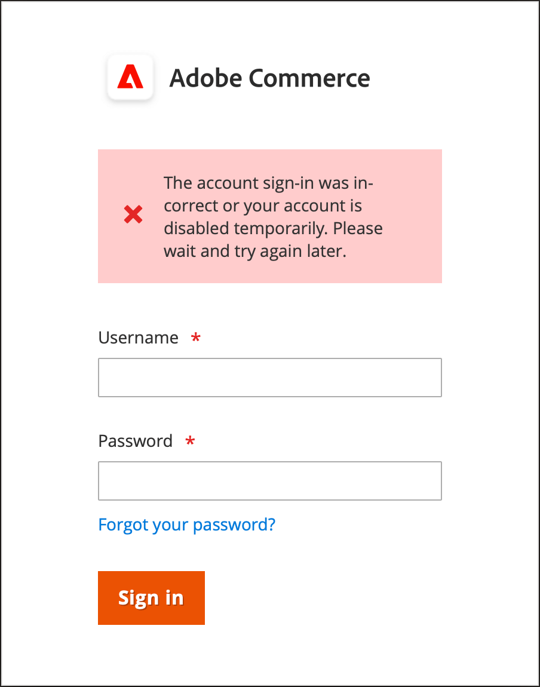

# Verwalten von Admin-Benutzerkonten

Wenn Ihr Store zum ersten Mal installiert wird, wird ein standardmäßiges Admin-Konto mit Anmeldedaten erstellt, über das Sie vollen Administratorzugriff erhalten. Als Best Practice sollten Sie ein weiteres Benutzerkonto mit vollem Administratorzugriff erstellen. Auf diese Weise können Sie ein Konto für Ihre alltäglichen Verwaltungsaktivitäten verwenden und das andere als &quot;Super Admin&quot;-Konto reservieren. Dies kann hilfreich sein, wenn Sie Ihre regulären Anmeldedaten vergessen haben oder sie irgendwie unbrauchbar werden.

Wenn andere Mitarbeiter in Ihrem Team oder bei Service Providern Zugriff benötigen, können Sie für jede Gruppe ein eigenes Benutzerkonto erstellen und eingeschränkten Zugriff je nach geschäftlichen Anforderungen zuweisen. Um die Websites oder Stores zu beschränken, auf die Benutzer in Admin zugreifen können, müssen Sie zunächst [eine Rolle ](permissions-user-roles.md) mit begrenztem Umfang und nur die erforderlichen Ressourcen erstellen. Anschließend können Sie die Rolle einem bestimmten Benutzerkonto zuweisen. Admin-Benutzer, die einer eingeschränkten Rolle zugewiesen sind, können Daten nur für Websites oder Stores anzeigen und ändern, die mit der Rolle verknüpft sind. Sie können jedoch keine globalen Einstellungen oder Daten ändern.

>[!NOTE]
>
>Adobe Commerce-Händler, die über eine Adobe ID verfügen und sich bei Adobe Commerce anmelden möchten, und Adobe Business-Produkte können die Commerce-Authentifizierung mit dem Adobe IMS-Authentifizierungs-Workflow integrieren. Nachdem diese Integration für Ihren Commerce-Store aktiviert wurde, muss sich jeder Admin-Benutzer mit seinen Adobe-Anmeldeinformationen - nicht mit seinen Commerce-Anmeldeinformationen - anmelden. Siehe [Adobe Identity Management Service (IMS)-Integrationsübersicht](https://experienceleague.adobe.com/docs/commerce-admin/start/admin/ims/adobe-ims-integration-overview.html).

Für temporäre Benutzer oder Rollen können Sie auch ein Ablaufdatum für das Benutzerkonto festlegen.

<!--  update this to a better info-graphic  -->

## Benutzer erstellen

1. Wechseln Sie in der Seitenleiste _Admin_ zu **[!UICONTROL System]** > _[!UICONTROL Permissions]_>**[!UICONTROL All Users]**.

1. Klicken Sie in der oberen rechten Ecke auf **[!UICONTROL Add New User]**.

   Um einen vorhandenen Benutzer zu bearbeiten, klicken Sie auf einen Benutzernamen im Raster. Sie können die Abschnitte _[!UICONTROL User Info]_und_[!UICONTROL User Role]_ nach Bedarf ändern.

1. Gehen Sie im Abschnitt _[!UICONTROL Account Information]_wie folgt vor:

   {width="600" zoomable="yes"}

   - Geben Sie den Wert **[!UICONTROL User Name]** für das Konto ein.

     Der Benutzername sollte leicht zu merken sein. Dabei wird nicht zwischen Groß- und Kleinschreibung unterschieden. Wenn der Benutzername beispielsweise `John` lautet, kann er sich auch als `john` anmelden.

   - Füllen Sie die folgenden Informationen aus:

      - **[!UICONTROL First Name]**
      - **[!UICONTROL Last Name]**
      - **[!UICONTROL Email address]**

     Jedes Benutzerkonto muss über eine eindeutige E-Mail-Adresse verfügen.

   - Geben Sie einen **[!UICONTROL Password]** für das Konto ein.

     >[!NOTE]
     >
     >Ein Administratorkennwort muss mindestens sieben Zeichen lang sein und sowohl Buchstaben als auch Zahlen enthalten. Weitere Kennwortoptionen finden Sie unter [Konfigurieren von Admin Security](security-admin.md).

   - Geben Sie für **[!UICONTROL Password Confirmation]** das Kennwort erneut ein, um sicherzustellen, dass es korrekt eingegeben wurde.

   - Wenn Ihr Store mehrere Sprachen hat, setzen Sie **[!UICONTROL Interface Locale]** auf die Sprache, die für die Admin-Oberfläche verwendet werden soll.

1. Setzen Sie **[!UICONTROL This Account is]** auf `Active`.

1. Klicken Sie auf das Kalendersymbol, um die **[!UICONTROL Expiration Date]** für das Benutzerkonto festzulegen.

   Die Definition eines Ablaufdatums ist hilfreich, wenn ein Benutzer oder eine Rolle temporär ist. Nach dem Ablaufdatum ändert sich der Benutzerkontenstatus in `Inactive` und kann bei Bedarf aktualisiert werden.

1. Geben Sie unter _[!UICONTROL Current User Identity Verification]_Ihr Passwort für Ihr Benutzerkonto ein.

>[!IMPORTANT]
>
>Nach Abschluss des Abschnitts _[!UICONTROL Account Information]_können Sie den Benutzer speichern. Der neue Benutzer wird im Raster_[!UICONTROL Users]_ angezeigt, der Benutzername kann sich jedoch erst anmelden, wenn eine Rolle zugewiesen wurde.

## Zuweisen einer Benutzerrolle

1. Klicken Sie im linken Bereich auf **[!UICONTROL User Role]**.

   Das Raster listet alle vorhandenen Benutzerrollen auf. Bei einem neuen Store ist _[!UICONTROL Administrators]_die einzige verfügbare Rolle.

   {width="600" zoomable="yes"}

1. Wählen Sie in der Spalte _[!UICONTROL Assigned]_eine Benutzerrolle aus.

   Sie können [ vorhandene Benutzerrollen anzeigen oder zusätzliche Benutzerrollen definieren](permissions-user-roles.md). Nachdem eine Rolle definiert wurde, müssen Sie das Benutzerkonto bearbeiten, um die neue Rolle zuzuweisen.

## 2FA-Anbieter überprüfen oder zurücksetzen

1. Öffnen Sie das Admin-Benutzerkonto.

1. Klicken Sie im linken Bereich auf **[!UICONTROL 2FA]**.

   {width="600" zoomable="yes"}

1. Überprüfen Sie die 2FA-Lösungen, die für _Admin_ -Benutzer verfügbar sind, und raten Sie jedem Benutzer, die Lösungen zu installieren, die er verwenden möchte, bevor er sich anmeldet.

   Die Authentifizierung durch nur eine 2FA-Lösung ist erforderlich, um sich bei _Admin_ anzumelden.

1. Wenn der Benutzer die 2FA-Lösung neu installieren muss, können Sie die aktuelle 2FA-Konfiguration zurücksetzen.

   Dazu muss der Benutzer den Einrichtungsprozess wiederholen, bevor er sich erneut anmelden kann. Beispielsweise könnte der Benutzer über ein neues Smartphone verfügen und muss Google Authenticator neu installieren. Um das aktuelle 2FA-Setup des Benutzers zu löschen, klicken Sie für jede Lösung, die Sie löschen möchten, auf &quot;**[!UICONTROL Reset (Provider)]**&quot;. Klicken Sie nach Aufforderung zur Bestätigung auf **[!UICONTROL OK]** .

   Der Benutzer erhält eine E-Mail mit einem Link zu [configure 2FA](security-two-factor-authentication.md). Der Link kann nur einmal verwendet werden. Wenn der Benutzer versucht, sich mehrmals anzumelden, wird nach jedem Versuch ein neuer Link gesendet.

1. Klicken Sie auf **[!UICONTROL Save User]**.

1. Geben Sie bei Aufforderung Ihr Kennwort ein, um Ihre Identität zu bestätigen, und klicken Sie erneut auf **[!UICONTROL Save User]**.

   Das Raster _[!UICONTROL Users]_wird geöffnet und listet alle Benutzer auf.

## Löschen eines Admin-Benutzers

1. Wechseln Sie in der Seitenleiste _Admin_ zu **[!UICONTROL System]** > _[!UICONTROL Permissions]_>**[!UICONTROL All Users]**.

1. Suchen Sie das Benutzerkonto mithilfe von Filtern über dem Raster und klicken Sie auf den Benutzernamen.

1. Geben Sie bei Aufforderung Ihr Kennwort zur Bestätigung Ihrer Identität ein.

1. Klicken Sie in der oberen rechten Ecke auf **[!UICONTROL Delete User]**.

1. Um die Aktion zu bestätigen, klicken Sie auf **[!UICONTROL OK]**.

## Vergessenes Passwort und Zurücksetzen von E-Mails

Die Konfiguration der E-Mail-Vorlage &quot;Admin&quot;bestimmt die E-Mails, die gesendet werden, wenn Benutzer ihr Passwort vergessen und zurücksetzen. Diese Konfiguration gibt den Store-Kontakt an, der als Absender der Nachricht erscheint, und wie lange der Link zur Passwortwiederherstellung gültig bleibt.

**_So konfigurieren Sie die Admin-E-Mail-Vorlagen:_**

1. Wechseln Sie in der Seitenleiste _Admin_ zu **[!UICONTROL Stores]** > _[!UICONTROL Setting]_>**[!UICONTROL Configuration]**.

1. Erweitern Sie im linken Seitenbedienfeld **[!UICONTROL Advanced]** und wählen Sie **[!UICONTROL Admin]**.

1. Erweitern Sie  den Abschnitt **[!UICONTROL Admin User Emails]** .

   {width="600" zoomable="yes"}

1. Setzen Sie **[!UICONTROL Forgot Password Email Template]** auf die Vorlage, die gesendet wird, wenn ein Admin-Benutzer sein Passwort vergisst.

1. Setzen Sie **[!UICONTROL Forgot and Reset Email Sender]** auf den Store-Kontakt, der als Absender der Nachricht angezeigt wird.

1. Setzen Sie **[!UICONTROL User Notification Template]** auf die E-Mail-Vorlage, die als Standard für Admin-Benachrichtigungen verwendet wird.

1. Klicken Sie nach Abschluss des Vorgangs auf **[!UICONTROL Save Config]**.

## Gesperrte Benutzer

Aus Sicherheitsgründen Ihres Unternehmens werden Benutzerkonten standardmäßig gesperrt, nachdem sechs fehlgeschlagene Anmeldeversuche für [1} beim Administrator fehlgeschlagen sind. ](../getting-started/admin-signin.md) Alle Benutzerkonten, die derzeit gesperrt sind, werden im Raster Gesperrte Benutzer angezeigt. Ein Konto kann von jedem anderen Benutzer mit vollständigen Administratorberechtigungen entsperrt werden.

Zusätzliche Kennwortsicherheitsmaßnahmen können in der Konfiguration [Erweiterter Admin](../configuration-reference/advanced/admin.md#security) implementiert werden. Siehe [Admin Security](security-admin.md).

{width="300"}

**_So entsperren Sie ein Admin-Konto:_**

1. Wechseln Sie in der Seitenleiste _Admin_ zu **[!UICONTROL System]** > _[!UICONTROL Permissions]_>**[!UICONTROL Locked Users]**.

1. Aktivieren Sie im Raster das Kontrollkästchen des gesperrten Kontos.

   {width="600" zoomable="yes"}

1. Setzen Sie oben links **[!UICONTROL Actions]** auf `Unlock`.

1. Klicken Sie auf **[!UICONTROL Submit]** , um das Konto zu entsperren.
