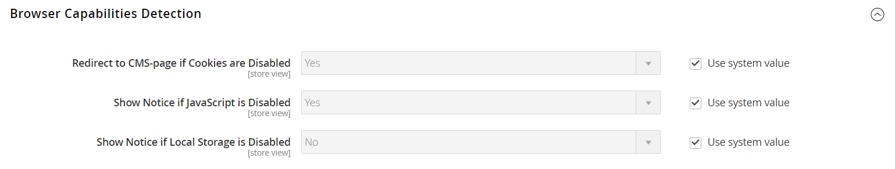

# Erkennung von Browser-Funktionen

Wie die meisten Websites und Anwendungen im Internet erfordern Adobe Commerce und Magento Open Source, dass der Browser des Besuchers sowohl Cookies als auch JavaScript für den vollständigen Betrieb zulässt. Gelegentlich ist jedoch der Browser eines Benutzers auf die höchste Datenschutzeinstellung eingestellt, die sowohl Cookies als auch JavaScript verhindert. Ihr Store kann so konfiguriert werden, dass die Funktionen des Browsers jedes Besuchers getestet werden und ein Hinweis angezeigt wird, wenn die Einstellungen geändert werden müssen.

- Wenn Cookies in den Datenschutzeinstellungen des Browsers nicht zulässig sind, können Sie das System so konfigurieren, dass sie automatisch zur Seite &quot;[ aktivieren](../content-design/pages.md#enable-cookies) umgeleitet werden, auf der erläutert wird, wie Sie die empfohlenen Einstellungen mit den meisten Browsern vornehmen können.
- Wenn JavaScript in den Datenschutzeinstellungen des Browsers nicht zulässig ist, können Sie das System so konfigurieren, dass die folgende Meldung über der Kopfzeile jeder Seite angezeigt wird.

Technische Informationen finden Sie unter [Unterstützte Browser](https://experienceleague.adobe.com/docs/commerce-operations/installation-guide/system-requirements.html#supported-browsers) im _Installationshandbuch_.

## Konfigurieren der Browser-Erkennung

1. Navigieren Sie in _Admin_-Seitenleiste zu **[!UICONTROL Stores]** > _[!UICONTROL Settings]_>**[!UICONTROL Configuration]**.

1. Wählen Sie im Bedienfeld links unter _[!UICONTROL General]_**[!UICONTROL Web]**aus.

1. Erweitern Sie  den Abschnitt **[!UICONTROL Browser Capabilities Detection]** und führen Sie folgende Schritte aus:

   - Um Anweisungen anzuzeigen, die erläutern, wie der Browser so konfiguriert wird, dass Cookies zugelassen werden, setzen Sie **[!UICONTROL Redirect to CMS-page if Cookies are Disabled]** auf `Yes`.

   - Um ein Banner über der Kopfzeile anzuzeigen, wenn JavaScript im Browser des Benutzers deaktiviert ist, setzen Sie **[!UICONTROL Show Notice if JavaScript is Disabled]** auf `Yes`.

   - Um ein Banner über der Kopfzeile anzuzeigen, wenn Lokaler Speicher im Browser des Benutzers deaktiviert ist, setzen Sie **[!UICONTROL Show Notice if Local Storage is Disabled]** auf `Yes`.

   {width="600" zoomable="yes"}

1. Klicken Sie abschließend auf **[!UICONTROL Save Config]**.
