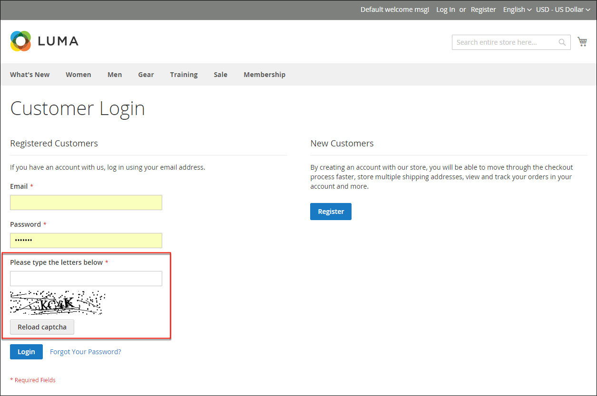
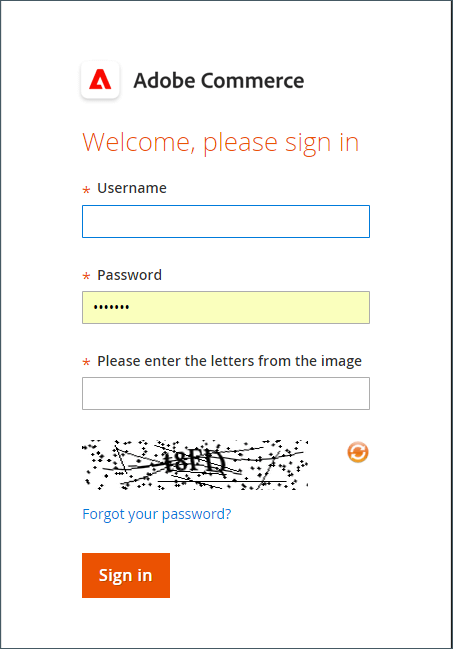
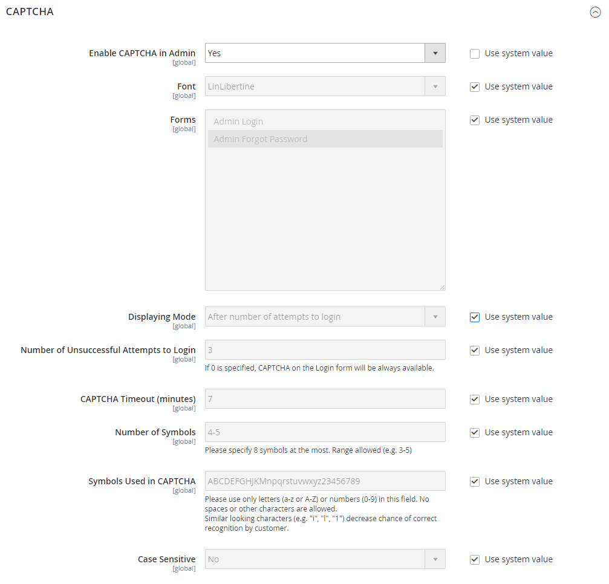
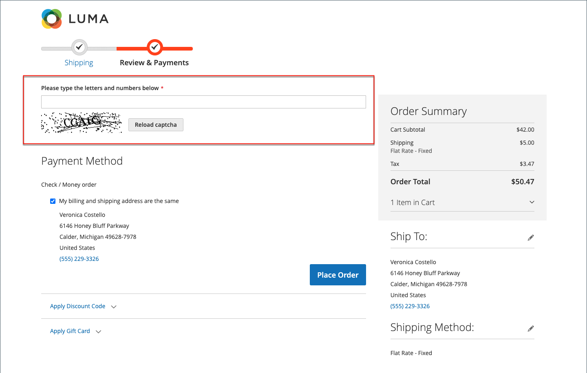
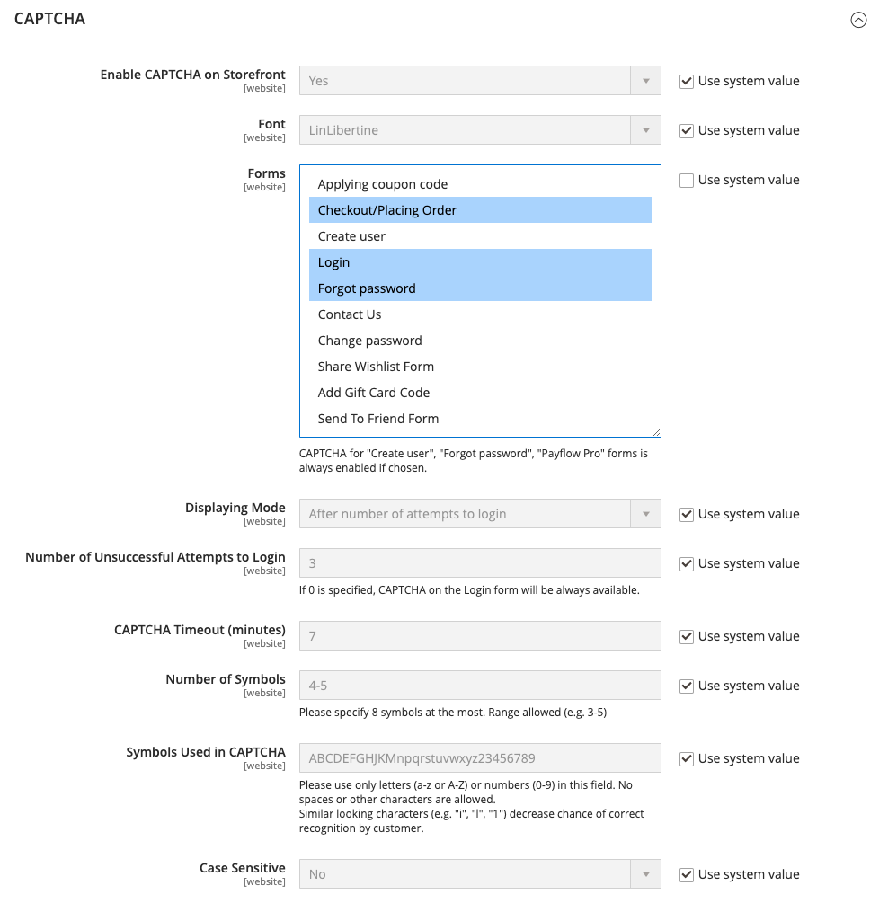

# CAPTCHA

Ein CAPTCHA ist ein visuelles Gerät, das sicherstellt, dass ein Mensch - und nicht ein Computer (oder „Bot„) - mit der Website interagiert. CAPTCHA ist ein Akronym für _Completely Automated Public Turing test to tell Computers and Humans Apart_. Sie kann sowohl für den Admin-Zugriff als auch für verschiedene Storefront-Aktionen verwendet werden, die von registrierten Kunden initiiert werden. Adobe Commerce und Magento Open Source unterstützen das in diesem Thema beschriebene standardmäßige CAPTCHA und [Google reCAPTCHA](security-google-recaptcha.md).

Sie können das CAPTCHA so oft wie nötig neu laden, indem Sie auf das Symbol Neu laden in der oberen rechten Ecke des Bildes klicken. CAPTCHA ist vollständig konfigurierbar und kann jedes Mal oder nur nach einer definierten Anzahl fehlgeschlagener Anmeldeversuche festgelegt werden.

{width="700" zoomable="yes"}

## Konfigurieren von CAPTCHA für den Administrator

Als zusätzliche Sicherheitsstufe können Sie der Seite „Admin-Anmeldung“ und „Kennwort vergessen“ ein CAPTCHA hinzufügen. Admin-Benutzer können das angezeigte CAPTCHA neu laden, indem sie auf _Symbol_ Neu laden in der oberen rechten Ecke des Bildes klicken. Die Anzahl der Neuladungen ist unbegrenzt.

{width="300"}

1. Navigieren Sie in _Admin_-Seitenleiste zu **[!UICONTROL Stores]** > _[!UICONTROL Settings]_>**[!UICONTROL Configuration]**.

1. Erweitern Sie im linken Bereich **[!UICONTROL Advanced]** und wählen Sie **[!UICONTROL Admin]**.

1. Setzen Sie in der oberen rechten Ecke **[!UICONTROL Store View]** auf `Default`.

   Wenn der [Umfang](../getting-started/websites-stores-views.md#scope-settings) Ihrer Commerce-Installation mehrere Websites umfasst, wählen Sie die Websites aus, auf die die CAPTCHA-Konfiguration angewendet werden soll.

1. Erweitern Sie  den Abschnitt **[!UICONTROL CAPTCHA]** .

1. Legen Sie **[!UICONTROL Enable CAPTCHA in Admin]** auf `Yes` fest. Füllen Sie dann die verbleibenden Optionen wie folgt aus:

   {width="600" zoomable="yes"}

   - Geben Sie den Namen der **[!UICONTROL Font]** ein, die für CAPTCHA-Symbole verwendet werden soll (Standard: `LinLibertine`).

     Um Ihre eigene Schriftart hinzuzufügen, muss sich die Schriftartendatei im selben Verzeichnis wie Ihre Commerce-Installation befinden und in der `config.xml` des Captcha-Moduls unter `app/code/Magento/Captcha/etc` deklariert werden.

   - Wählen Sie eine der folgenden **[!UICONTROL Forms]** aus, in denen CAPTCHA verwendet werden soll. Um mehrere Formulare auszuwählen, halten Sie die Strg- (PC) bzw. Befehlstaste (Mac) gedrückt.

      - `Admin Login`
      - `Admin Forgot Password`

   - Legen Sie **[!UICONTROL Displaying Modes]** auf eine der folgenden Einstellungen fest:

      - `Always` - CAPTCHA ist immer erforderlich, um sich beim Administrator anzumelden.
      - `After number of attempts to login` - Diese Option gilt nur für das Admin-Anmeldeformular. Wenn diese Option ausgewählt ist, wird das Feld _[!UICONTROL Number of Unsuccessful Attempts to Login]_&#x200B;angezeigt. Geben Sie die Anzahl der Anmeldeversuche ein, die Sie zulassen möchten. Der Wert 0 (Null) entspricht der Einstellung des Anzeigemodus `Always`.

     Um die Anzahl erfolgloser Anmeldeversuche zu verfolgen, wird jeder Anmeldeversuch unter einer E-Mail-Adresse und von einer IP-Adresse gezählt. Die maximale Anzahl von Anmeldeversuchen, die von derselben IP-Adresse aus zulässig sind, beträgt 1.000. Diese Einschränkung gilt nur, wenn CAPTCHA aktiviert ist.

   - Geben Sie **[!UICONTROL Number of Unsuccessful Attempts to Login]** ein, wie oft sich der Administrator anmelden kann, bevor CAPTCHA angezeigt wird. Ist hierfür null (`0`) festgelegt, ist immer CAPTCHA erforderlich.

   - Geben Sie **[!UICONTROL CAPTCHA Timeout (minutes)]** die Anzahl der Minuten vor Ablauf des CAPTCHA ein. Wenn das CAPTCHA abläuft, muss der Administrator die Seite neu laden.

   - Geben Sie die **[!UICONTROL Number of Symbols]** ein, die im CAPTCHA angezeigt werden soll. Es können bis zu acht (`8`) Symbole verwendet werden. Geben Sie für eine variable Anzahl von Symbolen, die sich mit jedem CAPTCHA ändern, einen Bereich ein (z. B. `5-8`).

   - Geben Sie **[!UICONTROL Symbols Used in CAPTCHA]** die Buchstaben (a-z und A-Z) und Zahlen (0-9) ein, die zufällig im CAPTCHA angezeigt werden sollen. Symbole, die nur schwer von anderen Symbolen wie `i`, `l` oder `1` zu unterscheiden sind, sind nicht im Standardsatz von CAPTCHA-Symbolen enthalten.

   - Legen Sie **[!UICONTROL Case Sensitive]** auf `Yes` fest, wenn Sie möchten, dass Administratoren die Zeichen in Groß- oder Kleinbuchstaben genau wie im CAPTCHA gezeigt eingeben müssen.

1. Klicken Sie abschließend auf **[!UICONTROL Save Config]**.

## Konfigurieren von CAPTCHA für die Storefront

Von Kunden kann verlangt werden, ein CAPTCHA jedes Mal einzugeben, wenn sie sich bei ihren Konten anmelden, oder nach mehreren erfolglosen Anmeldeversuchen. Darüber hinaus können zahlreiche Formulare, die in der Storefront verwendet werden, so konfiguriert werden, dass sie eine Überprüfung durch CAPTCHA erfordern.

{width="700" zoomable="yes"}

1. Navigieren Sie in _Admin_-Seitenleiste zu **[!UICONTROL Stores]** > _[!UICONTROL Settings]_>**[!UICONTROL Configuration]**.

1. Erweitern Sie im linken Bereich **[!UICONTROL Customers]** und wählen Sie **[!UICONTROL Customer Configuration]**.

1. Erweitern Sie  den Abschnitt **[!UICONTROL CAPTCHA]** .

{width="600" zoomable="yes"}

1. Legen Sie **[!UICONTROL Enable CAPTCHA on Storefront]** auf `Yes` fest. Füllen Sie dann die verbleibenden Optionen wie folgt aus:

   - Geben Sie den Namen des **[!UICONTROL Font]** ein, der für die CAPTCHA-Symbole verwendet werden soll (Standard: `LinLibertine`).

     Um eine eigene Schriftart hinzuzufügen, muss sich die Schriftartdatei im selben Verzeichnis wie die Commerce-Installation befinden und in der `config.xml` des CAPTCHA-Moduls deklariert sein.

   - Wählen Sie eine der folgenden **[!UICONTROL Forms]** aus, in denen CAPTCHA verwendet werden soll. Um mehrere Formulare auszuwählen, halten Sie die Strg- (PC) bzw. Befehlstaste (Mac) gedrückt.

      - `Applying coupon code`
      - `Checkout/Placing Order`
      - `Create user`
      - `Login`
      - `Forgot password`
      - `Contact Us`
      - `Change password`
      - `Share Wishlist Form`
      - `Payflow Pro` (siehe [Sicherheits-](https://experienceleague.adobe.com/docs/commerce-knowledge-base/kb/troubleshooting/payments/paypal-payflow-pro-active-carding-activity.html)_Wissensdatenbank_ Artikel)
      - `Send to Friend Form`  (nur Magento Open Source)
      - `Add Gift Card Code`  (nur Adobe Commerce)
      - `Create company`  (nur bei Adobe Commerce B2B verfügbar)

   - Legen Sie **[!UICONTROL Displaying Mode]** auf eine der folgenden Einstellungen fest:

      - `Always` - CAPTCHA ist immer erforderlich, um auf die ausgewählten Formulare zuzugreifen.
      - `After number of attempts to login` — Geben Sie die Anzahl der Anmeldeversuche ein, bevor CAPTCHA angezeigt wird. Ein Wert von 0 (Null) ist ähnlich wie „Immer“. Wenn diese Option ausgewählt ist, wird die Anzahl erfolgloser Anmeldeversuche angezeigt. Diese Option gilt nicht für das Formular „Kennwort vergessen“, das bei Aktivierung immer das CAPTCHA anzeigt.

   - Geben Sie **[!UICONTROL Number of Unsuccessful Attempts to Login]** ein, wie oft sich ein Kunde nicht erfolgreich anmelden kann, bevor das CAPTCHA angezeigt wird. Ist hierfür null (`0`) festgelegt, wird immer CAPTCHA verwendet.

   - Geben Sie **[!UICONTROL CAPTCHA Timeout (minutes)]** die Anzahl der Minuten vor Ablauf des CAPTCHA ein. Wenn das CAPTCHA abläuft, muss der Kunde die Seite neu laden, um ein neues CAPTCHA zu generieren.

   - Geben Sie die **[!UICONTROL Number of Symbols]** ein, die im CAPTCHA angezeigt werden soll. Es können bis zu acht (`8`) Symbole verwendet werden. Geben Sie für eine variable Anzahl von Symbolen, die sich mit jedem CAPTCHA ändern, einen Bereich ein (z. B. `5-8`).

   - Geben Sie **[!UICONTROL Symbols Used in CAPTCHA]** die Buchstaben (a-z und A-Z) und Zahlen (0-9) ein, die zufällig im CAPTCHA angezeigt werden sollen. Der Standardzeichensatz enthält keine ähnlichen Symbole wie `I` oder `1`. Die besten Ergebnisse erzielen Sie, wenn Sie Symbole verwenden, die die Benutzer leicht erkennen können.

   - Legen Sie **[!UICONTROL Case Sensitive]** auf `Yes` fest, wenn Kundinnen und Kunden die Zeichen in Groß- oder Kleinbuchstaben genau wie im CAPTCHA gezeigt eingeben müssen.

1. Klicken Sie abschließend auf **[!UICONTROL Save Config]**.
