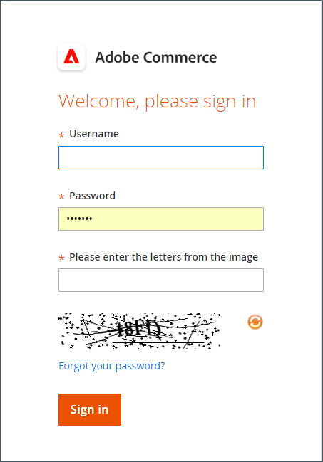
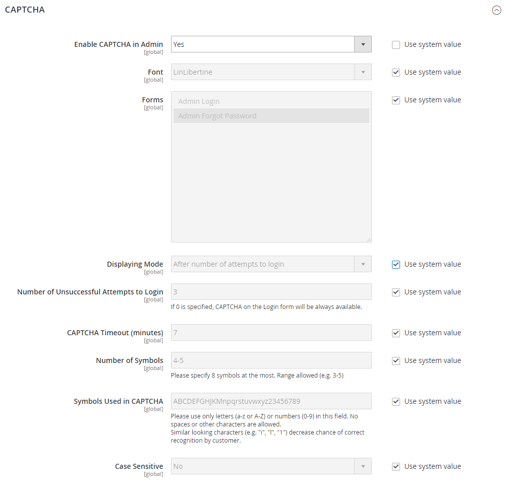

# CAPTCHA

Ein CAPTCHA ist ein visuelles Gerät, das sicherstellt, dass ein Mensch und nicht ein Computer (oder &quot;Bot&quot;) mit der Site interagiert. CAPTCHA ist ein Akronym für _Vollständig automatisierter öffentlicher Turing-Test zur Unterscheidung von Computern und Menschen_. Sie kann sowohl für den Admin-Zugriff als auch für verschiedene Storefront-Aktionen verwendet werden, die von registrierten Kunden initiiert werden. Adobe Commerce und Magento Open Source unterstützen das in diesem Thema beschriebene Standard-CAPTCHA und [Google reCAPTCHA](security-google-recaptcha.md).

Sie können das CAPTCHA so oft wie nötig neu laden, indem Sie oben rechts im Bild auf das Symbol Neu laden klicken. Das CAPTCHA ist vollständig konfigurierbar und kann jedes Mal oder erst nach einer bestimmten Anzahl fehlgeschlagener Anmeldeversuche angezeigt werden.

{width="700" zoomable="yes"}

## CAPTCHA für den Administrator konfigurieren

Für eine zusätzliche Sicherheitsstufe können Sie der Seite &quot;Admin Sign-In&quot;und &quot;Kennwort vergessen&quot;ein CAPTCHA hinzufügen. Admin-Benutzer können das angezeigte CAPTCHA neu laden, indem sie auf die _Neu laden_  rechts oben im Bild. Die Anzahl der Neuladungen ist unbegrenzt.

{width="300"}

1. Im _Admin_ Seitenleiste, navigieren Sie zu **[!UICONTROL Stores]** > _[!UICONTROL Settings]_>**[!UICONTROL Configuration]**.

1. Erweitern Sie im linken Bereich **[!UICONTROL Advanced]** und wählen **[!UICONTROL Admin]**.

1. Legen Sie in der oberen rechten Ecke **[!UICONTROL Store View]** nach `Default`.

   Wenn die Variable [Umfang](../getting-started/websites-stores-views.md#scope-settings) Wählen Sie für Ihre Commerce-Installation mehrere Websites aus, auf die die CAPTCHA-Konfiguration angewendet werden soll.

1. Erweitern  die **[!UICONTROL CAPTCHA]** Abschnitt.

1. Satz **[!UICONTROL Enable CAPTCHA in Admin]** nach `Yes`. Führen Sie dann die restlichen Optionen wie folgt aus:

   {width="600" zoomable="yes"}

   - Geben Sie den Namen der **[!UICONTROL Font]** zur Verwendung für CAPTCHA-Symbole (Standard: `LinLibertine`).

     Um eine eigene Schriftart hinzuzufügen, muss sich die Schriftartdatei im selben Ordner wie Ihre Commerce-Installation befinden und im Ordner `config.xml` Datei des Captcha-Moduls unter `app/code/Magento/Captcha/etc`.

   - Wählen Sie eine der folgenden Optionen aus **[!UICONTROL Forms]** wo CAPTCHA verwendet werden soll. Um mehrere Formulare auszuwählen, halten Sie die Strg-Taste (PC) oder Befehlstaste (Mac) gedrückt.

      - `Admin Login`
      - `Admin Forgot Password`

   - Satz **[!UICONTROL Displaying Modes]** auf einen der folgenden Werte zu:

      - `Always` - CAPTCHA ist immer erforderlich, um sich beim Administrator anzumelden.
      - `After number of attempts to login` — Diese Option gilt nur für das Anmeldeformular &quot;Admin&quot;. Wenn ausgewählt, wird die _[!UICONTROL Number of Unsuccessful Attempts to Login]_angezeigt. Geben Sie die Anzahl der Anmeldeversuche ein, die Sie zulassen möchten. Der Wert 0 (null) ähnelt dem Festlegen des Anzeigemodus auf `Always`.

     Um die Anzahl der fehlgeschlagenen Anmeldeversuche zu verfolgen, wird jeder Versuch, sich unter einer E-Mail-Adresse und von einer IP-Adresse aus anzumelden, gezählt. Die maximal zulässige Anzahl von Anmeldeversuchen für dieselbe IP-Adresse beträgt 1.000. Diese Einschränkung gilt nur, wenn CAPTCHA aktiviert ist.

   - Für **[!UICONTROL Number of Unsuccessful Attempts to Login]** eingeben, wie oft der Administrator versuchen kann, sich anzumelden, bevor das CAPTCHA angezeigt wird. Wenn auf null gesetzt (`0`), ist immer CAPTCHA erforderlich.

   - Für **[!UICONTROL CAPTCHA Timeout (minutes)]** Geben Sie die Anzahl der Minuten ein, bevor das CAPTCHA abläuft. Wenn das CAPTCHA abläuft, muss der Administrator die Seite neu laden.

   - Geben Sie die **[!UICONTROL Number of Symbols]** in der CAPTCHA angezeigt. Bis zu acht (`8`) verwendet werden. Geben Sie für eine variable Anzahl von Symbolen, die sich mit jedem CAPTCHA ändert, einen Bereich ein (z. B. `5-8`).

   - Für **[!UICONTROL Symbols Used in CAPTCHA]**, geben Sie die Buchstaben (a-z und A-Z) und die Zahlen (0-9) ein, die Sie zufällig im CAPTCHA erscheinen lassen möchten. Symbole, die sich nur schwer von anderen Symbolen unterscheiden lassen, z. B. `i`, `l`oder `1`, sind nicht im Standardsatz der CAPTCHA-Symbole enthalten.

   - Satz **[!UICONTROL Case Sensitive]** nach `Yes` , wenn Sie von Administratoren verlangen möchten, dass sie die Zeichen in Groß- oder Kleinschreibung genau eingeben, wie im CAPTCHA dargestellt.

1. Wenn Sie fertig sind, klicken Sie auf **[!UICONTROL Save Config]**.

## CAPTCHA für die Storefront konfigurieren

Kunden können aufgefordert werden, bei jeder Anmeldung bei ihren Konten oder nach mehreren erfolglosen Anmeldeversuchen eine CAPTCHA einzugeben. Darüber hinaus können zahlreiche Formulare, die im gesamten Storefront verwendet werden, so konfiguriert werden, dass sie von CAPTCHA überprüft werden müssen.

{width="700" zoomable="yes"}

1. Im _Admin_ Seitenleiste, navigieren Sie zu **[!UICONTROL Stores]** > _[!UICONTROL Settings]_>**[!UICONTROL Configuration]**.

1. Erweitern Sie im linken Bereich **[!UICONTROL Customers]** und wählen **[!UICONTROL Customer Configuration]**.

1. Erweitern  die **[!UICONTROL CAPTCHA]** Abschnitt.

{width="600" zoomable="yes"}

1. Satz **[!UICONTROL Enable CAPTCHA on Storefront]** nach `Yes`. Führen Sie dann die restlichen Optionen wie folgt aus:

   - Geben Sie den Namen der **[!UICONTROL Font]** für die CAPTCHA-Symbole verwendet werden (Standard: `LinLibertine`).

     Um eine eigene Schriftart hinzuzufügen, muss sich die Schriftartdatei im selben Ordner wie Ihre Commerce-Installation befinden und im Ordner `config.xml` -Datei des CAPTCHA-Moduls.

   - Wählen Sie eine der folgenden Optionen aus **[!UICONTROL Forms]** wo CAPTCHA verwendet werden soll. Um mehrere Formulare auszuwählen, halten Sie die Strg-Taste (PC) oder Befehlstaste (Mac) gedrückt.

      - `Applying coupon code`
      - `Checkout/Placing Order`
      - `Create user`
      - `Login`
      - `Forgot password`
      - `Contact Us`
      - `Change password`
      - `Share Wishlist Form`
      - `Payflow Pro` (siehe [Sicherheits-Patch](https://experienceleague.adobe.com/docs/commerce-knowledge-base/kb/troubleshooting/payments/paypal-payflow-pro-active-carding-activity.html) _Wissensdatenbank_ Artikel)
      - `Send to Friend Form`  (nur Magento Open Source)
      - `Add Gift Card Code`  (Nur Adobe Commerce)
      - `Create company`  (Nur bei Adobe Commerce B2B verfügbar)

   - Satz **[!UICONTROL Displaying Mode]** auf einen der folgenden Werte zu:

      - `Always` — CAPTCHA ist immer erforderlich, um auf die ausgewählten Formulare zuzugreifen.
      - `After number of attempts to login` — Geben Sie die Anzahl der Anmeldeversuche ein, bevor das CAPTCHA angezeigt wird. Der Wert 0 (null) ähnelt &quot;Immer&quot;. Wenn diese Option aktiviert ist, wird die Anzahl der fehlgeschlagenen Anmeldeversuche angezeigt. Diese Option gilt nicht für das Formular &quot;Kennwort vergessen&quot;, das bei Aktivierung immer CAPTCHA anzeigt.

   - Für **[!UICONTROL Number of Unsuccessful Attempts to Login]** eingeben, wie oft sich ein Kunde nicht erfolgreich anmelden kann, bevor CAPTCHA angezeigt wird. Wenn auf null gesetzt (`0`), wird immer CAPTCHA verwendet.

   - Für **[!UICONTROL CAPTCHA Timeout (minutes)]** Geben Sie die Anzahl der Minuten ein, bevor das CAPTCHA abläuft. Wenn das CAPTCHA abläuft, muss der Kunde die Seite neu laden, um ein neues CAPTCHA zu generieren.

   - Geben Sie die **[!UICONTROL Number of Symbols]** in der CAPTCHA angezeigt. Bis zu acht (`8`) verwendet werden. Geben Sie für eine variable Anzahl von Symbolen, die sich mit jedem CAPTCHA ändert, einen Bereich ein (z. B. `5-8`).

   - Für **[!UICONTROL Symbols Used in CAPTCHA]**, geben Sie die Buchstaben (a-z und A-Z) und die Zahlen (0-9) ein, die Sie zufällig im CAPTCHA erscheinen lassen möchten. Der Standardsatz von Zeichen enthält keine ähnlichen Symbole wie `I` oder `1`. Verwenden Sie für optimale Ergebnisse Symbole, die Benutzer leicht identifizieren können.

   - Satz **[!UICONTROL Case Sensitive]** nach `Yes` wenn Sie möchten, dass Kunden die Zeichen in Groß- oder Kleinbuchstaben genau wie im CAPTCHA angegeben eingeben müssen.

1. Wenn Sie fertig sind, klicken Sie auf **[!UICONTROL Save Config]**.
