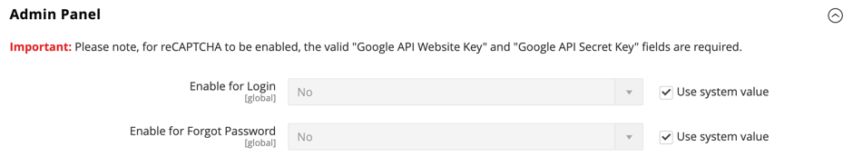

# Google reCAPTCHA

[Google reCAPTCHA](https://developers.google.com/recaptcha) stellt sicher, dass ein Mensch, anstatt eines Computers (oder &quot;Bots&quot;), mit Ihrer Website interagiert. Im Gegensatz zu Adobe Commerce und Magento Open Source [CAPTCHA](security-captcha.md)bietet Google reCAPTCHA eine verbesserte Sicherheit mit einer Auswahl verschiedener Anzeigeoptionen und -methoden. Weitere Informationen zum Website-Traffic finden Sie im Dashboard Ihres Google reCAPTCHA-Kontos.

Google reCAPTCHA ist separat für Admin und Storefront konfiguriert.

- Für Admin kann Google reCAPTCHA auf der [Anmelden](../getting-started/admin-signin.md) und wenn ein Benutzer ein Zurücksetzen des Kennworts anfordert. Wenn der standardmäßige Commerce [CAPTCHA](security-captcha.md) aktiviert ist, kann Google reCAPTCHA ohne Probleme gleichzeitig verwendet werden.

- Für die Storefront kann Google reCAPTCHA verwendet werden, um sich bei einer [Kundenkonto](../customers/customer-sign-in.md), senden Sie eine Nachricht aus dem [Kontakt](../getting-started/store-details.md#contact-us-form) und an zahlreichen anderen Storefront-Standorten.

  {width="700" zoomable="yes"}

Google reCAPTCHA kann auf verschiedene Weise implementiert werden:

- _reCAPTCHA v3 unsichtbar_ — Verwendet einen Algorithmus zum Bewerten von Benutzerinteraktionen und bestimmt anhand eines Punktes die Wahrscheinlichkeit, dass der Benutzer menschlich ist.

- _reCAPTCHA v2 Invisible_ — Führt eine Hintergrundüberprüfung ohne Benutzerinteraktion durch. Benutzer und Kunden werden automatisch verifiziert, müssen jedoch möglicherweise bestimmte Bilder auswählen, um eine Herausforderung abzuschließen.

- _reCAPTCHA v2 (&quot;Ich bin kein Roboter&quot;)_ — Validiert Anforderungen mit der _&quot;Ich bin kein Roboter&quot;_ aktivieren.

>[!IMPORTANT]
>
>Bevor Google reCAPTCHA konfiguriert werden kann, stellen Sie sicher, dass Ihre `PHP.ini` -Datei enthält die folgende Einstellung: `allow_url_fopen = 1`. Dies erfordert möglicherweise Hilfe von Entwicklern. Siehe [Erforderliche PHP-Einstellungen](https://experienceleague.adobe.com/docs/commerce-operations/installation-guide/prerequisites/php-settings.html){:target=&quot;_blank&quot;} im Installationshandbuch.

## Schritt 1: Generieren von Google reCAPTCHA-Schlüsseln

Google reCAPTCHA erfordert zur Aktivierung ein Paar API-Schlüssel. Sie können diese Schlüssel kostenlos über die reCAPTCHA-Website erhalten. Bevor Sie die Schlüssel generieren, müssen Sie den Typ von reCAPTCHA kennen, den Sie verwenden möchten.

1. Öffnen Sie die Google-reCAPTCHA-Seite und melden Sie sich bei Ihrem Konto an.

1. Für **[!UICONTROL Label]**, geben Sie einen Namen ein, um die Schlüssel für die interne Referenz zu identifizieren.

   Sie benötigen einen Satz Schlüssel für jeden reCAPTCHA-Typ, der in Ihrer Adobe Commerce- oder Magento Open Source-Installation verwendet wird. Beispiel: `Commerce Invisible`

1. Für **[!UICONTROL reCAPTCHA type]** wählen Sie die Methode aus, die Sie verwenden möchten.

   - _reCAPTCHA v3 unsichtbar_
   - _reCAPTCHA v2 Invisible_
   - _reCAPTCHA v2 (&quot;Ich bin kein Roboter&quot;)_

1. Für **[!UICONTROL Domain]**, geben Sie die Domäne Ihres Stores ein. Beispiel: mystore.com

   Wenn mehrere Stores mit unterschiedlichen Domänen vorhanden sind, geben Sie jede Domäne in einer separaten Zeile ein.

   - Fügen Sie Ihre Store-Domäne und alle Subdomänen hinzu.
   - Sie können `localhost`, anderen lokalen VM-Domänen und Staging-Domänen nach Bedarf für Tests.

1. Aktivieren Sie das Kontrollkästchen, um **[!UICONTROL Accept the reCAPTCHA Terms of Service]**.

1. (Optional) Wählen Sie die **[!UICONTROL Send alerts to owners]** aktivieren, um eine Benachrichtigung zu senden, wenn Google Probleme oder verdächtigen Traffic erkennt.

1. Klicks **[!UICONTROL Submit]** , um die Registrierung abzuschließen und Schlüssel zu erhalten.

   >[!IMPORTANT]
   >
   >Nicht alle Schlüssel gelten für alle Typen von reCAPTCHA, und eine falsche Anwendung kann zu unerwartetem Verhalten führen. Beispielsweise funktionieren Google reCAPTCHA-Schlüssel, die für reCAPTCHA v2 &quot;Ich bin kein Roboter&quot;generiert wurden, nicht mit _reCAPTCHA v2 Invisible_ und könnte Funktionen blockieren, bei denen reCAPTCHA aktiviert ist.

## Schritt 2: Konfigurieren von Google reCAPTCHA für den Administrator

1. Melden Sie sich bei Ihrem Admin-Konto an.

1. Navigieren Sie in der Admin-Seitenleiste zu **[!UICONTROL Stores]** > _[!UICONTROL Settings]_>**[!UICONTROL Configuration]**.

1. Legen Sie in der oberen rechten Ecke **[!UICONTROL Store View]** nach `Default Config`.

1. Erweitern Sie im linken Bereich **[!UICONTROL Security]** und klicken **[!UICONTROL Google reCAPTCHA Admin Panel]**.

   >[!NOTE]
   >
   >Löschen Sie die **[!UICONTROL Use system value]** für jedes Feld, das Sie konfigurieren möchten.

1. Verwendung _[!DNL reCAPTCHA v2 ("I am not a robot")]_, erweitern Sie die **[!UICONTROL reCAPTCHA v2 ("I am not a robot")]**und führen Sie folgende Schritte aus:

   - Für **[!UICONTROL Google API Website Key]** eingeben, geben Sie den Website-Schlüssel ein, der für diesen reCAPTCHA-Typ erstellt wurde, als Sie Ihr Google reCAPTCHA-Konto registriert haben.

   - Für **[!UICONTROL Google API Secret Key]** Geben Sie den geheimen Schlüssel ein, der mit Ihrem Google reCAPTCHA-Konto verknüpft ist.

   - Für **[!UICONTROL Size]** wählen Sie die Größe des Google reCAPTCHA-Felds aus, das angezeigt werden soll. Optionen: `Normal (default)` / `Compact`

   - Für **[!UICONTROL Theme]** auswählen Sie das Design, das Sie verwenden möchten, um das Google reCAPTCHA-Feld zu formatieren. Optionen: `Light Theme (default)` / `Dark Theme`

   - Für **[!UICONTROL Language Code]**, geben Sie den Code mit zwei Zeichen ein, um die [Sprache, die für Google-reCAPTCHA-Text und -Messaging verwendet wird](https://developers.google.com/recaptcha/docs/language).

   {width="600" zoomable="yes"}

1. Verwendung _[!DNL reCAPTCHA v2 Invisible]_, erweitern Sie die **[!UICONTROL reCAPTCHA v2 Invisible]**und führen Sie folgende Schritte aus:

   - Für **[!UICONTROL Google API Website Key]** eingeben, geben Sie den Website-Schlüssel ein, der für diesen reCAPTCHA-Typ erstellt wurde, als Sie Ihr Google reCAPTCHA-Konto registriert haben.

   - Für **[!UICONTROL Google API Secret Key]** Geben Sie den geheimen Schlüssel ein, der mit Ihrem Google reCAPTCHA-Konto verknüpft ist.

   - Für **[!UICONTROL Invisible Badge Position]** wählen Sie die Badge-Position aus, die auf jeder Seite verwendet werden soll. Optionen: `Inline` / `Bottom Right` / `Bottom Left`

   - Für **[!UICONTROL Theme]** wählen Sie das Design aus, das für die Formatierung des Google reCAPTCHA -Felds verwendet werden soll. Optionen: `Light Theme (default)` / `Dark Theme`

   - Für **[!UICONTROL Language Code]**, geben Sie einen Code mit zwei Zeichen ein, der die [Sprache, die für Google-reCAPTCHA-Text und -Messaging verwendet wird](https://developers.google.com/recaptcha/docs/language).

   {width="600" zoomable="yes"}

1. Verwendung _[!DNL reCAPTCHA v3 Invisible]_, erweitern Sie die **[!UICONTROL reCAPTCHA v3 Invisible]**und führen Sie folgende Schritte aus:

   - Für **[!UICONTROL Google API Website Key]** eingeben, geben Sie den Website-Schlüssel ein, der für diesen reCAPTCHA-Typ erstellt wurde, als Sie Ihr Google reCAPTCHA-Konto registriert haben.

   - Für **[!UICONTROL Google API Secret Key]** Geben Sie den geheimen Schlüssel ein, der mit Ihrem Google reCAPTCHA-Konto verknüpft ist.

   - Geben Sie die **[!UICONTROL Minimum Score Threshold]** , um zu ermitteln, wann eine Benutzerinteraktion als potenzielles Risiko gekennzeichnet ist, wobei 1.0 eine typische Benutzerinteraktion und 0.0 wahrscheinlich ein Bot ist. Standard: `0.5`

   - Für **[!UICONTROL Invisible Badge Position]**, wählen Sie die Position aus, die auf jeder Seite verwendet werden soll. Optionen: `Inline` / `Bottom Right` / `Bottom Left`

   - Für **[!UICONTROL Theme]** wählen Sie das Design aus, das für die Formatierung des Google reCAPTCHA -Felds verwendet werden soll. Optionen: `Light Theme (default)` / `Dark Theme`

   - Für **[!UICONTROL Language Code]**, geben Sie einen Code mit zwei Zeichen ein, der die [Sprache, die für Google-reCAPTCHA-Text und -Messaging verwendet wird](https://developers.google.com/recaptcha/docs/language).

   {width="600" zoomable="yes"}

1. Erweitern **[!UICONTROL reCAPTCHA Validation Failure Messages]** und geben Sie die Meldungen ein, die im Admin angezeigt werden, wenn die Validierung fehlschlägt oder nicht abgeschlossen werden kann.

   {width="600" zoomable="yes"}

1. Erweitern Sie die **[!UICONTROL Admin Panel]** und konfigurieren Sie nach Bedarf Folgendes:

   - Satz **[!UICONTROL Enable for Login]** auf den reCAPTCHA-Typ, den Sie für die Admin-Anmeldeseite verwenden möchten.

   - Satz **[!UICONTROL Enable for Forgot Password]** auf den reCAPTCHA-Typ, den Sie für Anforderungen zum Zurücksetzen des Kennworts verwenden möchten.

   {width="600" zoomable="yes"}

## Schritt 3: Konfigurieren von Google reCAPTCHA für die Storefront

1. Im linken Bereich unter _[!UICONTROL Security]_auswählen **[!UICONTROL Google reCAPTCHA Storefront]**.

1. Füllen Sie den Abschnitt für jeden reCAPTCHA-Typ aus, den Sie in der Storefront verwenden möchten.

   Weitere Informationen finden Sie unter _Schritt 2: Konfigurieren von Google reCAPTCHA für den Administrator_ für Details zu den Optionen für jeden reCAPTCHA-Typ.

1. Erweitern **[!UICONTROL reCAPTCHA Validation Failure Messages]** und geben Sie die Meldungen ein, die in der Storefront angezeigt werden, wenn die Validierung fehlschlägt oder nicht abgeschlossen werden kann.

1. Erweitern Sie die **[!UICONTROL Storefront]** Abschnitt.

   >[!NOTE]
   >
   >Löschen Sie die **[!UICONTROL Use system value]** für jedes Feld, das Sie konfigurieren möchten.

1. Stellen Sie jedes Feld für den Speicherort der Storefront auf den Typ von reCAPTCHA ein, den Sie für die Verwendung konfiguriert haben.

   - [!UICONTROL Enable for Customer Login]
   - [!UICONTROL Enable for Forgot Password]
   - [!UICONTROL Enable for Create New Customer Account]
   - [!UICONTROL Enable for Edit Customer Account]
   - [!UICONTROL Enable for Create New Company Account]  (Nur mit B2B für Adobe Commerce verfügbar)
   - [!UICONTROL Enable for Contact Us]
   - [!UICONTROL Enable for Product Review]
   - [!UICONTROL Enable for Newsletter Subscription]
   - [!UICONTROL Enable for Gift Card]  (Nur Adobe Commerce)
   - [!UICONTROL Enable for Invitation Create Account]
   - [!UICONTROL Enable for Send To Friend]
   - [!UICONTROL Enable for Checkout/Placing Order]
   - [!UICONTROL Enable for Wishlist Sharing]
   - [!UICONTROL Enable for Coupon Codes]
   - [!UICONTROL Enable for PayPal PayflowPro payment form]

   {width="600" zoomable="yes"}

## Schritt 4: Konfiguration speichern

1. Klicken Sie nach Abschluss der Konfigurationseinstellungen auf **[!UICONTROL Save Config]**.

1. Klicken Sie in der Meldung oben im Arbeitsbereich auf **[!UICONTROL Cache Management]** und aktualisieren Sie jeden ungültigen Cache.
