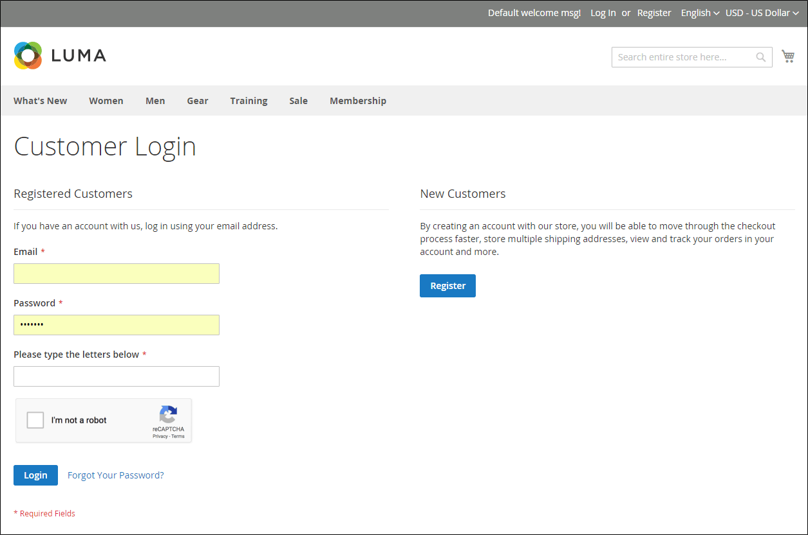

# Google reCAPTCHA

[Google reCAPTCHA](https://developers.google.com/recaptcha) stellt sicher, dass ein Mensch und nicht ein Computer (oder „Bot„) mit Ihrer Website interagiert. Im Gegensatz zum standardmäßigen Adobe Commerce und Magento Open Source [CAPTCHA](security-captcha.md) bietet Google reCAPTCHA erhöhte Sicherheit durch eine Auswahl verschiedener Anzeigeoptionen und -methoden. Weitere Informationen zum Website-Traffic finden Sie im Dashboard Ihres Google reCAPTCHA-Kontos.

Google reCAPTCHA wird für die Admin- und Storefront separat konfiguriert.

- Für Admins kann Google reCAPTCHA auf der Anmeldeseite [Anmelden](../getting-started/admin-signin.md) und verwendet werden, wenn ein Benutzer ein Zurücksetzen des Kennworts anfordert. Wenn auch der standardmäßige Commerce [CAPTCHA](security-captcha.md) aktiviert ist, kann Google reCAPTCHA problemlos gleichzeitig verwendet werden.

- Für die Storefront kann Google reCAPTCHA verwendet werden, um sich bei einem [Kundenkonto](../customers/customer-sign-in.md) anzumelden, eine Nachricht von der Seite [Kontaktieren Sie uns](../getting-started/store-details.md#contact-us-form) und an zahlreichen anderen Storefront-Standorten zu senden.

  {width="700" zoomable="yes"}

Google reCAPTCHA kann auf verschiedene Weise implementiert werden:

- _reCAPTCHA v3 Invisible_ - Verwendet einen Algorithmus zur Bewertung von Benutzerinteraktionen und ermittelt anhand eines Scores die Wahrscheinlichkeit, dass der Benutzer ein Mensch ist.

- _reCAPTCHA v2 Invisible_ — Führt eine Hintergrundüberprüfung ohne Benutzerinteraktion durch. Benutzer und Kunden werden automatisch verifiziert. Möglicherweise müssen sie jedoch bestimmte Bilder auswählen, um eine Challenge abzuschließen.

- _reCAPTCHA v2 („Ich bin kein Roboter„)_ — Validiert Anfragen mit dem _„Ich bin kein Roboter“_.

>[!IMPORTANT]
>
>Bevor Google reCAPTCHA konfiguriert werden kann, stellen Sie sicher, dass Ihre `PHP.ini` die folgende Einstellung enthält: `allow_url_fopen = 1`. Dies erfordert möglicherweise die Unterstützung eines Entwicklers. Siehe [Erforderliche PHP](https://experienceleague.adobe.com/docs/commerce-operations/installation-guide/prerequisites/php-settings.html){:target="_blank"}Einstellungen im Installationshandbuch.

## Schritt 1: Generieren von Google reCAPTCHA-Schlüsseln

Google reCAPTCHA erfordert zur Aktivierung ein Paar API-Schlüssel. Diese Schlüssel erhalten Sie kostenlos über die reCAPTCHA-Website. Bevor Sie die Schlüssel generieren, müssen Sie den Typ von reCAPTCHA kennen, den Sie verwenden möchten.

1. Öffnen Sie die Google reCAPTCHA-Seite und melden Sie sich bei Ihrem Konto an.

1. Geben Sie **[!UICONTROL Label]** einen Namen ein, um die Schlüssel für die interne Referenz zu identifizieren.

   Sie benötigen einen Schlüsselsatz für jeden reCAPTCHA-Typ, der in Ihrer Adobe Commerce- oder Magento Open Source-Installation verwendet wird. Beispiel: `Commerce Invisible`

1. Wählen Sie **[!UICONTROL reCAPTCHA type]** die gewünschte Methode aus.

   - _reCAPTCHA v3 unsichtbar_
   - _reCAPTCHA v2 Invisible_
   - _reCAPTCHA v2 („Ich bin kein Roboter„)_

1. Geben Sie **[!UICONTROL Domain]** die Domain Ihres Geschäfts ein. Beispiel: mystore.com

   Wenn Sie mehrere Stores mit unterschiedlichen Domains haben, geben Sie jede Domain in einer separaten Zeile ein.

   - Fügen Sie Ihre Store-Domain und alle Subdomains hinzu.
   - Sie können nach Bedarf `localhost`, andere lokale VM-Domains und Staging-Domains zum Testen hinzufügen.

1. Aktivieren Sie das zu **[!UICONTROL Accept the reCAPTCHA Terms of Service]** Kontrollkästchen.

1. (Optional) Aktivieren Sie das Kontrollkästchen **[!UICONTROL Send alerts to owners]** , um eine Benachrichtigung zu senden, wenn Google Probleme oder verdächtigen Traffic erkennt.

1. Klicken Sie auf **[!UICONTROL Submit]** , um die Registrierung abzuschließen und Schlüssel zu erhalten.

   >[!IMPORTANT]
   >
   >Nicht alle Schlüssel gelten für alle Typen von reCAPTCHA, und eine falsche Anwendung könnte zu unerwartetem Verhalten führen. Beispielsweise funktionieren Google-reCAPTCHA-Schlüssel, die für reCAPTCHA v2 „Ich bin kein Roboter“ generiert wurden, nicht mit _reCAPTCHA v2 Invisible_ und können Funktionen blockieren, bei denen reCAPTCHA aktiviert ist.

## Schritt 2: Konfigurieren von Google reCAPTCHA für Admins

[!BADGE Nur PaaS]{type=Informative url="https://experienceleague.adobe.com/en/docs/commerce/user-guides/product-solutions" tooltip="Gilt nur für Adobe Commerce in Cloud-Projekten (von Adobe verwaltete PaaS-Infrastruktur) und lokale Projekte."}

1. Melden Sie sich bei Ihrem Administratorkonto an.

1. Navigieren Sie in der Seitenleiste Admin zu **[!UICONTROL Stores]** > _[!UICONTROL Settings]_>**[!UICONTROL Configuration]**.

1. Setzen Sie in der oberen rechten Ecke **[!UICONTROL Store View]** auf `Default Config`.

1. Erweitern Sie im linken Bereich **[!UICONTROL Security]** und klicken Sie auf **[!UICONTROL Google reCAPTCHA Admin Panel]**.

   >[!NOTE]
   >
   >Deaktivieren Sie das Kontrollkästchen **[!UICONTROL Use system value]** für jedes Feld, das Sie konfigurieren möchten.

1. Um _[!DNL reCAPTCHA v2 ("I am not a robot")]_zu verwenden, erweitern Sie den Abschnitt **[!UICONTROL reCAPTCHA v2 ("I am not a robot")]**und gehen Sie folgendermaßen vor:

   - Geben Sie **[!UICONTROL Google API Website Key]** den Website-Schlüssel ein, der für diesen reCAPTCHA-Typ erstellt wurde, als Sie Ihr Google reCAPTCHA-Konto registriert haben.

   - Geben Sie **[!UICONTROL Google API Secret Key]** den geheimen Schlüssel ein, der mit Ihrem Google reCAPTCHA-Konto verknüpft ist.

   - Wählen Sie **[!UICONTROL Size]** die Größe des Google reCAPTCHA-Felds aus, das angezeigt werden soll. Optionen: `Normal (default)` / `Compact`

   - Wählen Sie **[!UICONTROL Theme]** das Design aus, das Sie zum Gestalten des Google reCAPTCHA-Felds verwenden möchten. Optionen: `Light Theme (default)` / `Dark Theme`

   - Geben Sie **[!UICONTROL Language Code]** den zweistelligen Code ein, um die [Sprache, die für Google reCAPTCHA-Text und -Messaging verwendet wird](https://developers.google.com/recaptcha/docs/language) anzugeben.

   {width="600" zoomable="yes"}

1. Um _[!DNL reCAPTCHA v2 Invisible]_zu verwenden, erweitern Sie den Abschnitt **[!UICONTROL reCAPTCHA v2 Invisible]**und gehen Sie folgendermaßen vor:

   - Geben Sie **[!UICONTROL Google API Website Key]** den Website-Schlüssel ein, der für diesen reCAPTCHA-Typ erstellt wurde, als Sie Ihr Google reCAPTCHA-Konto registriert haben.

   - Geben Sie **[!UICONTROL Google API Secret Key]** den geheimen Schlüssel ein, der mit Ihrem Google reCAPTCHA-Konto verknüpft ist.

   - Wählen Sie **[!UICONTROL Invisible Badge Position]** die Badge-Position, die auf jeder Seite verwendet werden soll. Optionen: `Inline` / `Bottom Right` / `Bottom Left`

   - Wählen Sie **[!UICONTROL Theme]** das Design aus, das zum Formatieren des Google reCAPTCHA-Felds verwendet werden soll. Optionen: `Light Theme (default)` / `Dark Theme`

   - Geben Sie **[!UICONTROL Language Code]** einen zweistelligen Code ein, der die [Sprache, die für Google reCAPTCHA-Text und -Messaging verwendet wird](https://developers.google.com/recaptcha/docs/language) angibt.

   {width="600" zoomable="yes"}

1. Um _[!DNL reCAPTCHA v3 Invisible]_zu verwenden, erweitern Sie den Abschnitt **[!UICONTROL reCAPTCHA v3 Invisible]**und gehen Sie folgendermaßen vor:

   - Geben Sie **[!UICONTROL Google API Website Key]** den Website-Schlüssel ein, der für diesen reCAPTCHA-Typ erstellt wurde, als Sie Ihr Google reCAPTCHA-Konto registriert haben.

   - Geben Sie **[!UICONTROL Google API Secret Key]** den geheimen Schlüssel ein, der mit Ihrem Google reCAPTCHA-Konto verknüpft ist.

   - Geben Sie den **[!UICONTROL Minimum Score Threshold]** ein, um zu ermitteln, wann eine Benutzerinteraktion als potenzielles Risiko gekennzeichnet ist, wobei 1.0 eine typische Benutzerinteraktion und 0.0 wahrscheinlich ein Bot ist. Standard: `0.5`

   - Wählen Sie **[!UICONTROL Invisible Badge Position]** die Position, die auf jeder Seite verwendet werden soll. Optionen: `Inline` / `Bottom Right` / `Bottom Left`

   - Wählen Sie **[!UICONTROL Theme]** das Design aus, das zum Formatieren des Google reCAPTCHA-Felds verwendet werden soll. Optionen: `Light Theme (default)` / `Dark Theme`

   - Geben Sie **[!UICONTROL Language Code]** einen zweistelligen Code ein, der die [Sprache, die für Google reCAPTCHA-Text und -Messaging verwendet wird](https://developers.google.com/recaptcha/docs/language) angibt.

   {width="600" zoomable="yes"}

1. Erweitern Sie **[!UICONTROL reCAPTCHA Validation Failure Messages]** und geben Sie die Nachrichten ein, die in Admin angezeigt werden, wenn die Validierung fehlschlägt oder nicht abgeschlossen werden kann.

   {width="600" zoomable="yes"}

1. Erweitern Sie den Abschnitt **[!UICONTROL Admin Panel]** und konfigurieren Sie nach Bedarf Folgendes:

   - Legen Sie **[!UICONTROL Enable for Login]** auf den reCAPTCHA-Typ fest, den Sie für die Admin-Anmeldeseite verwenden möchten.

   - Legen Sie **[!UICONTROL Enable for Forgot Password]** auf den reCAPTCHA-Typ fest, den Sie für Anfragen zum Zurücksetzen des Kennworts verwenden möchten.

   {width="600" zoomable="yes"}

## Schritt 3: Konfigurieren von Google reCAPTCHA für die Storefront

1. Wählen Sie im linken Bedienfeld unter _[!UICONTROL Security]_die Option **[!UICONTROL Google reCAPTCHA Storefront]**aus.

1. Füllen Sie den Abschnitt für jeden reCAPTCHA-Typ aus, den Sie in der Storefront verwenden möchten.

   Google Weitere Informationen zu den Optionen für _einzelnen reCAPTCHA-Typ finden Sie in den Informationen unter Schritt 2: Konfigurieren von reCAPTCHA für_.

1. Erweitern Sie **[!UICONTROL reCAPTCHA Validation Failure Messages]** und geben Sie die Nachrichten ein, die in der Storefront angezeigt werden, wenn die Validierung fehlschlägt oder nicht abgeschlossen werden kann.

1. Erweitern Sie den Abschnitt **[!UICONTROL Storefront]** .

   >[!NOTE]
   >
   >Deaktivieren Sie das Kontrollkästchen **[!UICONTROL Use system value]** für jedes Feld, das Sie konfigurieren möchten.

1. Legen Sie jedes Standortfeld der Storefront auf den Typ von reCAPTCHA fest, den Sie für die Verwendung konfiguriert haben.

   - [!UICONTROL Enable for Customer Login]
   - [!UICONTROL Enable for Forgot Password]
   - [!UICONTROL Enable for Create New Customer Account]
   - [!UICONTROL Enable for Edit Customer Account]
   - [!UICONTROL Enable for Create New Company Account]  (nur bei Adobe Commerce B2B verfügbar)
   - [!UICONTROL Enable for Contact Us]
   - [!UICONTROL Enable for Product Review]
   - [!UICONTROL Enable for Newsletter Subscription]
   - [!UICONTROL Enable for Gift Card]  (nur Adobe Commerce)
   - [!UICONTROL Enable for Invitation Create Account]
   - [!UICONTROL Enable for Send To Friend]
   - [!UICONTROL Enable for Checkout/Placing Order]
   - [!UICONTROL Enable for Wishlist Sharing]
   - [!UICONTROL Enable for Coupon Codes]
   - [!UICONTROL Enable for PayPal PayflowPro payment form]

   {width="600" zoomable="yes"}

## Schritt 4: Speichern Sie die Konfiguration

1. Wenn die Konfigurationseinstellungen abgeschlossen sind, klicken Sie auf **[!UICONTROL Save Config]**.

1. Klicken Sie in der Meldung oben im Arbeitsbereich auf **[!UICONTROL Cache Management]** und aktualisieren Sie jeden ungültigen Cache.
