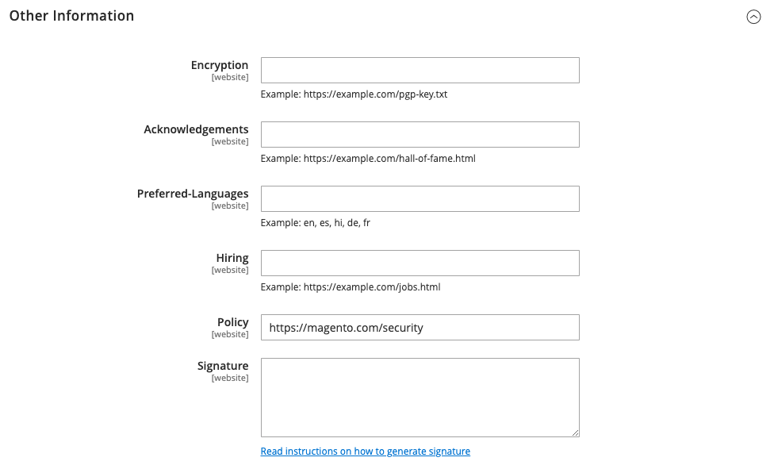

# Meldung von Sicherheitsproblemen

Die `security.txt`-Datei enthält Kontaktinformationen und sicherheitsbezogene Links, die von Sicherheitsforschern verwendet werden können, um Sicherheitsbedenken über Ihre Website zu melden. Wenn sich Ihre Sicherheitsinformationen im Laufe der Zeit ändern, stellen Sie sicher, dass die Informationen in der `security.txt`-Datei auf dem neuesten Stand sind.

**_So konfigurieren Sie security.txt:_**

1. Navigieren Sie in _Admin_-Seitenleiste zu **[!UICONTROL Stores]** > _[!UICONTROL Settings]_>**[!UICONTROL Configuration]**.

1. Klicken Sie im linken Bedienfeld unter _[!UICONTROL Security]_auf **[!UICONTROL Security.txt]**.

1. Legen Sie im _[!UICONTROL General]_Abschnitt **[!UICONTROL Enable]**auf `Yes` fest.

   {width="600" zoomable="yes"}

1. Geben Sie unter _[!UICONTROL Contact Information]_Folgendes ein:

   - Die E-Mail-Adresse und Telefonnummer der Person, die Sicherheitsprobleme für Ihren Store verwaltet.

   - Die URL der **[!UICONTROL Contact Page]** Ihres Stores. Bei dieser Seite kann es sich entweder um eine Liste von Store-Sicherheitskontakten oder um Ihre Seite _Kontakt_ handeln.

   {width="600" zoomable="yes"}

1. Geben Sie unter _[!UICONTROL Other Information]_Folgendes ein:

   - Die URL Ihres öffentlichen **[!UICONTROL Encryption]**. Beispiel: `https://example.com/pgp-key.txt`

   - Die URL einer **[!UICONTROL Acknowledgments]**, auf der Sicherheitsexperten für ihre Arbeit im Namen Ihres Stores ausgezeichnet werden.

   - Ihr **[!UICONTROL Preferred Languages]** für sicherheitsbezogene Kommunikation. Geben Sie für jede unterstützte Sprache den standardmäßigen [-Sprach](https://en.wikipedia.org/wiki/List_of_ISO_639-1_codes)Code, getrennt durch ein Komma, ein. Um beispielsweise Englisch, Spanisch und Französisch anzugeben, geben Sie `en, es, fr` ein. Alle angegebenen Sprachen haben die gleiche Priorität, unabhängig von ihrer Reihenfolge ihres Erscheinungsbildes.

   - Die URL einer **[!UICONTROL Hiring]**, die sicherheitsbezogene Beschäftigungsmöglichkeiten mit Ihrem Geschäft auflistet.

   - Die URL Ihrer **[!UICONTROL Policy]**.

   - Die URL einer digitalen **[!UICONTROL Signature]**, die auf Ihrem Server gespeichert wird. Beispiel: `https://mystore.com/.well-known/security.txt.sig`

   Die digitale Signatur muss über die CLI (Befehlszeilenschnittstelle) des Servers eingerichtet werden. Weitere Informationen finden Sie unter [Security.txt](https://github.com/magento/security-package/blob/1.0-develop/Securitytxt/README.md) auf GitHub.

   {width="600" zoomable="yes"}

1. Klicken Sie abschließend auf **[!UICONTROL Save Config]**.
