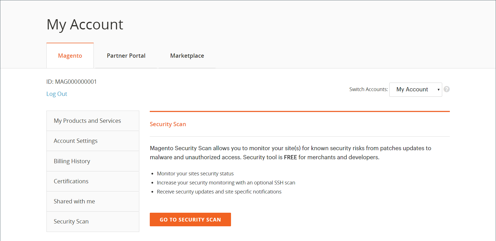

# Sicherheitsüberprüfung

Überwachen Sie Ihre Adobe Commerce- und Magento Open Source-Sites auf Sicherheitsrisiken und Malware und erhalten Sie Sicherheits-Updates und -Benachrichtigungen.

- Erhalten Sie mit insight einen Echtzeitsicherheitsstatus Ihres Stores.
- Erhalten Sie Vorschläge auf der Grundlage von Best Practices, die Sie bei der Lösung von Problemen unterstützen.
- Planen Sie die Ausführung einer Sicherheitsprüfung wöchentlich, täglich oder nach Bedarf.
- Führen Sie über 21.000 Sicherheitstests durch, um potenzielle Malware zu identifizieren.
- Zugriff auf historische Sicherheitsberichte, die den Fortschritt Ihrer Sites verfolgen und überwachen.
- Greifen Sie mit allen empfohlenen Aktionen auf den Scanbericht zu, der erfolgreiche und fehlgeschlagene Prüfungen anzeigt.

Das Security Scan Tool ist kostenlos im Dashboard Ihres [Commerce/Magento-Kontos](../getting-started/commerce-account-create.md) verfügbar. Technische Informationen finden Sie unter [Einrichten des Sicherheits-Scan-Tools](https://experienceleague.adobe.com/en/docs/commerce-on-cloud/user-guide/launch/overview#set-up-the-security-scan-tool) im _Handbuch zu Commerce in Cloud-Infrastrukturen_.

{width="600" zoomable="yes"}

## Workflow

Führen Sie zwei Schritte aus, um das Security Scan Tool für Ihre Adobe Commerce- oder Magento Open Source-Site einzurichten und zu konfigurieren:

1. [Einrichten der Website für die Sicherheitsüberprüfung](#step-1-set-up-your-site-for-security-scanning)
2. [Automatische Sicherheitsprüfungen konfigurieren](#step-2-configure-automatic-security-scans)

### Schritt 1: Richten Sie Ihre Site für die Sicherheitsüberprüfung ein.

1. Melden Sie sich auf der Commerce-Startseite bei Ihrem [Commerce/Magento-Konto an](../getting-started/commerce-account-create.md).

2. Lesen und akzeptieren Sie die Bedingungen für die Verwendung des Security Scan Tools.

   1. Wählen Sie im linken Bedienfeld **[!UICONTROL Security Scan]** aus.
   1. Klicken Sie auf **[!UICONTROL Go to Security Scan]**.
   1. Lies die **[!UICONTROL Terms and Conditions]**.
   1. Zum Fortfahren auf **[!UICONTROL Agree]** klicken.

3. Klicken Sie auf der _[!UICONTROL Monitored Websites]_Seite auf **[!UICONTROL +Add Site]**.

   Wenn Sie mehrere Websites mit unterschiedlichen Domains haben, konfigurieren Sie für jede Domain einen separaten Scan.

   {width="600" zoomable="yes"}

4. Überprüfen Sie, ob Sie Eigentümer der Website-Domain sind, indem Sie einen Bestätigungscode generieren und zum Sicherheits-Scan-Tool hinzufügen.

   Der Prozess zum Hinzufügen des Bestätigungs-Codes hängt vom Typ der verwendeten Storefront ab. Führen Sie die Schritte für Ihren Storefront-Typ aus.

>[!BEGINTABS]

>[!TAB Commerce-Storefront]

1. Geben Sie den **[!UICONTROL Site URL]** und die **[!UICONTROL Site Name]** ein.
1. Klicken Sie auf **[!UICONTROL Generate Confirmation Code]**.
1. Klicken Sie **Kopieren**, um Ihren Bestätigungs-Code in die Zwischenablage zu kopieren.

   {width="400" zoomable="yes"}

1. Melden Sie sich beim Administrator Ihres Stores als Benutzer mit vollständigen Administratorrechten an und führen Sie die folgenden Schritte aus:

   1. Navigieren Sie in _Admin_-Seitenleiste zu **[!UICONTROL Content]** > _[!UICONTROL Design]_>**[!UICONTROL Configuration]**.
   1. Suchen Sie Ihre Site in der Liste und klicken Sie auf **[!UICONTROL Edit]**.
   1. Erweitern Sie  den Abschnitt **[!UICONTROL HTML Head]** .
   1. Scrollen Sie nach unten zu **[!UICONTROL Scripts and Style Sheets]** und klicken Sie in das Textfeld am Ende eines vorhandenen Codes. Fügen Sie den Bestätigungscode in das Textfeld ein.

      {width="600" zoomable="yes"}

   1. Klicken Sie abschließend auf **[!UICONTROL Save Configuration]**.

1. Kehren Sie zur Seite _[!UICONTROL Security Scan]_in Ihrem Commerce-Konto zurück und klicken Sie auf **[!UICONTROL Verify Confirmation Code]**, um die Eigentümerschaft an der Domain herzustellen.

>[!TAB PWA-Storefront]

1. Geben Sie den **[!UICONTROL Site URL]** und die **[!UICONTROL Site Name]** ein.

1. Wählen Sie **[!UICONTROL Confirmation Code]** die Option `META Tag` aus und klicken Sie dann auf **[!UICONTROL Generate Code]**.

1. Klicken Sie auf **[!UICONTROL Copy]** , um den generierten Bestätigungs-Code META Tag in die Zwischenablage zu kopieren.

   {width="400" zoomable="yes"}

1. Gehen Sie zum Projektverzeichnis der PWA Studio-Storefront und gehen Sie folgendermaßen vor:

   1. Wechseln Sie im PWA Studio-Projektverzeichnis zu `packages > venia-concept > template.html`.
   1. Fügen Sie den kopierten Bestätigungs-Code (das generierte META-Tag) zum HTML-Head hinzu und speichern Sie die Änderungen.

      {width="600" zoomable="yes"}

   1. Kehren Sie zur PWA Studio-CLI zurück, installieren Sie mithilfe von „Garn“ die Projektabhängigkeiten und führen Sie den Projekterstellungsbefehl aus.

      ```sh
      yarn install &&
      yarn build
      ```

   1. *Erstellen Sie* Cloud-Projekt einen `pwa` Ordner und kopieren Sie den Inhalt in den `dist` Ordner Ihres Storefront-Projekts.

      ```sh
      mkdir pwa && cp -r <path to your storefront project>/dist/* pwa
      ```

   1. Verwenden Sie das Git-CLI-Tool, um diese Änderungen zu testen, zu übertragen und in Ihr Cloud-Projekt zu übertragen.

      ```sh
      git add . &&
      git commit -m "Added storefront file bundles" &&
      git push origin
      ```

      Nach Abschluss des Build-Prozesses werden die Änderungen in Ihrer PWA-Storefront bereitgestellt.

1. Kehren Sie zur Seite _[!UICONTROL Security Scan]_in Ihrem Commerce-Konto zurück und klicken Sie auf **[!UICONTROL Verify Confirmation Code]**, um die Eigentümerschaft an der Domain herzustellen.

>[!TAB AEM-Storefront]

1. Geben Sie den **[!UICONTROL Site URL]** und die **[!UICONTROL Site Name]** ein.

1. Wählen Sie **[!UICONTROL Confirmation Code]** die Option `HTML Content` oder `META Tag` aus und klicken Sie dann auf **[!UICONTROL Generate Code]**.

1. Klicken Sie auf **[!UICONTROL Copy]** , um den generierten Bestätigungscode in die Zwischenablage zu kopieren.

   {width="400" zoomable="yes"}

1. Gehen Sie zum Projektverzeichnis der AEM-Storefront und gehen Sie folgendermaßen vor:

   1. Wechseln Sie im Projektverzeichnis der AEM-Storefront zu `head.html`.
   1. Fügen Sie den kopierten Bestätigungs-Code (den generierten HTML-Inhalt oder das META-Tag) zu `head.html` Datei hinzu und speichern Sie die Änderungen.

   >[!NOTE]
   >
   >Die Überprüfung des Site-Eigentümers funktioniert nur, wenn die Bestätigung direkt zur `head.html` im AEM-Storefront-Projektverzeichnis hinzugefügt wird. Sie kann nicht über Tools zur Bearbeitung von Web-Seiten wie die Dokumentbearbeitung oder den universellen Editor hinzugefügt werden.

   {width="600" zoomable="yes"}

1. Verwenden Sie das Git-CLI-Tool, um diese Änderungen zu testen, zu übertragen und in Ihr Projekt-Repository zu übertragen.

   ```sh
   git add . &&
   git commit -m "Added security scan confirmation code" &&
   git push origin
   ```

   Nach Abschluss des Build-Prozesses werden die Änderungen an Ihrer AEM-Storefront bereitgestellt.

1. Kehren Sie zur Seite _[!UICONTROL Security Scan]_in Ihrem Commerce-Konto zurück und klicken Sie auf **[!UICONTROL Verify Confirmation Code]**, um die Eigentümerschaft an der Domain herzustellen.

>[!ENDTABS]

### Schritt 2: Automatische Sicherheitsprüfungen konfigurieren

1. Nachdem Sie die Eigentümerschaft der Site erfolgreich überprüft haben, konfigurieren Sie die **[!UICONTROL Set Automatic Security Scan]** für einen der folgenden Typen:

   **Wöchentlicher Scan (empfohlen)**:

   Wählen Sie **[!UICONTROL Week Day]**, **[!UICONTROL Time]** und **[!UICONTROL Time Zone]** aus, dass der Scan jede Woche durchgeführt werden soll.

   Standardmäßig ist der Scan so geplant, dass er jede Woche um Mitternacht Samstag (UTC) beginnt und bis zum frühen Sonntag fortgesetzt wird.

   {width="500" zoomable="yes"}

   **Tägliche Suche**:

   Wählen Sie die **[!UICONTROL Time]** aus und **[!UICONTROL Time Zone]** Sie, dass der Scan jeden Tag stattfinden soll.

   Standardmäßig ist der Beginn der Suche für jeden Tag um Mitternacht (UTC) geplant.

   {width="500" zoomable="yes"}

1. Geben Sie die **[!UICONTROL Email Address]** ein, in der Sie Benachrichtigungen über abgeschlossene Suchvorgänge und Sicherheits-Updates erhalten möchten.

   {width="400" zoomable="yes"}

1. Klicken Sie abschließend auf **[!UICONTROL Submit]**.

   Nachdem das Eigentum an der Domain überprüft wurde, wird die Site in der Liste Überwachte Websites Ihres Commerce-Kontos angezeigt.

1. Wenn Sie mehrere Websites mit unterschiedlichen Domains haben, wiederholen Sie diesen Vorgang, um für jede Website eine Sicherheitsprüfung einzurichten.

## Suchfehler verwalten

Mit dem Security Scan Tool können Sie Suchfehler direkt in der Berichtsansicht verwalten. Sie können bestimmte Überprüfungsfehler als falsch positiv markieren und aus Ihrer Risikobewertung ausschließen.

### Vorteile bei der Verwaltung von Scanfehlern

Die Verwaltung von Suchfehlern hilft Ihnen, eine genauere Sicherheitsübersicht über Ihren Store zu erhalten, indem:

- Reduzierung von Fehlalarmen in Ihren Sicherheitsberichten.
- Konzentration auf relevante Sicherheitsprobleme, die Aufmerksamkeit erfordern.
- Pflegen einer klareren Übersicht über den tatsächlichen Sicherheitsstatus Ihres Stores.
- Die Notwendigkeit, den Support bei bekannten falsch positiven Ergebnissen zu kontaktieren, entfällt.
- Zeitersparnis durch die Selbstverwaltung von bereits untersuchten Scan-Fehlern.

Häufige Szenarien, in denen Sie einen Scan-Fehler als falsch positiv markieren können, sind:

- Wenn Sie bereits einen Sicherheits-Patch angewendet haben, den das Scan-Tool nicht erkannt hat.
- Wenn ein erkanntes Problem nicht auf Ihre spezifische Store-Konfiguration zutrifft.
- Wenn Sie eine alternative Sicherheitsmaßnahme implementiert haben, mit der das Problem behoben wird.
- Wenn der Überprüfungsfehler auf einer Konfiguration basiert, die Sie absichtlich für Ihre Geschäftsanforderungen festgelegt haben.

### Scan-Fehler ignorieren

Gehen Sie wie folgt vor, um Scanfehler zu verwalten, die als falsch positiv identifiziert wurden:

1. Klicken Sie auf der Seite _[!UICONTROL Monitored Websites]_auf **[!UICONTROL View Report]**für die Site, die Sie verwalten möchten.

1. Suchen Sie in der Berichtsansicht den fehlgeschlagenen Scan, den Sie als falsch positiv markieren möchten.

1. Klicken Sie auf **[!UICONTROL Ignore]**, um den jeweiligen Scan-Fehler anzuzeigen.

   {width="600" zoomable="yes"}

1. Klicken Sie auf **[!UICONTROL Apply Changes]** , um Ihre Auswahl zu speichern.

Der ignorierte Überprüfungsfehler wird in den Abschnitt &quot;_[!UICONTROL Ignored Results]_&quot; verschoben und von der Risikobewertung ausgeschlossen.

### Suchfehler nicht mehr ignorieren

Führen Sie die folgenden Schritte aus, um einen zuvor ignorierten Überprüfungsfehler auf Ihrer aktiven Überwachung wiederherzustellen:

1. Scrollen Sie in der Berichtsansicht zum Abschnitt _[!UICONTROL Ignored Results]_.

1. Klicken Sie auf **[!UICONTROL Stop Ignoring]** für den Suchfehler, den Sie wiederherstellen möchten.

   {width="600" zoomable="yes"}

1. Klicken Sie auf **[!UICONTROL Apply Changes]** , um Ihre Auswahl zu speichern.

Der Scan-Fehler wird wieder in den Abschnitt _[!UICONTROL Failed Scans]_verschoben und ist in Ihrer Risikobewertung enthalten.

### Ignorierte Scanfehler anzeigen

Ignorierte Ergebnisse werden in einem separaten Abschnitt des Berichts angezeigt. Die Risikobewertung wird automatisch aktualisiert, um nur aktive Scan-Fehler widerzuspiegeln. Sie können mehrere Überprüfungsfehler gleichzeitig verwalten, indem Sie mehrere Elemente auswählen, bevor Sie Änderungen anwenden.

{width="600" zoomable="yes"}
