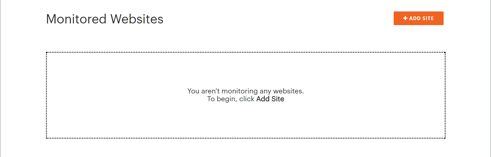
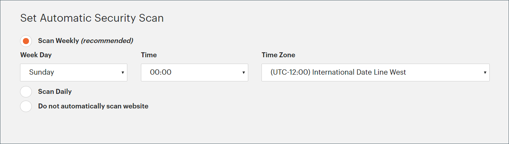

# Sicherheitsüberprüfung

Die erweiterte Sicherheitsüberprüfung ermöglicht es Ihnen, jede Ihrer Adobe Commerce- und Magento Open Source-Websites, einschließlich PWA, auf bekannte Sicherheitsrisiken und Malware zu überwachen und Patch-Updates und Sicherheitsbenachrichtigungen zu erhalten.

- Gewinnen Sie Einblicke in den Echtzeit-Sicherheitsstatus Ihres Stores.
- Erhalten Sie Vorschläge auf der Grundlage von Best Practices, die Sie bei der Lösung von Problemen unterstützen.
- Planen Sie die Ausführung der Sicherheitsüberprüfung auf wöchentliche, tägliche oder On-Demand-Basis.
- Führen Sie über 21.000 Sicherheitstests durch, um potenzielle Malware zu identifizieren.
- Zugriff auf historische Sicherheitsberichte, die den Fortschritt Ihrer Sites verfolgen und überwachen.
- Greifen Sie mit allen empfohlenen Aktionen auf den Scanbericht zu, der erfolgreiche und fehlgeschlagene Prüfungen anzeigt.

Das Tool zur Sicherheitsüberprüfung steht kostenlos im Dashboard Ihres [Commerce/Magento-Kontos zur ](../getting-started/commerce-account-create.md). Technische Informationen finden Sie unter [Einrichten des Sicherheits-Scan-Tools](https://experienceleague.adobe.com/docs/commerce-cloud-service/user-guide/launch/overview.html#set-up-the-security-scan-tool) im Handbuch zu _Commerce in Cloud-Infrastrukturen_.

{width="600" zoomable="yes"}

## Ausführen einer Sicherheitsprüfung

1. Melden Sie sich auf der Commerce-Startseite bei Ihrem [Commerce-/Magento-Konto an](../getting-started/commerce-account-create.md).

1. Überprüfen und akzeptieren Sie die Bedingungen für die Verwendung des Security Scan Tools.

   - Wählen Sie im linken Bedienfeld **[!UICONTROL Security Scan]** aus.
   - Klicken Sie auf **[!UICONTROL Go to Security Scan]**.
   - Lies die **[!UICONTROL Terms and Conditions]**.
   - Zum Fortfahren auf **[!UICONTROL Agree]** klicken.

1. Klicken Sie auf der _[!UICONTROL Monitored Websites]_Seite auf **[!UICONTROL +Add Site]**.

   Wenn Sie mehrere Websites mit unterschiedlichen Domains haben, konfigurieren Sie für jede Domain einen separaten Scan.

   {width="600" zoomable="yes"}

1. Um zu überprüfen, ob Sie der Eigentümer der Website-Domain sind, indem Sie einen Bestätigungscode hinzufügen, führen Sie einen der folgenden Schritte aus:

   **Commerce-Storefront**:

   - Geben Sie den **[!UICONTROL Site URL]** und die **[!UICONTROL Site Name]** ein.
   - Klicken Sie auf **[!UICONTROL Generate Confirmation Code]**.
   - Klicken Sie **Kopieren**, um Ihren Bestätigungs-Code in die Zwischenablage zu kopieren.

     {width="400" zoomable="yes"}

   - Melden Sie sich beim Administrator Ihres Stores als Benutzer mit vollständigen Administratorrechten an und führen Sie die folgenden Schritte aus:

      - Navigieren Sie in _Admin_-Seitenleiste zu **[!UICONTROL Content]** > _[!UICONTROL Design]_>**[!UICONTROL Configuration]**.
      - Suchen Sie Ihre Site in der Liste und klicken Sie auf **[!UICONTROL Edit]**.
      - Erweitern Sie  den Abschnitt **[!UICONTROL HTML Head]** .
      - Scrollen Sie nach unten zu **[!UICONTROL Scripts and Style Sheets]** und klicken Sie in das Textfeld am Ende eines vorhandenen Codes und fügen Sie den Bestätigungscode in das Textfeld ein.

        {width="600" zoomable="yes"}

      - Klicken Sie abschließend auf **[!UICONTROL Save Configuration]**.

   **PWA-Storefront**:

   - Geben Sie den **[!UICONTROL Site URL]** und die **[!UICONTROL Site Name]** ein.

   - Wählen Sie **[!UICONTROL Confirmation Code]** die Option `META Tag` aus und klicken Sie dann auf **[!UICONTROL Generate Code]**.

   - Klicken Sie auf **[!UICONTROL Copy]** , um das generierte Bestätigungs-Code-META-Tag in die Zwischenablage zu kopieren.

     {width="400" zoomable="yes"}

   - Gehen Sie zum Projektverzeichnis der PWA Studio-Storefront und gehen Sie folgendermaßen vor:

      - Wechseln Sie im Projektverzeichnis des PWA Studios zu `packages > venia-concept > template.html`.
      - Fügen Sie den kopierten Bestätigungs-Code (das generierte META-Tag) zum HTML-Head hinzu und speichern Sie die Änderungen.

        {width="600" zoomable="yes"}

      - Kehren Sie zur PWA Studio-CLI zurück, installieren Sie mithilfe von „Garn“ die Projektabhängigkeiten und führen Sie den Projekterstellungsbefehl aus.

        ```sh
        yarn install &&
        yarn build
        ```

      - *Erstellen Sie* Cloud-Projekt einen `pwa` Ordner und kopieren Sie den Inhalt in den `dist` Ordner Ihres Storefront-Projekts.

        ```sh
        mkdir pwa && cp -r <path to your storefront project>/dist/* pwa
        ```

      - Verwenden Sie das Git-CLI-Tool, um diese Änderungen zu testen, zu übertragen und in Ihr Cloud-Projekt zu übertragen.

        ```sh
        git add . &&
        git commit -m "Added storefront file bundles" &&
        git push origin
        ```

        Nach Abschluss des Build-Prozesses werden die Änderungen an Ihrer PWA-Store-Front bereitgestellt.

1. Kehren Sie zur Seite _[!UICONTROL Security Scan]_in Ihrem Commerce-Konto zurück und klicken Sie auf **[!UICONTROL Verify Confirmation Code]**, um die Eigentümerschaft an der Domain herzustellen.

1. Konfigurieren Sie nach erfolgreicher Bestätigung die **[!UICONTROL Set Automatic Security Scan]** für einen der folgenden Typen:

   **Wöchentlicher Scan (empfohlen)**:

   - Wählen Sie **[!UICONTROL Week Day]**, **[!UICONTROL Time]** und **[!UICONTROL Time Zone]** aus, dass der Scan jede Woche durchgeführt werden soll.
   - Standardmäßig ist der Scan so geplant, dass er jede Woche um Mitternacht Samstag (UTC) beginnt und bis zum frühen Sonntag fortgesetzt wird.

     {width="500" zoomable="yes"}

   **Tägliche Suche**:

   - Wählen Sie die **[!UICONTROL Time]** aus und **[!UICONTROL Time Zone]** Sie, dass der Scan jeden Tag stattfinden soll.
   - Standardmäßig ist der Beginn der Suche für jeden Tag um Mitternacht (UTC) geplant.

     {width="500" zoomable="yes"}

1. Geben Sie die **[!UICONTROL Email Address]** ein, in der Sie Benachrichtigungen über abgeschlossene Suchvorgänge und Sicherheits-Updates erhalten möchten.

   {width="400" zoomable="yes"}

1. Klicken Sie abschließend auf **[!UICONTROL Submit]**.

   Nachdem das Eigentum an der Domain überprüft wurde, wird die Site in der Liste Überwachte Websites Ihres Commerce-Kontos angezeigt.

1. Wenn Sie mehrere Websites mit unterschiedlichen Domains haben, wiederholen Sie diesen Vorgang, um für jede Website eine Sicherheitsprüfung einzurichten.
