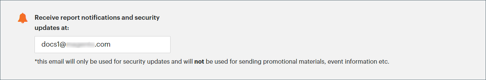

# Sicherheitsscan

Mit dem erweiterten Sicherheitsscan können Sie jede Ihrer Adobe Commerce- und Magento Open Source-Sites, einschließlich PWA, auf bekannte Sicherheitsrisiken und Malware überwachen und Patchaktualisierungen und Sicherheitsbenachrichtigungen erhalten.

- Erhalten Sie Einblicke in den Echtzeit-Sicherheitsstatus Ihres Stores.
- Erhalten Sie Vorschläge basierend auf Best Practices, um Probleme zu beheben.
- Planen Sie die Durchführung der Sicherheitsprüfung wöchentlich, täglich oder auf Anfrage.
- Führen Sie über 21.000 Sicherheitstests durch, um potenzielle Malware zu identifizieren.
- Rufen Sie historische Sicherheitsberichte auf, die den Fortschritt Ihrer Sites verfolgen und überwachen.
- Rufen Sie den Überprüfungsbericht auf, der erfolgreiche und fehlgeschlagene Prüfungen mit empfohlenen Aktionen anzeigt.

Das Sicherheits-Scan-Tool ist im Dashboard Ihrer [Commerce-Konto](../getting-started/commerce-account-create.md). Technische Informationen finden Sie unter [Einrichten des Sicherheitsscan-Tools](https://experienceleague.adobe.com/docs/commerce-cloud-service/user-guide/launch/overview.html#set-up-the-security-scan-tool) im _Benutzerhandbuch zu Commerce on Cloud Infrastructure_.

{width="600" zoomable="yes"}

## Ausführen einer Sicherheitsprüfung

1. Gehen Sie zur Commerce-Startseite und melden Sie sich bei Ihrem [Commerce-Konto](../getting-started/commerce-account-create.md) und gehen Sie wie folgt vor:

   - Wählen Sie im linken Bereich die Option **[!UICONTROL Security Scan]**.
   - Klicken **[!UICONTROL Go to Security Scan]**.
   - Lesen Sie die **[!UICONTROL Terms and Conditions]**.
   - Klicks **[!UICONTROL Agree]** , um fortzufahren.

1. Im _[!UICONTROL Monitored Websites]_Seite, klicken **[!UICONTROL +Add Site]**.

   Wenn Sie mehrere Sites mit unterschiedlichen Domänen haben, müssen Sie für jede Domäne eine separate Prüfung konfigurieren.

   {width="600" zoomable="yes"}

1. Führen Sie einen der folgenden Schritte aus, um durch Hinzufügen eines Bestätigungscodes zu überprüfen, ob Sie Eigentümer der Website-Domäne sind:

   **Commerce-Storefront**:

   - Geben Sie die **[!UICONTROL Site URL]** und **[!UICONTROL Site Name]**.
   - Klicken **[!UICONTROL Generate Confirmation Code]**.
   - Klicks **Kopieren** , um Ihren Bestätigungscode in die Zwischenablage zu kopieren.

     {width="400" zoomable="yes"}

   - Melden Sie sich beim Administrator Ihres Stores als Benutzer mit vollständigen Administratorrechten an und führen Sie die folgenden Schritte aus:

      - Im _Admin_ Seitenleiste, navigieren Sie zu **[!UICONTROL Content]** > _[!UICONTROL Design]_>**[!UICONTROL Configuration]**.
      - Suchen Sie Ihre Site in der Liste und klicken Sie auf **[!UICONTROL Edit]**.
      - Erweitern  die **[!UICONTROL HTML Head]** Abschnitt.
      - Nach unten scrollen zu **[!UICONTROL Scripts and Style Sheets]** und klicken Sie am Ende eines vorhandenen Codes auf das Textfeld und fügen Sie den Bestätigungscode in das Textfeld ein.

        {width="600" zoomable="yes"}

      - Wenn Sie fertig sind, klicken Sie auf **[!UICONTROL Save Configuration]**.

   **PWA storefront**:

   - Geben Sie die **[!UICONTROL Site URL]** und **[!UICONTROL Site Name]**.

   - Für **[!UICONTROL Confirmation Code]**, wählen Sie die `META Tag` und klicken Sie auf **[!UICONTROL Generate Code]**.

   - Klicks **[!UICONTROL Copy]** , um den generierten Bestätigungscode META Tag in die Zwischenablage zu kopieren.

     {width="400" zoomable="yes"}

   - Wechseln Sie zum Projektverzeichnis für das PWA Studio-Storefront-Projekt und führen Sie die folgenden Schritte aus:

      - Wechseln Sie im Projektverzeichnis des PWA Studios zu `packages > venia-concept > template.html`.
      - Fügen Sie den kopierten Bestätigungscode (das generierte META-Tag) zum HTML-Head hinzu und speichern Sie die Änderungen.

        {width="600" zoomable="yes"}

      - Gehen Sie zurück zur PWA Studio-CLI und verwenden Sie Garn, um Projektabhängigkeiten zu installieren und den Projekterstellungsbefehl auszuführen.

        ```sh
        yarn install &&
        yarn build
        ```

      - *In Ihrem Cloud-Projekt*, erstellen Sie eine `pwa` und kopieren Sie den Inhalt in das Repository-Projekt `dist` Ordner.

        ```sh
        mkdir pwa && cp -r <path to your storefront project>/dist/* pwa
        ```

      - Verwenden Sie das Git-CLI-Tool, um diese Änderungen zu inszenieren, zu übertragen und in Ihr Cloud-Projekt zu übertragen.

        ```sh
        git add . &&
        git commit -m "Added storefront file bundles" &&
        git push origin
        ```

        Nachdem der Build-Prozess abgeschlossen ist, werden die Änderungen auf Ihrer PWA Store-Front bereitgestellt.

1. Kehren Sie zu _[!UICONTROL Security Scan]_Seite in Ihrem Commerce-Konto und klicken Sie auf **[!UICONTROL Verify Confirmation Code]**um Ihr Eigentum an der Domain zu begründen.

1. Konfigurieren Sie nach einer erfolgreichen Bestätigung die **[!UICONTROL Set Automatic Security Scan]** Optionen für einen der folgenden Typen:

   **Wöchentlich scannen (empfohlen)**:

   - Wählen Sie die **[!UICONTROL Week Day]**, **[!UICONTROL Time]**, und **[!UICONTROL Time Zone]** dass die Prüfung jede Woche stattfinden soll.
   - Standardmäßig ist geplant, die Prüfung jede Woche um Mitternacht Samstag, UTC zu beginnen und am frühen Sonntag weiterzumachen.

     {width="500" zoomable="yes"}

   **Täglich scannen**:

   - Wählen Sie die **[!UICONTROL Time]**, und **[!UICONTROL Time Zone]** dass die Prüfung jeden Tag stattfinden soll.
   - Standardmäßig ist geplant, die Prüfung jeden Tag um Mitternacht (UTC) zu starten.

     {width="500" zoomable="yes"}

1. Geben Sie die **[!UICONTROL Email Address]** wo Sie Benachrichtigungen über abgeschlossene Prüfungen und Sicherheitsaktualisierungen erhalten möchten.

   {width="400" zoomable="yes"}

1. Wenn Sie fertig sind, klicken Sie auf **[!UICONTROL Submit]**.

   Nachdem das Eigentum an der Domäne überprüft wurde, wird die Site in der Liste &quot;Überwachte Websites&quot;Ihres Commerce-Kontos angezeigt.

1. Wenn Sie mehrere Websites mit unterschiedlichen Domänen haben, wiederholen Sie diesen Vorgang, um für jede Website eine Sicherheitsprüfung einzurichten.
