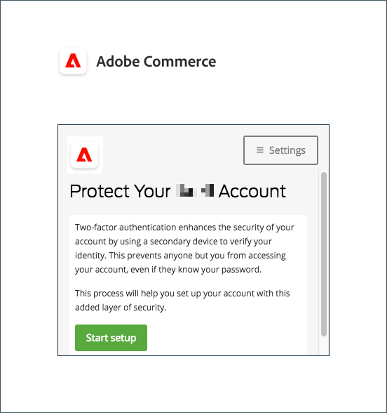

# Zwei-Faktor-Authentifizierungseinstellungen für Benutzerkonten

Diese Anweisungen zeigen, wie Sie während der ersten Anmeldung bei Adobe Commerce oder Magento Open Source eine Zwei-Faktor-Authentifizierung einrichten und Ihre Identität mithilfe der folgenden Apps und Geräte authentifizieren können.

Vollständige Anweisungen finden Sie unter [Anmelden durch Administratoren](../getting-started/admin-signin.md).

>[!NOTE]
>
>Bei Stores, für die die Authentifizierung mit [!DNL Adobe Identity Management Services] (IMS) aktiviert wurde, sind native Adobe Commerce und Magento Open Source 2FA deaktiviert. Admin-Benutzer, die mit ihren Adobe-Anmeldeinformationen bei ihrer Commerce-Instanz angemeldet sind, müssen sich nicht für viele Administratoraufgaben erneut authentifizieren. Die Authentifizierung wird von Adobe IMS verarbeitet, wenn sich der Administrator in seiner aktuellen Sitzung anmeldet. Siehe [[!DNL Adobe Identity Management Service]  (IMS)-Integrationsübersicht](../getting-started/adobe-ims-integration-overview.md).

## [!DNL Google Authenticator]

### Schritt 1: Einrichten von [!DNL Google Authenticator]

1. Geben Sie Ihre Kontoanmeldeinformationen ein und melden Sie sich bei _Admin_ an. Ein neuer Authentifizierungsbildschirm mit QR-Code wird angezeigt.

1. Öffnen Sie die **[!UICONTROL Google Authenticator]** -App auf Ihrem Mobilgerät.

1. Klicken Sie auf das Pluszeichen ( **+** ), um einen Eintrag hinzuzufügen und das rote Feld mit dem QR-Code anzuzeigen, der mit der Kamera auf Ihrem Smartphone gescannt werden soll.

1. Wenn Ihr Telefon den QR-Code erkennt und einen Eintrag hinzufügt, geben Sie diesen 6-stelligen Code in das Feld _Admin_ **[!UICONTROL Authenticator code]** ein.

1. Klicken Sie nach Abschluss des Vorgangs auf **[!UICONTROL Confirm]**.

   {width="300"}

### Schritt 2: Anmelden mit [!DNL Google Authenticator]

1. Geben Sie Ihre Kontoanmeldeinformationen ein und melden Sie sich bei Commerce _Admin_ an.

   {width="300"}

1. Öffnen Sie [!DNL Google Authenticator] auf Ihrem Mobilgerät.

1. Geben Sie bei Aufforderung den sechsstelligen Authentifizierungscode ein.

1. Um die Authentifizierung für zukünftige Anmeldungen zu speichern, aktivieren Sie das Kontrollkästchen **[!UICONTROL Trust this device, do not ask again]** .

1. Klicken Sie nach Abschluss des Vorgangs auf **[!UICONTROL Confirm]**.

## [!DNL Duo Security]

[!DNL Duo] bietet eine kostenlose Testversion und Gebühren entsprechend der Anzahl der Benutzer, die mit dem Konto verknüpft sind. Befolgen Sie ihre [-Anweisungen, um Ihr Konto einzurichten und die App herunterzuladen](https://duo.com/product/multi-factor-authentication-mfa/duo-mobile-app).

### Schritt 1: Einrichten von [!DNL Duo Security]

1. Geben Sie Ihre Kontoanmeldeinformationen ein und melden Sie sich bei _Admin_ an.

1. Wenn die Seite [!DNL Duo] Setup angezeigt wird, klicken Sie auf **[!UICONTROL Start setup]** und führen Sie die folgenden Schritte aus:

   {width="300"}

1. Wählen Sie Ihr Gerät aus.

1. Geben Sie bei Aufforderung Ihre Telefonnummer ein und klicken Sie auf **[!UICONTROL Continue]**.

   In diesem Beispiel wird Ihre Telefonnummer angefordert, da wir ein Mobilgerät verwenden.

1. Wenn Sie aufgefordert werden, [!DNL Duo Mobile] für Ihren Telefontyp zu installieren, klicken Sie auf **[!UICONTROL I have Duo Mobile]**.

1. Öffnen Sie [!DNL Duo Mobile] und scannen Sie den QR-Code, um den Authentifizierer mit Adobe Commerce zu synchronisieren. Nach Abschluss der Aktivierung wird ein Häkchen angezeigt.

1. Um die Einstellungen für das Gerät zu konfigurieren, wählen Sie die Aktion aus, die bei der Anmeldung durchgeführt werden soll.

   - `Ask me to choose an authenticator method` - Ermöglicht dem Benutzer die Auswahl beim Anmelden und Authentifizieren bei _Admin_.
   - `Automatically send this device a Duo Push` - Sendet eine Nachricht an Ihr Gerät, um den Zugriff zu akzeptieren oder zu verweigern.
   - `Automatically call this device` - Ruft ein Passwort auf und stellt es bereit, das für den Zugriff eingegeben wird.

   {width="300"}

### Schritt 2: Anmelden mit [!DNL Duo Security]

Das folgende Beispiel zeigt die Optionen für `Ask me to choose an authenticator method`:

1. Wenn Sie dazu aufgefordert werden, geben Sie Ihre _Admin_-Anmeldedaten ein, um sich anzumelden.

   {width="300"}

1. Wählen Sie die Methode aus, die Sie für die Authentifizierung verwenden möchten:

   - `Send Me a Push` - Klicken Sie auf , um eine Push-Benachrichtigung an [!DNL Duo Mobile] zu erhalten. Akzeptieren zur Authentifizierung.
   - `Call Me` - Klicken Sie auf diese Option, erhalten Sie einen Aufruf mit einem Code und geben Sie den Pass-Code ein.
   - `Enter a Passcode` - Klicken Sie auf diese Option, um einen Pass-Code zu erhalten und einzugeben.

1. Schließen Sie den Push- oder Code ab, um sich vollständig bei _Admin_ anzumelden.

## [!DNL Authy]

[!DNL Authy] bietet Benutzern ihre App und ihren Service kostenlos an. Befolgen Sie die Anweisungen zum Herunterladen und Einrichten der App für Ihr Gerät oder Ihren Browser. Weitere Informationen finden Sie in der [[!DNL Authy] Dokumentation](https://authy.com/features/setup/).

### Schritt 1: Einrichten der Autoreninstanz

1. Geben Sie Ihre Kontoanmeldeinformationen ein und melden Sie sich bei _Admin_ an.

   ![[!DNL Authy] registration](./assets/storefront-2fa-authy-auth.png){width="300"}

1. Wenn Sie dazu aufgefordert werden, sich bei der Autoreninstanz zu registrieren, gehen Sie wie folgt vor:

   - Wählen Sie Ihr Land aus.

   - Geben Sie Ihre Telefonnummer ein.

   - Wählen Sie die **[!UICONTROL Verification method]**: `SMS` oder `Call Me` aus.

   Klicken Sie auf **[!UICONTROL Continue]**. Eine Nachricht wird über SMS-Text oder einen Anruf an Ihr Telefon gesendet.

1. Geben Sie den Verifizierungscode ein, den Sie erhalten, und klicken Sie auf **[!UICONTROL Verify]**.

1. Klicken Sie nach Abschluss des Vorgangs auf **[!UICONTROL Confirm]**.

   ![[!DNL Authy] Verifikationscode](./assets/storefront-2fa-authy-verify.png){width="300"}

### Schritt 2: Anmelden mit [!DNL Authy]

1. Geben Sie Ihre Kontoanmeldeinformationen ein und melden Sie sich bei _Admin_ an.

   ![[!DNL Authy] - signin](./assets/storefront-2fa-authy-access.png){width="300"}

1. Wählen Sie eine der folgenden Authentifizierungsmethoden aus:

   - `Use one touch` - Sendet einen Warnhinweis an Ihre [!DNL Authy]-App. Akzeptieren Sie in der App den Zugriff.
   - `Use authy token` - Aufforderung zur Eingabe eines Codes aus Ihrer [!DNL Authy]-App.

1. Wenn Sie Schwierigkeiten haben, sich anzumelden, wählen Sie die Methode aus, die Sie für den Empfang des Codes verwenden möchten. Geben Sie dann den Code ein, den Sie für den Zugriff auf _Admin_ erhalten.

   Das Programm enthält diese zusätzlichen Notfallmethoden.

   - `Send me a code via SMS` - Eine SMS-Textnachricht wird an das konfigurierte Mobilgerät gesendet.
   - `Send me a code via phone call` - Der Benutzer erhält einen Telefonanruf mit Code.

   Ihr Konto wird geprüft und geöffnet.

## U2F ([!DNL Yubikey]) und andere Geräte

Befolgen Sie die Anweisungen des Lösungsanbieters, um Ihr U2F-Gerät zu konfigurieren. Weitere Informationen finden Sie in der Dokumentation des Anbieters, z. B. [[!DNL YubiKey]](https://support.yubico.com/hc/en-us/articles/360013790339-Getting-Started-with-Your-YubiKey) von [!UICONTROL Yubico].

1. Geben Sie Ihre Kontoanmeldeinformationen ein und melden Sie sich bei _Admin_ an.

   {width="300"}

1. Drücken Sie die Taste auf der Taste.

   Die Authentifizierung erfolgt sofort Trigger und öffnet den _Admin_.

1. Setzen Sie den **[!UICONTROL U2F key]** in einen USB-Anschluss auf Ihrem Computer ein.
