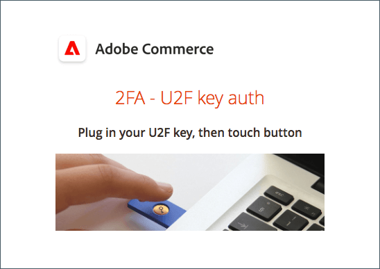

# Zwei-Faktor-Authentifizierungs-Setup für Benutzerkonten

Diese Anweisungen zeigen, wie Sie während Ihrer ersten Anmeldung bei Adobe Commerce oder Magento Open Source eine Zwei-Faktor-Authentifizierung einrichten und Ihre Identität mit den folgenden Programmen und Geräten authentifizieren können.

Vollständige Anweisungen finden Sie unter [Admin-Anmeldung](../getting-started/admin-signin.md).

>[!NOTE]
>
>Bei Stores mit aktivierter [!DNL Adobe Identity Management Services]-Authentifizierung (IMS) sind die native Adobe Commerce und Magento Open Source 2FA deaktiviert. Admin-Benutzende, die mit ihren Adobe-Anmeldeinformationen bei ihrer Commerce-Instanz angemeldet sind, müssen sich für viele Admin-Aufgaben nicht erneut authentifizieren. Die Authentifizierung wird von Adobe IMS durchgeführt, wenn sich der Administrator bei seiner aktuellen Sitzung anmeldet. Siehe Übersicht über die [[!DNL Adobe Identity Management Service] (IMS)-Integration](../getting-started/adobe-ims-integration-overview.md).

## [!DNL Google Authenticator]

### Schritt 1: Einrichten von [!DNL Google Authenticator]

1. Geben Sie Ihre Kontoanmeldeinformationen ein und melden Sie sich bei &quot;_&quot;_. Ein neuer Authentifizierungsbildschirm wird mit einem QR-Code angezeigt.

1. Öffnen Sie die **[!UICONTROL Google Authenticator]** App auf Ihrem Mobilgerät.

1. Klicken Sie auf das Pluszeichen ( **+** ), um einen Eintrag hinzuzufügen und das rote Feld mit dem QR-Code auszurichten, um mit der Kamera auf Ihrem Smartphone zu scannen.

1. Wenn Ihr Telefon den QR-Code erkennt und einen Eintrag hinzufügt, geben Sie diesen 6-stelligen Code in das **[!UICONTROL Authenticator code]** _Admin_ ein.

1. Klicken Sie abschließend auf **[!UICONTROL Confirm]**.

   {width="300"}

### Schritt 2: Mit [!DNL Google Authenticator] anmelden

1. Geben Sie Ihre Kontoanmeldeinformationen ein und melden Sie sich bei Commerce (_)_.

   {width="300"}

1. Öffnen Sie [!DNL Google Authenticator] auf Ihrem Mobilgerät.

1. Wenn Sie dazu aufgefordert werden, geben Sie den sechsstelligen Authentifizierungscode ein.

1. Um die Authentifizierung für zukünftige Anmeldungen zu speichern, aktivieren Sie das Kontrollkästchen **[!UICONTROL Trust this device, do not ask again]** .

1. Klicken Sie abschließend auf **[!UICONTROL Confirm]**.

## [!DNL Duo Security]

[!DNL Duo] bietet eine kostenlose Testversion an und berechnet die Kosten entsprechend der Anzahl der Benutzenden, die mit dem Konto verbunden sind. Folgen Sie den [Anweisungen, um Ihr Konto einzurichten und die App herunterzuladen](https://duo.com/product/multi-factor-authentication-mfa/duo-mobile-app).

### Schritt 1: Einrichten von [!DNL Duo Security]

1. Geben Sie Ihre Kontoanmeldeinformationen ein und melden Sie sich bei &quot;_&quot;_.

1. Wenn die Seite [!DNL Duo] Setup angezeigt wird, klicken Sie auf **[!UICONTROL Start setup]** und führen Sie folgende Schritte aus:

   {width="300"}

1. Wählen Sie Ihr Gerät.

1. Geben Sie bei Aufforderung Ihre Telefonnummer ein und klicken Sie auf **[!UICONTROL Continue]**.

   In diesem Beispiel wird Ihre Telefonnummer angefordert, da wir ein Mobilgerät verwenden.

1. Wenn Sie nach der Installation von [!DNL Duo Mobile] für Ihren Telefontyp gefragt werden, klicken Sie auf **[!UICONTROL I have Duo Mobile]**.

1. Öffnen Sie [!DNL Duo Mobile] und scannen Sie den QR-Code, um den Authenticator mit Adobe Commerce zu synchronisieren. Nach Abschluss der Aktivierung wird ein Häkchen angezeigt.

1. Um Ihre Einstellungen für das Gerät zu konfigurieren, wählen Sie die Aktion aus, die bei der Anmeldung ausgeführt werden soll.

   - `Ask me to choose an authenticator method` - Ermöglicht dem Benutzer die Auswahl, wenn er sich bei der _Admin_ anmeldet und authentifiziert.
   - `Automatically send this device a Duo Push` - Sendet eine Nachricht an Ihr Gerät, um den Zugriff zu akzeptieren oder abzulehnen.
   - `Automatically call this device` - Ruft auf und stellt einen Passcode bereit, den Sie für den Zugriff eingeben müssen.

   {width="300"}

### Schritt 2: Mit [!DNL Duo Security] anmelden

Das folgende Beispiel zeigt die Optionen für `Ask me to choose an authenticator method`:

1. Geben Sie bei Aufforderung Ihre _Admin_-Anmeldedaten ein, um sich anzumelden.

   {width="300"}

1. Wählen Sie die Authentifizierungsmethode aus, die Sie verwenden möchten:

   - `Send Me a Push` - Klicken Sie, um eine Push-Benachrichtigung an [!DNL Duo Mobile] zu erhalten. Zur Authentifizierung akzeptieren.
   - `Call Me` - Klicken Sie auf diese Option, rufen Sie einen Code an und geben Sie den Bestell-Code ein.
   - `Enter a Passcode` - Klicken Sie auf diese Option, um einen Bestell-Code zu erhalten und einzugeben.

1. Schließen Sie die Push-Benachrichtigung oder den Code ab, um sich vollständig bei _Admin_ anzumelden.

## [!DNL Authy]

[!DNL Authy] bietet seinen Nutzern ihre App und ihren Service kostenlos an. Folgen Sie den Anweisungen, um die App für Ihr Gerät oder Ihren Browser herunterzuladen und einzurichten. Weitere Informationen finden Sie in der [[!DNL Authy] Dokumentation](https://authy.com/features/setup/).

### Schritt 1: Einrichten der Autorität

1. Geben Sie Ihre Kontoanmeldeinformationen ein und melden Sie sich bei &quot;_&quot;_.

   ![[!DNL Authy] Registrierung](./assets/storefront-2fa-authy-auth.png){width="300"}

1. Wenn Sie dazu aufgefordert werden, sich bei der Autorisierung zu registrieren, führen Sie die folgenden Schritte aus:

   - Land auswählen.

   - Geben Sie Ihre Telefonnummer ein.

   - Wählen Sie die **[!UICONTROL Verification method]** aus: `SMS` oder `Call Me`

   Klicken Sie auf **[!UICONTROL Continue]**. Eine Nachricht wird über SMS-Text oder einen Anruf an Ihr Telefon gesendet.

1. Geben Sie den Verifizierungs-Code ein, den Sie erhalten, und klicken Sie auf **[!UICONTROL Verify]**.

1. Klicken Sie abschließend auf **[!UICONTROL Confirm]**.

   ![[!DNL Authy] Verifizierungs-Code](./assets/storefront-2fa-authy-verify.png){width="300"}

### Schritt 2: Mit [!DNL Authy] anmelden

1. Geben Sie Ihre Kontoanmeldeinformationen ein und melden Sie sich bei &quot;_&quot;_.

   ![[!DNL Authy] - Anmelden](./assets/storefront-2fa-authy-access.png){width="300"}

1. Wählen Sie eine der folgenden Authentifizierungsmethoden:

   - `Use one touch` - Sendet einen Warnhinweis an Ihre [!DNL Authy] App. Akzeptieren Sie in der App den Zugriff.
   - `Use authy token` - Fordert zur Eingabe eines Codes aus Ihrer [!DNL Authy] App auf.

1. Wenn Sie Probleme haben, sich anzumelden, wählen Sie die Methode aus, die Sie verwenden möchten, um den Code zu erhalten. Geben Sie dann den Code ein, den Sie für den Zugriff auf „Admin _erhalten_.

   Die App enthält diese zusätzlichen Notfallmethoden.

   - `Send me a code via SMS` - Eine SMS-Textnachricht wird an das konfigurierte Mobilgerät gesendet.
   - `Send me a code via phone call` - Der Benutzer erhält einen Anruf mit einem Code.

   Ihr Konto ist verifiziert und wird geöffnet.

## U2F ([!DNL Yubikey] und andere Geräte)

Befolgen Sie die Anweisungen des Lösungsanbieters, um Ihr U2F-Gerät zu konfigurieren. Weitere Informationen finden Sie in der Dokumentation des Anbieters, z. B. [[!DNL YubiKey]](https://support.yubico.com/hc/en-us/articles/360013790339-Getting-Started-with-Your-YubiKey) nach [!UICONTROL Yubico].

1. Geben Sie Ihre Kontoanmeldeinformationen ein und melden Sie sich bei &quot;_&quot;_.

   {width="300"}

1. Drücken Sie die Taste auf der Taste.

   Trigger Bei der Authentifizierung wird sofort die _Admin_ geöffnet.

1. Stecken Sie den **[!UICONTROL U2F key]** in einen USB-Anschluss Ihres Computers.
