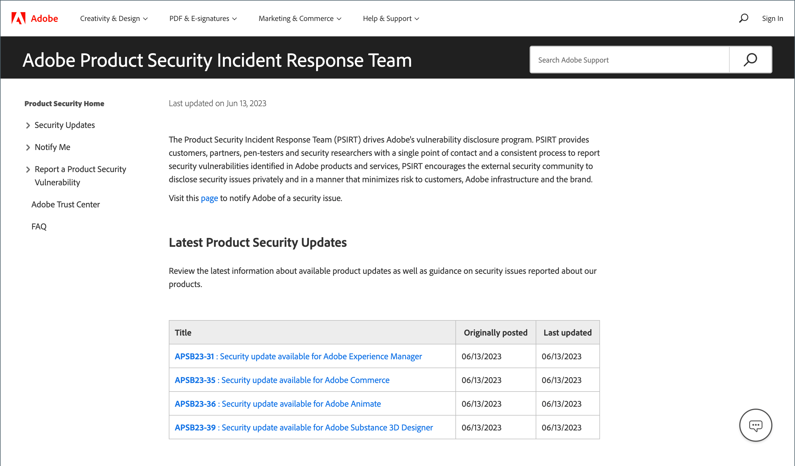

# Sicherheit

Es gibt mehrere Möglichkeiten, Ihren Speicher zu schützen und Ihre Datensicherheit zu gewährleisten:

- Einrichten [Zwei-Faktor-Authentifizierung](security-two-factor-authentication.md)
- Implementieren von [CAPTCHA](security-captcha.md) oder [reCAPTCHA](security-google-recaptcha.md)
- Richten Sie für jede Domain [&#x200B; Ihrer Adobe Commerce- oder Magento Open Source](security-scan.md)Installation eine Sicherheitsüberprüfung ein.

>[!NOTE]
>
>Bei Stores mit aktivierter [!DNL Adobe Identity Management Services]-Authentifizierung (IMS) sind die native Adobe Commerce und Magento Open Source 2FA deaktiviert. Admin-Benutzende, die mit ihren Adobe-Anmeldeinformationen bei ihrer Commerce-Instanz angemeldet sind, müssen sich für viele Admin-Aufgaben nicht erneut authentifizieren. Die Authentifizierung wird von Adobe IMS durchgeführt, wenn sich der Administrator bei seiner aktuellen Sitzung anmeldet. Siehe Übersicht über die [[!DNL Adobe Identity Management Service] (IMS)-Integration](../getting-started/adobe-ims-integration-overview.md).

Besuchen Sie das [Sicherheitscenter](https://helpx.adobe.com/de/security.html){:target="_blank"}, um die neuesten Informationen über potenzielle Sicherheitslücken zu erhalten, sich für Adobe-Sicherheitsbenachrichtigungen zu registrieren und auf das Adobe Trust Center zuzugreifen.

{width="700" zoomable="yes"}

Informationen zu Best Practices für die Sicherheit finden Sie unter [Sichern der Commerce-Site und &#x200B;](https://experienceleague.adobe.com/docs/commerce-operations/implementation-playbook/best-practices/launch/security-best-practices.html?lang=de)) im _Implementierungs-Playbook_.

## Sicherheits-Aktionsplan

Wenn Sie vermuten, dass Ihre Adobe Commerce- oder Magento Open Source-Site gefährdet ist, befolgen Sie diesen Aktionsplan unverzüglich.

1. **Diagnose**: Führen Sie eine Suche durch, um den Sicherheitsstatus Ihres Commerce-Stores zu ermitteln. Commerce [Security Scan](security-scan.md) ist ein kostenloser Service von Adobe, mit dem Sie Ihre Commerce-Sites auf bekannte Sicherheitsrisiken und Malware überwachen und Sicherheitsbenachrichtigungen erhalten können.

1. **Säubern**: Bestellen Sie einen [qualifizierten Berater](https://solutionpartners.adobe.com/s/directory/?partner_type=1) oder Online-Service, um Ihre Website von allen bösartigen Code zu säubern. Einige Mitglieder der Commerce-Community empfehlen [[!DNL Sucuri Website Malware Removal]](https://sucuri.net/website-antivirus/malware-removal). Überprüfen Sie den `/media` Ordner auf übrig gebliebenen ausführbaren Code. Entfernen Sie alle unbekannten Admin-Benutzer und setzen Sie alle Admin-Kennwörter zurück.

1. **Protect**: Halten Sie Ihre Commerce-Installation mit der neuesten Version auf dem neuesten Stand. Wenn Sie eine ältere Version verwenden, wenden Sie alle Sicherheits-Patches an, sobald sie verfügbar werden. Überprüfen und befolgen Sie die [Best Practices für die Sicherheit von Commerce](https://www.adobe.com/content/dam/cc/en/trust-center/ungated/whitepapers/experience-cloud/adobe-commerce-best-practices-guide.pdf). [Commerce-Sicherheitswarnungen abonnieren](https://www.adobe.com/subscription/adbeSecurityNotifications.html).

1. **Bericht**: Wenn Sie glauben, dass Sie eine bestimmte Sicherheitslücke in Commerce gefunden haben, [eröffnen Sie ein Problem mit Adobe](https://hackerone.com/adobe?type=team) und fügen Sie technische Details hinzu.

1. **Upgrade**: Planen Sie jetzt Ihr Upgrade auf [Adobe Commerce in unserer Cloud-Architektur, um die zusätzliche Sicherheit zu &#x200B;](https://business.adobe.com/de/products/magento/cloud-delivery.html), die durch den 24/7-Support entsteht.
