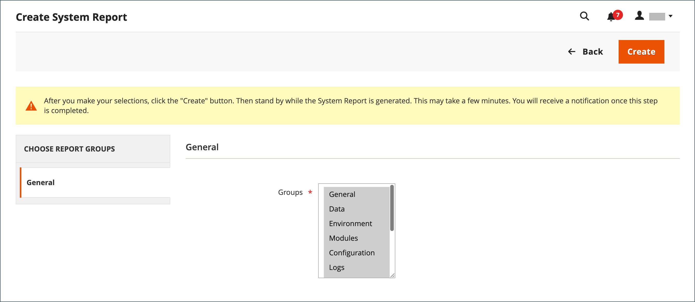

# Support-Tools

{{ee-feature}}

Die Support-Tools dienen zur Identifizierung bekannter Probleme in Ihrem System. Sie können während der Entwicklungs- und Optimierungsprozesse als Ressource und als Diagnosewerkzeug verwendet werden, um unser Supportteam bei der Identifizierung und Lösung von Problemen zu unterstützen.

## Systemberichte

Mit dem Tool für die Systemberichterstellung können Sie regelmäßig vollständige oder teilweise Momentaufnahmen des Systems erstellen und diese zur späteren Verwendung speichern. Sie können Leistungseinstellungen vor und nach Code-Entwicklungszyklen oder Änderungen an den Server-Einstellungen vergleichen. Das System-Reporting-Tool kann den Zeitaufwand für die Vorbereitung und Übermittlung der vom Support benötigten Informationen für den Beginn einer Untersuchung erheblich reduzieren.

Über das Raster Systemberichte können Sie vorhandene Berichte anzeigen und herunterladen, Berichte löschen und Berichte erstellen.

### Zugriff auf Systemberichte

Navigieren Sie in _Admin_-Seitenleiste zu **[!UICONTROL System]** > _[!UICONTROL Support]_>**[!UICONTROL System Report]**.

{width="600" zoomable="yes"}

### Erstellen eines Berichts

1. Klicken Sie auf **[!UICONTROL New Report]**.

1. Wählen Sie in der Liste **[!UICONTROL Groups]** alle Informationen aus, die Sie in den Bericht aufnehmen möchten. Standardmäßig sind alle Gruppen ausgewählt.

   {width="600" zoomable="yes"}

1. Klicken Sie oben rechts auf **[!UICONTROL Create]**.

   Je nach der Anzahl der ausgewählten Berichtstypen kann es einige Minuten dauern, bis der Bericht generiert wird. Wenn der Bericht fertig ist, wird er am oberen Rand des Rasters mit dem generierten Datum und der generierten Uhrzeit angezeigt.

### Modulinformationen anzeigen

Nützliche Informationen zu installierten Modulen finden Sie hier.

**_So zeigen Sie Berichtsinformationen für jedes installierte Modul an:_**

1. Navigieren Sie in _Admin_-Seitenleiste zu **[!UICONTROL System]** > _[!UICONTROL Support]_>**[!UICONTROL System Report]**.
1. Klicken Sie auf **[!UICONTROL New Report]**.
1. Wählen Sie `Modules` aus der Liste **[!UICONTROL Groups]** aus.
1. Klicken Sie auf **[!UICONTROL Create]**.
1. Nachdem der Bericht generiert wurde, klicken Sie auf **[!UICONTROL Select]** und dann auf **[!UICONTROL View]** , um alle Modulversionen anzuzeigen.
1. Klicken Sie auf **[!UICONTROL Download]** , um den Bericht herunterzuladen.

### Systemberichte verwalten

Wählen Sie in der Spalte **[!UICONTROL Action]** des Rasters eine der folgenden Optionen aus:

- `View` - Verwenden Sie diese Funktion, um die Details des Berichts anzuzeigen.
- `Delete` - Mit dieser Funktion können Sie den generierten Bericht aus der Liste löschen.
- `Download` : Verwenden Sie diese Funktion, um den Bericht als HTML-Datei zu speichern.

### Anzeigen von Systemberichtsdetails

1. Wählen Sie für den benötigten Bericht **[!UICONTROL View]** in der Spalte _[!UICONTROL Actions]_aus.

1. Erweitern Sie im linken Bereich  jeden Abschnitt des Berichts, um die Details anzuzeigen.

   {width="600" zoomable="yes"}

### Verfügbare Systemberichte

| Berichtsgruppe | Enthaltene Informationen |
| ------------ | -------------------- |
| [!UICONTROL General] | Adobe Commerce version data count cache status index status |
| [!UICONTROL Environment] | Umgebungsinformationen/ -Status |
| [!UICONTROL Data] | Kategorien nach URL-Schlüssel duplizieren  Produkte nach URL-Schlüssel duplizieren  Produkte nach SKU duplizieren  Bestellungen nach Inkrement-ID  Duplizieren von Benutzern nach E-Mail beschädigte Kategoriedaten |
| [!UICONTROL Modules] | Benutzerdefinierte Module Liste Deaktivierte Module Liste Alle Module Liste |
| [!UICONTROL Configuration] | Konfiguration Daten aus der Funktionsmatrix `app/etc/env.php` Versandmethoden Zahlungsmethoden Zahlungen |
| [!UICONTROL Logs] | Protokolldateien Top-Systemmeldungen Aktuelle Top-Systemmeldungen Top-Debugmeldungen Aktuelle Top-Debugmeldungen Top-Ausnahmemeldungen Aktuelle Top-Ausnahmemeldungen |
| [!UICONTROL Attributes] | Benutzerdefinierte EAV-Attribute neue EAV-Attribute Entitätstypen Alle EAV-Attribute Kategorie-EAV-Attribute Produkt-EAV-Attribute Kunden-EAV-Attribute Kundenadresse EAV-Attribut RMA-Element EAV-Attribute |
| [!UICONTROL Events] | Benutzerdefinierte globale Ereignisse Benutzerdefinierte Admin-Ereignisse Benutzerdefinierte Frontend-Ereignisse Benutzerdefinierte Dokumentereignisse Benutzerdefinierte Crontab-Ereignisse benutzerdefinierte REST-Ereignisse Benutzerdefinierte SOAP SOAP-Ereignisse Core-globale Ereignisse Core-Admin-Ereignisse   Core-Frontend-Ereignisse Core-Crontab-Ereignisse   Core-REST-Ereignisse Alle globalen Ereignisse Alle Admin-Ereignisse   Alle Doc-Ereignisse Alle REST-Ereignisse Alle SOAP-Ereignisse Alle Crontab-Ereignisse |
| [!UICONTROL Cron] | Cron-Zeitpläne nach Status-Code Cron-Zeitpläne nach Auftrags-Code Fehler in Cron-Zeitplänen Warteschlange Cron-Zeitplanliste Benutzerdefinierte globale Cron-Aufträge Benutzerdefinierte konfigurierbare Cron-Aufträge Core-globale Cron-Aufträge Core konfigurierbare Cron-Aufträge Alle globalen Cron-Aufträge Alle konfigurierbaren Cron-Aufträge |
| [!UICONTROL Design] | AdminHTML-Designliste Frontend-Designliste |
| [!UICONTROL Stores] | Website-Baumstruktur Websites-Liste Stores-Liste Store-Ansichten-Liste |
| OMS-Connector  _(sichtbar mit OMS-Integration)_ | Ergebnisse   Connector- -Connector-Überwachung |

{style="table-layout:auto"}
